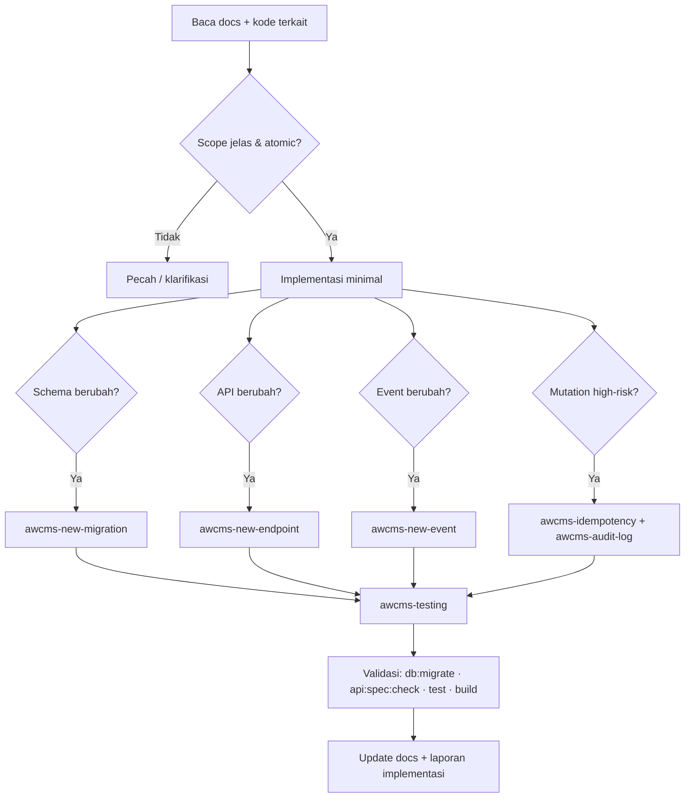

# AWCMS — Implement Issue / Sprint (Atomic)

Skill orkestrator untuk mengeksekusi satu unit kerja AWCMS end-to-end sesuai kontrak di `AGENTS.md` dan `docs/awcms/12_generator_prompt.md`.

## Prasyarat baca (WAJIB sebelum edit)

1. `AGENTS.md` — aturan wajib & guardrail.
2. `docs/awcms/06_github_issues_detail.md` — detail issue.
3. `docs/awcms/11_implementation_blueprint.md` — folder/file target sprint.
4. Modul, SQL, OpenAPI, AsyncAPI, dan docs yang terkait scope.

## Prosedur



## Aturan atomic

- Kerjakan hanya scope issue; **jangan** sentuh file unrelated.
- Data tenant-scoped: tenant context + `awcms-abac-guard` + RLS.
- Data sensitif: `awcms-sensitive-data`.
- High-risk action: `awcms-audit-log`; high-risk mutation: `awcms-idempotency`.
- Resource deletable: soft delete + restore/purge policy; jangan hapus posted/append-only entity.
- Provider eksternal lewat outbox/queue, **tidak** di dalam DB transaction.
- Backend/tooling wajib Bun-only. Jangan menambah Node.js/npm/npx/pnpm/yarn atau adapter server Node.js kecuali Bun belum mendukung capability tersebut, maintainer sudah memberi izin eksplisit, dan pengecualian dicatat di docs/audit.

## Validasi wajib

```bash
bun run db:migrate
bun run api:spec:check
bun test
bun run build
```

## Definition of Done

Ikuti checklist DoD di `AGENTS.md`. Tutup dengan **laporan implementasi**:

```text
Summary:
Files changed:
Commands run:
Test results:
Security notes:
Documentation updates:
Remaining limitations:
Next recommended step:
```

## Skill terkait

`awcms-new-module`, `awcms-new-migration`, `awcms-new-endpoint`, `awcms-new-event`, `awcms-idempotency`, `awcms-abac-guard`, `awcms-audit-log`, `awcms-sensitive-data`, `awcms-testing`, `awcms-security-review`, `awcms-pr-review`.
