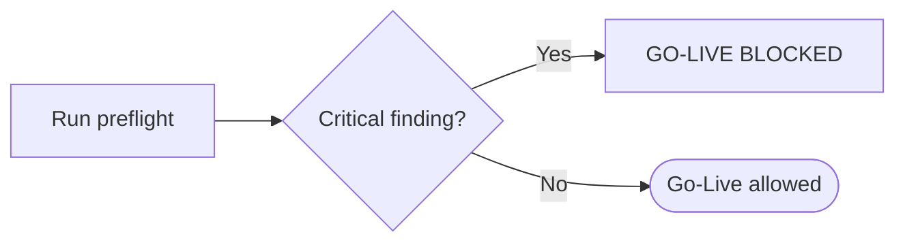

🇬🇧 English (source) · 🇮🇩 [Bahasa Indonesia](SKILL.id.md)

# AWCMS — Production Preflight & Go-Live

Follow `docs/awcms/07_sprint_testing_production_readiness.md` and `docs/awcms/12_generator_prompt.md`.

## Preflight commands

```bash
bun install
bun run config:validate     # env rules + production cross-rules
bun run check               # the full chain: lint, docs, contracts, typecheck, test, build
bun run db:pool:health      # against the target DB
bun run security:readiness  # go-live GATE — exits non-zero if there is a `critical`
```

> **`bun run production:preflight` DOES NOT EXIST — do not run it.** It
> fails with `error: Script not found`. The staged orchestrator
> described in doc 07 §Preflight was never implemented in this repo
> (doc 07 says so itself, and `scripts/README.md` §Deferred
> lists it as a deferred target) — and so was its
> `database:capacity` stage. The commands above are the REAL steps
> that replace it; `security:readiness` is the only one that
> actually blocks go-live with an exit code.

> **CORRECTION 4 August 2026 — two claims in this paragraph do not hold in this
> repo.** The config registry that used to be named here (under src/lib/config/)
> **does not exist** — that directory itself does not exist — and `config:docs:check` is not
> a target in `package.json`. Both are `awcms-mini` artifacts that were carried along. What is
> REAL here: `scripts/validate-env.ts` (`bun run config:validate`) holds
> the env rules together with the production cross-rules, and
> `bun run config:env:coverage:check` — part of the `bun run check` chain —
> keeps every variable the code reads registered.
>
> **Why that claim survived for months, and this applies to every
> skill:** the path was **broken across lines** by markdown wrapping, and
> the `bun run skills:check` extractor only looks at backticked paths on a **single
> line** — so the gate never saw it. (Proven while this correction was
> being written: joining it back onto one line immediately turned the gate red.
> That is why the path above is written **without backticks** — the gate has no way
> to tell "this path exists" from "this path DOES NOT exist", and flagging it as a
> claim would be wrong.) The original text is kept below as a historical note.
>
> _"Since Issue #689 (epic #679), `config:validate`'s CLI report adds one
> new section at the end of its output — deprecation notices (informational, never
> failing this check), driven by the config registry's `deprecated` field."_

**`AUTH_COOKIE_SECURE` is now genuinely guarded by preflight** (4 August 2026):
its production rule demands exactly the value `"true"`. Previously it only rejected
the literal string `"false"`, so a variable that was **not set** — its
default state — produced session cookies without `Secure` while preflight reported
clean. Still **verify the response**, not just the configuration: `curl -I` against
the production login must show `Set-Cookie … Secure`. The validator checks what
is configured; only the response proves what is sent.

Response compression and cache tiers ABOVE the application (Cloudflare in front of
Traefik/Varnish) are not checked by any preflight — see the `awcms-deploy` skill
(findings C3/C14 in the performance & security standards document).

Since Issue #684 (epic #679), `bun run production:preflight` (Issue 12.2)
is ONE **read-only** command that runs the full sequence itself
— `config:validate` → `security:readiness` → `database:capacity` (Issue
#743, epic #738 platform-evolution — a cross-instance connection capacity
calculator, pure config arithmetic, with no database connection at
all; see `database-capacity-runbook.md`) → `db:connectivity` (one
`SELECT` verifying the connection + the migration ledger table) → `api:spec:check`
→ `modules:compose:check` (Issue #740, epic #738 — the build-time composition
registry of base modules is valid; there is no derived-application/
`extension:check` path any more, removed by ADR-0034) → `test` → `build` →
`db:pool:health` (skipped if the server is not
running yet, except under `APP_ENV=production` — there the skip BLOCKS go-live) →
`migration:plan` (dry-run: lists pending migrations WITHOUT running them).
**Ten** read-only stages in total (`scripts/production-preflight.ts`'s
`REMAINING_CHILD_PROCESS_STAGES` + the separately handled `db:connectivity`/`db:pool:health`/
`migration:plan` — `extension:check` removed, ADR-0034). No stage writes to the
database. Running the commands one by one manually (like the old list
above) is NO longer recommended — `bun run db:migrate` on its
own is NOT part of this preflight at all; see §Applying
migrations below.

### Applying migrations (a separate step, must be explicit)

`bun run production:preflight` itself **never** writes to the
database — an old bug (Issue #684): `db:migrate` used to run as an
unconditional early stage, so a later stage (spec check/test/build)
failing still left the database migrated even though the final verdict was
"GO-LIVE BLOCKED". Applying migrations now requires explicit flags, and
runs ONLY when the verdict is `GO-LIVE ALLOWED` (all ten read-only stages
above passed):

```bash
APP_ENV=production DATABASE_URL=<production-url> bun run production:preflight \
  --apply-migrations --backup-verified --acknowledge-target=production
```

All three flags are MANDATORY together (`scripts/production-preflight.ts`'s
`authorizeApply`, covered by unit tests): `--apply-migrations` (operator intent),
`--backup-verified` (an attestation of a fresh backup that has been proven
restorable), `--acknowledge-target=<value>` which must be EXACTLY the same as
`APP_ENV` (a typo catcher — running in the wrong shell/`.env` with the wrong
`--acknowledge-target` produces a hard refusal, not a silent mutation
of the wrong database). The full procedure (rehearsal, backup evidence,
apply, rollback): `docs/awcms/production-preflight-runbook.md`. Its
rehearsal stage only applies to installations that do stand up a second
environment — this repo does not, and there is no profile for it: `staging` was removed from the
deployment profile vocabulary
([ADR-0083](../../../docs/adr/0083-this-template-deploys-to-one-environment.md)
as amended; `development`/`production`/`offline-lan` remain).
Without a preceding environment, `--backup-verified` stops being a
ceremonial attestation: it is the only thing standing in front of a production migration.

## Go-live checklist

**Application:** build pass · migration pass · OpenAPI valid · setup wizard locked · default roles present · ABAC default deny tested · RLS tested · soft delete default filter tested · logging active.

**Database:** version matches the target · PostgreSQL not public · least-privilege user · backup active · restore tested · main indexes present · partial soft-delete index present where relevant · pool healthy · slow query monitoring.

**Security:** no hardcoded secret · `.env` safe & not committed · modern password hash · login lockout · RLS active · ABAC active · audit active · restore/purge authorized and audited · tax data masked · CRM opt-out respected · AI read-only · sync HMAC if hybrid · errors without stack traces · **no critical finding**.

**Privacy / data subject rights (ADR-0094):** `bun run subject-data:coverage:check` 0 tables in debt · `bun run subject-data:registry:check` green · export and erasure permissions separated, and **no single principal holds both `subject_erasure.create` AND `.approve`** (a `critical` SoD conflict — check in the production tenant, not only in the code) · `awcms_subject_requests` has no DELETE for `awcms_app` (an explicit `REVOKE` in `sql/125`, listed in `RETIRED_TENANT_TABLE_PRIVILEGES`).

**Permissions on older tenants:** after a release that adds new permissions, `bun run identity-access:permissions:backfill` has been run and verified by opening the relevant screen as the owner of an OLD tenant — the seed migration only reaches tenants created after it, and its failure mode is a silent 403.

**Runtime platform:** backend, scripts, tests, migrations, build, and preflight all run on Bun. No `node`, `npm`, `npx`, `pnpm`, `yarn`, Node.js server adapter, or dependency that forces the Node.js runtime, unless a written exception has been approved and recorded in the docs/audit.

## Gate



## Backup & restore (must be tested)

Since Issue 12.2 this flow has been implemented as ready-to-use
scripts — since Issue #691 (epic #679) these scripts require an **encrypted
backup + a signed manifest (HMAC)**, and restore verifies the
checksum BEFORE any mutation (see `deploy/backup/README.md` for the
full security model: keys must come from a FILE — `BACKUP_ENCRYPTION_KEY_FILE`/
`BACKUP_HMAC_KEY_FILE` — not from the CLI/env content; `DATABASE_URL` never
appears in the argv of `pg_dump`/`pg_restore`/`psql`; a mutual-exclusion lock; an optional off-site
copy via `deploy/backup/offsite-copy.sh`; scheduled restore drills
via `deploy/backup/restore-drill.sh`):

```bash
DATABASE_URL="$DATABASE_URL" \
BACKUP_DIR=/var/backups/awcms \
BACKUP_ENCRYPTION_KEY_FILE=/etc/awcms/backup-encryption.key \
BACKUP_HMAC_KEY_FILE=/etc/awcms/backup-hmac.key \
./deploy/backup/backup-postgres.sh

DATABASE_URL="$DATABASE_URL" \
BACKUP_ENCRYPTION_KEY_FILE=/etc/awcms/backup-encryption.key \
BACKUP_HMAC_KEY_FILE=/etc/awcms/backup-hmac.key \
./deploy/backup/restore-postgres.sh /var/backups/awcms/awcms_YYYYMMDD_HHMMSS.dump.enc
```

(Restores into the disposable `awcms_restore_test` database by
default — never the live one. `--target=<dbname>` + matching
`--acknowledge-target=<dbname>` is required for a real recovery target.)

Restore validation: tenant/user/product/stock/transaction readable · login test · POS smoke test · report smoke test. `deploy/backup/restore-drill.sh` automates part of this validation (schema migration, RLS tenant isolation, sample records) plus an RTO/RPO report — run it on a schedule, separately from the daily backup.

Since Issue #684, `--backup-verified` above MUST be based on real
restore-test evidence from these scripts, not merely a backup that "exists" —
see `docs/awcms/production-preflight-runbook.md`'s §Backup evidence
for the full sequence (dump → restore-test → record evidence).

## Output

A production readiness report: the status of each gate, findings (severity), rollback plan, go/no-go decision. A critical control failure **blocks** go-live.
`--json-output=<path>` (optional, Issue #684) writes the structured result
(`{ go, failedStages, blockingSkips, results, plan, applied }`) to a file — for deploy evidence archives,
it does not change the default stdout output.
