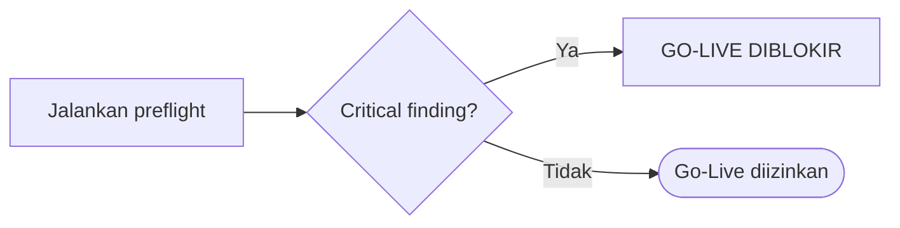

# AWCMS — Production Preflight & Go-Live

Ikuti `docs/awcms/07_sprint_testing_production_readiness.md` dan `docs/awcms/12_generator_prompt.md`.

## Command preflight

```bash
bun install
bun run production:preflight
```

> **KOREKSI 4 Agustus 2026 — dua klaim di paragraf ini tidak berlaku di repo
> ini.** Registry config yang dulu disebut di sini (di bawah src/lib/config/)
> **tidak ada** — direktori itu sendiri tidak ada — dan `config:docs:check` bukan
> target di `package.json`. Keduanya artefak `awcms-mini` yang ikut terbawa. Yang
> NYATA di sini: `scripts/validate-env.ts` (`bun run config:validate`) memegang
> aturan env beserta aturan silang produksi, dan
> `bun run config:env:coverage:check` — bagian dari rantai `bun run check` —
> menjaga tiap variabel yang dibaca kode tetap terdaftar.
>
> **Kenapa klaim itu bertahan berbulan-bulan, dan ini berlaku untuk setiap
> skill:** path-nya **terpotong baris** oleh pembungkusan markdown, dan
> ekstraktor `bun run skills:check` hanya melihat path berbacktick **satu
> baris** — jadi gerbangnya tak pernah melihatnya. (Dibuktikan saat koreksi ini
> ditulis: menyatukannya kembali ke satu baris langsung memerahkan gerbang.
> Karena itu path di atas ditulis **tanpa backtick** — gerbang tidak punya cara
> membedakan "path ini ada" dari "path ini TIDAK ada", dan menandainya sebagai
> klaim akan salah.) Teks aslinya dipertahankan di bawah sebagai catatan sejarah.
>
> _"Sejak Issue #689 (epic #679), `config:validate`'s CLI report menambahkan satu
> seksi baru di akhir output — deprecation notices (informational, tidak pernah
> menggagalkan check ini), didorong oleh registry config's field `deprecated`."_

**`AUTH_COOKIE_SECURE` kini benar-benar dijaga preflight** (4 Agustus 2026):
aturan produksinya menuntut nilai persis `"true"`. Sebelumnya ia hanya menolak
string literal `"false"`, sehingga variabel yang **tidak diset** — keadaan
bawaannya — menghasilkan cookie sesi tanpa `Secure` dengan preflight melaporkan
bersih. Tetap **verifikasi respons**, bukan hanya konfigurasi: `curl -I` pada
login produksi harus menunjukkan `Set-Cookie … Secure`. Validator memeriksa apa
yang dikonfigurasi; hanya respons yang membuktikan apa yang dikirim.

Kompresi respons dan tier cache di ATAS aplikasi (Cloudflare di depan
Traefik/Varnish) tidak diperiksa preflight mana pun — lihat skill `awcms-deploy`
(temuan C3/C14 di dokumen standar performa & keamanan).

Sejak Issue #684 (epic #679), `bun run production:preflight` (Issue 12.2)
adalah SATU perintah **read-only** yang menjalankan urutan lengkap sendiri
— `config:validate` → `security:readiness` → `database:capacity` (Issue
#743, epic #738 platform-evolution — kalkulator kapasitas koneksi
lintas-instance, murni aritmatika config, tanpa koneksi database sama
sekali; lihat `database-capacity-runbook.md`) → `db:connectivity` (satu
`SELECT` memverifikasi koneksi + tabel ledger migrasi) → `api:spec:check`
→ `modules:compose:check` (Issue #740, epic #738 — registry komposisi
build-time modul base valid; tidak ada lagi jalur aplikasi-turunan/
`extension:check`, dihapus oleh ADR-0034) → `test` → `build` →
`db:pool:health` (skip bila server belum
jalan, kecuali `APP_ENV=production` — di situ skip BLOKIR go-live) →
`migration:plan` (dry-run: daftar migrasi pending TANPA menjalankannya).
**Sepuluh** stage read-only total (`scripts/production-preflight.ts`'s
`REMAINING_CHILD_PROCESS_STAGES` + `db:connectivity`/`db:pool:health`/
`migration:plan` yang ditangani terpisah — `extension:check` dihapus, ADR-0034). Tidak ada stage yang menulis ke
database. Menjalankan command satu-satu secara manual (seperti daftar lama
di atas) TIDAK lagi direkomendasikan — `bun run db:migrate` secara
terpisah TIDAK termasuk dalam preflight ini sama sekali; lihat §Menerapkan
migrasi di bawah.

### Menerapkan migrasi (langkah terpisah, wajib eksplisit)

`bun run production:preflight` sendiri **tidak pernah** menulis ke
database — bug lama (Issue #684): `db:migrate` dulu berjalan sebagai
stage awal tanpa syarat, jadi stage belakangan (spec check/test/build)
yang gagal tetap meninggalkan database ter-migrasi walau verdict akhirnya
"GO-LIVE DIBLOKIR". Sekarang menerapkan migrasi butuh flag eksplisit,
HANYA berjalan bila verdict `GO-LIVE DIIZINKAN` (sepuluh stage read-only
di atas semua lulus):

```bash
APP_ENV=production DATABASE_URL=<production-url> bun run production:preflight \
  --apply-migrations --backup-verified --acknowledge-target=production
```

Ketiga flag WAJIB bersamaan (`scripts/production-preflight.ts`'s
`authorizeApply`, diuji unit test): `--apply-migrations` (niat operator),
`--backup-verified` (atestasi backup baru yang sudah dibuktikan bisa
di-restore), `--acknowledge-target=<nilai>` yang harus SAMA PERSIS dengan
`APP_ENV` (penangkap typo — menjalankan di shell/`.env` yang salah dengan
`--acknowledge-target` salah menghasilkan penolakan keras, bukan mutasi
diam-diam ke database yang salah). Prosedur lengkap (rehearsal, bukti backup,
apply, rollback): `docs/awcms/production-preflight-runbook.md`. Tahap
rehearsal-nya hanya berlaku bagi instalasi yang memang mendirikan environment
kedua — repo ini tidak, dan tidak ada profil untuk itu: `staging` dihapus dari
kosakata profil deployment
([ADR-0083](../../../docs/adr/0083-this-template-deploys-to-one-environment.md)
sebagaimana diamandemen; tersisa `development`/`production`/`offline-lan`).
Tanpa environment pendahulu, `--backup-verified` berhenti menjadi atestasi
seremonial: ia satu-satunya yang berdiri di depan migrasi produksi.

## Checklist go-live

**Application:** build pass · migration pass · OpenAPI valid · setup wizard locked · role default ada · ABAC default deny tested · RLS tested · soft delete default filter tested · logging aktif.

**Database:** versi sesuai target · PostgreSQL tidak public · least-privilege user · backup aktif · restore tested · index utama ada · partial index soft delete ada bila relevan · pool sehat · slow query monitoring.

**Security:** no hardcoded secret · `.env` aman & tidak dikomit · password hash modern · login lockout · RLS aktif · ABAC aktif · audit aktif · restore/purge berizin dan diaudit · tax data masked · CRM opt-out respected · AI read-only · sync HMAC bila hybrid · error tanpa stack trace · **no critical finding**.

**Runtime platform:** backend, script, test, migration, build, dan preflight berjalan dengan Bun. Tidak ada `node`, `npm`, `npx`, `pnpm`, `yarn`, adapter server Node.js, atau dependency yang memaksa runtime Node.js kecuali pengecualian tertulis sudah disetujui dan dicatat di docs/audit.

## Gate



## Backup & restore (wajib teruji)

Sejak Issue 12.2, alur ini sudah diimplementasikan sebagai skrip siap
pakai — sejak Issue #691 (epic #679) skrip ini mewajibkan **backup
terenkripsi + manifest bertanda tangan (HMAC)**, dan restore memverifikasi
checksum SEBELUM mutasi apa pun (lihat `deploy/backup/README.md` untuk
model keamanan lengkap: kunci wajib dari FILE — `BACKUP_ENCRYPTION_KEY_FILE`/
`BACKUP_HMAC_KEY_FILE` — bukan CLI/env-content; `DATABASE_URL` tidak pernah
muncul di argv `pg_dump`/`pg_restore`/`psql`; lock mutual-exclusion; off-site
copy opsional via `deploy/backup/offsite-copy.sh`; restore drill terjadwal
via `deploy/backup/restore-drill.sh`):

```bash
DATABASE_URL="$DATABASE_URL" \
BACKUP_DIR=/var/backups/awcms \
BACKUP_ENCRYPTION_KEY_FILE=/etc/awcms/backup-encryption.key \
BACKUP_HMAC_KEY_FILE=/etc/awcms/backup-hmac.key \
./deploy/backup/backup-postgres.sh

DATABASE_URL="$DATABASE_URL" \
BACKUP_ENCRYPTION_KEY_FILE=/etc/awcms/backup-encryption.key \
BACKUP_HMAC_KEY_FILE=/etc/awcms/backup-hmac.key \
./deploy/backup/restore-postgres.sh /var/backups/awcms/awcms_YYYYMMDD_HHMMSS.dump.enc
```

(Restores into the disposable `awcms_restore_test` database by
default — never the live one. `--target=<dbname>` + matching
`--acknowledge-target=<dbname>` is required for a real recovery target.)

Validasi restore: tenant/user/produk/stok/transaksi terbaca · login test · POS smoke test · report smoke test. `deploy/backup/restore-drill.sh` mengotomasi sebagian validasi ini (migrasi schema, tenant isolation RLS, sample record) plus laporan RTO/RPO — jalankan terjadwal, terpisah dari backup harian.

Sejak Issue #684, `--backup-verified` di atas WAJIB berdasarkan bukti
restore-test nyata dari skrip ini, bukan sekadar backup yang "ada" —
lihat `docs/awcms/production-preflight-runbook.md`'s §Backup evidence
untuk urutan lengkap (dump → restore-test → catat evidence).

## Output

Laporan production readiness: status tiap gate, temuan (severity), rollback plan, keputusan go/no-go. Critical control fail **memblokir** go-live.
`--json-output=<path>` (opsional, Issue #684) menulis hasil terstruktur
(`{ go, failedStages, blockingSkips, results, plan, applied }`) ke file — untuk arsip evidence deploy,
tidak mengubah output stdout default.
