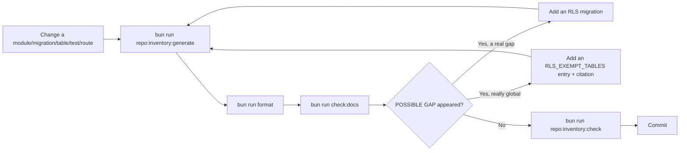

🇬🇧 English (source) · 🇮🇩 [Bahasa Indonesia](SKILL.id.md)

# AWCMS — Repo Inventory Regenerate

`docs/awcms/repo-inventory.md` is a **GENERATED** document — do not edit
it directly. It regenerates, from the repo itself (not from memory or
assumption), five inventories that used to drift easily from reality
(Issue #688, epic #679 — the 2026-07-11 audit found a GitHub snapshot
claiming 6 open issues when 33+ were really open, and stale module names
in `AGENTS.md`):

- **Modules** — from `listModules()` (`src/modules/index.ts`).
- **Migrations** — every `sql/*.sql`, sorted by number.
- **Tables & Row-Level Security** — tables parsed out of `CREATE TABLE` +
  the `ENABLE ROW LEVEL SECURITY` status, matched against the reviewed
  RLS-exempt allow-list (`RLS_EXEMPT_TABLES` in
  `scripts/repo-inventory-generate.ts`).
- **Tests** — the number of test files per `tests/` subdirectory.
- **Routes/Operations** — a summary of the path/operation counts from the
  bundled OpenAPI contract (parity itself is already enforced separately
  by `bun run api:spec:check`, this document only displays the numbers).

The GitHub issue/label/milestone snapshot is **not** regenerated by this
script — that stays the responsibility of the `awcms-github-snapshot`
skill (a live network call to `gh`, deliberately outside `bun run check`).

## When to run it

Run `bun run repo:inventory:generate` in the same PR every time you:

- Add/remove a module in `src/modules/index.ts`.
- Add a new migration in `sql/`.
- Add/remove a table, or change `ENABLE ROW LEVEL SECURITY`.
- Add/remove a test file in `tests/`.
- Add/remove a path/operation in the bundled OpenAPI contract.

`bun run repo:inventory:check` (part of `bun run check`) regenerates it
again in memory and diffs against the committed file — it fails loud if
you missed any of the changes above.

## Command

```bash
bun run repo:inventory:generate
bun run format
bun run check:docs
bun run repo:inventory:check   # must be OK before committing
```

## When "POSSIBLE GAP" appears in the Tables & Row-Level Security section

This is a STATIC heuristic (parsing `sql/*.sql`), not a replacement for
real RLS enforcement (ADR-0003, migration `013` `FORCE ROW LEVEL SECURITY`

- least-privilege roles, or `bun run security:readiness`). Two
  possibilities:

1. **A real gap** — a new tenant-scoped table has no `ALTER TABLE ...
ENABLE ROW LEVEL SECURITY` in any migration. Add an RLS migration
   (skill `awcms-new-migration`), then regenerate.
2. **The table really is global** (registry/catalog, not tenant data) —
   add a new entry to `RLS_EXEMPT_TABLES` (`scripts/repo-inventory-generate.ts`)
   with a citation of the document explaining why (the same pattern as
   `ROUTE_PARITY_EXEMPTIONS`/`CONFIG_EXEMPTIONS`) — do not add an entry
   without a written reason.

## Flow



## Output

A summary: which sections changed (module/migration/table/test/route
count), and whether there is a new RLS "POSSIBLE GAP" that needs review.
