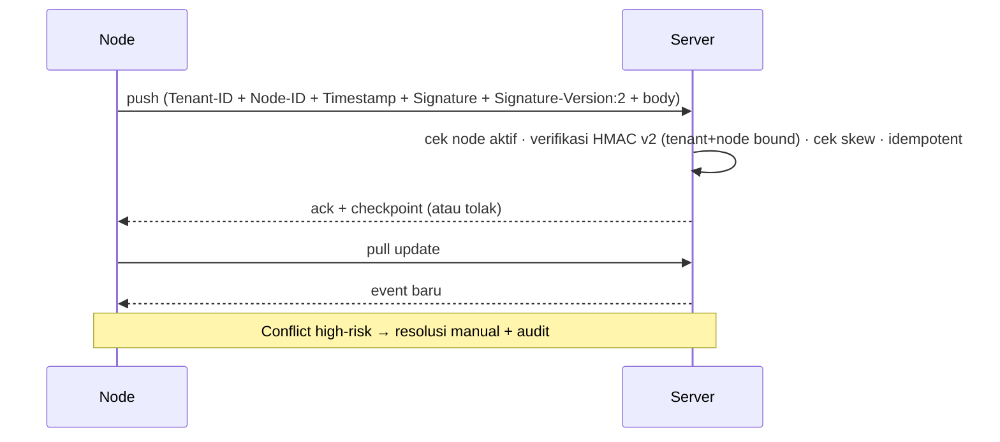

# AWCMS — Sync HMAC & Offline Sync

Ikuti `docs/awcms/08_sop_operasional_user_guide.md` dan `docs/awcms/10_template_kode_coding_standard.md`.

## Signature ber-versi (perbaikan GHSA-c972-3q5p-g3h4)

Celah lintas-tenant lama (tenant & node **di luar** material tanda tangan)
sudah ditutup dengan skema signature **ber-versi**. Gunakan **v2** untuk semua
kode & node baru.

### v2 — kanonik (WAJIB untuk kode baru)

```text
signature = HMAC-SHA256(secret, "v2:<tenantId>:<nodeCode>:<timestamp>:<body>")
```

- Tenant dan node **di dalam** material → signature yang dibuat untuk tenant A
  tidak lagi valid saat header `X-AWCMS-Tenant-ID` ditukar ke tenant B.
- Node **wajib** mengirim header `X-AWCMS-Signature-Version: 2`.
- Field constraint agar material tidak ambigu: `tenantId` = UUID; `nodeCode` &
  `timestamp` dari HTTP header (tak boleh mengandung CR/LF); `body` adalah field
  terakhir sehingga `:` di dalamnya tak menggeser batas field sebelumnya.
- **Enforcement L1 (delimiter hardening, GHSA-c972):** `tenantId` = UUID
  **ditegakkan** di boundary v2, bukan sekadar diasumsikan. `nodeCode` boleh
  mengandung `:` (schema `node_code text`), jadi tanpa syarat UUID, batas
  tenant/node ambigu — `(tenantId="A", nodeCode="x:y")` dan
  `(tenantId="A:x", nodeCode="y")` menghasilkan material identik. UUID = 36 char
  tetap tanpa `:` → batas tak ambigu. `computeSyncSignatureV2` **throw** bila
  `tenantId` bukan UUID; `verifySyncSignatureV2` **fail-closed** (return
  `false`). Hanya `tenantId` yang dibatasi; `nodeCode` tak disentuh dan **format
  material v2 TIDAK berubah** → node v1/v2 lama (tenant id-nya UUID) tak
  terpengaruh; mini/spec tak perlu ubah format material.
- Implementasi kanonik ada di repo **awcms** (`domain/sync-hmac.ts`
  `computeSyncSignatureV2` / `verifySyncSignatureV2`).

### v1 — legacy, RENTAN (transisi saja)

```text
signature = HMAC-SHA256(secret, "<timestamp>.<body>")
```

- Dipakai bila node **tidak** mengirim `X-AWCMS-Signature-Version`.
- Tenant & node tidak terikat → **masih bisa dipalsukan lintas-tenant**. Ada
  hanya supaya node lama tetap jalan selama migrasi.
- Diterima **hanya** selama env `SYNC_HMAC_ALLOW_LEGACY` bukan `false`
  (default: mengizinkan). Operator men-set `SYNC_HMAC_ALLOW_LEGACY=false`
  setelah semua node pindah ke v2 untuk menolak v1 sepenuhnya.
- **Celah tertutup penuh hanya saat `SYNC_HMAC_ALLOW_LEGACY=false` DAN semua
  node memakai v2.** Jangan klaim advisory tertutup sebelum kedua syarat itu.

### Koordinasi lintas-repo

v2 kanonik di **awcms** (base ini). **awcms-mini** dan skill/spec node harus
di-update agar node & spec mencerminkan material v2 yang persis sama sebelum
`SYNC_HMAC_ALLOW_LEGACY=false` diaktifkan di deployment mana pun. Idealnya
lanjutkan ke **secret per-node** (saran advisory ke-3) — di luar scope patch ini.

## Registrasi node — default `inactive` + approve admin

`resolveOrRegisterSyncNode` meng-INSERT node first-contact dengan
`status='inactive'` (bukan `active`). Node dikarantina sampai admin menyetujui
lewat `PATCH /api/v1/sync/nodes/{id}` (`status: "active"`, guarded
`sync_storage.node_management.update`, audited). Ini menutup jalur "node-id
baru" — request palsu untuk tenant lain mendarat di node inactive dan ditolak
gate `node.status !== "active"`. Node yang sudah `active` tak terpengaruh.
(Kolom `sql/010` masih default `active` untuk baris historis; INSERT di kode
yang membuat baris baru jadi eksplisit `inactive` — tanpa mengedit migration
terapan.)

## Header

`X-AWCMS-Tenant-ID`, `X-AWCMS-Node-ID`, `X-AWCMS-Timestamp`,
`X-AWCMS-Signature`, `X-AWCMS-Signature-Version` (`2` untuk v2).

## Aturan validasi

1. Signature **wajib** ada; tolak jika kosong.
2. Timestamp valid; **max skew default 300 detik** (anti replay).
3. **Timing-safe compare** untuk signature (kedua versi).
4. v2: material mengikat tenant+node — tenant-swap otomatis invalid.
5. v1 diterima hanya bila `SYNC_HMAC_ALLOW_LEGACY` ≠ `false`.
6. Node **inactive** ditolak (`node.status !== "active"` → 403); node baru
   auto-register `inactive` dan wajib approve admin.
7. Duplicate event idempotent (tidak dobel) — lihat `awcms-idempotency`.
8. Posted transaction **immutable**; sync tidak menimpa transaksi posted.
9. HMAC secret & R2 credential hanya dari **environment**.

## Alur



## R2 object queue (opsional)

- File lokal disimpan dulu, masuk `awcms_object_sync_queue`.
- Upload saat online; **checksum diverifikasi**; retry aman.

## Verifikasi (test)

- v2 tenant-swap ditolak (material beda → HMAC beda).
- v1 diterima saat `SYNC_HMAC_ALLOW_LEGACY=true`, ditolak saat `false`.
- Node auto-register `inactive` → pull ditolak; node `active` tetap jalan.
- HMAC valid diterima; invalid/expired ditolak.
- Duplicate batch idempotent; checkpoint updated.
- Conflict tercatat immutable + audit.
