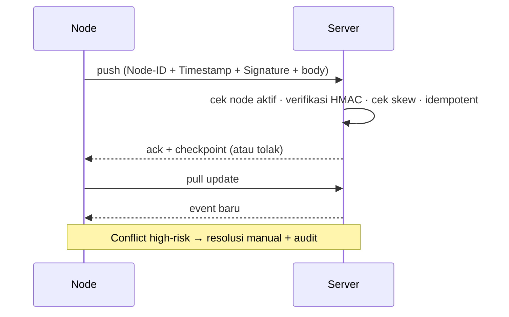

# AWCMS — Sync HMAC & Offline Sync

Ikuti `docs/awcms/08_sop_operasional_user_guide.md` dan `docs/awcms/10_template_kode_coding_standard.md`.

## ⚠️ Spek di bawah ini punya celah lintas-tenant yang diketahui — jangan sebarkan

Skema signature yang didokumentasikan skill ini **cacat** dan sedang dilacak di security advisory privat (`GHSA-c972-3q5p-g3h4`). Jangan jadikan ia contoh untuk kode baru sebelum advisory itu selesai.

Masalahnya: **tenant dan node berada di luar material tanda tangan**. Digabung dengan satu secret deployment-wide dan auto-registrasi node berstatus `active`, pemegang secret sah milik satu tenant dapat menukar header `X-AWCMS-Tenant-ID` dan membaca/menulis data tenant lain — signature yang sama valid untuk **setiap** tenant.

Perhatikan juga: aturan 4 ("Node inactive ditolak") saat ini **hampa**, karena `resolveOrRegisterSyncNode` meng-INSERT node tak dikenal dan `sql/010` memberi `status DEFAULT 'active'` — sehingga cek status selalu lolos.

Arah perbaikan (butuh koordinasi awcms + awcms-mini + skill ini, dan **memutus kompatibilitas protokol** dengan node yang sudah berjalan):

```text
signature = HMAC(secret, "<tenantId>.<nodeCode>.<timestamp>.<body>")
```

plus registrasi node default `inactive` (wajib approve admin), dan idealnya secret per-node.

## Signature (kondisi saat ini — lihat peringatan di atas)

```text
signature = HMAC(secret, "<timestamp>.<body>")
```

Header: `X-AWCMS-Tenant-ID`, `X-AWCMS-Node-ID`, `X-AWCMS-Timestamp`, `X-AWCMS-Signature`. Tenant dibaca dari header dan **tidak diverifikasi terhadap signature** — inilah inti celahnya.

## Aturan validasi

1. Signature **wajib** ada; tolak jika kosong.
2. Timestamp valid; **max skew default 300 detik** (anti replay).
3. **Timing-safe compare** untuk signature.
4. Node inactive ditolak — lihat peringatan di atas: aturan ini belum efektif selama node auto-register berstatus `active`.
5. Duplicate event idempotent (tidak dobel) — lihat `awcms-idempotency`.
6. Posted transaction **immutable**; sync tidak menimpa transaksi posted.
7. HMAC secret & R2 credential hanya dari **environment**.

## Alur



## R2 object queue (opsional)

- File lokal disimpan dulu, masuk `awcms_object_sync_queue`.
- Upload saat online; **checksum diverifikasi**; retry aman.

## Verifikasi (test)

- HMAC valid diterima; invalid/expired ditolak.
- Duplicate batch idempotent; checkpoint updated.
- Conflict tercatat immutable + audit.
