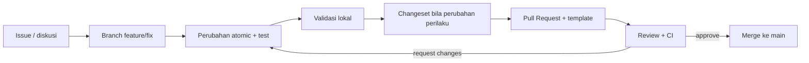

# Berkontribusi ke AWCMS

Terima kasih sudah tertarik berkontribusi. Dokumen ini menjelaskan cara berkontribusi ke AWCMS (platform ERP & integrasi solusi bisnis) secara aman, konsisten, dan sesuai standar.

> **Wajib dibaca lebih dulu:** [`AGENTS.md`](AGENTS.md) adalah kontrak kerja teknis (aturan wajib, guardrail keamanan, alur task). Dokumen ini melengkapinya dengan sisi proses kontribusi. Standar dasar (runtime, RLS, ABAC, kontrak API/event) tercatat di [`docs/adr/`](docs/adr/README.md); baca ADR terkait bila mengubah lapisan fondasi.

## Prinsip singkat

1. **Atomic** — satu Pull Request = satu perubahan yang jelas dan terisolasi (satu issue/modul ERP, bukan gabungan beberapa hal).
2. **Aman by default** — jangan pernah commit secret, kredensial, dump database, atau data bisnis/finansial asli (lihat [`SECURITY.md`](SECURITY.md)).
3. **Konsisten dengan standar yang sudah ditetapkan** — ikuti coding standard yang berlaku kecuali ada ADR lokal yang menyatakan penyesuaian untuk kebutuhan ERP.
4. **Terdokumentasi** — perubahan perilaku wajib menyertakan update dokumen dan changeset.

## Alur kontribusi



1. **Mulai dari issue.** Bila belum ada issue, buat lebih dulu memakai template (sebutkan modul ERP terkait, mis. `finance`, `inventory`, `hr-payroll`, `integration`).
2. **Buat branch** dari `main`: `feature/<issue>-<nama>`, `fix/<issue>-<nama>`, atau `docs/<topik>`.
3. **Kerjakan atomic.** Ikuti aturan wajib di `AGENTS.md`: migration bila schema berubah, OpenAPI bila API berubah, AsyncAPI bila event berubah, idempotency untuk mutation high-risk (posting transaksi, payroll, adjustment finansial, sync integrasi), ABAC + RLS untuk data tenant/entitas-scoped, audit untuk aksi high-risk, masking untuk data sensitif.
4. **Validasi lokal** (lihat di bawah) — jangan buka PR bila validasi gagal.
5. **Tambahkan changeset** bila perubahan mempengaruhi perilaku: `bun run changeset`. Perubahan docs-only/chore boleh tanpa changeset.
6. **Buka Pull Request** dengan mengisi template PR. Kaitkan issue terkait (`Closes #NNN`).

## Setup pengembangan

```bash
bun install
cp .env.example .env
# docker compose up -d db
# bun run db:migrate && bun run dev
```

Prasyarat: **Bun** (versi terkunci di `package.json` `packageManager`/`engines`). Repositori ini **Bun-only** — jangan menambahkan `node`/`npm`/`npx`/`pnpm`/`yarn` atau tooling yang memaksa runtime Node.js.

## Validasi sebelum PR

Jalankan yang relevan dengan perubahan Anda:

```bash
bun run check         # gate CI utama: lint + typecheck + test + build (lihat package.json untuk daftar lengkap)
bun run lint          # prettier check
bun run typecheck     # tsc --noEmit
bun test              # unit + integration test (bun:test) di tests/
bun run api:spec:check   # bila mengubah OpenAPI/AsyncAPI
bun run db:migrate       # bila menambah migration
bun run build            # Astro build
```

## Menulis test

- Test runner = **`bun test`** (`bun:test`). Berkas test di `tests/`, pola nama `*.test.ts`.
- Pisahkan **logika murni** (unit-testable, tanpa I/O) dari **I/O/orkestrasi** (integration test).
- Setiap perubahan perilaku wajib disertai test yang gagal sebelum fix dan lulus sesudahnya.
- Modul ERP dengan dampak finansial (posting, payroll, rekonsiliasi) memerlukan test skenario negatif (double-submit, saldo tidak seimbang, race condition) selain happy path.

## Konvensi commit

Format [Conventional Commits](https://www.conventionalcommits.org/):

```text
<type>(<scope>): <ringkasan singkat, imperative>
```

- **Types:** `feat`, `fix`, `docs`, `test`, `refactor`, `chore`, `security`, `perf`, `ci`, `build`.
- **Scopes base (dari fondasi):** `foundation`, `db`, `api`, `auth`, `access`, `profile`, `tenant`, `sync`, `ui`, `logging`, `security`, `docs`.
- **Scopes ERP (repo ini):** `finance`, `inventory`, `procurement`, `manufacturing`, `hr-payroll`, `integration`, dan modul domain lain sesuai kebutuhan bisnis.
- Baris badan menjelaskan **alasan** perubahan; footer memakai `Closes #NNN`.

## Definition of Done

Sebuah PR dianggap selesai jika:

- Scope sesuai issue, tanpa perubahan unrelated.
- Migration/OpenAPI/AsyncAPI diperbarui bila schema/API/event berubah.
- Input validation, Auth/ABAC/RLS, audit high-risk, masking data sensitif diterapkan.
- Idempotency diterapkan pada mutation high-risk ERP (posting, payroll run, cancel/return, sync).
- Soft delete diterapkan untuk resource yang deletable; data yang sudah posted/final tetap immutable.
- Test relevan lulus; build lulus; CI hijau.
- Dokumentasi diperbarui; changeset ditambahkan bila perilaku berubah.
- Tidak ada secret/data sensitif dalam diff.

## Review

- Modul sensitif (auth, access, sync, dan modul ERP finansial/payroll) memerlukan review keamanan tambahan.
- Maintainer yang tercantum di `.github/CODEOWNERS` (bila ada) otomatis diminta review.

## Lisensi kontribusi

Dengan mengirim kontribusi, Anda setuju bahwa kontribusi tersebut dilisensikan di bawah [lisensi MIT](LICENSE) proyek ini.

## Pertanyaan

Lihat [`SUPPORT.md`](SUPPORT.md) untuk kanal bantuan. Untuk laporan keamanan, ikuti [`SECURITY.md`](SECURITY.md) — **jangan** buka issue publik untuk kerentanan.
