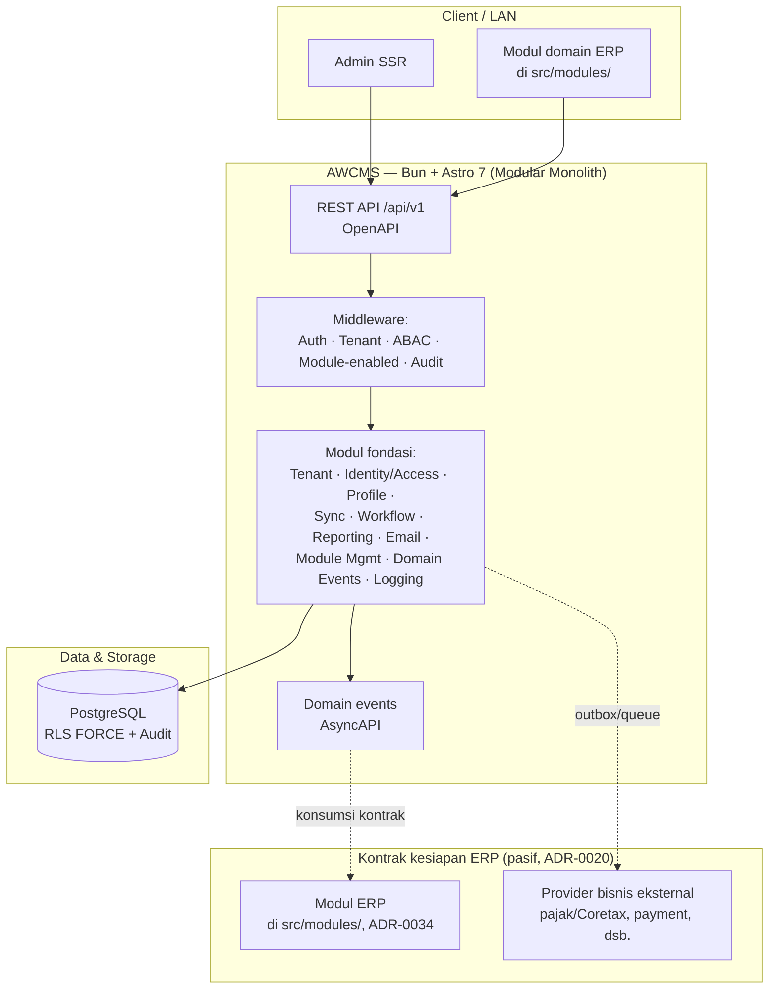
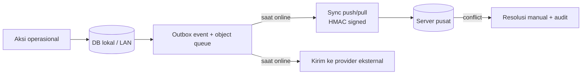
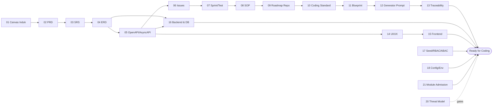

🇮🇩 Bahasa Indonesia (sumber) · 🇬🇧 [English (default)](README.md)

   

# AWCMS — Basis Platform untuk ERP & Solusi Bisnis

> **AWCMS adalah template lini ERP/back-office keluarga AWCMS — dipakai LANGSUNG.** Ia salah satu dari tiga template sejajar (`awcms-mini`/`awcms`/`awcms-micro`) yang dipakai langsung sebagai titik awal pengembangan, bukan basis-turunan-wajib yang di atasnya harus dibangun repo aplikasi terpisah ([ADR-0034](docs/adr/0034-awcms-family-direct-use-templates-and-derived-pathway-removal.md), men-supersede ADR-0013/0014/0015/0022/0025). Sebagai template yang di-ship, base menyediakan **modul fondasi reusable + kontrak netral kesiapan ERP** ([ADR-0020](docs/adr/0020-erp-extension-readiness-contracts.md)) dan belum berisi logika domain ERP (chart of accounts, general ledger, jurnal, AR/AP, valuasi inventori, payroll, perhitungan pajak). Untuk membangun ERP/solusi bisnis: **pakai template ini langsung dan tambahkan modul domain di `src/modules/`** — bukan membuat repo turunan terpisah. Lihat juga [`docs/awcms/erp-extension-contracts.md`](docs/awcms/erp-extension-contracts.md).

> **Status: fondasi aktif dikembangkan.** File kode legacy di repo ini sudah dihapus (lihat commit `chore(foundation): remove legacy repository files`) dan repo ini **dikembangkan ulang dari nol** di atas standar teknis modular monolith (Bun + Astro 7 + PostgreSQL/RLS). Sebelas modul fondasi sudah live (lihat [`docs/ARCHITECTURE.md`](docs/ARCHITECTURE.md) untuk state kode saat ini), sebagai **basis** pengembangan ERP dan solusi bisnis — bukan sekadar CMS/base generik, dan bukan pula sebuah ERP jadi.

## Daftar isi

- [Kenapa repo ini dibangun ulang](#kenapa-repo-ini-dibangun-ulang)
- [Arah pengembangan: basis teknologi awcms-mini, skop fondasi ERP](#arah-pengembangan-basis-teknologi-awcms-mini-skop-fondasi-erp)
- [Arsitektur tingkat tinggi](#arsitektur-tingkat-tinggi)
- [Prinsip offline-first](#prinsip-offline-first)
- [Stack](#stack)
- [Prinsip utama](#prinsip-utama)
- [Paket dokumen](#paket-dokumen)
- [Untuk kontributor](#untuk-kontributor)
- [Status implementasi](#status-implementasi)
- [Keamanan](#keamanan)
- [Tata kelola & komunitas](#tata-kelola--komunitas)
- [Versioning](#versioning)
- [Lisensi](#lisensi)

## Kenapa repo ini dibangun ulang

AWCMS versi lama dibangun di atas kombinasi Node.js, Vite/React (admin & public), dan Supabase. Sepanjang siklus migrasi (ADR-013 s/d ADR-023), setiap komponen dipindah bertahap ke runtime dan arsitektur baru:

- `chore(mcp): migrasi awcms-mcp ke runtime Bun (ADR-019, #113)`
- `chore(public): migrasi awcms-public ke Bun (ADR-019, #113)`
- `chore(admin): migrasi awcms admin (Vite/React) ke Bun (ADR-019, #113)`
- `docs: referensi keputusan arsitektur kanonik (ADR-013…023 per produk)`
- `docs(readme): add architecture update note (PostgreSQL-only, RLS wajib, EmDash optional)`
- `docs: inventaris pemakaian Supabase (audit off-Supabase, #108)`

Setelah seluruh komponen (mcp, public, admin) selesai dipindah dan Supabase tidak lagi dipakai, file-file legacy di repo ini dihapus (`chore(foundation): remove legacy repository files`) — bukan untuk memensiunkan repo, melainkan untuk membersihkan lahan agar AWCMS bisa dibangun ulang di atas fondasi standar yang baru, dengan skop bisnis yang jauh lebih luas dari sebelumnya.

## Arah pengembangan: basis teknologi awcms-mini, skop fondasi ERP

Repo ini **mengadopsi stack dan standar teknis dari [awcms-mini](https://github.com/ahliweb/awcms-mini)** — _modular monolith standard_ AhliWeb — sebagai basis teknologi. Ketiga repo keluarga (`awcms-mini`, `awcms`, `awcms-micro`) adalah **tiga template sejajar yang dipakai langsung** ([ADR-0034](docs/adr/0034-awcms-family-direct-use-templates-and-derived-pathway-removal.md)), bukan hierarki base-dan-turunan; `awcms` adalah template lini ERP/back-office. Sebagai template yang di-ship, fokus repo ini adalah menyediakan **fondasi + kontrak kesiapan ERP**, dan modul domain ERP ditambahkan **langsung di `src/modules/`** saat template dipakai:

- **Modul fondasi reusable** — tenant, identity/access (RBAC/ABAC/RLS), central profile, sync/outbox, workflow, reporting, observability, dsb. — dipakai apa adanya oleh modul domain yang dibangun di atasnya.
- **Kontrak netral kesiapan ERP** — bentuk data pasif, capability port, dan skema payload event (business transaction, posting, period-lock, item/currency/UoM, inventory movement, reporting projection — [ADR-0020](docs/adr/0020-erp-extension-readiness-contracts.md)) yang **diimplementasikan/dikonsumsi oleh modul ERP yang ditambahkan langsung di `src/modules/`** (atau oleh template keluarga lain), bukan diisi logikanya oleh base itu sendiri.
- **Kerangka integrasi solusi bisnis** — pola outbox/queue offline-first-safe + provider adapter (mis. payment gateway, marketplace, pajak/Coretax, logistik) yang menjadi titik pasang bagi konektor domain yang dibangun di atas template ini.
- **Skala multi-tenant/multi-entitas** — RBAC/ABAC/RLS + batas tenant/legal-entity/organization-unit ([ADR-0013](docs/adr/0013-extension-layers-and-boundary-model.md)) yang dipakai ulang lintas modul domain.

Modul domain ERP sesungguhnya (finance/GL, inventory/warehouse, procurement, manufaktur, HR/payroll) dan vertikal bisnis (POS, portal sekolah, dsb.) **ditambahkan langsung di `src/modules/` template ini** saat dipakai ([ADR-0034](docs/adr/0034-awcms-family-direct-use-templates-and-derived-pathway-removal.md)) — bukan di repo turunan terpisah. (Panduan lama [`docs/awcms/derived-application-guide.md`](docs/awcms/derived-application-guide.md) kini **DEPRECATED**.)

Basis teknologi yang diadopsi dari awcms-mini:

| Aspek         | Sebelumnya (repo lama)                 | Sekarang (basis awcms-mini)                                                                                                                       |
| ------------- | -------------------------------------- | ------------------------------------------------------------------------------------------------------------------------------------------------- |
| Runtime       | Node.js                                | **Bun** (Bun-only, lihat ADR-0002)                                                                                                                |
| Web framework | Vite + React (admin/public terpisah)   | **Astro 7** (SSR di atas Bun, satu shell modular monolith)                                                                                        |
| Database      | Supabase (Postgres terkelola)          | **PostgreSQL** dengan **RLS wajib** (ADR-0003)                                                                                                    |
| Arsitektur    | Aplikasi terpisah (mcp, public, admin) | **Modular monolith, microservice-ready** (ADR-0001), modul base reusable (Tenant, Identity, Profile, Access/RBAC-ABAC, Sync, Workflow, Reporting) |
| Mode operasi  | Online-dependent                       | **Offline-first / LAN-first** dengan sync outbox HMAC-signed (ADR-0006)                                                                           |
| Kontrak API   | Ad-hoc                                 | OpenAPI/AsyncAPI tervalidasi, response helper standar                                                                                             |

Modul base reusable (Tenant, Identity, Profile, Access/RBAC-ABAC, Sync, Workflow, Reporting) dari awcms-mini dipakai apa adanya sebagai fondasi; modul domain ERP dan integrasi bisnis dikembangkan **langsung di atas fondasi tersebut, di `src/modules/` template ini** — bukan di repo turunan terpisah ([ADR-0034](docs/adr/0034-awcms-family-direct-use-templates-and-derived-pathway-removal.md), men-supersede ADR-0022).

## Arsitektur tingkat tinggi

Modul fondasi ini tidak mengimplementasikan logika ERP — ia hanya menyediakan kontrak netral (event, posting request/result, period-lock, dsb.) yang **dikonsumsi** oleh modul ERP yang ditambahkan langsung di `src/modules/`. Provider bisnis eksternal terhubung lewat **outbox/queue**, bukan jalur langsung transaksi, sehingga alur kritikal tetap berjalan saat koneksi eksternal bermasalah (ADR-0006).

## Prinsip offline-first

## Stack

- Runtime: **Bun** ([ADR-0002](docs/adr/0002-bun-only-runtime.md) — Bun-only; Node.js hanya lewat pengecualian tertulis berizin maintainer)
- Web framework: **Astro 7** (SSR di atas Bun, `@astrojs/node` sebagai adapter)
- Database: **PostgreSQL** dengan **RLS FORCE** ([ADR-0003](docs/adr/0003-postgresql-rls-multi-tenant.md))
- Arsitektur: **Modular monolith, microservice-ready** ([ADR-0001](docs/adr/0001-rebuild-on-awcms-foundation-erp-scope.md))
- Mode operasi: **Offline-first / LAN-first**, sync outbox opsional ([ADR-0006](docs/adr/0006-offline-first-sync-outbox.md))
- Security baseline: **RBAC + ABAC default-deny + PostgreSQL RLS + Audit Log** ([ADR-0004](docs/adr/0004-rbac-abac-default-deny.md))
- Kontrak: **OpenAPI** + **AsyncAPI**, versi independen dari rilis paket ([ADR-0007](docs/adr/0007-openapi-asyncapi-contracts.md), [ADR-0008](docs/adr/0008-independent-contract-and-module-versioning.md))
- Model keluarga: **template dipakai-langsung, modul domain di `src/modules/`** ([ADR-0034](docs/adr/0034-awcms-family-direct-use-templates-and-derived-pathway-removal.md), men-supersede jalur turunan ADR-0013/0022); boundary tenant/entitas & kriteria ekstraksi layanan tetap dari [ADR-0013](docs/adr/0013-extension-layers-and-boundary-model.md)

## Prinsip utama

1. Modul fondasi bersifat **reusable apa adanya** oleh setiap modul domain yang dibangun di atasnya — bukan ditulis ulang per pemakaian.
2. Kontrak kesiapan ERP bersifat **pasif dan netral** (bentuk data, capability port, skema event) — logika bisnis ERP sesungguhnya **tidak** hidup di base ini ([ADR-0020](docs/adr/0020-erp-extension-readiness-contracts.md)).
3. Multi-tenant wajib memakai `tenant_id`, **RLS FORCE**, tenant context, dan ABAC default-deny di setiap tabel/endpoint tenant-scoped.
4. Provider bisnis eksternal (pajak, payment, logistik, dsb.) tidak boleh menjadi dependency alur kritikal dan tidak boleh dipanggil di dalam DB transaction — selalu lewat outbox/queue.
5. Data sensitif (password, token sesi, identifier pribadi/bisnis) wajib di-hash/mask/redact — tidak pernah tersimpan/tercatat mentah.
6. Master/config yang bisa dihapus memakai **soft delete**; list default menyembunyikan `deleted_at`, restore harus berizin dan diaudit ([ADR-0005](docs/adr/0005-soft-delete-and-immutability.md)).
7. Dokumentasi, migration, kontrak API/event, test, dan skill agent mengikuti implementasi nyata — bukan sebaliknya.
8. Backend **Bun-only**; pengecualian Node.js hanya dengan izin maintainer + catatan docs.

## Paket dokumen

Paket dokumen master ada di [`docs/awcms/`](docs/awcms/README.md) — diadaptasi dari paket `docs/awcms-mini/` di repo [awcms-mini](https://github.com/ahliweb/awcms-mini), disesuaikan ke skop fondasi ERP yang lebih luas:

- **01–13** perencanaan → kontrak → eksekusi; **14–18** desain teknis; **19** glossary; **20** threat model & arsitektur keamanan; **21** tata kelola penerimaan modul (module admission governance).
- **Catatan penting:** banyak dokumen di paket ini memakai contoh domain ERP/retail sebagai **ilustrasi** — polanya reusable, entitas/endpoint/layarnya adalah contoh yang diganti aplikasi turunan sesuai kebutuhan domainnya. Lihat [`docs/awcms/README.md`](docs/awcms/README.md) untuk status penerjemahan dan catatan penting lainnya.
- **Keputusan arsitektural** dicatat di [`docs/adr/`](docs/adr/README.md) (34 ADR saat ini).
- **State kode saat ini** (bukan rencana): [`docs/ARCHITECTURE.md`](docs/ARCHITECTURE.md).

## Untuk kontributor

1. Baca [`AGENTS.md`](AGENTS.md) — kontrak kerja teknis, aturan wajib, guardrail keamanan.
2. Baca [`CONTRIBUTING.md`](CONTRIBUTING.md) — alur kontribusi, setup, konvensi commit, Definition of Done.
3. Gunakan **skill proyek** di [`.claude/skills/`](.claude/skills/) agar standar diterapkan konsisten (satu skill per topik: migration, endpoint, ABAC guard, audit log, testing, dsb.).
4. Kerjakan **atomic** per issue; migration bila schema berubah, OpenAPI bila API berubah, AsyncAPI bila event berubah.
5. Validasi (`bun run check` — gate CI utama; rantai sub-check lengkap dan urutannya didokumentasikan di [`CONTRIBUTING.md`](CONTRIBUTING.md#validasi-sebelum-pr) dan `package.json`'s `check` script, jangan diduplikasi di sini agar tidak drift) sebelum PR. Untuk perubahan UI non-trivial, tambahkan/jalankan E2E browser sungguhan secara terpisah — `bun run test:e2e` (Playwright + Bun), butuh app+`DATABASE_URL` hidup.

## Status implementasi

Sebelas modul fondasi sudah live di kode (lihat [`docs/ARCHITECTURE.md`](docs/ARCHITECTURE.md) untuk detail per modul, dan README masing-masing modul di `src/modules/*/README.md`): `tenant-admin`, `identity-access` (login, sesi, RBAC/ABAC, admin write CRUD — Issue #166/#171), `profile-identity`, `logging` (audit trail), `module-management` (enable/disable per tenant, ditegakkan di setiap request), `sync-storage` (outbox/inbox HMAC-signed, conflict resolution, object queue R2), `workflow-approval`, `reporting` (projection + export), `email` (dispatch + template), `domain-event-runtime` (publisher event lintas modul). Admin SSR shell (`/admin/*`) menyediakan layar read + write (create/edit/soft-delete/restore) untuk seluruh domain di atas.

Riwayat perubahan lengkap ada di [`CHANGELOG.md`](CHANGELOG.md); status issue/PR terkini di [GitHub Issues](https://github.com/ahliweb/awcms/issues) (kerja dilacak langsung sebagai issue GitHub, bukan backlog statis).

## Keamanan

- Kebijakan pelaporan kerentanan: [`SECURITY.md`](SECURITY.md) (gunakan private vulnerability reporting — **jangan** issue publik).
- Model ancaman & arsitektur keamanan: [`docs/awcms/20_threat_model_security_architecture.md`](docs/awcms/20_threat_model_security_architecture.md).
- Automasi: Dependabot, CodeQL, GitHub secret scanning + push protection, GitGuardian, CI hygiene (Bun-only + no-secret).

## Tata kelola & komunitas

| Dokumen                                                                                                          | Isi                                                      |
| ---------------------------------------------------------------------------------------------------------------- | -------------------------------------------------------- |
| [`CONTRIBUTING.md`](CONTRIBUTING.md)                                                                             | Cara berkontribusi                                       |
| [`CODE_OF_CONDUCT.md`](CODE_OF_CONDUCT.md)                                                                       | Standar perilaku komunitas                               |
| [`GOVERNANCE.md`](GOVERNANCE.md)                                                                                 | Peran, pengambilan keputusan, rilis                      |
| [`SUPPORT.md`](SUPPORT.md)                                                                                       | Kanal bantuan                                            |
| [`SECURITY.md`](SECURITY.md)                                                                                     | Kebijakan keamanan                                       |
| [`docs/adr/`](docs/adr/README.md)                                                                                | Architecture Decision Records                            |
| [`docs/Pedoman_Penggunaan_Agent_Keluarga_AWCMS_v1.0.pdf`](docs/Pedoman_Penggunaan_Agent_Keluarga_AWCMS_v1.0.pdf) | Pedoman penggunaan AI agent lintas keluarga produk AWCMS |

## Versioning

**Semantic Versioning** + **[Changesets](.changeset/README.md)**; riwayat lengkap di [`CHANGELOG.md`](CHANGELOG.md). Setiap PR yang mengubah perilaku wajib menyertakan changeset (ditegakkan `bun run changesets:policy:check` di CI). Versi rilis saat ini `5.1.1`.

**Kebijakan penomoran versi (penting, baca sebelum membandingkan versi):**

- Versi rilis paket (`package.json`, README ini) memakai garis nomor major legacy yang disengaja — lompat langsung dari `0.2.0` ke `5.0.0` per keputusan maintainer, BUKAN hasil hitung SemVer otomatis, agar perbandingan versi lintas rebuild tidak pernah terlihat seperti downgrade dari tag legacy terakhir (`v4.6.0`). **`5.0.0` ke atas TIDAK backward-compatible dengan rilis legacy `v2.x`–`v4.x`** manapun — seluruh kode ditulis ulang dari nol di atas fondasi baru. Lihat [ADR-0024](docs/adr/0024-semver-numbering-continues-legacy-major-line.md).
- Versi **kontrak** (`info.version` OpenAPI/AsyncAPI) dan versi/status **module descriptor** (`src/modules/*/module.ts`) memakai kebijakan SemVer independen masing-masing, tidak mekanis terikat ke versi rilis paket. Lihat [ADR-0008](docs/adr/0008-independent-contract-and-module-versioning.md).

## Lisensi

Dilisensikan di bawah lisensi **MIT** — lihat [`LICENSE`](LICENSE). Audit standar pengembangan terakhir: [`docs/awcms/AUDIT_STANDAR_PENGEMBANGAN_2026-07-04.md`](docs/awcms/AUDIT_STANDAR_PENGEMBANGAN_2026-07-04.md).
