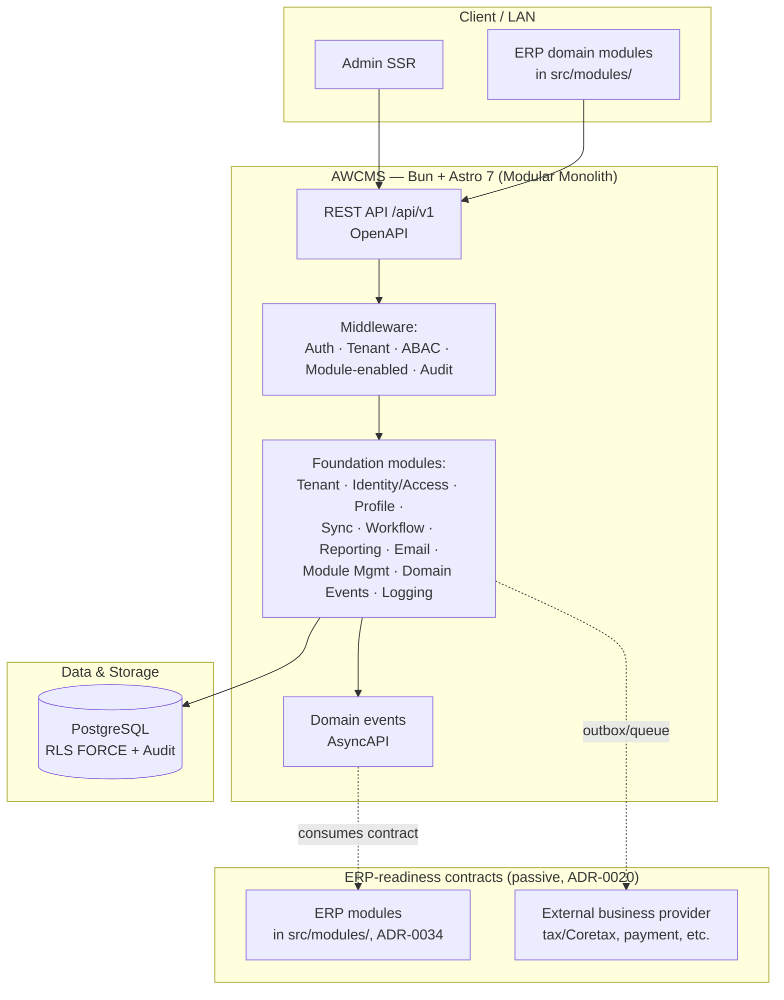
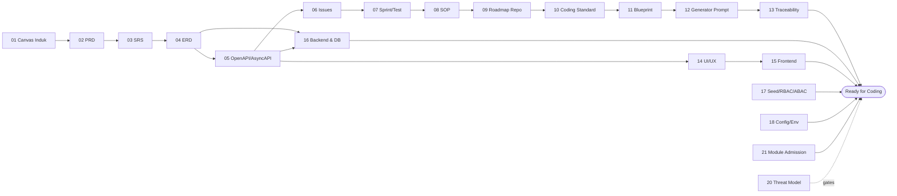

🇬🇧 English (default) · 🇮🇩 [Bahasa Indonesia (sumber)](README.id.md)

<!-- i18n-source-hash: sha256:e4d6d5a92c2b5f22f6d55b8b8a486aa1b16592b371580d42f00aa15d2726178a -->

[](https://github.com/ahliweb/awcms/actions/workflows/ci.yml) [](https://github.com/ahliweb/awcms/actions/workflows/codeql.yml) [](LICENSE) [](https://bun.sh)

# AWCMS — Online-First ERP & Business Solutions Template (AWCMS-family superset)

> **AWCMS is the AWCMS-family ERP/back-office template — used DIRECTLY**, developed from the awcms-mini technical base. Its operating mode is **hybrid online + offline with an online-first priority** (online is the primary path; offline/LAN is the resilience mode), and it is **ERP-ready and built for integrated SaaS**. It is the family's **superset** template: it absorbs the full website/e-commerce module cluster, UI/UX, and auth hardening of `awcms-micro` on top of the awcms-mini foundation and ERP scope ([ADR-0035](docs/adr/0035-awcms-online-first-erp-saas-superset-repositioning.md), refining [ADR-0034](docs/adr/0034-awcms-family-direct-use-templates-and-derived-pathway-removal.md)). By contrast, `awcms-mini` stays hybrid **offline-first** (SaaS-ready) and `awcms-micro` stays the lean **full-online website-only** template. The base provides **reusable foundation modules + neutral ERP-readiness contracts** ([ADR-0020](docs/adr/0020-erp-extension-readiness-contracts.md)); domain modules — ERP and website/content alike — are added **directly in `src/modules/`**, not a separate derived repo. Absorption map: [`docs/awcms/absorb-awcms-micro-roadmap.md`](docs/awcms/absorb-awcms-micro-roadmap.md). See also [`docs/awcms/erp-extension-contracts.md`](docs/awcms/erp-extension-contracts.md).

> **Status: foundation actively developed.** Legacy code files in this repo have already been removed (see commit `chore(foundation): remove legacy repository files`) and this repo has been **rebuilt from scratch** on a modular-monolith technical standard (Bun + Astro 7 + PostgreSQL/RLS). Eighteen modules are already live (see [`docs/ARCHITECTURE.md`](docs/ARCHITECTURE.md) for the current code state) — thirteen foundation modules plus five website/content modules absorbed from awcms-micro (`tenant-domain`, `visitor-analytics`, `media-library`, `data-lifecycle`, `seo-distribution`) — as a **foundation** for ERP, SaaS, and website/e-commerce development — not just a generic CMS/base, and not a finished ERP either.

## Table of contents

- [Why this repo was rebuilt](#why-this-repo-was-rebuilt)
- [Direction: awcms-mini technology base, ERP-foundation scope](#direction-awcms-mini-technology-base-erp-foundation-scope)
- [High-level architecture](#high-level-architecture)
- [Hybrid online-first principle](#hybrid-online-first-principle)
- [Stack](#stack)
- [Core principles](#core-principles)
- [Document package](#document-package)
- [For contributors](#for-contributors)
- [Implementation status](#implementation-status)
- [Security](#security)
- [Governance & community](#governance--community)
- [Versioning](#versioning)
- [License](#license)

## Why this repo was rebuilt

The old version of AWCMS was built on a combination of Node.js, Vite/React (admin & public), and Supabase. Throughout the migration cycle (ADR-013 through ADR-023), every component was moved in stages to a new runtime and architecture:

- `chore(mcp): migrasi awcms-mcp ke runtime Bun (ADR-019, #113)`
- `chore(public): migrasi awcms-public ke Bun (ADR-019, #113)`
- `chore(admin): migrasi awcms admin (Vite/React) ke Bun (ADR-019, #113)`
- `docs: referensi keputusan arsitektur kanonik (ADR-013…023 per produk)`
- `docs(readme): add architecture update note (PostgreSQL-only, RLS wajib, EmDash optional)`
- `docs: inventaris pemakaian Supabase (audit off-Supabase, #108)`

Once every component (mcp, public, admin) had finished moving and Supabase was no longer used, the legacy files in this repo were removed (`chore(foundation): remove legacy repository files`) — not to retire the repo, but to clear the ground so AWCMS could be rebuilt on the new standard foundation, with a much broader business scope than before.

## Direction: awcms-mini technology base, ERP-foundation scope

This repo **adopts the stack and technical standard from [awcms-mini](https://github.com/ahliweb/awcms-mini)** — AhliWeb's _modular monolith standard_ — as its technology base, then **develops** it toward ERP scope and **absorbs** awcms-micro's website/e-commerce cluster. The three family repos (`awcms-mini`, `awcms`, `awcms-micro`) are **three sibling templates used directly** ([ADR-0034](docs/adr/0034-awcms-family-direct-use-templates-and-derived-pathway-removal.md)), not a base-and-derivative hierarchy; `awcms` is the ERP/back-office lineage template, now positioned as **online-first hybrid, ERP + integrated-SaaS ready, and the family superset** ([ADR-0035](docs/adr/0035-awcms-online-first-erp-saas-superset-repositioning.md)). This repo's focus is providing the **foundation + ERP-readiness contracts + a complete website/e-commerce capability set** (absorbed from awcms-micro, see [`docs/awcms/absorb-awcms-micro-roadmap.md`](docs/awcms/absorb-awcms-micro-roadmap.md)), and ERP domain modules are added **directly in `src/modules/`** when the template is used:

- **Reusable foundation modules** — tenant, identity/access (RBAC/ABAC/RLS), central profile, sync/outbox, workflow, reporting, observability, etc. — used as-is by the domain modules built on top of them.
- **Neutral ERP-readiness contracts** — passive data shapes, capability ports, and event payload schemas (business transaction, posting, period-lock, item/currency/UoM, inventory movement, reporting projection — [ADR-0020](docs/adr/0020-erp-extension-readiness-contracts.md)) that are **implemented/consumed by ERP modules added directly in `src/modules/`** (or by other family templates), not given their logic by the base itself.
- **Business-integration framework** — the same offline-first-safe outbox/queue pattern + provider adapters (e.g. payment gateways, marketplaces, tax/Coretax, logistics) as the mounting point for domain connectors built on top of this template.
- **Multi-tenant/multi-entity scale** — RBAC/ABAC/RLS + tenant/legal-entity/organization-unit boundaries ([ADR-0013](docs/adr/0013-extension-layers-and-boundary-model.md)) reused across domain modules.

Actual ERP domain modules (finance/GL, inventory/warehouse, procurement, manufacturing, HR/payroll) and business verticals (POS, school portal, etc.) are **added directly in this template's `src/modules/`** when it is used ([ADR-0034](docs/adr/0034-awcms-family-direct-use-templates-and-derived-pathway-removal.md)) — not in a separate derived repo. (The former [`docs/awcms/derived-application-guide.md`](docs/awcms/derived-application-guide.md) guide is now **DEPRECATED**.)

Technology base adopted from awcms-mini:

| Aspect         | Before (old repo)                    | Now (awcms-mini base)                                                                                                                               |
| -------------- | ------------------------------------ | --------------------------------------------------------------------------------------------------------------------------------------------------- |
| Runtime        | Node.js                              | **Bun** (Bun-only, see ADR-0002)                                                                                                                    |
| Web framework  | Vite + React (separate admin/public) | **Astro 7** (SSR on Bun, single modular-monolith shell)                                                                                             |
| Database       | Supabase (managed Postgres)          | **PostgreSQL** with **mandatory RLS** (ADR-0003)                                                                                                    |
| Architecture   | Separate apps (mcp, public, admin)   | **Modular monolith, microservice-ready** (ADR-0001), reusable base modules (Tenant, Identity, Profile, Access/RBAC-ABAC, Sync, Workflow, Reporting) |
| Operating mode | Online-dependent                     | **Hybrid online-first** (online is the primary path; offline/LAN is the resilience mode with HMAC-signed sync outbox, ADR-0006)                     |
| API contract   | Ad-hoc                               | Validated OpenAPI/AsyncAPI, standard response helper                                                                                                |

Reusable base modules (Tenant, Identity, Profile, Access/RBAC-ABAC, Sync, Workflow, Reporting) from awcms-mini are used as-is as the foundation; ERP domain modules and business integrations are developed **directly on top of that foundation, in this template's `src/modules/`** — not in a separate derived repo ([ADR-0034](docs/adr/0034-awcms-family-direct-use-templates-and-derived-pathway-removal.md), superseding ADR-0022).

## High-level architecture



These foundation modules do not implement ERP logic — they only provide neutral contracts (events, posting request/result, period-lock, etc.) that are **consumed** by ERP modules added directly in `src/modules/`. External business providers connect via **outbox/queue**, not a direct transaction path, so critical flows keep running when an external connection has issues (ADR-0006).

## Hybrid online-first principle

`awcms`'s operating mode is **hybrid online + offline with an online-first priority**: online connectivity is the primary path and deployment default (synced multi-branch, public portals, provider integrations). Offline/LAN capabilities (HMAC outbox/sync, [ADR-0006](docs/adr/0006-offline-first-sync-outbox.md)) remain present and supported as a **resilience mode** when connectivity drops — not the primary assumption like `awcms-mini`, which is offline-first. Data flow stays idempotent and safe to reconcile when back online:

```mermaid
flowchart LR
  Tx[Operational action] -->|online (primary)| Server[(Central server / SaaS)]
  Tx -.->|when offline/LAN| Local[(Local / LAN DB)]
  Local --> Outbox[Outbox event + object queue]
  Outbox -->|when back online| Sync[Sync push/pull<br/>HMAC signed]
  Sync --> Server
  Server -->|conflict| Manual[Manual resolution + audit]
  Server -.-> Deliver[Send to external provider]
```

## Stack

- Runtime: **Bun** ([ADR-0002](docs/adr/0002-bun-only-runtime.md) — Bun-only; Node.js only via a written, maintainer-approved exception)
- Web framework: **Astro 7** (SSR on Bun, `@astrojs/node` as adapter)
- Database: **PostgreSQL** with **RLS FORCE** ([ADR-0003](docs/adr/0003-postgresql-rls-multi-tenant.md))
- Architecture: **Modular monolith, microservice-ready** ([ADR-0001](docs/adr/0001-rebuild-on-awcms-foundation-erp-scope.md))
- Operating mode: **Hybrid online-first** — online is the primary path; offline/LAN is the resilience mode, optional sync outbox ([ADR-0006](docs/adr/0006-offline-first-sync-outbox.md))
- Security baseline: **RBAC + ABAC default-deny + PostgreSQL RLS + Audit Log** ([ADR-0004](docs/adr/0004-rbac-abac-default-deny.md))
- Contracts: **OpenAPI** + **AsyncAPI**, versioned independently from the package release ([ADR-0007](docs/adr/0007-openapi-asyncapi-contracts.md), [ADR-0008](docs/adr/0008-independent-contract-and-module-versioning.md))
- Family model: **direct-use templates, domain modules in `src/modules/`** ([ADR-0034](docs/adr/0034-awcms-family-direct-use-templates-and-derived-pathway-removal.md), superseding the derived pathway of ADR-0013/0022); `awcms` = **online-first hybrid & superset** absorbing awcms-micro ([ADR-0035](docs/adr/0035-awcms-online-first-erp-saas-superset-repositioning.md)); tenant/entity boundaries & service-extraction criteria remain from [ADR-0013](docs/adr/0013-extension-layers-and-boundary-model.md)

## Core principles

1. Foundation modules are **reusable as-is** by every domain module built on top — not rewritten per use.
2. ERP-readiness contracts are **passive and neutral** (data shapes, capability ports, event schemas) — actual ERP business logic does **not** live in this base ([ADR-0020](docs/adr/0020-erp-extension-readiness-contracts.md)).
3. Multi-tenancy requires `tenant_id`, **RLS FORCE**, tenant context, and default-deny ABAC on every tenant-scoped table/endpoint.
4. External business providers (tax, payment, logistics, etc.) must not become a critical-path dependency and must never be called inside a DB transaction — always via outbox/queue.
5. Sensitive data (passwords, session tokens, personal/business identifiers) must be hashed/masked/redacted — never stored/logged raw.
6. Deletable master/config data uses **soft delete**; default lists hide `deleted_at`, restore requires permission and is audited ([ADR-0005](docs/adr/0005-soft-delete-and-immutability.md)).
7. Documentation, migrations, API/event contracts, tests, and agent skills follow the real implementation — not the other way around.
8. Backend is **Bun-only**; Node.js exceptions only with maintainer approval + documented note.

## Document package

The master document package lives in [`docs/awcms/`](docs/awcms/README.md) — adapted from the `docs/awcms-mini/` package in the [awcms-mini](https://github.com/ahliweb/awcms-mini) repo, tailored to a broader ERP-foundation scope:



- **01–13** planning → contract → execution; **14–18** technical design; **19** glossary; **20** threat model & security architecture; **21** module admission governance.
- **Important note:** many documents in this package use ERP/retail domain examples as **illustration** — the pattern is reusable, the entities/endpoints/screens are examples that domain modules in `src/modules/` swap or extend for their own domain needs. See [`docs/awcms/README.md`](docs/awcms/README.md) for translation status and other important notes.
- **Architectural decisions** are recorded in [`docs/adr/`](docs/adr/README.md) (40 ADRs currently).
- **Current code state** (not a plan): [`docs/ARCHITECTURE.md`](docs/ARCHITECTURE.md).

## For contributors

1. Read `AGENTS.md` — technical work contract, mandatory rules, security guardrails.
2. Read [`CONTRIBUTING.md`](CONTRIBUTING.md) — contribution flow, setup, commit conventions, Definition of Done.
3. Use the **project skills** in [`.claude/skills/`](.claude/skills/) so standards are applied consistently (one skill per topic: migration, endpoint, ABAC guard, audit log, testing, etc.).
4. Work **atomically** per issue; add a migration when the schema changes, OpenAPI when the API changes, AsyncAPI when an event changes.
5. Validate (`bun run check` — the main CI gate; the full sub-check chain and its order are documented in [`CONTRIBUTING.md`](CONTRIBUTING.md#validasi-sebelum-pr) and `package.json`'s `check` script — not duplicated here to avoid drift) before opening a PR. For non-trivial UI changes, add/run a real browser E2E separately — `bun run test:e2e` (Playwright + Bun), needs a live app + `DATABASE_URL`.

## Implementation status

Thirteen foundation modules are already live in code (see [`docs/ARCHITECTURE.md`](docs/ARCHITECTURE.md) for per-module detail, and each module's own README at `src/modules/*/README.md`): `tenant-admin`, `identity-access` (login, sessions, RBAC/ABAC, MFA/OIDC/SSO, business-scope, SoD, admin write CRUD — Issue #166/#171), `profile-identity`, `logging` (audit trail), `module-management` (per-tenant enable/disable, enforced on every request), `sync-storage` (HMAC-signed outbox/inbox, conflict resolution, R2 object queue), `workflow-approval`, `reporting` (projections + export), `email` (dispatch + templates), `domain-event-runtime` (cross-module event publisher), `theming`, `blog-content`, `news-portal` (public website/content modules). The admin SSR shell (`/admin/*`) provides read + write (create/edit/soft-delete/restore) screens across all of the above. The rest of awcms-micro's website/e-commerce capabilities are being **absorbed incrementally** — see [`docs/awcms/absorb-awcms-micro-roadmap.md`](docs/awcms/absorb-awcms-micro-roadmap.md).

Full change history is in [`CHANGELOG.md`](CHANGELOG.md); current issue/PR status is on [GitHub Issues](https://github.com/ahliweb/awcms/issues) (work is tracked directly as GitHub issues, not a static backlog).

## Security

- Vulnerability reporting policy: [`SECURITY.md`](SECURITY.md) (use private vulnerability reporting — **not** a public issue).
- Threat model & security architecture: [`docs/awcms/20_threat_model_security_architecture.md`](docs/awcms/20_threat_model_security_architecture.md).
- Automation: Dependabot, CodeQL, GitHub secret scanning + push protection, GitGuardian, CI hygiene (Bun-only + no-secret).

## Governance & community

| Document                                   | Contents                         |
| ------------------------------------------ | -------------------------------- |
| [`CONTRIBUTING.md`](CONTRIBUTING.md)       | How to contribute                |
| [`CODE_OF_CONDUCT.md`](CODE_OF_CONDUCT.md) | Community behavior standards     |
| [`GOVERNANCE.md`](GOVERNANCE.md)           | Roles, decision-making, releases |
| [`SUPPORT.md`](SUPPORT.md)                 | Help channels                    |
| [`SECURITY.md`](SECURITY.md)               | Security policy                  |
| [`docs/adr/`](docs/adr/README.md)          | Architecture Decision Records    |

## Versioning

**Semantic Versioning** + **[Changesets](.changeset/README.md)**; full history in [`CHANGELOG.md`](CHANGELOG.md). Every PR that changes behavior must include a changeset (enforced by `bun run changesets:policy:check` in CI). Current release version is `6.0.0`.

**Version numbering policy (important, read before comparing versions):**

- The package release version (`package.json`, this README) uses a deliberate legacy major-number line — jumping directly from `0.2.0` to `5.0.0` per maintainer decision, NOT a tool-computed SemVer increment, so version comparisons across the rebuild never look like a downgrade from the last legacy tag (`v4.6.0`). **`5.0.0` and above are NOT backward-compatible with any legacy `v2.x`–`v4.x` release** — the entire codebase was rewritten from scratch on a new foundation. See [ADR-0024](docs/adr/0024-semver-numbering-continues-legacy-major-line.md).
- **Contract** version (`info.version` in OpenAPI/AsyncAPI) and **module descriptor** version/status (`src/modules/*/module.ts`) follow their own independent SemVer policy, not mechanically tied to the package release version. See [ADR-0008](docs/adr/0008-independent-contract-and-module-versioning.md).

## License

Licensed under the **MIT** license — see [`LICENSE`](LICENSE). Latest development-standard audit: [`docs/awcms/AUDIT_STANDAR_PENGEMBANGAN_2026-07-04.md`](docs/awcms/AUDIT_STANDAR_PENGEMBANGAN_2026-07-04.md).
