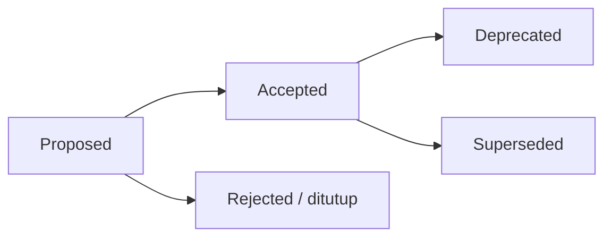

🇮🇩 Bahasa Indonesia (sumber) · 🇬🇧 [English (default)](README.md)

# Architecture Decision Records (ADR)

Folder ini menyimpan **catatan keputusan arsitektural** AWCMS — **basis/fondasi platform tempat ERP & solusi bisnis dibangun di atasnya** (bukan sebuah ERP; lihat [ADR-0022](0022-erp-modules-live-in-extension-repos.md)). Setiap keputusan penting (arsitektur, runtime, kontrak, keamanan, atau penyimpangan dari standar dasar) dicatat sebagai satu berkas ADR agar konteks dan alasannya awet.

## Hubungan dengan repo acuan awcms-mini

AWCMS dibangun ulang (lihat [ADR-0001](0001-rebuild-on-awcms-foundation-erp-scope.md)) di atas basis teknis modular monolith [`ahliweb/awcms-mini`](https://github.com/ahliweb/awcms-mini). Namun repo ini bersifat **standalone** — ia menanggung sendiri seluruh fondasi (tidak berbagi base terpisah), sehingga ADR fondasi (runtime, RLS, ABAC, offline-first, kontrak API/event, admission modul) **hidup lokal di folder ini** sebagai ADR-0002…0021, hasil adaptasi dari ADR acuan awcms-mini. ADR yang **spesifik untuk skop ERP & integrasi bisnis** ditambahkan di atasnya.

> Catatan penomoran: ADR-0001 di repo ini adalah keputusan **rebuild**. Framing awalnya ("platform ERP", modul ERP di `src/modules/`) telah **di-amend oleh [ADR-0022](0022-erp-modules-live-in-extension-repos.md)**: AWCMS adalah **basis** tempat ERP dibangun (di repo ekstensi terpisah), bukan sebuah ERP. Prinsip modular monolith yang mendasarinya diadopsi eksplisit oleh ADR-0001 dan dirinci oleh ADR fondasi 0002–0021 serta [`../ARCHITECTURE.md`](../ARCHITECTURE.md).

## Aturan

1. Satu keputusan = satu berkas `NNNN-judul-kebab.md` (nomor urut, nol di depan).
2. ADR **tidak dihapus**. Bila sebuah keputusan diganti, ADR lama ditandai `Status: Superseded by ADR-XXXX` dan ADR baru mereferensikannya.
3. Status yang valid: `Proposed`, `Accepted`, `Deprecated`, `Superseded`.
4. Perubahan standar yang mengikat (lihat [`GOVERNANCE.md`](../../GOVERNANCE.md)) wajib punya ADR.
5. Gunakan template di [`0000-template.md`](0000-template.md).

## Alur

## Indeks

| ADR                                                                   | Judul                                                                                             | Status   |
| --------------------------------------------------------------------- | ------------------------------------------------------------------------------------------------- | -------- |
| [0001](0001-rebuild-on-awcms-foundation-erp-scope.md)                 | Rebuild AWCMS sebagai platform ERP di atas standar modular monolith                               | Accepted |
| [0002](0002-bun-only-runtime.md)                                      | Runtime & tooling Bun-only                                                                        | Accepted |
| [0003](0003-postgresql-rls-multi-tenant.md)                           | PostgreSQL + RLS untuk isolasi multi-tenant                                                       | Accepted |
| [0004](0004-rbac-abac-default-deny.md)                                | RBAC + ABAC default-deny sebagai baseline akses                                                   | Accepted |
| [0005](0005-soft-delete-and-immutability.md)                          | Soft delete untuk master/config, immutability untuk data posted                                   | Accepted |
| [0006](0006-offline-first-sync-outbox.md)                             | Offline-first + transactional outbox + sync HMAC                                                  | Accepted |
| [0007](0007-openapi-asyncapi-contracts.md)                            | OpenAPI & AsyncAPI sebagai kontrak wajib                                                          | Accepted |
| [0008](0008-independent-contract-and-module-versioning.md)            | Versioning independen: package, kontrak API/event, module descriptor                              | Accepted |
| [0009](0009-public-tenant-scoped-routes.md)                           | Resolusi tenant untuk rute publik (tanpa sesi)                                                    | Accepted |
| [0010](0010-public-host-tenant-routing.md)                            | Host/domain-based public tenant routing                                                           | Accepted |
| [0011](0011-capability-ports-for-cross-module-collaboration.md)       | Capability ports untuk kolaborasi lintas-modul                                                    | Accepted |
| [0012](0012-module-admission-and-trusted-registry-boundary.md)        | Module admission categories & trusted static registry boundary                                    | Accepted |
| [0013](0013-extension-layers-and-boundary-model.md)                   | Lapisan ekstensi platform, batas tenant/bisnis, kriteria ekstraksi layanan                        | Accepted |
| [0014](0014-deterministic-build-time-module-composition.md)           | Komposisi modul deterministik build-time (registry base + aplikasi turunan)                       | Accepted |
| [0015](0015-derived-application-compatibility-manifest.md)            | Derived-application compatibility manifest, test kit, semantic-version gates                      | Accepted |
| [0016](0016-organization-structure-module-admission.md)               | Admission `organization_structure` (Official Optional Business Foundation)                        | Accepted |
| [0017](0017-document-infrastructure-module-admission.md)              | Admission `document_infrastructure` (Official Optional Business Foundation)                       | Accepted |
| [0018](0018-data-exchange-module-admission.md)                        | Admission `data_exchange` (Official Optional Business Foundation)                                 | Accepted |
| [0019](0019-integration-hub-module-admission.md)                      | Admission `integration_hub` (System Foundation)                                                   | Accepted |
| [0020](0020-erp-extension-readiness-contracts.md)                     | Kontrak kesiapan ekstensi ERP (business transaction, posting, period-lock, item, projection)      | Accepted |
| [0021](0021-reference-data-module-admission.md)                       | Admission `reference_data` (Official Optional Business Foundation)                                | Accepted |
| [0022](0022-erp-modules-live-in-extension-repos.md)                   | Modul domain ERP hidup di repo ekstensi, bukan di base (amandemen ADR-0001 poin 3)                | Accepted |
| [0023](0023-bilingual-docs-indonesian-source-english-default.md)      | Dokumentasi dwibahasa: sumber Indonesia, Inggris default, digerbang staleness                     | Accepted |
| [0024](0024-semver-numbering-continues-legacy-major-line.md)          | Penomoran SemVer melanjutkan lini major legacy (lompat ke 5.0.0), bukan reset ke 1.0.0            | Accepted |
| [0025](0025-implement-deterministic-build-time-module-composition.md) | Implementasi nyata komposisi modul deterministik build-time di awcms (adendum ADR-0014)           | Accepted |
| [0026](0026-modular-openapi-ownership-and-composition.md)             | Kontrak OpenAPI modular: kepemilikan per modul, bundle deterministik, kontribusi fragment turunan | Accepted |
| [0027](0027-mfa-totp-session-assurance-step-up.md)                    | MFA TOTP, recovery codes, session assurance (aal1/aal2), dan step-up                              | Accepted |
| [0028](0028-oidc-sso-tenant-aware-account-linking-break-glass.md)     | OIDC/SSO tenant-aware, account linking fail-closed, SSRF guard, dan break-glass                   | Accepted |
| [0029](0029-deployment-profile-aware-turnstile-bot-protection.md)     | Cloudflare Turnstile bot protection sadar profil deployment (LAN/offline exempt)                  | Accepted |
| [0030](0030-business-scope-hierarchy-generic-authorization-layer.md)  | Lapisan authorization generik business-scope hierarchy (multi-entity/unit)                        | Accepted |
| [0031](0031-segregation-of-duties-conflict-enforcement.md)            | Segregation of duties (SoD) generik, exception/override, conflict enforcement                     | Accepted |
| [0032](0032-family-compatibility-manifest-and-ci-conformance.md)      | Compatibility manifest keluarga + CI conformance terhadap standar AWCMS-Mini                      | Accepted |

ADR spesifik skop fondasi ERP & integrasi bisnis ditambahkan mulai nomor berikutnya seiring keputusan diambil.
