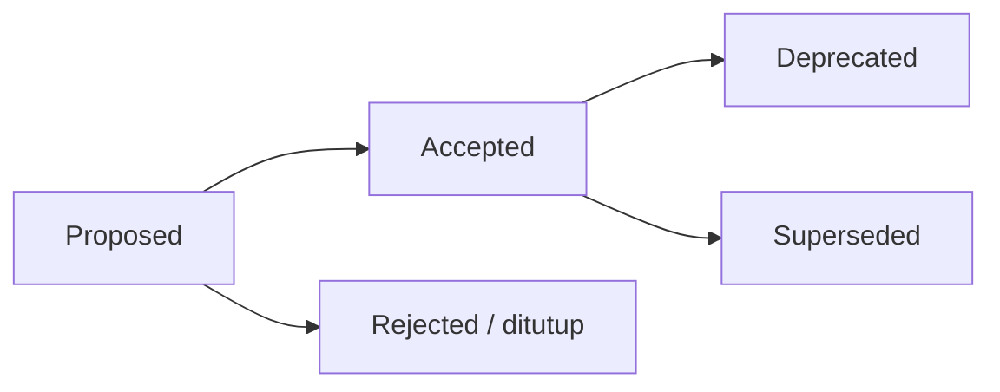

🇮🇩 Bahasa Indonesia (sumber) · 🇬🇧 [English (default)](README.md)

# Architecture Decision Records (ADR)

Folder ini menyimpan **catatan keputusan arsitektural** AWCMS — salah satu dari **tiga template keluarga AWCMS yang dipakai langsung** — lini ERP/back-office, kini **online-first hybrid & superset keluarga** yang menyerap klaster website/e-commerce awcms-micro (lihat [ADR-0034](0034-awcms-family-direct-use-templates-and-derived-pathway-removal.md) & [ADR-0035](0035-awcms-online-first-erp-saas-superset-repositioning.md)). Setiap keputusan penting (arsitektur, runtime, kontrak, keamanan, atau penyimpangan dari standar dasar) dicatat sebagai satu berkas ADR agar konteks dan alasannya awet.

## Hubungan dengan repo acuan awcms-mini

AWCMS dibangun ulang (lihat [ADR-0001](0001-rebuild-on-awcms-foundation-erp-scope.md)) di atas basis teknis modular monolith [`ahliweb/awcms-mini`](https://github.com/ahliweb/awcms-mini). Repo ini bersifat **standalone** — ia menanggung sendiri seluruh fondasi (tidak berbagi base terpisah), sehingga ADR fondasi (runtime, RLS, ABAC, offline-first, kontrak API/event, admission modul) **hidup lokal di folder ini** sebagai ADR-0002…0021, hasil adaptasi dari ADR acuan awcms-mini. Sejak [ADR-0034](0034-awcms-family-direct-use-templates-and-derived-pathway-removal.md), `awcms-mini`, `awcms`, dan `awcms-micro` diposisikan sebagai **tiga template sejajar yang dipakai langsung** (bukan hierarki base-dan-turunan): `awcms` adalah template lini ERP/back-office. ADR yang **spesifik untuk skop ERP & integrasi bisnis** ditambahkan di atas fondasi itu.

> Catatan penomoran: ADR-0001 di repo ini adalah keputusan **rebuild**. Framing awalnya ("platform ERP", modul ERP di `src/modules/`) sempat **di-amend oleh [ADR-0022](0022-erp-modules-live-in-extension-repos.md)** (memindahkan modul ERP ke repo ekstensi terpisah), namun ADR-0022 kini **di-supersede oleh [ADR-0034](0034-awcms-family-direct-use-templates-and-derived-pathway-removal.md)**: keluarga AWCMS adalah tiga template dipakai-langsung dan modul domain — termasuk ERP — **boleh & seharusnya hidup langsung di `src/modules/`** template yang dipakai, bukan di repo turunan terpisah. Prinsip modular monolith yang mendasarinya diadopsi eksplisit oleh ADR-0001 dan dirinci oleh ADR fondasi 0002–0021 serta [`../ARCHITECTURE.md`](../ARCHITECTURE.md).

## Aturan

1. Satu keputusan = satu berkas `NNNN-judul-kebab.md` (nomor urut, nol di depan).
2. ADR **tidak dihapus**. Bila sebuah keputusan diganti, ADR lama ditandai `Status: Superseded by ADR-XXXX` dan ADR baru mereferensikannya.
3. Status yang valid: `Proposed`, `Accepted`, `Deprecated`, `Superseded`.
4. Perubahan standar yang mengikat (lihat [`GOVERNANCE.md`](../../GOVERNANCE.md)) wajib punya ADR.
5. Gunakan template di [`0000-template.md`](0000-template.md).

## Alur

```mermaid
flowchart LR
  P[Proposed] --> A[Accepted]
  A --> D[Deprecated]
  A --> S[Superseded]
  P --> R[Rejected / ditutup]
```

## Indeks

| ADR                                                                           | Judul                                                                                                                                                                                                                                                                                                                                                                                                                                                                                                                                                                                                                                                                                                                                                                                                                                                                                                                                                                                                                                               | Status                                                                                                              |
| ----------------------------------------------------------------------------- | --------------------------------------------------------------------------------------------------------------------------------------------------------------------------------------------------------------------------------------------------------------------------------------------------------------------------------------------------------------------------------------------------------------------------------------------------------------------------------------------------------------------------------------------------------------------------------------------------------------------------------------------------------------------------------------------------------------------------------------------------------------------------------------------------------------------------------------------------------------------------------------------------------------------------------------------------------------------------------------------------------------------------------------------------- | ------------------------------------------------------------------------------------------------------------------- |
| [0001](0001-rebuild-on-awcms-foundation-erp-scope.md)                         | Rebuild AWCMS sebagai platform ERP di atas standar modular monolith                                                                                                                                                                                                                                                                                                                                                                                                                                                                                                                                                                                                                                                                                                                                                                                                                                                                                                                                                                                 | Accepted                                                                                                            |
| [0002](0002-bun-only-runtime.md)                                              | Runtime & tooling Bun-only                                                                                                                                                                                                                                                                                                                                                                                                                                                                                                                                                                                                                                                                                                                                                                                                                                                                                                                                                                                                                          | Accepted                                                                                                            |
| [0003](0003-postgresql-rls-multi-tenant.md)                                   | PostgreSQL + RLS untuk isolasi multi-tenant                                                                                                                                                                                                                                                                                                                                                                                                                                                                                                                                                                                                                                                                                                                                                                                                                                                                                                                                                                                                         | Accepted                                                                                                            |
| [0004](0004-rbac-abac-default-deny.md)                                        | RBAC + ABAC default-deny sebagai baseline akses                                                                                                                                                                                                                                                                                                                                                                                                                                                                                                                                                                                                                                                                                                                                                                                                                                                                                                                                                                                                     | Accepted                                                                                                            |
| [0005](0005-soft-delete-and-immutability.md)                                  | Soft delete untuk master/config, immutability untuk data posted                                                                                                                                                                                                                                                                                                                                                                                                                                                                                                                                                                                                                                                                                                                                                                                                                                                                                                                                                                                     | Accepted                                                                                                            |
| [0006](0006-offline-first-sync-outbox.md)                                     | Offline-first + transactional outbox + sync HMAC                                                                                                                                                                                                                                                                                                                                                                                                                                                                                                                                                                                                                                                                                                                                                                                                                                                                                                                                                                                                    | Accepted                                                                                                            |
| [0007](0007-openapi-asyncapi-contracts.md)                                    | OpenAPI & AsyncAPI sebagai kontrak wajib                                                                                                                                                                                                                                                                                                                                                                                                                                                                                                                                                                                                                                                                                                                                                                                                                                                                                                                                                                                                            | Accepted                                                                                                            |
| [0008](0008-independent-contract-and-module-versioning.md)                    | Versioning independen: package, kontrak API/event, module descriptor                                                                                                                                                                                                                                                                                                                                                                                                                                                                                                                                                                                                                                                                                                                                                                                                                                                                                                                                                                                | Accepted                                                                                                            |
| [0009](0009-public-tenant-scoped-routes.md)                                   | Resolusi tenant untuk rute publik (tanpa sesi)                                                                                                                                                                                                                                                                                                                                                                                                                                                                                                                                                                                                                                                                                                                                                                                                                                                                                                                                                                                                      | Accepted                                                                                                            |
| [0010](0010-public-host-tenant-routing.md)                                    | Host/domain-based public tenant routing                                                                                                                                                                                                                                                                                                                                                                                                                                                                                                                                                                                                                                                                                                                                                                                                                                                                                                                                                                                                             | Accepted                                                                                                            |
| [0011](0011-capability-ports-for-cross-module-collaboration.md)               | Capability ports untuk kolaborasi lintas-modul                                                                                                                                                                                                                                                                                                                                                                                                                                                                                                                                                                                                                                                                                                                                                                                                                                                                                                                                                                                                      | Accepted                                                                                                            |
| [0012](0012-module-admission-and-trusted-registry-boundary.md)                | Module admission categories & trusted static registry boundary                                                                                                                                                                                                                                                                                                                                                                                                                                                                                                                                                                                                                                                                                                                                                                                                                                                                                                                                                                                      | Accepted                                                                                                            |
| [0013](0013-extension-layers-and-boundary-model.md)                           | Lapisan ekstensi platform, batas tenant/bisnis, kriteria ekstraksi layanan                                                                                                                                                                                                                                                                                                                                                                                                                                                                                                                                                                                                                                                                                                                                                                                                                                                                                                                                                                          | Accepted (jalur turunan → [0034](0034-awcms-family-direct-use-templates-and-derived-pathway-removal.md))            |
| [0014](0014-deterministic-build-time-module-composition.md)                   | Komposisi modul deterministik build-time (registry base + aplikasi turunan)                                                                                                                                                                                                                                                                                                                                                                                                                                                                                                                                                                                                                                                                                                                                                                                                                                                                                                                                                                         | Accepted (jalur turunan → [0034](0034-awcms-family-direct-use-templates-and-derived-pathway-removal.md))            |
| [0015](0015-derived-application-compatibility-manifest.md)                    | Derived-application compatibility manifest, test kit, semantic-version gates                                                                                                                                                                                                                                                                                                                                                                                                                                                                                                                                                                                                                                                                                                                                                                                                                                                                                                                                                                        | Superseded → [0034](0034-awcms-family-direct-use-templates-and-derived-pathway-removal.md)                          |
| [0016](0016-organization-structure-module-admission.md)                       | Admission `organization_structure` (Official Optional Business Foundation)                                                                                                                                                                                                                                                                                                                                                                                                                                                                                                                                                                                                                                                                                                                                                                                                                                                                                                                                                                          | Accepted                                                                                                            |
| [0017](0017-document-infrastructure-module-admission.md)                      | Admission `document_infrastructure` (Official Optional Business Foundation)                                                                                                                                                                                                                                                                                                                                                                                                                                                                                                                                                                                                                                                                                                                                                                                                                                                                                                                                                                         | Accepted                                                                                                            |
| [0018](0018-data-exchange-module-admission.md)                                | Admission `data_exchange` (Official Optional Business Foundation)                                                                                                                                                                                                                                                                                                                                                                                                                                                                                                                                                                                                                                                                                                                                                                                                                                                                                                                                                                                   | Accepted                                                                                                            |
| [0019](0019-integration-hub-module-admission.md)                              | Admission `integration_hub` (System Foundation)                                                                                                                                                                                                                                                                                                                                                                                                                                                                                                                                                                                                                                                                                                                                                                                                                                                                                                                                                                                                     | Accepted                                                                                                            |
| [0020](0020-erp-extension-readiness-contracts.md)                             | Kontrak kesiapan ekstensi ERP (business transaction, posting, period-lock, item, projection)                                                                                                                                                                                                                                                                                                                                                                                                                                                                                                                                                                                                                                                                                                                                                                                                                                                                                                                                                        | Accepted                                                                                                            |
| [0021](0021-reference-data-module-admission.md)                               | Admission `reference_data` (Official Optional Business Foundation)                                                                                                                                                                                                                                                                                                                                                                                                                                                                                                                                                                                                                                                                                                                                                                                                                                                                                                                                                                                  | Accepted                                                                                                            |
| [0022](0022-erp-modules-live-in-extension-repos.md)                           | Modul domain ERP hidup di repo ekstensi, bukan di base (amandemen ADR-0001 poin 3)                                                                                                                                                                                                                                                                                                                                                                                                                                                                                                                                                                                                                                                                                                                                                                                                                                                                                                                                                                  | Superseded → [0034](0034-awcms-family-direct-use-templates-and-derived-pathway-removal.md)                          |
| [0023](0023-bilingual-docs-indonesian-source-english-default.md)              | Dokumentasi dwibahasa: sumber Indonesia, Inggris default, digerbang staleness                                                                                                                                                                                                                                                                                                                                                                                                                                                                                                                                                                                                                                                                                                                                                                                                                                                                                                                                                                       | Accepted                                                                                                            |
| [0024](0024-semver-numbering-continues-legacy-major-line.md)                  | Penomoran SemVer melanjutkan lini major legacy (lompat ke 5.0.0), bukan reset ke 1.0.0                                                                                                                                                                                                                                                                                                                                                                                                                                                                                                                                                                                                                                                                                                                                                                                                                                                                                                                                                              | Accepted                                                                                                            |
| [0025](0025-implement-deterministic-build-time-module-composition.md)         | Implementasi nyata komposisi modul deterministik build-time di awcms (adendum ADR-0014)                                                                                                                                                                                                                                                                                                                                                                                                                                                                                                                                                                                                                                                                                                                                                                                                                                                                                                                                                             | Accepted (jalur turunan → [0034](0034-awcms-family-direct-use-templates-and-derived-pathway-removal.md))            |
| [0026](0026-modular-openapi-ownership-and-composition.md)                     | Kontrak OpenAPI modular: kepemilikan per modul, bundle deterministik, kontribusi fragment turunan                                                                                                                                                                                                                                                                                                                                                                                                                                                                                                                                                                                                                                                                                                                                                                                                                                                                                                                                                   | Accepted                                                                                                            |
| [0027](0027-mfa-totp-session-assurance-step-up.md)                            | MFA TOTP, recovery codes, session assurance (aal1/aal2), dan step-up                                                                                                                                                                                                                                                                                                                                                                                                                                                                                                                                                                                                                                                                                                                                                                                                                                                                                                                                                                                | Accepted                                                                                                            |
| [0028](0028-oidc-sso-tenant-aware-account-linking-break-glass.md)             | OIDC/SSO tenant-aware, account linking fail-closed, SSRF guard, dan break-glass                                                                                                                                                                                                                                                                                                                                                                                                                                                                                                                                                                                                                                                                                                                                                                                                                                                                                                                                                                     | Accepted                                                                                                            |
| [0029](0029-deployment-profile-aware-turnstile-bot-protection.md)             | Cloudflare Turnstile bot protection sadar profil deployment (LAN/offline exempt)                                                                                                                                                                                                                                                                                                                                                                                                                                                                                                                                                                                                                                                                                                                                                                                                                                                                                                                                                                    | Accepted                                                                                                            |
| [0030](0030-business-scope-hierarchy-generic-authorization-layer.md)          | Lapisan authorization generik business-scope hierarchy (multi-entity/unit)                                                                                                                                                                                                                                                                                                                                                                                                                                                                                                                                                                                                                                                                                                                                                                                                                                                                                                                                                                          | Accepted                                                                                                            |
| [0031](0031-segregation-of-duties-conflict-enforcement.md)                    | Segregation of duties (SoD) generik, exception/override, conflict enforcement                                                                                                                                                                                                                                                                                                                                                                                                                                                                                                                                                                                                                                                                                                                                                                                                                                                                                                                                                                       | Accepted                                                                                                            |
| [0032](0032-family-compatibility-manifest-and-ci-conformance.md)              | Compatibility manifest keluarga + CI conformance terhadap standar AWCMS-Mini                                                                                                                                                                                                                                                                                                                                                                                                                                                                                                                                                                                                                                                                                                                                                                                                                                                                                                                                                                        | Accepted                                                                                                            |
| [0033](0033-abac-dynamic-policy-evaluator.md)                                 | Evaluator ABAC dinamis: DSL kondisi terbatas, precedence deny-overrides, cache tenant-keyed                                                                                                                                                                                                                                                                                                                                                                                                                                                                                                                                                                                                                                                                                                                                                                                                                                                                                                                                                         | Accepted                                                                                                            |
| [0034](0034-awcms-family-direct-use-templates-and-derived-pathway-removal.md) | Keluarga AWCMS = template dipakai-langsung; jalur aplikasi-turunan dihapus; tidak membuat repo derivatif                                                                                                                                                                                                                                                                                                                                                                                                                                                                                                                                                                                                                                                                                                                                                                                                                                                                                                                                            | Accepted                                                                                                            |
| [0035](0035-awcms-online-first-erp-saas-superset-repositioning.md)            | `awcms` = template online-first hybrid, siap ERP + SaaS terintegrasi, superset keluarga (menyerap awcms-micro)                                                                                                                                                                                                                                                                                                                                                                                                                                                                                                                                                                                                                                                                                                                                                                                                                                                                                                                                      | Accepted (menyempurnakan positioning [0034](0034-awcms-family-direct-use-templates-and-derived-pathway-removal.md)) |
| [0036](0036-media-library-module-admission-ownership-inversion.md)            | Admission `media_library` lewat inversi kepemilikan (ekstraksi registry media dari `news_portal`); pensiun `news_media`; migrasi 052-054                                                                                                                                                                                                                                                                                                                                                                                                                                                                                                                                                                                                                                                                                                                                                                                                                                                                                                            | Accepted (mengadaptasi awcms-micro ADR-0026)                                                                        |
| [0037](0037-data-lifecycle-module-admission.md)                               | Admission `data_lifecycle` (governance retensi + legal-hold, System Foundation); re-wire kopling legal-hold `visitor_analytics`/`logging`; migrasi 055-056                                                                                                                                                                                                                                                                                                                                                                                                                                                                                                                                                                                                                                                                                                                                                                                                                                                                                          | Accepted (mengadaptasi awcms-micro Issue #745)                                                                      |
| [0038](0038-seo-distribution-module-admission-discovery-scope.md)             | Admission scope discovery `seo_distribution` (renderer SEO terpusat + sitemap/robots/RSS/Atom/JSON + config tenant; seam capability `seo_facts`); tata-kelola redirect + telemetri 404 ditunda; migrasi 057-059                                                                                                                                                                                                                                                                                                                                                                                                                                                                                                                                                                                                                                                                                                                                                                                                                                     | Accepted (mengadaptasi awcms-micro ADR-0028)                                                                        |
| [0039](0039-seo-distribution-redirect-governance.md)                          | Scope tata-kelola redirect `seo_distribution` (aturan redirect exact-path + capture perubahan URL + telemetri 404, satu edit `src/middleware.ts` fail-open); host-based-only, legacy-blog inert, locale=null; migrasi 060-061                                                                                                                                                                                                                                                                                                                                                                                                                                                                                                                                                                                                                                                                                                                                                                                                                       | Accepted (mengadaptasi awcms-micro ADR-0028 §8/ADR-0010)                                                            |
| [0040](0040-site-search-module-admission.md)                                  | Admission `site_search` (Official Optional Module): indeks PostgreSQL FTS lintas-konten + query/suggest publik host-resolved + admin index/settings/diagnostics; seam descriptor `searchSources` (MODULE_CONTRACT_VERSION 2.2.0), template URL `:tenantCode`, tanpa typeahead inline; migrasi 064-065                                                                                                                                                                                                                                                                                                                                                                                                                                                                                                                                                                                                                                                                                                                                               | Accepted (mengadaptasi awcms-micro ADR-0031)                                                                        |
| [0041](0041-comments-module-admission.md)                                     | Admission `comments` (Official Optional Module): komentar moderation-first di atas resource TERBIT; seam descriptor `commentableResources` (MODULE_CONTRACT_VERSION 2.3.0), template URL `:tenantCode`, nol `AccessAction` baru, simpan-teks-polos/escape-saat-render, respons publik seragam anti-oracle; migrasi 066-067                                                                                                                                                                                                                                                                                                                                                                                                                                                                                                                                                                                                                                                                                                                          | Accepted (mengadaptasi awcms-micro ADR-0032)                                                                        |
| [0042](0042-varnish-edge-cache-auto-activation.md)                            | Lapisan cache tepi Varnish OPSIONAL (default mati, no-op saat mati) dengan aktivasi otomatis berbasis tekanan origin: allow-list surface fail-closed terpisah dari sinyal beban (tekanan hanya mengubah BERAPA LAMA, tak pernah APA), VCL default-deny + penandaan eksplisit setiap respons, invalidasi surrogate-key ber-anchor lewat antrean tahan-lama pola outbox; migrasi 068                                                                                                                                                                                                                                                                                                                                                                                                                                                                                                                                                                                                                                                                  | Accepted (native awcms, bukan port)                                                                                 |
| [0043](0043-lib-boundary-and-module-presentation-layer.md)                    | Batas `src/lib` = infrastruktur teknis tanpa nama domain; kode presentasi/pengiriman modul pindah ke `src/modules/<m>/presentation/`. `modules:dag:check` diperluas: namespace `src/lib/<x>/` yang bertabrakan nama dengan `moduleKey` (persis atau lewat alias domain) GAGAL; satu pengecualian tercatat (`logging`). `tests/module-boundary.test.ts` diperluas ke `src/pages` memakai `api.routes` (#256)                                                                                                                                                                                                                                                                                                                                                                                                                                                                                                                                                                                                                                         | Accepted (native awcms; awcms-micro ADR-0038 memutuskan hal sama di sana)                                           |
| [0044](0044-merge-news-portal-into-blog-content.md)                           | Lebur `news_portal` ke `blog_content` (modul konten tunggal, TANPA kehilangan fitur): `news_portal` (11 berkas, 3 tabel, nol capability, konsumen wajib `public_content`) dipensiunkan; nama tabel `awcms_news_portal_*` DIPERTAHANKAN mengikuti preseden ADR-0036; dua sistem iklan disatukan ke tabel ber-FK media terverifikasi setelah diperlebar dengan penargetan post/page (residu ingest dilaporkan, tak pernah hilang senyap); `awcms_news_portal_tenant_state` (inert, tanpa writer) di-DROP; permission di-seed DAN di-backfill untuk tenant lama; path API tidak di-rename di perubahan yang sama. Halaman publik pindah ke repo `ahliweb/awcms-astro`                                                                                                                                                                                                                                                                                                                                                                                  | Accepted (native awcms; pasangan repo `ahliweb/awcms-astro`)                                                        |
| [0045](0045-jualanku-porting-awcms-system-of-record-astro-bff.md)             | Porting Jualanku.info: `awcms` sebagai system of record + admin internal, `awcms-astro` sebagai experience layer + satu-satunya BFF; static-by-default dengan rute on-demand (bukan "hybrid"); satu tenant penyelenggara dengan **merchant sebagai business scope** (mengisi resolver hierarki yang base-nya fail-closed) ditambah predikat kepemilikan di setiap query — bukan mengandalkan RLS tenant maupun atribut ABAC baru; lima bounded context `jualanku_*` (bukan tujuh); kontrak introspeksi sesi lintas-origin untuk portal; namespace public/portal/admin memanggil application service yang sama. Blueprint: [`../awcms/jualanku/`](../awcms/jualanku/README.md).                                                                                                                                                                                                                                                                                                                                                                      | Accepted                                                                                                            |
| [0046](0046-idn-admin-regions-module-admission.md)                            | Admisi `idn_admin_regions` (Official Optional Module): master data wilayah administratif Indonesia (provinsi/kabupaten-kota/kecamatan/desa-kelurahan) sebagai reference data **GLOBAL ber-versi** — tanpa `tenant_id`/RLS karena barisnya identik untuk semua tenant, diganti registrasi wajib di `GLOBAL_TABLE_FORBIDDEN_PRIVILEGES` (privilege per role eksplisit, nol DELETE) sementara otorisasi tetap per-tenant default-deny; dataset upstream `cahyadsn/wilayah` (MIT) DI-VENDOR ke repo agar impor deterministik & offline, dengan nomor Kepmendagri direkam **per berkas** dari header masing-masing; impor = JOB (dry-run default, menolak hierarki parsial), aktivasi/rollback = aksi admin ter-audit dengan aturan satu-dataset-aktif ditegakkan partial unique index                                                                                                                                                                                                                                                                   | Accepted                                                                                                            |
| [0047](0047-mini-micro-frozen-foundation-built-here.md)                       | `awcms-mini` dan `awcms-micro` dibekukan sebagai **referensi** (31 Juli 2026): boleh dibaca dan di-port KELUAR, tetapi tidak menerima perubahan. Jalur **mini-first** di `AGENTS.md` karena itu DITANGGUHKAN, bukan dihapus — fitur fondasi dirintis langsung di sini, sebab pembekuan DITAMBAH mini-first membuat pekerjaan fondasi tidak punya tempat mendarat sama sekali. Terverifikasi langsung, bukan disimpulkan: `awcms-astro` tidak bisa menarik kontennya sendiri (`X-Tenant-Code` tidak pernah dibaca — awcms membaca `x-awcms-tenant-id`) dan tidak ada kredensial mesin di repo mana pun di keluarga ini, sehingga build feed dan kontrak introspeksi sesi ADR-0045 sama-sama buntu. Seluruh penjagaan yang dibawa mini-first secara implisit kini eksplisit: review keamanan auth/access, ADR, `family:conformance:check`. Setiap fitur yang mendarat selama pembekuan adalah divergence sengaja yang dicatat di `awcms-family-compatibility.yaml` saat ia mendarat. `0046` adalah celah yang dicadangkan (pekerjaan sedang berjalan) | Accepted                                                                                                            |
| [0048](0048-frontend-role-split-awcms-astro-internal-admin.md)                | Pembagian peran frontend: `awcms-astro` = halaman admin **owner/internal**, `awcms` = frontend **publik + admin publik (tenant)**. Melengkapi ADR-0047 (yang memusatkan pengembangan di dua repo tapi tak menyatakan layar mana milik siapa) dan mengoreksi premis "situs statis tanpa permukaan terautentikasi" untuk `awcms-astro`. Izin TIDAK ikut pindah: layar internal tetap memanggil `/api/v1/*` repo ini lewat BFF (ADR-0045) dan tetap melewati sesi + konteks tenant + ABAC default-deny; cache tepi tak pernah dibagi dengan permukaan admin. Mengikat layar BARU; pemilahan `/admin/*` yang sudah ada ditunda ke ADR tersendiri                                                                                                                                                                                                                                                                                                                                                                                                        | Superseded by ADR-0051                                                                                              |
| [0049](0049-machine-credentials-and-session-introspection.md)                 | Kredensial mesin baca-saja + introspeksi sesi lintas-origin: bearer KEDUA yang bukan sesi manusia, terikat ke satu service account, dengan token yang **membawa tenant-nya sendiri** (klien build cukup satu env var) dan hash ber-ruang-nama `mc-sha256:` sehingga chokepoint bisa memilih tabel dari hash saja — tanpa mengubah tanda tangan di 183 rute. Ia MENGAUTENTIKASI, tidak pernah MENGOTORISASI: izin efektif = IRISAN dengan izin service account (menyempitkan, tak pernah melebarkan), dan setiap permintaannya ditolak kecuali action `read`, diputus SEBELUM izin dilihat — token bocor tak bisa mengubah apa pun walau akunnya `owner`. Kedaluwarsa wajib (maks 365 hari), pencabutan berlaku di permintaan berikutnya, decision log mencatat kredensial MANA yang bertindak. Plus `GET /api/v1/auth/session` (klaim aman saja, satu bentuk 401 untuk semua kegagalan). Fitur fondasi pertama yang dirintis langsung di sini di bawah ADR-0047, dicatat sebagai divergence saat mendarat                                           | Accepted                                                                                                            |
| [0050](0050-bff-session-handoff-code.md)                                      | BFF `awcms-astro` memperoleh sesi manusia lewat **kode handoff sekali-pakai**, bukan dengan mem-proksi password. `awcms` tetap satu-satunya tempat kredensial diterima: pengguna login DI `awcms` (password, MFA, OIDC, Turnstile — tak satu pun diimplementasi ulang), lalu dialihkan balik membawa `code` berumur ≤60 detik yang ditukar BFF **server-ke-server**. Token sesi tak pernah sampai ke browser; introspeksi ADR-0049 jadi sumber kebenaran per permintaan (deaktivasi mencabut sesi seketika sejak #319), logout memanggil `awcms` LEBIH DAHULU. Proksi password ditolak terutama karena login di sini bukan satu langkah — mem-proksinya berarti menyalin alur MFA/OIDC/Turnstile ke repo kedua. Menjadi OIDC provider ditolak untuk satu klien tepercaya; kredensial mesin ditolak karena baca-saja dan menghapus atribusi per-pengguna                                                                                                                                                                                             | Accepted                                                                                                            |
| [0051](0051-admin-screens-consolidated-in-awcms.md)                           | Seluruh layar admin — tenant maupun owner/internal/platform — dibangun di `awcms` di bawah satu shell `/admin/*`. **Men-supersede ADR-0048**, yang hanya mengikat layar baru (sehingga `/admin/*` lama tetap bercampur) dan yang memindahkan LAYAR aktivasi dataset ke repo lain sementara PERMISSION-nya tetap di-seed ke role `owner` tiap tenant — jadi tidak pernah menahan risiko lintas-tenant yang menjadi alasannya. Sebagai gantinya risiko itu dipindahkan ke gerbang yang menegakkan: aksi lintas-tenant wajib punya gerbang platform-scoped dan tidak boleh masuk katalog yang di-seed ke role tenant. Peran `awcms-astro` sebagai experience layer + BFF (ADR-0045) tidak berubah.                                                                                                                                                                                                                                                                                                                                                     | Accepted                                                                                                            |
| [0052](0052-idn-region-dataset-lifecycle-is-an-operator-job.md)               | Aktivasi/rollback dataset wilayah menjadi **job operator**; endpoint HTTP-nya dihapus dan `dataset.configure`/`.restore` dicabut dari katalog (`sql/084`). Keduanya mengganti data yang dilayani ke SEMUA tenant, tetapi permission-nya ter-seed ke katalog global yang diberikan penuh ke role `owner` tiap tenant — sehingga owner tenant biasa berwenang atas data tenant lain. Kandidat "gerbangi dengan kredensial mesin" DITOLAK: kredensial mesin baca-saja (ADR-0049), jadi melebarkannya justru membuat token build yang bocor bisa mengganti dataset global. Mengikuti preseden ADR-0046 §5 (import sudah job-only). Biaya yang diterima: baris audit hilang, karena `awcms_audit_events` tenant-scoped sedangkan aksinya global.                                                                                                                                                                                                                                                                                                         | Accepted                                                                                                            |

ADR spesifik skop fondasi ERP & integrasi bisnis ditambahkan mulai nomor berikutnya seiring keputusan diambil.
