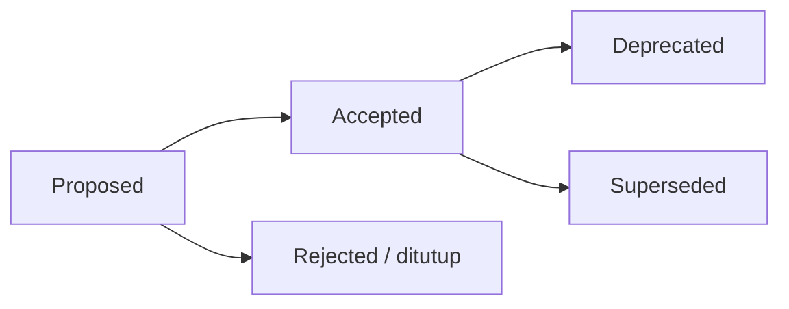

🇮🇩 Bahasa Indonesia (sumber) · 🇬🇧 [English (default)](README.md)

# Architecture Decision Records (ADR)

Folder ini menyimpan **catatan keputusan arsitektural** AWCMS — template lini ERP/back-office, kini **online-first hybrid & superset keluarga** (lihat [ADR-0034](0034-awcms-family-direct-use-templates-and-derived-pathway-removal.md) & [ADR-0035](0035-awcms-online-first-erp-saas-superset-repositioning.md)). Setiap keputusan penting (arsitektur, runtime, kontrak, keamanan, atau penyimpangan dari standar dasar) dicatat sebagai satu berkas ADR agar konteks dan alasannya awet.

## Keluarga hari ini: dua repo

Sejak [ADR-0055](0055-development-confined-to-awcms-and-awcms-astro.md) (2 Agustus 2026), pengembangan AWCMS berlangsung di **dua repositori, dan hanya dua**: repo ini sebagai **system of record** (seluruh permukaan otorisasi, API, dan layar admin **SISTEM**), dan [`ahliweb/awcms-astro`](https://github.com/ahliweb/awcms-astro) yang memikul **halaman publik sebagai fungsi utama** serta **permukaan admin USER bila sebuah situs menyatakannya** ([ADR-0070](0070-peran-keluarga-awcms-astro-memikul-publik-dan-admin-user.md)). Pasangan keduanya adalah **pengganti multiguna** dari ketiga template lama.

**`awcms-mini` dan `awcms-micro` adalah ARSIP** — tidak dilanjutkan, bukan standar, bukan sumber port ([ADR-0055](0055-development-confined-to-awcms-and-awcms-astro.md) §1, men-supersede [ADR-0047](0047-mini-micro-frozen-foundation-built-here.md)).

## Asal-usul: repo acuan awcms-mini (sejarah)

AWCMS **dahulu** dibangun ulang (lihat [ADR-0001](0001-rebuild-on-awcms-foundation-erp-scope.md)) di atas basis teknis modular monolith [`ahliweb/awcms-mini`](https://github.com/ahliweb/awcms-mini). Repo ini bersifat **standalone** — ia menanggung sendiri seluruh fondasi (tidak berbagi base terpisah), sehingga ADR fondasi (runtime, RLS, ABAC, offline-first, kontrak API/event, admission modul) **hidup lokal di folder ini** sebagai ADR-0002…0021, hasil adaptasi dari ADR acuan awcms-mini. ADR yang **spesifik untuk skop ERP & integrasi bisnis** ditambahkan di atas fondasi itu.

Kalimat di atas adalah **provenance**, dan itu benar selamanya. Yang sudah tidak berlaku adalah posisi "tiga template sejajar" yang sempat ditetapkan ADR-0034 — lihat §Keluarga hari ini.

> Catatan penomoran: ADR-0001 di repo ini adalah keputusan **rebuild**. Framing awalnya ("platform ERP", modul ERP di `src/modules/`) sempat **di-amend oleh [ADR-0022](0022-erp-modules-live-in-extension-repos.md)** (memindahkan modul ERP ke repo ekstensi terpisah), namun ADR-0022 kini **di-supersede oleh [ADR-0034](0034-awcms-family-direct-use-templates-and-derived-pathway-removal.md)**: modul domain — termasuk ERP — **boleh & seharusnya hidup langsung di `src/modules/`** template yang dipakai, bukan di repo turunan terpisah. (Posisi "tiga template dipakai-langsung" yang ADR-0034 tetapkan sudah tidak berlaku sejak ADR-0055 — lihat §Keluarga hari ini; yang tetap berlaku dari ADR-0034 adalah pencabutan jalur repo turunan.) Prinsip modular monolith yang mendasarinya diadopsi eksplisit oleh ADR-0001 dan dirinci oleh ADR fondasi 0002–0021 serta [`../ARCHITECTURE.md`](../ARCHITECTURE.md).

## Aturan

1. Satu keputusan = satu berkas `NNNN-judul-kebab.md` (nomor urut, nol di depan).
2. ADR **tidak dihapus**. Bila sebuah keputusan diganti, ADR lama ditandai `Status: Superseded by ADR-XXXX` dan ADR baru mereferensikannya.
3. Status yang valid: `Proposed`, `Accepted`, `Deprecated`, `Superseded`. `Accepted` boleh membawa kualifikasi `Accepted (belum diimplementasikan)` selama artefak yang dijanjikan ADR-nya (modul di `src/modules/` atau berkas kontrak `_shared`) belum ada di repo ini — `tests/adr-implementation-status.test.ts` menegakkannya dua arah: kualifikasi wajib ada selama artefaknya tidak ada, dan wajib dicabut (kembali `Accepted` polos) pada PR yang mendaratkan artefaknya.
4. Perubahan standar yang mengikat (lihat [`GOVERNANCE.md`](../../GOVERNANCE.md)) wajib punya ADR.
5. Gunakan template di [`0000-template.md`](0000-template.md).

## Alur

```mermaid
flowchart LR
  P[Proposed] --> A[Accepted]
  A --> D[Deprecated]
  A --> S[Superseded]
  P --> R[Rejected / ditutup]
```

## Indeks

| ADR                                                                           | Judul                                                                                                                                                                                                                                                                                                                                                                                                                                                                                                                                                                                                                                                                                                                                                                                                                                                                                                                                                                                                                                                                                                                                   | Status                                                                                                              |
| ----------------------------------------------------------------------------- | --------------------------------------------------------------------------------------------------------------------------------------------------------------------------------------------------------------------------------------------------------------------------------------------------------------------------------------------------------------------------------------------------------------------------------------------------------------------------------------------------------------------------------------------------------------------------------------------------------------------------------------------------------------------------------------------------------------------------------------------------------------------------------------------------------------------------------------------------------------------------------------------------------------------------------------------------------------------------------------------------------------------------------------------------------------------------------------------------------------------------------------- | ------------------------------------------------------------------------------------------------------------------- |
| [0001](0001-rebuild-on-awcms-foundation-erp-scope.md)                         | Rebuild AWCMS sebagai platform ERP di atas standar modular monolith                                                                                                                                                                                                                                                                                                                                                                                                                                                                                                                                                                                                                                                                                                                                                                                                                                                                                                                                                                                                                                                                     | Accepted                                                                                                            |
| [0002](0002-bun-only-runtime.md)                                              | Runtime & tooling Bun-only                                                                                                                                                                                                                                                                                                                                                                                                                                                                                                                                                                                                                                                                                                                                                                                                                                                                                                                                                                                                                                                                                                              | Accepted                                                                                                            |
| [0003](0003-postgresql-rls-multi-tenant.md)                                   | PostgreSQL + RLS untuk isolasi multi-tenant                                                                                                                                                                                                                                                                                                                                                                                                                                                                                                                                                                                                                                                                                                                                                                                                                                                                                                                                                                                                                                                                                             | Accepted                                                                                                            |
| [0004](0004-rbac-abac-default-deny.md)                                        | RBAC + ABAC default-deny sebagai baseline akses                                                                                                                                                                                                                                                                                                                                                                                                                                                                                                                                                                                                                                                                                                                                                                                                                                                                                                                                                                                                                                                                                         | Accepted                                                                                                            |
| [0005](0005-soft-delete-and-immutability.md)                                  | Soft delete untuk master/config, immutability untuk data posted                                                                                                                                                                                                                                                                                                                                                                                                                                                                                                                                                                                                                                                                                                                                                                                                                                                                                                                                                                                                                                                                         | Accepted                                                                                                            |
| [0006](0006-offline-first-sync-outbox.md)                                     | Offline-first + transactional outbox + sync HMAC                                                                                                                                                                                                                                                                                                                                                                                                                                                                                                                                                                                                                                                                                                                                                                                                                                                                                                                                                                                                                                                                                        | Accepted                                                                                                            |
| [0007](0007-openapi-asyncapi-contracts.md)                                    | OpenAPI & AsyncAPI sebagai kontrak wajib                                                                                                                                                                                                                                                                                                                                                                                                                                                                                                                                                                                                                                                                                                                                                                                                                                                                                                                                                                                                                                                                                                | Accepted                                                                                                            |
| [0008](0008-independent-contract-and-module-versioning.md)                    | Versioning independen: package, kontrak API/event, module descriptor                                                                                                                                                                                                                                                                                                                                                                                                                                                                                                                                                                                                                                                                                                                                                                                                                                                                                                                                                                                                                                                                    | Accepted                                                                                                            |
| [0009](0009-public-tenant-scoped-routes.md)                                   | Resolusi tenant untuk rute publik (tanpa sesi)                                                                                                                                                                                                                                                                                                                                                                                                                                                                                                                                                                                                                                                                                                                                                                                                                                                                                                                                                                                                                                                                                          | Accepted                                                                                                            |
| [0010](0010-public-host-tenant-routing.md)                                    | Host/domain-based public tenant routing                                                                                                                                                                                                                                                                                                                                                                                                                                                                                                                                                                                                                                                                                                                                                                                                                                                                                                                                                                                                                                                                                                 | Accepted                                                                                                            |
| [0011](0011-capability-ports-for-cross-module-collaboration.md)               | Capability ports untuk kolaborasi lintas-modul                                                                                                                                                                                                                                                                                                                                                                                                                                                                                                                                                                                                                                                                                                                                                                                                                                                                                                                                                                                                                                                                                          | Accepted                                                                                                            |
| [0012](0012-module-admission-and-trusted-registry-boundary.md)                | Module admission categories & trusted static registry boundary                                                                                                                                                                                                                                                                                                                                                                                                                                                                                                                                                                                                                                                                                                                                                                                                                                                                                                                                                                                                                                                                          | Accepted                                                                                                            |
| [0013](0013-extension-layers-and-boundary-model.md)                           | Lapisan ekstensi platform, batas tenant/bisnis, kriteria ekstraksi layanan                                                                                                                                                                                                                                                                                                                                                                                                                                                                                                                                                                                                                                                                                                                                                                                                                                                                                                                                                                                                                                                              | Accepted (jalur turunan → [0034](0034-awcms-family-direct-use-templates-and-derived-pathway-removal.md))            |
| [0014](0014-deterministic-build-time-module-composition.md)                   | Komposisi modul deterministik build-time (registry base + aplikasi turunan)                                                                                                                                                                                                                                                                                                                                                                                                                                                                                                                                                                                                                                                                                                                                                                                                                                                                                                                                                                                                                                                             | Accepted (jalur turunan → [0034](0034-awcms-family-direct-use-templates-and-derived-pathway-removal.md))            |
| [0015](0015-derived-application-compatibility-manifest.md)                    | Derived-application compatibility manifest, test kit, semantic-version gates                                                                                                                                                                                                                                                                                                                                                                                                                                                                                                                                                                                                                                                                                                                                                                                                                                                                                                                                                                                                                                                            | Superseded → [0034](0034-awcms-family-direct-use-templates-and-derived-pathway-removal.md)                          |
| [0016](0016-organization-structure-module-admission.md)                       | Admission `organization_structure` (Official Optional Business Foundation)                                                                                                                                                                                                                                                                                                                                                                                                                                                                                                                                                                                                                                                                                                                                                                                                                                                                                                                                                                                                                                                              | Accepted (belum diimplementasikan)                                                                                  |
| [0017](0017-document-infrastructure-module-admission.md)                      | Admission `document_infrastructure` (Official Optional Business Foundation)                                                                                                                                                                                                                                                                                                                                                                                                                                                                                                                                                                                                                                                                                                                                                                                                                                                                                                                                                                                                                                                             | Accepted (belum diimplementasikan)                                                                                  |
| [0018](0018-data-exchange-module-admission.md)                                | Admission `data_exchange` (Official Optional Business Foundation)                                                                                                                                                                                                                                                                                                                                                                                                                                                                                                                                                                                                                                                                                                                                                                                                                                                                                                                                                                                                                                                                       | Accepted (belum diimplementasikan)                                                                                  |
| [0019](0019-integration-hub-module-admission.md)                              | Admission `integration_hub` (System Foundation)                                                                                                                                                                                                                                                                                                                                                                                                                                                                                                                                                                                                                                                                                                                                                                                                                                                                                                                                                                                                                                                                                         | Accepted (belum diimplementasikan)                                                                                  |
| [0020](0020-erp-extension-readiness-contracts.md)                             | Kontrak kesiapan ekstensi ERP (business transaction, posting, period-lock, item, projection)                                                                                                                                                                                                                                                                                                                                                                                                                                                                                                                                                                                                                                                                                                                                                                                                                                                                                                                                                                                                                                            | Accepted (belum diimplementasikan)                                                                                  |
| [0021](0021-reference-data-module-admission.md)                               | Admission `reference_data` (Official Optional Business Foundation)                                                                                                                                                                                                                                                                                                                                                                                                                                                                                                                                                                                                                                                                                                                                                                                                                                                                                                                                                                                                                                                                      | Accepted (belum diimplementasikan)                                                                                  |
| [0022](0022-erp-modules-live-in-extension-repos.md)                           | Modul domain ERP hidup di repo ekstensi, bukan di base (amandemen ADR-0001 poin 3)                                                                                                                                                                                                                                                                                                                                                                                                                                                                                                                                                                                                                                                                                                                                                                                                                                                                                                                                                                                                                                                      | Superseded → [0034](0034-awcms-family-direct-use-templates-and-derived-pathway-removal.md)                          |
| [0023](0023-bilingual-docs-indonesian-source-english-default.md)              | Dokumentasi dwibahasa: sumber Indonesia, Inggris default, digerbang staleness                                                                                                                                                                                                                                                                                                                                                                                                                                                                                                                                                                                                                                                                                                                                                                                                                                                                                                                                                                                                                                                           | Accepted                                                                                                            |
| [0024](0024-semver-numbering-continues-legacy-major-line.md)                  | Penomoran SemVer melanjutkan lini major legacy (lompat ke 5.0.0), bukan reset ke 1.0.0                                                                                                                                                                                                                                                                                                                                                                                                                                                                                                                                                                                                                                                                                                                                                                                                                                                                                                                                                                                                                                                  | Accepted                                                                                                            |
| [0025](0025-implement-deterministic-build-time-module-composition.md)         | Implementasi nyata komposisi modul deterministik build-time di awcms (adendum ADR-0014)                                                                                                                                                                                                                                                                                                                                                                                                                                                                                                                                                                                                                                                                                                                                                                                                                                                                                                                                                                                                                                                 | Accepted (jalur turunan → [0034](0034-awcms-family-direct-use-templates-and-derived-pathway-removal.md))            |
| [0026](0026-modular-openapi-ownership-and-composition.md)                     | Kontrak OpenAPI modular: kepemilikan per modul, bundle deterministik, kontribusi fragment turunan                                                                                                                                                                                                                                                                                                                                                                                                                                                                                                                                                                                                                                                                                                                                                                                                                                                                                                                                                                                                                                       | Accepted                                                                                                            |
| [0027](0027-mfa-totp-session-assurance-step-up.md)                            | MFA TOTP, recovery codes, session assurance (aal1/aal2), dan step-up                                                                                                                                                                                                                                                                                                                                                                                                                                                                                                                                                                                                                                                                                                                                                                                                                                                                                                                                                                                                                                                                    | Accepted                                                                                                            |
| [0028](0028-oidc-sso-tenant-aware-account-linking-break-glass.md)             | OIDC/SSO tenant-aware, account linking fail-closed, SSRF guard, dan break-glass                                                                                                                                                                                                                                                                                                                                                                                                                                                                                                                                                                                                                                                                                                                                                                                                                                                                                                                                                                                                                                                         | Accepted                                                                                                            |
| [0029](0029-deployment-profile-aware-turnstile-bot-protection.md)             | Cloudflare Turnstile bot protection sadar profil deployment (LAN/offline exempt)                                                                                                                                                                                                                                                                                                                                                                                                                                                                                                                                                                                                                                                                                                                                                                                                                                                                                                                                                                                                                                                        | Accepted                                                                                                            |
| [0030](0030-business-scope-hierarchy-generic-authorization-layer.md)          | Lapisan authorization generik business-scope hierarchy (multi-entity/unit)                                                                                                                                                                                                                                                                                                                                                                                                                                                                                                                                                                                                                                                                                                                                                                                                                                                                                                                                                                                                                                                              | Accepted                                                                                                            |
| [0031](0031-segregation-of-duties-conflict-enforcement.md)                    | Segregation of duties (SoD) generik, exception/override, conflict enforcement                                                                                                                                                                                                                                                                                                                                                                                                                                                                                                                                                                                                                                                                                                                                                                                                                                                                                                                                                                                                                                                           | Accepted                                                                                                            |
| [0032](0032-family-compatibility-manifest-and-ci-conformance.md)              | Compatibility manifest keluarga + CI conformance terhadap standar AWCMS-Mini. **Porosnya dicabut [ADR-0055](0055-development-confined-to-awcms-and-awcms-astro.md)**: manifes kini self-anchored (`standard: awcms`) dan menyatakan kontrak antara `awcms` dan `awcms-astro`; mekanismenya — pemeriksaan versi kontrak + `intentionalDivergences` ber-`reviewDate` — tetap dan justru bagian yang paling terpakai.                                                                                                                                                                                                                                                                                                                                                                                                                                                                                                                                                                                                                                                                                                                      | Accepted                                                                                                            |
| [0033](0033-abac-dynamic-policy-evaluator.md)                                 | Evaluator ABAC dinamis: DSL kondisi terbatas, precedence deny-overrides, cache tenant-keyed                                                                                                                                                                                                                                                                                                                                                                                                                                                                                                                                                                                                                                                                                                                                                                                                                                                                                                                                                                                                                                             | Accepted                                                                                                            |
| [0034](0034-awcms-family-direct-use-templates-and-derived-pathway-removal.md) | Keluarga AWCMS = template dipakai-langsung; jalur aplikasi-turunan dihapus; tidak membuat repo derivatif                                                                                                                                                                                                                                                                                                                                                                                                                                                                                                                                                                                                                                                                                                                                                                                                                                                                                                                                                                                                                                | Accepted                                                                                                            |
| [0035](0035-awcms-online-first-erp-saas-superset-repositioning.md)            | `awcms` = template online-first hybrid, siap ERP + SaaS terintegrasi, superset keluarga (menyerap awcms-micro)                                                                                                                                                                                                                                                                                                                                                                                                                                                                                                                                                                                                                                                                                                                                                                                                                                                                                                                                                                                                                          | Accepted (menyempurnakan positioning [0034](0034-awcms-family-direct-use-templates-and-derived-pathway-removal.md)) |
| [0036](0036-media-library-module-admission-ownership-inversion.md)            | Admission `media_library` lewat inversi kepemilikan (ekstraksi registry media dari `news_portal`); pensiun `news_media`; migrasi 052-054                                                                                                                                                                                                                                                                                                                                                                                                                                                                                                                                                                                                                                                                                                                                                                                                                                                                                                                                                                                                | Accepted (mengadaptasi awcms-micro ADR-0026)                                                                        |
| [0037](0037-data-lifecycle-module-admission.md)                               | Admission `data_lifecycle` (governance retensi + legal-hold, System Foundation); re-wire kopling legal-hold `visitor_analytics`/`logging`; migrasi 055-056                                                                                                                                                                                                                                                                                                                                                                                                                                                                                                                                                                                                                                                                                                                                                                                                                                                                                                                                                                              | Accepted (mengadaptasi awcms-micro Issue #745)                                                                      |
| [0038](0038-seo-distribution-module-admission-discovery-scope.md)             | Admission scope discovery `seo_distribution` (renderer SEO terpusat + sitemap/robots/RSS/Atom/JSON + config tenant; seam capability `seo_facts`); tata-kelola redirect + telemetri 404 ditunda; migrasi 057-059                                                                                                                                                                                                                                                                                                                                                                                                                                                                                                                                                                                                                                                                                                                                                                                                                                                                                                                         | Accepted (mengadaptasi awcms-micro ADR-0028)                                                                        |
| [0039](0039-seo-distribution-redirect-governance.md)                          | Scope tata-kelola redirect `seo_distribution` (aturan redirect exact-path + capture perubahan URL + telemetri 404, satu edit `src/middleware.ts` fail-open); host-based-only, legacy-blog inert, locale=null; migrasi 060-061                                                                                                                                                                                                                                                                                                                                                                                                                                                                                                                                                                                                                                                                                                                                                                                                                                                                                                           | Accepted (mengadaptasi awcms-micro ADR-0028 §8/ADR-0010)                                                            |
| [0040](0040-site-search-module-admission.md)                                  | Admission `site_search` (Official Optional Module): indeks PostgreSQL FTS lintas-konten + query/suggest publik host-resolved + admin index/settings/diagnostics; seam descriptor `searchSources` (MODULE_CONTRACT_VERSION 2.2.0), template URL `:tenantCode`, tanpa typeahead inline; migrasi 064-065                                                                                                                                                                                                                                                                                                                                                                                                                                                                                                                                                                                                                                                                                                                                                                                                                                   | Accepted (mengadaptasi awcms-micro ADR-0031)                                                                        |
| [0041](0041-comments-module-admission.md)                                     | Admission `comments` (Official Optional Module): komentar moderation-first di atas resource TERBIT; seam descriptor `commentableResources` (MODULE_CONTRACT_VERSION 2.3.0), template URL `:tenantCode`, nol `AccessAction` baru, simpan-teks-polos/escape-saat-render, respons publik seragam anti-oracle; migrasi 066-067                                                                                                                                                                                                                                                                                                                                                                                                                                                                                                                                                                                                                                                                                                                                                                                                              | Accepted (mengadaptasi awcms-micro ADR-0032)                                                                        |
| [0042](0042-varnish-edge-cache-auto-activation.md)                            | Lapisan cache tepi Varnish OPSIONAL (default mati, no-op saat mati) dengan aktivasi otomatis berbasis tekanan origin: allow-list surface fail-closed terpisah dari sinyal beban (tekanan hanya mengubah BERAPA LAMA, tak pernah APA), VCL default-deny + penandaan eksplisit setiap respons, invalidasi surrogate-key ber-anchor lewat antrean tahan-lama pola outbox; migrasi 068                                                                                                                                                                                                                                                                                                                                                                                                                                                                                                                                                                                                                                                                                                                                                      | Accepted (native awcms, bukan port)                                                                                 |
| [0043](0043-lib-boundary-and-module-presentation-layer.md)                    | Batas `src/lib` = infrastruktur teknis tanpa nama domain; kode presentasi/pengiriman modul pindah ke `src/modules/<m>/presentation/`. `modules:dag:check` diperluas: namespace `src/lib/<x>/` yang bertabrakan nama dengan `moduleKey` (persis atau lewat alias domain) GAGAL; satu pengecualian tercatat (`logging`). `tests/module-boundary.test.ts` diperluas ke `src/pages` memakai `api.routes` (#256)                                                                                                                                                                                                                                                                                                                                                                                                                                                                                                                                                                                                                                                                                                                             | Accepted (native awcms; awcms-micro ADR-0038 memutuskan hal sama di sana)                                           |
| [0044](0044-merge-news-portal-into-blog-content.md)                           | Lebur `news_portal` ke `blog_content` (modul konten tunggal, TANPA kehilangan fitur): `news_portal` (11 berkas, 3 tabel, nol capability, konsumen wajib `public_content`) dipensiunkan; nama tabel `awcms_news_portal_*` DIPERTAHANKAN mengikuti preseden ADR-0036; dua sistem iklan disatukan ke tabel ber-FK media terverifikasi setelah diperlebar dengan penargetan post/page (residu ingest dilaporkan, tak pernah hilang senyap); `awcms_news_portal_tenant_state` (inert, tanpa writer) di-DROP; permission di-seed DAN di-backfill untuk tenant lama; path API tidak di-rename di perubahan yang sama. Halaman publik pindah ke repo `ahliweb/awcms-astro`                                                                                                                                                                                                                                                                                                                                                                                                                                                                      | Accepted (native awcms; pasangan repo `ahliweb/awcms-astro`)                                                        |
| [0045](0045-jualanku-porting-awcms-system-of-record-astro-bff.md)             | Porting Jualanku.info: `awcms` sebagai system of record + admin internal, `awcms-astro` sebagai experience layer + satu-satunya BFF; static-by-default dengan rute on-demand (bukan "hybrid"); satu tenant penyelenggara dengan **merchant sebagai business scope** (mengisi resolver hierarki yang base-nya fail-closed) ditambah predikat kepemilikan di setiap query — bukan mengandalkan RLS tenant maupun atribut ABAC baru; lima bounded context `jualanku_*` (bukan tujuh); kontrak introspeksi sesi lintas-origin untuk portal; namespace public/portal/admin memanggil application service yang sama. Blueprint: [`../awcms/jualanku/`](../awcms/jualanku/README.md).                                                                                                                                                                                                                                                                                                                                                                                                                                                          | Accepted                                                                                                            |
| [0046](0046-idn-admin-regions-module-admission.md)                            | Admisi `idn_admin_regions` (Official Optional Module): master data wilayah administratif Indonesia (provinsi/kabupaten-kota/kecamatan/desa-kelurahan) sebagai reference data **GLOBAL ber-versi** — tanpa `tenant_id`/RLS karena barisnya identik untuk semua tenant, diganti registrasi wajib di `GLOBAL_TABLE_FORBIDDEN_PRIVILEGES` (privilege per role eksplisit, nol DELETE) sementara otorisasi tetap per-tenant default-deny; dataset upstream `cahyadsn/wilayah` (MIT) DI-VENDOR ke repo agar impor deterministik & offline, dengan nomor Kepmendagri direkam **per berkas** dari header masing-masing; impor = JOB (dry-run default, menolak hierarki parsial), aktivasi/rollback = aksi admin ter-audit dengan aturan satu-dataset-aktif ditegakkan partial unique index                                                                                                                                                                                                                                                                                                                                                       | Accepted                                                                                                            |
| [0047](0047-mini-micro-frozen-foundation-built-here.md)                       | `awcms-mini` dan `awcms-micro` dibekukan sebagai **referensi** (31 Juli 2026): boleh dibaca dan di-port KELUAR, tetapi tidak menerima perubahan. **Jalur port-keluar itu kemudian DITUTUP juga oleh ADR-0055: keduanya kini ARSIP.** Jalur **mini-first** di `AGENTS.md` karena itu DITANGGUHKAN, bukan dihapus — fitur fondasi dirintis langsung di sini, sebab pembekuan DITAMBAH mini-first membuat pekerjaan fondasi tidak punya tempat mendarat sama sekali. Terverifikasi langsung, bukan disimpulkan: `awcms-astro` tidak bisa menarik kontennya sendiri (`X-Tenant-Code` tidak pernah dibaca — awcms membaca `x-awcms-tenant-id`) dan tidak ada kredensial mesin di repo mana pun di keluarga ini, sehingga build feed dan kontrak introspeksi sesi ADR-0045 sama-sama buntu. Seluruh penjagaan yang dibawa mini-first secara implisit kini eksplisit: review keamanan auth/access, ADR, `family:conformance:check`. Setiap fitur yang mendarat selama pembekuan adalah divergence sengaja yang dicatat di `awcms-family-compatibility.yaml` saat ia mendarat. `0046` adalah celah yang dicadangkan (pekerjaan sedang berjalan) | Superseded by ADR-0055                                                                                              |
| [0048](0048-frontend-role-split-awcms-astro-internal-admin.md)                | Pembagian peran frontend: `awcms-astro` = halaman admin **owner/internal**, `awcms` = frontend **publik + admin publik (tenant)**. Melengkapi ADR-0047 (yang memusatkan pengembangan di dua repo tapi tak menyatakan layar mana milik siapa) dan mengoreksi premis "situs statis tanpa permukaan terautentikasi" untuk `awcms-astro`. Izin TIDAK ikut pindah: layar internal tetap memanggil `/api/v1/*` repo ini lewat BFF (ADR-0045) dan tetap melewati sesi + konteks tenant + ABAC default-deny; cache tepi tak pernah dibagi dengan permukaan admin. Mengikat layar BARU; pemilahan `/admin/*` yang sudah ada ditunda ke ADR tersendiri                                                                                                                                                                                                                                                                                                                                                                                                                                                                                            | Superseded by ADR-0051                                                                                              |
| [0049](0049-machine-credentials-and-session-introspection.md)                 | Kredensial mesin baca-saja + introspeksi sesi lintas-origin: bearer KEDUA yang bukan sesi manusia, terikat ke satu service account, dengan token yang **membawa tenant-nya sendiri** (klien build cukup satu env var) dan hash ber-ruang-nama `mc-sha256:` sehingga chokepoint bisa memilih tabel dari hash saja — tanpa mengubah tanda tangan di 183 rute. Ia MENGAUTENTIKASI, tidak pernah MENGOTORISASI: izin efektif = IRISAN dengan izin service account (menyempitkan, tak pernah melebarkan), dan setiap permintaannya ditolak kecuali action `read`, diputus SEBELUM izin dilihat — token bocor tak bisa mengubah apa pun walau akunnya `owner`. Kedaluwarsa wajib (maks 365 hari), pencabutan berlaku di permintaan berikutnya, decision log mencatat kredensial MANA yang bertindak. Plus `GET /api/v1/auth/session` (klaim aman saja, satu bentuk 401 untuk semua kegagalan). Fitur fondasi pertama yang dirintis langsung di sini di bawah ADR-0047, dicatat sebagai divergence saat mendarat                                                                                                                               | Accepted                                                                                                            |
| [0050](0050-bff-session-handoff-code.md)                                      | BFF `awcms-astro` memperoleh sesi manusia lewat **kode handoff sekali-pakai**, bukan dengan mem-proksi password. `awcms` tetap satu-satunya tempat kredensial diterima: pengguna login DI `awcms` (password, MFA, OIDC, Turnstile — tak satu pun diimplementasi ulang), lalu dialihkan balik membawa `code` berumur ≤60 detik yang ditukar BFF **server-ke-server**. Token sesi tak pernah sampai ke browser; introspeksi ADR-0049 jadi sumber kebenaran per permintaan (deaktivasi mencabut sesi seketika sejak #319), logout memanggil `awcms` LEBIH DAHULU. Proksi password ditolak terutama karena login di sini bukan satu langkah — mem-proksinya berarti menyalin alur MFA/OIDC/Turnstile ke repo kedua. Menjadi OIDC provider ditolak untuk satu klien tepercaya; kredensial mesin ditolak karena baca-saja dan menghapus atribusi per-pengguna                                                                                                                                                                                                                                                                                 | Accepted                                                                                                            |
| [0051](0051-admin-screens-consolidated-in-awcms.md)                           | Seluruh layar admin — tenant maupun owner/internal/platform — dibangun di `awcms` di bawah satu shell `/admin/*`. **Men-supersede ADR-0048**, yang hanya mengikat layar baru (sehingga `/admin/*` lama tetap bercampur) dan yang memindahkan LAYAR aktivasi dataset ke repo lain sementara PERMISSION-nya tetap di-seed ke role `owner` tiap tenant — jadi tidak pernah menahan risiko lintas-tenant yang menjadi alasannya. Sebagai gantinya risiko itu dipindahkan ke gerbang yang menegakkan: aksi lintas-tenant wajib punya gerbang platform-scoped dan tidak boleh masuk katalog yang di-seed ke role tenant. Peran `awcms-astro` sebagai experience layer + BFF (ADR-0045) tidak berubah. **Kemudian DIPERSEMPIT [ADR-0070](0070-peran-keluarga-awcms-astro-memikul-publik-dan-admin-user.md)**: "seluruh layar admin" dibaca "seluruh layar admin **SISTEM**", dan permukaan admin **USER** boleh di `awcms-astro` bila situsnya menyatakannya (`owner` ditolak gerbang di sana). Ketiga gerbang penggantinya tidak dilonggarkan sedikit pun.                                                                                    | Accepted (dipersempit [0070](0070-peran-keluarga-awcms-astro-memikul-publik-dan-admin-user.md))                     |
| [0052](0052-idn-region-dataset-lifecycle-is-an-operator-job.md)               | Aktivasi/rollback dataset wilayah menjadi **job operator**; endpoint HTTP-nya dihapus dan `dataset.configure`/`.restore` dicabut dari katalog (`sql/084`). Keduanya mengganti data yang dilayani ke SEMUA tenant, tetapi permission-nya ter-seed ke katalog global yang diberikan penuh ke role `owner` tiap tenant — sehingga owner tenant biasa berwenang atas data tenant lain. Kandidat "gerbangi dengan kredensial mesin" DITOLAK: kredensial mesin baca-saja (ADR-0049), jadi melebarkannya justru membuat token build yang bocor bisa mengganti dataset global. Mengikuti preseden ADR-0046 §5 (import sudah job-only). Biaya yang diterima: baris audit hilang, karena `awcms_audit_events` tenant-scoped sedangkan aksinya global.                                                                                                                                                                                                                                                                                                                                                                                             | Accepted                                                                                                            |
| [0053](0053-platform-scoped-permissions.md)                                   | Permission ber-**scope** `tenant`/`platform` (`sql/085`): aksi yang efeknya melintasi batas tenant tidak lagi bisa masuk grant borongan yang diterima owner tiap tenant baru, dan chokepoint menolaknya kecuali tenant yang bertindak ADALAH tenant platform (di-resolve `PLATFORM_TENANT_ID` → rantai tenant default publik). Menutup KELAS cacatnya, bukan instansnya: `bootstrapPlatformTenant` masih `SELECT id FROM awcms_permissions`, yang melahirkan cacat ADR-0052 dan akan mengulanginya pada aksi lintas-tenant berikutnya. Pemicu gerbang dibaca dari deklarasi KODE, bukan kolom DB — kalau keduanya dari DB, satu UPDATE mencabut gerbang sekaligus filternya tanpa satu pun cek merah. Mengembalikan endpoint activate/rollback + layar `/admin/idn-regions`; job operatornya tetap. Mode ketenanan `single`/`multi` DITURUNKAN dari jumlah tenant aktif, tidak pernah di-toggle.                                                                                                                                                                                                                                        | Accepted                                                                                                            |
| [0054](0054-tenant-provisioning.md)                                           | Provisioning tenant: `POST`/`GET /api/v1/tenants` + layar `/admin/tenants`, keduanya PLATFORM-scoped (`sql/086`). Sampai ADR ini tenant kedua TIDAK BISA DIBUAT sama sekali — `setup/initialize` meng-klaim singleton `awcms_setup_state` — sehingga mode `multi` ADR-0053 tak terjangkau dan gerbang platformnya belum pernah bertemu tenant kedua yang nyata. `createTenantWithOwner` DIEKSTRAK dan dipakai bersama wizard setup: itu kontrol keamanan, bukan kerapian, karena rutin provisioning yang ditulis mandiri akan membawa salinan `INSERT` grant yang sepanjang umur repo ini tidak punya `WHERE scope = 'tenant'`. `read` ikut platform-scoped karena direktori mendaftar SETIAP tenant. Duplikat `tenant_code` butuh pre-check DAN savepoint (23505 membatalkan transaksi). Password owner tidak pernah masuk hash idempotency yang disimpan.                                                                                                                                                                                                                                                                             | Accepted                                                                                                            |
| [0055](0055-development-confined-to-awcms-and-awcms-astro.md)                 | Pengembangan AWCMS hanya di `ahliweb/awcms` (system of record) dan `ahliweb/awcms-astro` (experience layer + BFF). **Men-supersede ADR-0047**, yang membekukan mini/micro sebagai referensi yang MASIH boleh di-port keluar — posisi setengah itu membuat dokumen dan gerbang harus terus memelihara hubungan dengan repo yang tidak bergerak: manifest menyatakan `standard: awcms-mini`, dan sembilan divergence terjadwal di-review ulang dengan `reviewDate` yang memerahkan CI saat lewat. mini/micro kini ARSIP: kemampuan yang diinginkan DIBANGUN di sini dengan ADR admission sendiri, bukan di-port. Manifest tetap ter-gate tapi self-anchored (23 pemeriksaan versi kontrak vs konstanta nyata tetap utuh); `intentionalDivergences` dikosongkan, isinya jadi catatan sejarah di `family-compatibility.md`. Kewajiban ADR-0047 §4 (catat divergence saat mendarat) dicabut — ADR-nya sendiri yang jadi catatan; penjagaan §3 lain TETAP.                                                                                                                                                                                    | Accepted                                                                                                            |

| [0056](0056-media-library-admin-surface.md) | Permukaan admin `media_library` dipecah tiga, karena "layarnya hilang" ternyata salah untuk modul ini: **lima dari sebelas permission tidak digerbangi apa pun** (`media.attach`/`.detach`/`.delete`/`.restore`/`.purge` — tak ada route, tak ada fungsi, tak ada job), **lima fungsi aplikasi yang memanggilnya nol**, dan **tidak ada fungsi daftar** sama sekali (`GET /api/v1/media/objects` menuntut `?ids=`, ia resolver batch untuk build `awcms-astro`). `attach`/`detach` DICABUT — usang sejak inversi ADR-0036, keterikatan media kini FK milik konsumen; `delete`/`restore`/`purge` DIBERI permukaan, karena keduanya lubang nyata: hari ini objek salah-unggah hanya hilang bila job rekonsiliasi kebetulan mengategorikannya begitu. `purge` memurnikan registry, BUKAN byte R2 — job tetap satu-satunya penulis bucket. Daftar mendapat rute sendiri, bukan mode-ganda pada `?ids=`, karena itu mengubah 400 hari ini menjadi dump seluruh registry. Layar `/admin/media` menyusul SETELAH ketiganya mendarat. | Accepted |
| [0057](0057-blog-page-lifecycle.md) | Page `blog_content` mendapat siklus hidup. Audit `pages.*` sebelum menulis layarnya menemukan pola ADR-0056, lebih tajam: **empat dari delapan permission ter-seed tidak digerbangi apa pun** (`pages.publish`/`.archive`/`.restore`/`.purge`), dan tak seperti `media_library`, fungsi aplikasinya bukan sekadar tanpa pemanggil — ia **tidak ada**. Akibatnya fungsional, bukan kosmetik: `createBlogPage` menulis literal `'draft'`, `updateBlogPage` tak pernah menyentuh `status`, dan job penerbitan terjadwal hanya membaca `awcms_blog_posts`, jadi **tidak ada jalur kode yang bisa menerbitkan page** — itulah sebabnya cabang page pada pencarian publik, yang disaring `status = 'published'`, selalu mengembalikan nol baris di atas index yang dibuat persis untuk query itu. Keempat permission DIBERI permukaan alih-alih dicabut: mencabut `pages.publish` berarti memberkati cacat itu sebagai desain. Siklus hidupnya sengaja LEBIH SEMPIT dari post — tanpa `review`, tanpa `scheduled`, karena `sql/036` tak men-seed `pages.schedule` — dan `purge` MELAPORKAN alih-alih menolak: draf pertama membuatnya 409 selama ada ad placement menargetkan page itu, dan membaca `ad-placement-reference-validation.ts` membantahnya — modul itu sudah memutuskan target yang hilang belakangan "is not an error and never becomes one", query render tak pernah mencocokkan placement milik page yang tak dirender, dan soft delete hari ini punya efek yang sama persis. Responsnya justru membawa jumlah placement yang jadi inert, karena baris yang diam-diam mati adalah persis "menghilang tanpa catatan" yang ADR-0044 §4 tolak. **Nol migrasi**: kolom, CHECK, index, dan baris katalog semuanya sudah ada. Permukaan dulu, `/admin/blog/pages` menyusul — plus gate untuk KELASNYA: tiap permission terdeklarasi wajib punya call site `authorizeInTransaction` atau terdaftar sebagai pengecualian ber-alasan. | Accepted |
| [0058](0058-unenforced-permissions-disposition.md) | Empat permission terdeklarasi tanpa penegak diputuskan sekaligus: **dua diberi permukaan, dua dicabut**. Gerbang ADR-0057 §F yang menemukannya, dan skor pertamanya sendiri memuat **dua tuduhan palsu** — `visitor_analytics.settings.read`/`.update` tergerbangi penuh oleh `analytics/settings.ts`, tapi scanner membaca konstanta seluruh repo sebagai satu namespace datar dan `MODULE_KEY` terikat di lima berkas ke empat nilai, sehingga guard-nya tak terlihat; keduanya sempat ditulis sebagai KEPUTUSAN ber-alasan yang rutenya bantah baris demi baris (diperbaiki PR #359, resolusi file-first). Karena itu keempat sisanya diverifikasi ulang ke kode, dan ternyata **bukan satu kelas**: `profile_identity.profile_management.restore` dan `comments.moderation.delete` punya seluruh mesinnya kecuali permukaan — yang pertama meninggalkan `softDeleteParty` tanpa pasangan sehingga `restored_at`/`restored_by` (`sql/003`) tak pernah bisa terisi; yang kedua punya transisi `delete`→`deleted` yang legal dari keempat status non-terminal dan antrean admin yang bisa MEMFILTER `deleted`, tapi satu-satunya aktor yang bisa memproduksinya adalah PENULIS lewat `requestCommentDeletion`. Keduanya DIBERI permukaan, dan §B menyatakan terang bahwa `deleted` tetap terminal — moderator memperoleh satu aksi tak-terbalikkan, diterima karena keadaannya sudah tercapai lewat jalur penulis, tetap non-destruktif, dan tanpa itu tak ada jawaban in-band untuk konten yang harus ditarik permanen; `bulk-moderate` sengaja TIDAK ikut. Sebaliknya `blog_content.seo.configure` DICABUT sebagai sumbu otorisasi kedua untuk kolom yang `settings.configure` sudah kelola (`seoDefaultTitle`/`seoDefaultDescription`), dan `blog_content.posts.export` DICABUT karena nol mesin ekspor ada di mana pun — membangun fiturnya untuk membenarkan baris katalog adalah ekor menggerakkan anjing. Satu migrasi tunggal untuk kedua pencabutan (grant dulu, lalu katalog — FK), tanpa rollback. Urutannya mengikat: permukaan dulu, pencabutan terakhir, karena gerbangnya menandai pengecualian yang sudah punya penegak sebagai stale. Setelah keempatnya mendarat daftar pengecualian **kosong**. | Accepted |
| [0059](0059-host-resolved-public-content-routes.md) | Keluarga rute konten publik host-resolved mendarat di **`/news/**`**, empat rute (indeks, detail post, kategori, tag), dan permintaan backlog `/blog/{slug}` dijawab dengan penolakan beserta buktinya. Dua temuan menggerakkannya. Pertama, cacat yang tercatat — "setiap `<loc>` sitemap 404 untuk tenant host-resolved" — **salah**: `discovery-providers.ts` sudah men-scope adapter ke `/blog/{tenantCode}` sejak #223, diverifikasi dengan `git log -S`, dan default `/blog` yang dituduh itu nol pemanggil di `src/`. Kedua, gap yang sebenarnya: deployment host-resolved **tidak punya rute konten sama sekali**, jadi tenant berdomain sendiri menerbitkan URL yang membawa pengenal yang justru dihapus domain itu. `/blog/{slug}` tak bisa jadi bentuknya: diprobe langsung di repo ini, Astro memperingatkan rute itu "is defined in both" berkas dan **tetap sukses build**, satu diam-diam menaungi yang lain ("a hard error in following versions"), sedangkan menyelesaikannya di runtime membuat slug post bisa menaungi URL daftar tenant lain. Setting `publicBasePath` versi arsip juga tidak diadopsi — ia memindahkan tautan tanpa memindahkan rute, yakni pabrik URL 404 per-tenant. Gerbangnya (`withHostResolvedBlogTenant`) sebentuk dengan `site_search`/`comments`, ber-padding latensi; saklar baru `publicRouteMode` simetris dengan `legacyTenantRouteEnabled`; dan `seo_distribution` kini **memilih** base path dari keluarga yang benar-benar melayani, serta **tidak menyumbang provider sama sekali** bila tenant mematikan keduanya — sitemap kosong, bukan sitemap berisi 404, mutation-proven. Nol migrasi, nol permission, nol perubahan OpenAPI; `/news/**` sengaja belum jadi surface cache tepi (kunci per-host dulu). | Superseded by [0071](0071-kosakata-url-publik-dibelah-blog-di-sini-news-di-awcms-astro.md) |
| [0060](0060-business-scope-hierarchy-provided-by-tenant-admin.md) | `tenant_admin` menjadi penyedia `business_scope_hierarchy`, dan itu menutup sebuah endpoint yang **jalur suksesnya tak pernah bisa dicapai**. `POST /api/v1/identity/business-scope/assignments` ter-guard, ter-audit, ber-RLS, dievaluasi SoD — dan menolak SETIAP input di SETIAP deployment: composition root-nya menyuntikkan adapter NO-OP yang me-resolve semua scope ke `resolved: false`, sedangkan scope type cadangan `tenant` ditolak validator sebagai tak-bisa-di-assign (#180 F2). NO-OP itu benar saat ditulis — ia menunggu aplikasi TURUNAN menyuntikkan resolvernya — lalu ADR-0034 menghapus jalur turunan dan ADR-0055 mengunci pengembangan ke repo ini, sehingga penantiannya jadi penolakan permanen; `providedBy`-nya bahkan menamai `organization_structure`, modul yang ADR-0016 `Accepted` tanpa satu baris kode pun. Base sudah punya hierarki nyata yang sudah dikeraskan: `awcms_offices` dengan `parent_office_id`, FORCE RLS (`sql/017`), dan FK komposit anti-lintas-tenant (`sql/020`). Adapter barunya me-resolve scope type `office` saja; hanya baris HIDUP (bukan soft-deleted, bukan `inactive`, milik tenant sendiri) yang resolve, dan baris mati dilewati di mana pun dalam rantai sehingga tak ada cakupan yang dipinjam lewat resource yang dimatikan tenant-nya. **Setiap batas MENOLAK, tidak memotong** — siklus, kedalaman, jumlah — karena daftar terpotong tetap mengklaim `resolved: true`. Ditambah satu pengerasan di jalur baca: sentinel `tenant` hanya mencetak fakta mencakup-segalanya bila `scope_id` menamai tenant itu sendiri. Adapter NO-OP dihapus (nol pemanggil), nol migrasi, nol permission baru. | Accepted |
| [0061](0061-host-resolved-public-surfaces-are-edge-cacheable.md) | Permukaan publik host-resolved boleh di-cache di tepi, lewat rute yang **mempublikasikan tenant yang sudah mereka resolusi** — dan itu menutup sesuatu yang lebih besar dari "satu keluarga rute belum di-cache": **sumber tenant nomor satu ADR-0042 §8 tidak pernah punya penulis**. `locals.edgeCacheTenantId` dideklarasikan di `src/env.d.ts`, dibaca `src/middleware.ts`, dan didahulukan `resolveEdgeCacheTenantId` di atas segalanya — sementara nol rute pernah meng-assign-nya, sehingga cabang prioritas-pertama itu tak bisa dieksekusi sejak ADR-0042 mendarat. Akibatnya persis terbalik dari arah ADR-0059: cache tepi mempercepat `/blog/{tenantCode}/**` (bentuk warisan) dan **tidak menyentuh satu pun** permukaan yang me-resolve tenant dari request. §A menyambungkan keluarga `/news/**` (tiga entri registry mencerminkan TTL dan alasan pasangan `blog-*`-nya, dimiliki `blog_content` yang purge modulnya sudah terpasang); §B — enam rute discovery root, kandidat cache terbaik di repo ini — menyusul, karena `serveDiscovery` belum menerima `locals` dan `seo_distribution` belum punya call site purge yang akan dituntut `findOwnersWithoutPurges` begitu ia memiliki surface. Dua hal yang tidak terbaca dari kode dan karenanya jadi isi ADR ini. Pertama, prasyarat "VCL mem-hash `Host`" ternyata **dua** properti: `hash_data(req.http.host)` ADA, tetapi sub itu juga harus TIDAK `return (lookup)` — sub kustom yang `return` mengakhiri rantai sehingga `vcl_hash` milik `builtin.vcl` (yang mem-hash `req.url`) tak pernah jalan dan seluruh path pada satu host runtuh ke SATU entri; menambahkan baris itu terbaca seperti melengkapi subroutine. Kedua, **kapan** rute mempublikasikan tenant adalah pertanyaan disclosure, bukan gaya: 404 boleh di-cache, jadi publikasi sebelum cabang "post/term tidak ada" membuat 404 resource-hilang ber-`Surrogate-Control` sementara 404 host-tak-dikenal ber-`private, no-store` — menjawab "apakah hostname ini memetakan ke tenant hidup?" dari SATU permintaan, lewat kanal kedua atas pertanyaan yang `padUnresolvedHostRouteLatency` justru dibangun untuk menutup, dan salahnya berupa satu baris beberapa baris terlalu tinggi yang tetap meng-compile dan lolos setiap test fungsional. Aturan "publikasikan hanya pada jalur yang menyajikan" karena itu dijaga contract test atas teks sumber, mutation-proven. Fallback "tebak dari header `Host`" tetap DITOLAK (larangan ADR-0042 §8). Nol migrasi, nol permission, nol perubahan OpenAPI. | Accepted |
| [0062](0062-skills-are-gated-against-the-code-they-describe.md) | `.claude/skills/` masuk `bun run check` lewat `skills:check`, mencabut pengecualian lama yang ADR-0055 sudah hapus alasannya. Angka yang memaksanya: **sebelas ADR berurutan (0051–0061) mendarat tanpa SATU pun skill menyebutnya** — bukan sebagian, nol; **empat skill untuk modul HIDUP** menunjuk `src/lib/<modul>/…` untuk berkas yang sudah pindah ke `src/modules/<modul>/presentation/…`; beberapa mengumumkan layar admin "TIDAK di-port" berbulan-bulan setelah layarnya mendarat; dan enam masih mengajarkan alur mini-first dua hari setelah ADR-0055 mencabutnya. Kenapa ini lebih berbahaya dari dokumen basi: **skill DIIKUTI**, dan arah menuanya terbalik — "modul ini belum ada di repo ini" mulai BENAR, lalu modulnya dibangun, dan kalimatnya menua jadi kebohongan percaya diri yang menyuruh agen membangun ulang yang sudah ada atau mengambilnya dari arsip yang tidak bergerak. Gerbangnya tidak membaca maksud (prosa tak bisa digerbangi) dan bertumpu pada registry modul: (1) skill modul HIDUP wajib menunjuk path `src/…` yang ADA, **tanpa daftar pengecualian** karena skill untuk kode rilis tak punya alasan menyebut berkas yang tidak ada; (2) tiap `ADR-NNNN` yang dikutip wajib punya berkas; (3) skill untuk kode yang TIDAK ada wajib terdaftar di `ASPIRATIONAL_SKILLS` sebagai `target-spec`/`historical`/`cross-cutting` **beserta alasannya**. Daftarnya per-SKILL bukan per-PATH: daftar path tumbuh tiap kali spesifikasi target disunting lalu berhenti dibaca, daftar skill hanya berubah saat sebuah skill berubah SIFAT. Entri MATI ikut gagal — dan cara ia mati adalah yang benar-benar akan terjadi: modulnya DIBANGUN, aturan 1 mengambil alih, entrinya berhenti berarti apa pun sambil tetap terbaca sebagai keputusan (tiga entri sudah mati saat ditulis dan langsung dihapus). Sengaja TIDAK menuntut tiap ADR dirujuk suatu skill — itu akan menghasilkan rujukan seremonial demi menghijaukan CI, bentuk "upacara yang terlihat seperti cakupan" yang `edge-cache:surfaces:check` sudah tolak. `docs/awcms/` tetap di luar gerbang. Nol migrasi, nol permission, nol perubahan runtime. | Accepted |
| [0063](0063-ownership-grants-run-through-the-authorization-chokepoint.md) | Grant berbasis KEPEMILIKAN dialirkan LEWAT `authorizeInTransaction`, bukan menggantikannya. Tiga handler (`PATCH /blog/posts/{id}`, `POST /blog/posts/{id}/submit-review`, `PATCH /blog/pages/{id}`) memutuskan permission sendiri dari `fetchGrantedPermissionKeys` + aturan domain, sehingga **evaluator ABAC, gerbang platform-scope (ADR-0053), business-scope facts (ADR-0060) dan SoD (#181) dilewati** — akibat konkretnya, policy ABAC `deny` milik tenant dihormati di sebagian rute dan diabaikan di ketiganya, tanpa error/test/gerbang merah. Ketiganya BUKAN kelalaian: mereka menegakkan aturan produk #538 bahwa penulis boleh menyunting kontennya sendiri yang belum terbit MESKI tak memegang permission-nya — sumbu otorisasi yang katalog permission tak bisa ekspresikan — sedangkan chokepoint mengembalikan `denied` SEBELUM aturan domain dikonsultasi, jadi "panggil saja chokepoint" akan MENGHAPUS jalur penulis (regresi fungsional yang terlihat seperti pengetatan keamanan). Solusinya `ownershipGrant` yang **MELEBARKAN** himpunan permission yang dievaluasi, bukan memotong keputusan: tenant isolation, ABAC deny, business-scope dan SoD semuanya tetap bisa menolak; kredensial mesin dikecualikan (ADR-0049 §3 — token build yang diarahkan ke akun penulis tak boleh mewarisi kepemilikannya); decision log menandai `ownership_grant:<reason>` karena tanpa itu barisnya terbaca identik dengan allow RBAC. Gerbang `access:chokepoint:check` di-iris **per HANDLER**, dan itu keputusan yang menanggung beban: asesmen yang memicu ADR ini menyimpulkan pola yang salah justru karena membaca per-BERKAS — `blog/posts/[id].ts` memanggil chokepoint di `GET` dan `DELETE` sementara `PATCH` di berkas yang sama tidak, dan pembacaan per-berkas menggabungkannya jadi "patuh". Pengecualian berkunci `<berkas>#<METHOD>` supaya tak melebar ke handler tetangga; dua entri (`auth/login.ts#POST` pra-autentikasi, `access/evaluate.ts#POST` introspeksi diri yang justru MEMANGGIL `evaluateAccess`); entri MATI ikut gagal. Satu klaim di test ADR ini sendiri juga terbukti SALAH lewat mutasi — keamanannya BUKAN dari urutan ABAC-sebelum-RBAC (deny mengembalikan hasil di kedua urutan), melainkan dari TIDAK MEMOTONG, dan itu kini ditegakkan sebagai kontrak atas teks sumber guard karena implementasi salahnya satu baris dan lolos setiap test perilaku evaluator. Nol migrasi, nol permission, nol perubahan OpenAPI. | Accepted |
| [0064](0064-foreign-key-columns-must-be-index-reachable.md) | Kolom foreign key wajib TERJANGKAU index, dan ini gerbang PERFORMA pertama repo ini — asesmen 4 Agustus 2026 mengukur **nol dari 28 gerbang** menyentuh performa, sehingga FK tanpa index atau query N+1 mendarat dengan CI hijau penuh dan muncul berbulan-bulan kemudian sebagai "layar admin jadi lambat". Postgres meng-index sisi REFERENCED sebuah FK otomatis dan sisi REFERENCING **tidak sama sekali**, jadi kolom FK telanjang membayar dua kali: setiap `DELETE`/`UPDATE` induk sequential-scan tabel anak untuk menegakkan constraint, dan join induk→anak juga tak punya index. Diukur: **182 kolom FK, 14 tak terjangkau**, satu tabel (`awcms_blog_ads`) tanpa index apa pun di luar primary key. Aturan literalnya ("kolom FK wajib MEMIMPIN index", karena Postgres hanya bisa pakai PREFIX B-tree) melanggar **40 dari 182** — dan empat puluh migrasi pada hari sebuah gerbang mendarat bukan gerbang, melainkan daftar pengecualian yang menunggu ditulis, kelas kegagalan yang repo ini sudah catat tiga kali. Jadi aturannya SADAR-TENANT: terjangkau = memimpin index ATAU kolom kedua setelah `tenant_id`, karena setiap query ber-scope tenant membawa `tenant_id` (RLS `FORCE` menjaminnya) sehingga composite `(tenant_id, fk)` MEMANG index yang dipakai join itu. Residual dinyatakan terang: composite itu TIDAK membantu penegakan constraint saat baris INDUK dihapus (butuh lookup telanjang, akan scan) — diterima karena penghapusan induk administratif dan jarang sementara biaya tulis 26 index dibayar tiap insert selamanya. Relaksasinya berbatas dan diuji dua arah: kolom kedua setelah selain `tenant_id` TIDAK terjangkau, kolom KETIGA setelah `tenant_id` juga tidak — tanpa batas itu aturannya menerima composite apa pun dan menemukan nol. `sql/090` mengindeks ketiga belas sisanya (additif, `IF NOT EXISTS`, nol data dipindah). Satu pengecualian ber-alasan nyata: `awcms_setup_state.tenant_id`, singleton keras (`id boolean PRIMARY KEY` + `CHECK (id)`) yang berisi tepat satu baris. Entri pengecualian MATI ikut gagal. Nol permission, nol OpenAPI, nol perubahan runtime. | Accepted |
| [0065](0065-awcms-astro-consumer-contract-is-frozen.md) | Irisan API yang `ahliweb/awcms-astro` benar-benar panggil DIBEKUKAN dan digerbangi di repo ini (`bun run api:consumer-contract:check`). Snapshot beku yang ada adalah monolit PRA-migrasi #182 dan mengerjakan tugasnya dengan baik — tetapi **setiap permukaan yang repo sebelah panggil mendarat SESUDAHNYA** (`/auth/session` + `/access/machine-credentials` ADR-0049, `/media/objects` #318, `/media/public-origin` #370, traversal cursor `/blog/posts` #317); pencarian keempatnya di berkas snapshot mengembalikan NOL. Akibatnya mengubah bentuk respons salah satunya HIJAU di CI sini dan merusak build repo sebelah — kegagalan yang muncul di tempat orang yang menyebabkannya tidak melihat. Snapshot KEDUA, bukan memperluas yang pertama: keduanya menjawab pertanyaan berbeda, dan yang pra-migrasi harus tetap beku pada momennya sendiri agar terus menjawab pertanyaannya. **Closure `$ref` adalah intinya** — membekukan enam objek path saja nyaris tak berguna karena sebuah path hanya beberapa baris yang mem-`$ref` schema, dan kerusakan yang menarik terjadi di SCHEMA (field diganti nama, tipe dipersempit, nullable dicabut), jadi gerbang menelusuri setiap `$ref` terjangkau: 6 path + 16 komponen. Dibuktikan mutasi: mengganti nama `publicUrl` di dalam komponen `ResolvedMediaReference` memerahkan gerbang, menambah field opsional di komponen yang sama lolos. Aturannya subset ADITIF bukan kesetaraan; `CONSUMER_PATHS` diturunkan dengan mem-grep repo sebelah bukan dari ingatan; regenerasi adalah tindakan SENGAJA yang berarti konsumennya harus ikut berubah (dinyatakan di header fixture DAN di pesan kegagalan, karena pembacanya sedang di repo yang salah untuk menyadarinya sendiri); path konsumen yang hilang MELEMPAR alih-alih menyusutkan kontrak diam-diam. Yang TIDAK dijamin dinyatakan terang: ini kontrak SKEMA bukan perilaku — perubahan makna dengan bentuk sama tidak tertangkap. Nol migrasi, nol permission, nol perubahan runtime. | Accepted |
| [0066](0066-shared-rate-limiting-and-full-auth-surface-coverage.md) | Rate limit menjadi properti DEPLOYMENT, bukan properti satu proses. `rate-limit.ts` menghitung di `Map` dalam-proses (berkasnya sendiri mencatatnya), sehingga dengan **N** replika batas efektif jadi **N × batas terkonfigurasi** — anti-brute-force melemah persis sebanding jumlah replika, jadi deployment yang paling butuh perlindungan justru paling lemah. `checkSharedRateLimit` menghitung di Redis (yang SUDAH ada di repo) dengan **nomor window sebagai bagian dari KUNCI, bukan timestamp tersimpan** — itu yang membuatnya benar di tempat `Map` tidak: dua instans sepakat TANPA read-modify-write, jadi tak ada balapan untuk dimenangkan; `PEXPIRE` hanya pada hit pertama karena menyetel ulang tiap hit akan menggeser window dan membiarkan penyerang stabil menahan kunci hidup tanpa batas. Tanpa Redis ia jatuh ke `Map` — bukan kompromi, karena deployment satu-instans tak punya apa pun untuk dibagi. **GAGAL-TERBUKA saat Redis mati, dan itu kebalikan postur default repo ini**, jadi dinyatakan keras: rate limiter adalah perkakas KETERSEDIAAN di jalur autentikasi, dan gagal-tertutup mengubah gangguan Redis jadi "tidak ada yang bisa login" — penolakan layanan total atas control plane yang BISA DIPICU PENYERANG. Yang menjaganya jujur: ia bukan satu-satunya kontrol — lockout per-identitas ditegakkan di PostgreSQL secara atomik dan tak terpengaruh Redis, jadi limiter ini backstop ber-scope SUMBER (penangkap perotasi `loginIdentifier`), bukan garis terakhir; timeout 250 ms; `security:readiness` melaporkan Redis mati sehingga degradasi terlihat. Cakupan naik dari delapan ke **sebelas** permukaan — `session-handoff/issue`, `session-handoff/redeem`, dan `sso/{providerKey}/callback` sebelumnya tak punya limiter sama sekali (kelengkapan, bukan lubang: masing-masing punya mitigasi lain, tapi ASVS V11.2 menuntut anti-automation di SELURUH permukaan auth), dijaga test yang juga menegakkan tak ada rute memakai limiter per-instans langsung. Tetap fixed-window (bukan sliding/token-bucket): ia mengizinkan lonjakan 2× di perbatasan, diterima karena yang benar-benar mengikat brute-force adalah lockout per-identitas di DB. Mutation-proven dua arah: gagal-tertutup dan TTL-tiap-hit masing-masing memerahkan satu test. Nol migrasi, nol permission, nol OpenAPI. | Accepted |
| [0067](0067-core-web-vitals-collection.md) | **`Proposed` — bagian RUM menunggu keputusan pemilik produk; Opsi D (pengukuran LAB) diambil dan mendarat 2026-08-05.** Satu-satunya dari tujuh rekomendasi asesmen 4 Agustus 2026 yang TIDAK didaratkan seluruhnya, dengan sengaja: ia bukan memperbaiki cacat melainkan **menambah pengumpulan data tentang pengunjung nyata**, dan itu bertabrakan dengan postur yang modul tujuannya sudah nyatakan. Yang benar-benar hilang nyata: repo melayani HTML (`/news/**`, `/blog/{tenantCode}/**`, 31 layar admin) dan **LCP/INP/CLS tidak pernah diukur di mana pun**, sehingga seluruh investasi cache tepi (ADR-0042/0061, 11 surface) terbukti ke BEBAN ORIGIN dan tak pernah ke PENGALAMAN PENGGUNA — kita tahu query berkurang, kita tak tahu halamannya terasa lebih cepat. Tetapi `visitor_analytics` mendeklarasikan diri privacy-first bukan sebagai slogan: `purgeVisitorAnalyticsData` DELETE/UPDATE-to-null TANPA langkah arsip, dengan alasan tertulis bahwa detail pengunjung mentah sengaja tak disimpan lebih lama dari perlu — dan sampel Core Web Vitals adalah telemetri per-kunjungan, persis kelas data itu. Tiga opsi dengan trade-off sebenarnya: (A) tidak mengumpulkan — sah, dan lebih baik dicatat sebagai keputusan daripada dibiarkan jadi celah terbuka; (B) **agregat-saja** (direkomendasikan bila diambil) — server meng-agregasi di titik masuk ke bucket per-(tenant, rute-ter-normalisasi, hari) menyimpan hitungan + p75, TIDAK PERNAH baris mentah, sehingga `purge` tak punya apa-apa untuk dihapus dan janji privasi modul tak berubah; harganya tak bisa drill ke satu kunjungan lambat, diterima karena itu pekerjaan APM bukan CMS dan justru drill-down itulah yang menuntut data mentah; (C) baris mentah + retensi — DITOLAK dalam draf ini karena membalik keputusan eksplisit modul demi kemampuan yang tak ada kebutuhan tercatat menuntutnya. Yang tidak direkomendasikan dalam keadaan apa pun: menambahkannya sebagai "cuma tabel lagi" tanpa keputusan eksplisit, karena pembalikan postur privasi harus terlihat. Adendum 2026-08-05: **Opsi D (LAB) mendarat** — `tests/e2e/cwv-lab.e2e.ts` mengukur LCP+CLS `/login` di job CI `e2e-smoke` (gerbang env `E2E_CWV_LAB`, skip dinyatakan eksplisit, bukan lolos senyap); angkanya angka LAB satu mesin = detektor regresi, BUKAN p75 lapangan, dan INP tidak diklaim — keputusan RUM tetap terbuka. | Proposed |
| [0068](0068-family-standards-posture-editions-and-recorded-divergences.md) | Postur standar keluarga: **edisi standar di-pin oleh repo ini**, dan tiga selisih nyata dengan `awcms-astro` akhirnya DICATAT. Pemicunya keputusan yatim: `awcms-astro` ADR-0028 menyatakan tertulis bahwa ia menyamakan edisi OWASP dengan repo ini dan **tidak akan mendahuluinya** — sementara keputusan yang ia ikuti tidak pernah ada, karena pin OWASP Top 10 2021 / ASVS 4.0.3 datang lewat skill `awcms-security-hardening` (ditulis saat itu edisi terbaru) lalu diikuti karena sudah tertulis. Satu repo menunggu sinyal dari repo lain yang tidak tahu bahwa ia memegangnya. §A menuliskan pin itu beserta tanggal tinjau, dan menyatakan bahwa **menaikkan edisi adalah pekerjaan tingkat keluarga** yang memetakan ulang seluruh matriks §3-§7 `standar-performa-dan-keamanan.md` DAN mewajibkan repo sebelah diberi tahu dalam napas yang sama — jadi ia butuh ADR-nya sendiri, bukan penyuntingan tabel. §B mengisi `intentionalDivergences` yang sejak ADR-0055 kosong, dengan tiga entri ber-`reviewDate` yang gerbang `family:conformance:check` sudah tahu cara merahkan saat kedaluwarsa: (1) **HSTS** — repo ini kirim `includeSubDomains`, `awcms-astro` tidak, dan KEDUANYA benar (satu deployment yang operatornya tahu subdomainnya vs TEMPLATE yang berjalan di domain organisasi yang hampir pasti punya layanan lain di subdomain lain, tempat direktif itu memaksa semuanya HTTPS-saja setahun di browser tiap pengunjung dan biayanya ditanggung pihak yang tak ikut memutuskan); (2) **`.astro` tak diperiksa tipe** — 42 berkas / 22.328 baris, dan penyebabnya BUKAN disiplin melainkan toolchain: `@astrojs/check` menuntut API programatik TypeScript 6.x, repo ini di 7.0.2 yang tidak menyediakannya (diverifikasi dengan MEMASANG dan MENJALANKANNYA, bukan membaca), sementara `awcms-astro` di `^6.0.3` — menurunkan TypeScript demi satu pemeriksa akan meregresi toolchain di bawah 33 gerbang dan ~156.000 baris yang `tsc --noEmit` jaga bersih hari ini; (3) **pin edisi OWASP** itu sendiri. §C menyatakan `.astro` tetap tak-terperiksa sebagai **utang bertanggal**, bukan janji: yang ditunggu eksternal, jadi tanggalnya adalah kapan kita memeriksa ulang. Mitigasinya eksplisit — `awcms-testing` dan `awcms-pr-review` memuat instruksi membaca tipe `.astro` dengan mata beserta kelas cacat yang paling mungkin lolos (`withTenant`, yang mengembalikan `T | Response`, dipakai di tempat `withTenantOrThrow`). Nol perubahan header, nol perubahan toolchain, nol pemetaan ulang matriks: ADR ini MENAMAI keadaan, ia tidak mengubahnya. | Accepted |

| [0069](0069-cross-origin-isolation-divergence-with-awcms-astro.md) | Selisih COOP/CORP dengan `awcms-astro` DICATAT sebagai divergence keluarga keempat. Penutupan celah C2 (commit `769292d7`) membuat repo ini mengirim `Cross-Origin-Opener-Policy` dan `Cross-Origin-Resource-Policy` `same-origin` tanpa syarat pada setiap respons; `awcms-astro` tidak mengirim keduanya, dan itu BUKAN kelalaian — CORP ditolak eksplisit di sana ("memblokir situs lain menyematkan gambar dari situs ini adalah keputusan yang bukan milik sebuah TEMPLATE", daftar kontrol-ditolak ADR-0028 repo itu), dan COOP tidak punya permukaan untuk dipagari karena repo itu tidak punya sesi. Selisihnya jadi disengaja dan terdokumentasi DI KEDUA SISI (PR #40 repo sana sudah mengoreksi tabel headernya lebih dulu) — tetapi belum tercatat di satu-satunya tempat yang punya tanggal tinjau dan gerbang kedaluwarsa. Yang membuatnya layak dicatat: arah selisih ini KEBALIKAN dari semua selisih sebelumnya (repo ini yang di depan, template yang memilih tertinggal), persis bentuk yang paling mungkin "diperbaiki" ke arah paritas oleh orang tanpa konteks (celah C15). Entri `coop-corp-cross-origin-isolation` masuk `intentionalDivergences` ber-`reviewDate` 2027-02-04 — satu kohort dengan tiga entri ADR-0068 supaya seluruh postur keluarga kembali ke meja pada tanggal yang sama. Arah paritas TIDAK diubah: situs turunan template yang membutuhkan COOP/CORP memutuskannya lewat ADR di repo situsnya, bukan dengan menyalin nilai repo ini ke template. Nol perubahan kode, nol perubahan header — ADR ini menamai keadaan yang sudah benar di kedua sisi. | Accepted |
| [0070](0070-peran-keluarga-awcms-astro-memikul-publik-dan-admin-user.md) | Peran keluarga dinyatakan ulang: `awcms-astro` memikul **halaman publik sebagai fungsi utama** DAN **permukaan admin USER** bila situsnya menyatakannya. **MEMPERSEMPIT ADR-0051** — tidak men-supersede-nya. Pemicunya ADR-0034 di `awcms-astro` (8 Agustus 2026), yang menuliskan ketegangannya dengan repo ini secara terbuka lalu menutupnya dengan permintaan yang tidak bisa dipenuhi dari sana: catat selisih ini sebagai divergence keluarga, karena "repo ini tidak bisa menulisnya sendiri". Sumbu pembagian layar bergeser dari AUDIENS (tenant vs owner/internal/platform — kalimat ADR-0051 yang tidak pernah menyebut "admin USER" karena pada 1 Agustus pertanyaannya belum ada) menjadi APA YANG DIKELOLA: admin **SISTEM** (modul, peran, tenant, jejak audit, apa pun lintas-tenant) tetap di sini di bawah satu shell `/admin/*`; admin **USER** (seseorang mengerjakan bagiannya sendiri di SATU situs — menulis artikel, mengajukan tinjauan, profilnya sendiri) boleh di `awcms-astro`, dan hanya bila situs itu menyatakannya lewat `permukaanAdmin`. `owner` **ditolak gerbang** di sana, dan **tidak ada kemampuan yang hanya ada di sana** — setiap fitur USER wajib juga bisa dikelola dari `/admin/*` di sini, jadi urutan kerjanya `awcms` dulu, selalu. Yang membuat penyempitan ini murah adalah kalimat ADR-0051 sendiri: yang menahan aksi lintas-tenant adalah gerbang otorisasi, bukan alamat repo tempat tombolnya digambar — jadi **ketiga gerbang pengganti ADR-0051 dikutip utuh dan TIDAK dilonggarkan sedikit pun**, sementara temuan terbukanya untuk `idn_admin_regions.dataset.configure`/`.restore` sudah DITUTUP ADR-0052 (`sql/084`) lalu ADR-0053 (`sql/085`, scope `platform`). ADR-0050 (serah-terima sesi) akhirnya punya audiens yang DINYATAKAN NAMANYA — USER, tidak pernah `owner` — setelah ADR-0051 menyisakannya dengan motivasi berkurang; ADR-0065 sengaja TIDAK diperluas, bukan karena mekanismenya tak ada (`COMMITTED_PATHS` justru membekukan permukaan yang belum dipanggil) melainkan karena permukaan admin USER belum punya bentuk yang bisa dijanjikan. Entri `admin-user-surface-in-awcms-astro` masuk `intentionalDivergences` ber-`reviewDate` 2027-02-04, sekohort dengan empat entri lain; yang ditinjau bukan apakah admin USER boleh di sana melainkan apakah BATASNYA masih di tempat yang sama. Nol perubahan kode berjalan, nol izin berpindah. | Accepted |
| [0071](0071-kosakata-url-publik-dibelah-blog-di-sini-news-di-awcms-astro.md) | Kosakata URL publik keluarga DIBELAH, satu keluarga rute per repo dan tidak pernah keduanya di satu repo: **`/blog/{tenantCode}/**` di `awcms`** (path-scoped, ADR-0009) dan **`/news/**` di `awcms-astro`** (sebuah tab bernama `news` yang menyatakan `urutanSeksi: "terbaru"`, ADR-0033 repo sana). **MEN-SUPERSEDE ADR-0059**, yang mendaratkan `/news/**` di sini — alamatnya yang dicabut, bukan kemampuannya. Pemicunya: ADR-0070 menyatakan `awcms-astro` memikul halaman publik sebagai fungsi utama tetapi §Konsekuensi-nya masih menyebut `/news/**` sebagai permukaan repo ini, sehingga kedua repo boleh melayani berita publik pada dua alamat dari satu sumber konten — dua jawaban untuk satu pertanyaan yang ditanyakan setiap kali sebuah deployment dibangun. Yang dibelah adalah **URL, bukan kepemilikan konten**: keduanya dilayani modul `blog_content` yang sama, dan `awcms-astro` membacanya lewat `GET /api/v1/blog/posts` yang sudah dibekukan ADR-0065 — jadi aturan cermin ADR-0070 §4 (tidak ada kemampuan yang hanya ada di sana) terpenuhi tanpa pekerjaan tambahan. Dua keputusan ADR-0059 dinyatakan ULANG supaya tidak ikut gugur bersama supersede-nya: invarian §C (tenant yang mematikan permukaan publiknya mendapat sitemap KOSONG, bukan sitemap berisi tautan yang pasti 404) dan penolakan §E mendeklarasikan surface cache tepi host-resolved sebelum kunci per-host diverifikasi di VCL. Premis ADR-0061 §A ikut gugur ke arah yang menguntungkan: `/blog/{tenantCode}` bukan lagi "bentuk warisan yang di-cache sementara bentuk maju tidak" melainkan kosakata permanen yang path-scoped, jadi sudah bisa di-cache hari ini; ADR-0061 diberi banner, tidak di-supersede. **§4 BELUM DILAKSANAKAN**: empat rute masih ada di `src/pages/news/` dan `publicRouteMode` masih `domain_default` (menyala secara bawaan), jadi ada jendela nyata antara aturan dan kodenya. Jendela itu DIGERBANGI `tests/url-vocabulary-split.test.ts` dua arah — rute ada → ADR wajib berkata BELUM; rute hilang → wajib berkata SUDAH, pada PR yang sama. Kualifikasi `Accepted (belum diimplementasikan)` tidak bisa dipakai: gerbangnya mengikat kualifikasi pada KEBERADAAN artefak, dan ADR ini menjanjikan sebuah PENGHAPUSAN. PR implementasinya wajib membawa 301 `/news/**` → `/blog/{tenantCode}/**` (bukan 404) dan mematikan auto-redirect legacy `/blog/{tenantCode}` → `/news`, yang arahnya terbalik di bawah aturan ini. Nol perubahan kode pada PR aturan ini. | Accepted |

| [0072](0072-decision-log-retention-and-projection-authority.md) | `awcms_abac_decision_logs` — tabel tanpa batas terbesar di repo, satu baris untuk SETIAP keputusan otorisasi (±8,6 juta baris/hari @100 rps), nol retensi sejak `sql/005` — akhirnya mendapat batas, DAN sengketa yang lahir bersamanya diselesaikan di dokumen yang sama. Ia tumbuh sebanding dengan LALU LINTAS bukan data pelanggan: tenant yang tidak menambah satu pun konten tetap menambah baris tiap kali stafnya membuka layar. Job purge-nya, kalau ditulis hari ini, akan menghapus NOL baris — `sql/022` memberi `awcms_worker` hanya `SELECT`, jadi purge berjalan, melapor sukses, dan tak menghapus apa pun; kegagalan yang berbunyi seperti "tidak ada yang perlu dihapus". `sql/091` memberi `DELETE`. Sengketanya: `reporting` memakai tabel ini sebagai sumber cursor proyeksi `access_audit_summary` dan deskripsinya berbunyi "append-only — never updated/deleted, the ideal cursor_table source" — klaim yang DIBATALKAN retensi, dengan akibat bukan kosmetik. Penghitung INKREMENTAL tak terpengaruh purge; REBUILD menghitung ulang dari baris yang MASIH ADA. Setelah purge pertama operator yang menekan rebuild diam-diam MENGHANCURKAN hitungan historis dan menggantinya dengan yang lebih kecil, tanpa satu pun error. Keputusannya: keduanya diberi NAMA dan CAKUPAN — inkremental otoritatif untuk sepanjang-masa, rebuild otoritatif untuk "sejak horizon retensi" — dan pernyataan itu ditulis di deskripsi proyeksi tempat implementor membacanya, dijaga test dua arah (§E). Jendela 365 hari BUKAN 90: angkanya bukan preferensi penyimpanan melainkan horizon di mana proyeksi itu masih bisa di-rebuild, jadi 90 akan memilih angka yang MENYEMBUNYIKAN koplingnya. Satu klaim rancangan awal ternyata salah dan tidak jadi ditulis: usulan index `(tenant_id, created_at)` MENAIK ditolak karena btree PostgreSQL bisa dipindai MUNDUR, sehingga index `DESC` dari `sql/005` sudah melayani scan ASC purge tanpa sort — index kedua hanya menambah beban tulis pada tabel yang paling sering ditulis di repo, membeli nol. Alasannya ditulis di header `sql/091` supaya usulan itu tidak lahir kembali. Retensi belum berlaku sampai `bun run data-lifecycle:archive-purge` dijadwalkan; deskriptor tanpa jadwal adalah niat, bukan retensi. | Accepted |
| [0073](0073-suspension-is-a-service-state-not-a-login-state.md) | `awcms_tenants.status` menerima `'suspended'` sejak `sql/002` dan **tidak pernah ditegakkan di luar login** — enum yang hidup 92 migrasi tanpa satu pun gerbang keberatan. Asimetrinya mengarah ke sisi yang salah: situs publik tenant MATI SEKETIKA, sementara sesi admin yang sudah terbit tetap penuh akses sampai kedaluwarsa sendiri, dan machine credential (umur sampai 365 hari, jalurnya tak pernah menyentuh `awcms_tenants`) TIDAK TERSENTUH. Pelanggan yang ditangguhkan kehilangan hal yang dilihat pengunjungnya dan mempertahankan hal yang bisa mengubah datanya; untuk penangguhan karena penyalahgunaan atau perintah hukum, itu bukan penangguhan. Ditegakkan di chokepoint untuk sesi DAN machine credential (`403 TENANT_SUSPENDED`), diputuskan SEBELUM permission dicari — alasan yang sama dipakai penolakan read-only machine credential tepat di bawahnya. Tanpa sapuan pencabutan: pemeriksaannya pada TENANT bukan pada kredensial, jadi sapuan sekali-jalan yang bisa dilewati kredensial terbitan berikutnya tidak diperlukan. `inactive` diperlakukan sama dengan `suspended` — menegakkan satu dan melayani satu lagi memperkenalkan ulang asimetri yang sama dalam bentuk lebih kecil. Shell admin ikut diblokir di `resolveSsrContext`, SATU baris yang mencakup ke-32 layar karena middleware merutekan tiap `/admin/*` melaluinya; batasnya jujur: semua-atau-tidak, dan ketika layar penagihan tiba di Gelombang 5 cabang itu harus menumbuhkan allow-list yang sama. Allow-list berbasis PERMISSION KEY dan dideklarasikan di KODE (mengizinkan `read` akan membuka sebagian besar produk; dan penangguhan yang bisa dibatalkan satu baris UPDATE bukan penangguhan) — melebarkannya butuh ADR. Tenant PLATFORM dikecualikan DUA lapis, dan lapis pertamanya menuntut resolver baru: `resolvePlatformTenant` sengaja menuntut `status = 'active'`, jadi platform tenant yang ter-suspend akan membuatnya `null`, pengecualiannya false, dan operatornya ditolak SETIAP aksi termasuk yang mengangkat penangguhan itu — `resolvePlatformTenantIdIgnoringStatus` menjawab pertanyaan berbeda ("siapa pemegang otoritas platform") dan tidak memberi apa pun. Lapis kedua: endpoint `suspend` menolak dengan `409 PLATFORM_TENANT_PROTECTED`, pesan yang bisa dipahami alih-alih pintu terkunci. `disable` dan `restore` adalah DUA permission, keduanya `scope: platform` — saat insiden Anda ingin orang yang bisa mengembalikan pelanggan tanpa bisa memutus pelanggan. Tombolnya belum ada; kedua kunci masuk `NOT_YET_SCREENED` yang hanya boleh menyusut. | Accepted |
| [0074](0074-push-delivery-is-a-second-outbox.md) | Push notification mendapat outbox KEDUA, bukan consumer domain-event. `awcms_domain_events` sudah punya dispatcher, DLQ, dan replay, jadi menggantungkan push padanya adalah langkah pertama yang wajar bagi siapa pun — dan salah: `dispatch-domain-events.ts` menyatakan di header-nya bahwa CLAIM + handler + FINALIZE berjalan dalam SATU transaksi, sengaja, dan memanggil handler di dalamnya, sementara ADR-0006 melarang panggilan jaringan di dalam transaksi. `broker-adapter-port.ts` sudah menuliskan konsekuensinya ("would need the lease-based shape back") dan ia sendiri KODE MATI: nol pemanggil di seluruh repo. Yang membuatnya layak ADR: **tidak ada gerbang yang akan menangkapnya** — consumer FCM yang didaftarkan dengan cara paling wajar akan menahan koneksi pool selama round-trip ke Google sambil memegang row lock, mengubah tiap kegagalan jaringan menjadi rollback sehingga event yang SUDAH terkirim dikirim ulang, dengan 37 gerbang hijau. Jadi: modul `push_delivery`, pola lease yang sudah terbukti 3× (`email-dispatch`/`object-dispatch`/`purge-queue`), `sql/093` tiga tabel. Empat keputusan ikut: endpoint/token diperlakukan sebagai KREDENSIAL (disiplin tiga kolom `endpoint`/`_hash`/`_masked`, kolom mentah disebut di satu berkas saja — dan tak akan pernah bisa menumpang domain event karena `envelope.ts` menolak key ber-substring `token`); `subscriptionGone` adalah cabang hasil TERSENDIRI, bukan `retryable: false`, kalau tidak endpoint nisan memungut satu kegagalan permanen per pesan selamanya; retensi `delegated` bukan `generic`, karena `HighVolumeTableDescriptor` tak punya predikat status sehingga executor generik akan menghapus baris yang masih MENUNGGU dikirim dan lenyapnya terlihat persis seperti housekeeping berhasil; `targetPath` hanya path same-origin divalidasi SEBELUM baris ditulis (baris antrean ber-URL absolut = open-redirect tersimpan dengan notifikasi sistem sebagai kendaraan, membawa nama dan ikon origin sendiri). **FCM Web DITOLAK dan angkanya ditulis** supaya tak diusulkan ulang: 45.041 B vs plafon 21.000 B per berkas, total 185.049 B vs 180.000 B, dan CSP repo ini mengunci nol origin pihak ketiga (ADR-0029) — sementara Web Push/VAPID memberi hasil sama dengan nol byte SDK dan nol origin baru. Mendarat INERT: tanpa `PUSH_ENABLED=true` dispatcher tak mengklaim satu baris pun. | Accepted |
| [0075](0075-sse-reauthorizes-every-tick.md) | Koneksi SSE MENG-OTORISASI ULANG setiap tick. `defineTenantRoute` mengembalikan koneksi ke pool dan melepas slot work-class SEBELUM byte pertama sampai ke klien — benar dan hemat untuk request JSON, dan untuk koneksi tiga puluh menit ia mengubah keputusan sesaat menjadi IZIN BERDIRI: peran yang dicabut di menit kedua tetap dilayani sampai klien memutus sendiri. Itu persis postur yang baru saja dihapus #450 dari 32 layar admin. Yang membuatnya layak ADR: default-nya DIAM — tak ada gerbang yang bisa melihat "keputusan ini berumur 30 menit", karena `access:chokepoint:check` menghitung handler yang memutuskan, bukan berapa lama keputusannya dipakai. Keputusan: tiap tick membuka transaksinya sendiri, memanggil `authorizeInTransaction` lagi, dan membaca hanya setelah ia mengizinkan; deny bersifat terminal, tak pernah di-retry, dan membawa nama event BERBEDA dari penolakan basis data (memberi tahu klien bahwa aksesnya dicabut padahal pool sekadar sibuk adalah kebohongan ke arah yang diselidiki sebagai bug perizinan, dan sekaligus menyuruh klien yang taat untuk tidak pernah reconnect atas gangguan sementara). DITOLAK: TTL koneksi pendek + reconnect — ia memindahkan pertanyaannya, membiarkan pencabutan terlambat sebesar TTL, dan menukar satu angka yang harus dijaga dengan dua. Empat konsekuensi mengikat implementasinya: byte pertama ditulis SEGERA dengan alasannya di sebelahnya (Astro memanggil `writeHead()` tanpa `flushHeaders()` dan Bun menahan header sampai `write()` pertama — terukur +3013 ms vs +1 ms, sehingga `EventSource.onopen` tak pernah menyala); `tx` tak pernah masuk closure stream; loop-nya tinggal di `_shared`, bukan di `src/pages/api`; dan fan-out multi-instance adalah polling per-koneksi, ditulis alih-alih didiamkan, berikut jebakan bahwa `RedisClient` Bun yang sudah subscribe memblokir hampir semua perintah lain. | Accepted |
| [0076](0076-infrastructure-tables-may-hold-lifecycle-descriptors.md) | Tabel milik INFRASTRUKTUR boleh memegang deskriptor retensi, dan **klasifikator kepemilikan-tulis** yang memutuskan siapa boleh. `ownerModuleKey` wajib sama dengan key modul yang mendeklarasikan — aturan yang benar, dan tidak dilonggarkan di sini. Yang tak diantisipasinya: tabel yang TIDAK punya modul pemilik sama sekali. `awcms_edge_cache_purges` hidup di `src/lib/edge-cache/` yang SENGAJA bukan modul, jadi ia duduk di `TABLES_PREDATING_THE_RULE` bukan karena belum sempat melainkan karena kontraknya tidak bisa menyatakannya — dan ledger itu tak bisa membedakan tabel yang BELUM dideskripsikan dari yang TIDAK BISA, sehingga hitungan utangnya berhenti bisa dibaca. Satu koreksi terhadap premis issue-nya: retensinya BUKAN tidak ada — `bun run edge-cache:purge` sudah memangkas baris `done` di atas tujuh hari sejak ADR-0042; yang hilang adalah kemampuan MENYATAKANNYA, persis bentuk `executionMode: "delegated"` yang satu-satunya penghalangnya adalah kata _module_. Keputusan: registry KEDUA ber-`ownerPath`, bukan `ownerModuleKey` yang dibuat opsional — melonggarkan field-nya akan membuat deskriptor modul yang LUPA menyebut pemilik berhenti menjadi kesalahan dan mulai berarti "infrastruktur", yakni kesalahan ketik yang menjadi klaim kepemilikan. Wajib `delegated`: engine generik menghapus ATAS NAMA modul pemilik, dan tabel ini tak punya. Yang menahannya jadi tempat parkir bukan paragraf melainkan `ownerOfFile()` — fungsi yang sama yang dipakai `modules:table-writes:check` — sehingga deskriptor infrastruktur untuk tabel yang penulisnya modul, untuk tabel yang tak ditulis siapa pun, dan untuk key ber-namespace modul terdaftar semuanya ditolak; gerbangnya karena itu berhenti murni, harga yang dibayar sadar. Dua perubahan perilaku ikut mendarat karena tanpanya deskriptornya tidak benar: baris `failed` dibatasi 180 hari (alasan aslinya membatasi umur BERGUNAnya, bukan memperpanjangnya tanpa akhir), dan purge-nya menghormati legal hold lewat port yang sama dengan tujuh adopter lain — tanpa itu `legalHold.applicable: true` cuma deklarasi tanpa penegak. | Accepted |
| [0077](0077-one-outbox-sync-pull-reads-domain-events.md) | **Satu outbox.** `awcms_sync_outbox` lahir di `sql/010` dan TIDAK PERNAH ditulis apa pun — bukan kode, bukan trigger, bukan migrasi — sehingga `POST /api/v1/sync/pull`, satu-satunya pembacanya, tak pernah bisa mengembalikan apa pun selain daftar kosong. Pertanyaannya bukan "bagaimana mengisinya" melainkan APAKAH IA PERLU ADA, mengingat `awcms_domain_events` sudah menjadi outbox transaksional repo ini lengkap dengan dispatcher, DLQ, dan replay. Jawabannya tidak: tabelnya di-DROP (`sql/099`) dan endpoint-nya membaca `awcms_domain_events`. Replikasi menjadi properti EVENT TYPE lewat allow-list `SYNC_REPLICABLE_EVENT_TYPES`, yang mendarat KOSONG — jadi perilaku tak berubah (`200` dengan daftar kosong), yang berubah adalah KENAPA ia kosong: dari "tak ada jalur" menjadi "ada kebijakan, tertulis di satu tempat". Allow-list itu kosong karena mekanismenya BELUM BENAR, dan menemukan itu hasil paling berharga dari issue-nya: (1) VISIBILITAS COMMIT — `event_sequence` diberikan saat INSERT tetapi terlihat saat COMMIT, jadi dua transaksi bisnis yang tumpang tindih bisa commit tidak berurutan dan pembaca ber-cursor akan melihat 101, memajukan checkpoint, lalu TAK PERNAH melihat 100; dorman di tabel lama karena nol penulis, NYATA di `awcms_domain_events` yang ditulis tujuh call site produksi. (2) PROYEKSI PAYLOAD — node ber-HMAC bukan sesi, dan `redactEventPayloadForResponse` tak bisa dipakai ulang karena ia menutupi `email`/`phone`/`nik`/`npwp`, persis field yang perlu direplikasi. Repo ini sudah punya jawaban benar untuk (1) dan bukan cursor: `appendDomainEvent` menulis baris `awcms_domain_event_deliveries` per consumer DI TRANSAKSI YANG SAMA, sehingga tak ada cursor untuk dilompati. Dikerjakan SEKARANG karena `last_pull_sequence` tiap node terbukti bernilai 0 — query lama tak pernah bisa memajukannya — sehingga perpindahan sumber cursor gratis hari ini dan tidak lagi gratis setelah ada produsen. Migrasinya MENOLAK alih-alih menghancurkan: menghitung baris lebih dulu dan `RAISE EXCEPTION` bila menemukan satu pun. | Accepted |
| [0078](0078-a-grant-carries-its-own-scope.md) | **Sebuah grant membawa scope-nya sendiri.** Hari ini grant adalah `awcms_access_assignments (tenant_user_id, role_id)` dan menjawab satu pertanyaan: apakah orang ini memegang peran itu DI MANA PUN dalam tenant. Tabel baru `awcms_access_policies` (`sql/102`) menjawab yang lebih sempit — peran ini PADA SCOPE INI — dan `fetchGrantedPermissionKeys` membaca KEDUA bentuk lewat `UNION ALL`. Dengan tabel barunya kosong hasilnya IDENTIK dengan sebelumnya, dan itulah properti yang menyangga seluruh perubahan. Tabel BARU, bukan kolom tambahan, karena tiga hal: `UNIQUE (tenant_id, tenant_user_id, role_id)` justru yang harus MATI (satu peran di tiga scope = tiga baris) dan mencabut indeks unik dari tabel otorisasi hidup di migrasi yang sama dengan yang melebarkan maknanya salah ke arah MEMBOLEHKAN tanpa satu pun gerbang memerah; memperluas `awcms_business_scope_assignments` di tempat menulis ulang dua pembaca SoD di PR yang sama sehingga tak satu pun bisa dibalik sendirian; dan tabel ketiga memungkinkan expand/migrate/contract TANPA dual-write. `subject_type` sengaja hanya menerima `'tenant_user'` — `'user_group'` tiba bersama tabel grupnya, karena CHECK yang memuat nilai yang tak bisa diproduksi apa pun terbaca sebagai kapabilitas yang sudah ada (disiplin yang sama dipakai `sql/100` untuk `origin_auth`). Tipe kembalian `fetchGrantedPermissionKeys` BELUM berubah menjadi `{ keys, scopes }` seperti rencana: field yang tak dibaca apa pun adalah bau kapabilitas-tak-terpakai yang persis dihapus ADR-0077, dan ia akan mengaduk sebelas call site di PR yang paling tak mampu menanggungnya. NAMANYA tidak boleh berubah — `access-chokepoint-check.ts` mengunci sinyalnya pada literal itu, sehingga rename meninggalkan gerbangnya HIJAU sambil melaporkan nol handler yang memutuskan. Penanggalan efektif dievaluasi di BASIS DATA, bukan terhadap jam yang dikirim pemanggil: grant yang kedaluwarsa menurut gagasan aplikasi tentang waktu bisa diperpanjang oleh bug aplikasi. | Accepted |
| [0079](0079-the-legacy-grant-table-becomes-read-only-history.md) | **Tabel grant lama menjadi sejarah read-only, dan semua pembacanya dijadikan satu.** `sql/103` menyalin setiap baris `awcms_access_assignments` ke `awcms_access_policies` dengan `id` DIPERTAHANKAN (rujukan audit menamai grant lewat id-nya), lalu mencabut `INSERT`/`UPDATE`/`DELETE` dari `awcms_app`. `UNION ALL` ADR-0078 runtuh menjadi satu sumber DI PERUBAHAN YANG SAMA, dan itu bukan kerapian: baris lama DIPERTAHANKAN sebagai sejarah, dan baris dipertahankan yang masih dihitung adalah grant yang tak bisa dicabut siapa pun — pencabutan kini memindahkan Policy ke `revoked`, sementara `DELETE` yang dulu menghapus kembarannya sudah tidak diizinkan. Yang sebenarnya ditemukan lebih besar dari rencananya: sejak PR 3.2 memindahkan setiap PENULIS, **LIMA pembaca tetap membaca tabel yang tak ditulis siapa pun** — `GET /api/v1/auth/session` melaporkan owner tanpa peran, `/admin/users` menampilkan semua orang tanpa peran, `subject.roles` kosong sehingga kebijakan **DENY menjadi INERT (pelebaran)**, SoD berhenti melihat grant RBAC biasa, dan guard `last_admin_blocked` menyimpulkan tenant tak punya administrator sehingga **owner terakhir bisa dinonaktifkan** (tenant terkunci, tanpa pemulihan in-app). 38 gerbang hijau selama itu, karena setiap test meng-assert satu pembaca terhadap dirinya sendiri; tak ada yang menulis grant lewat penulis sungguhan lalu BERTANYA kepada para pembacanya. Maka perbaikannya menghapus kemungkinannya: `activeRoleGrants` (`grant-source.ts`) adalah satu-satunya definisi, disisipkan sebagai subquery — **fragmen, bukan VIEW**, karena view tanpa `security_invoker` berjalan sebagai pemiliknya dan MELEWATI FORCE RLS sementara setiap test RLS tetap hijau. `awcms_business_scope_assignments` sengaja TIDAK ikut dipensiunkan: `role_id`-nya tidak memberi permission key apa pun hari ini, jadi memindahkannya akan memberi setiap subjek ber-scope peran itu di SELURUH tenant selama scope belum dikualifikasi (PR 3.4). Ikut ketahuan: `awcms_setup` tak pernah diberi privilege pada tabel Policy, jadi setup wizard gagal `permission denied` sejak PR 3.2 — tanpa satu gerbang pun bisa melihatnya, karena `checkWorkerSetupRoleGrants` memeriksa grant COCOK dengan matriksnya dan kedua sisi masih setuju satu sama lain. | Accepted |
| [0080](0080-a-scoped-grant-covers-only-what-its-role-confers.md) | **Sebuah grant ber-scope hanya mencakup apa yang diberikan perannya.** `BusinessScopeFact` mendapat `permissionKeys?`, dan predikat cakupan `evaluateAccess` mendapat satu klausa: fakta yang TAHU permission apa yang dicakupnya tidak boleh mencakup yang lain. Seluruh argumen keamanannya muat di empat baris — `scopeFactQualifies` tidak punya cabang yang menghasilkan cakupan, jadi **tidak ada input, dalam urutan apa pun, yang bisa mengubah deny menjadi allow lewatnya**; sisanya dibuktikan sebagai PROPERTI atas korpus (6 bentuk fakta × 5 himpunan relasi × 2 aksi × 4 himpunan kunci), plus assertion bahwa korpusnya tidak hampa karena klausa yang tak melakukan apa-apa memuaskan properti itu dengan sempurna. Klausanya **PERTAMA, sebelum `tenantWide`**: fakta tenant-wide mencakup setiap scope, jadi meletakkannya sesudah berarti fakta tenant-wide yang membawa kunci akan mencakup permission yang tidak diberikan perannya. Grant tenant-wide **tidak melahirkan fakta sama sekali** — ia adalah KETIADAAN pengurungan scope, bukan pengurungan ke scope bernama "tenant", dan melahirkan fakta `tenantWide` darinya akan memberikan jawaban gerbang #180 kepada setiap pemegang peran apa pun. Kill switch `SCOPE_NARROWING_ENABLED` adalah konstanta **build-time**, bukan env var: dua instance satu deployment bisa berbeda pendapat soal env var, dan aturan otorisasi yang jawabannya bergantung pada socket mana yang menerima request bukan aturan; kedua keadaannya diuji, sehingga keadaan mati bukan keadaan yang belum pernah dijalankan. **Batas yang wajib dibaca sebelum permukaan penulisnya dibangun:** kualifikasi scope hanya sekuat rute yang MENYATAKAN required scope — `fetchGrantedPermissionKeys` tetap mengembalikan kunci dari semua grant (harus, karena gerbang RBAC berjalan lebih dulu), jadi pada rute yang tak menyatakan scope sebuah grant ber-scope memberi permission itu di seluruh tenant. Inert hari ini karena nol penulis, dan PR penulisnya tidak boleh mendarat tanpa menjawabnya. | Accepted |
| [0081](0081-a-user-group-is-a-subject-that-grants-roles.md) | **Sebuah grup pengguna adalah SUBJEK, dan ia memberi PERAN.** `awcms_user_groups` + `awcms_user_group_members` (`sql/104`), dan `awcms_access_policies.subject_type` kini menerima `'user_group'` dengan kolom subjek ber-XOR — grup memegang grant persis seperti orang memegangnya. **Mode kegagalan senyap yang ditolak desain ini:** grup yang memberi permission KEY langsung akan membuat subjek memegang kuncinya sementara `subject.roles` KOSONG, sehingga kebijakan tenant `subject.roles in ["editor"]` diam-diam berhenti cocok — `allow` yang berhenti cocok itu penyempitan (aman), tetapi **`deny` yang berhenti cocok itu INERT, yaitu pelebaran**, dan SoD ikut buta karena faktanya dikunci pada grant peran. Karena grant mendarat di tabel Policy, keanggotaan menjangkau setiap pembaca lewat SATU cabang di `activeRoleGrants` — itulah imbalan ADR-0079, yang tanpanya PR ini harus menyentuh tujuh pembaca. Gerbang `access:sod-fact-parity:check` yang diminta rencana **tidak dibangun, dan itu bukan pemotongan**: para pembaca tak lagi menyebut tabel grant sama sekali, jadi "merujuk konstanta yang sama" adalah pemeriksaan yang LEBIH LEMAH dari "memakai fragmen yang sama" yang sudah berlaku. `external_id` (bukan `group_code`) adalah kunci sinkron karena rename di IdP tak boleh meng-orphan grup; SCIM **tidak dibangun**, hanya penolakannya (`409 GROUP_EXTERNALLY_MANAGED`), dan `source` tak pernah diterima dari request. Memberi grup sebuah PERAN memakai `access_control.assign`, bukan permission grup: membaliknya adalah eskalasi tanpa nama — administrator grup yang bisa memberi peran ke grupnya sendiri bisa memberi `owner` ke grup yang ia anggotai. Tak ada `delete`: memensiunkan grup adalah tiga keputusan (grant-nya, keanggotaannya, `external_id` yang besok disodorkan lagi). Mencabut `NOT NULL` dari `tenant_user_id` aman DI SINI justru karena ia DIGANTI CHECK yang lebih ketat di blok yang sama — berbeda dari pencabutan indeks unik yang ADR-0078 tolak, yang salah ke arah membolehkan; dan indeks unik parsialnya wajib dapat saudara, karena `NULL <> NULL` membuat yang lama berhenti membatasi apa pun. | Accepted |
| [0082](0082-an-invitation-carries-its-own-policy.md) | **Sebuah undangan membawa Policy-nya sendiri.** `awcms_invitations` + `awcms_invitation_policies` (`sql/106`, permission `sql/107`) — undangan menyebut alamat dan membawa peran yang akan dipegang orang itu, dan peran itu **inert sampai diterima**: penerimaan memanggil `grantRolePolicy`, penulis yang sama dengan setiap grant lain, sehingga `activeRoleGrants` tidak pernah perlu tahu tabel ini ada (kalau ia tahu, itu jalur grant KEDUA yang ADR-0079 runtuhkan). **Mengundang dan MEMBERI PERAN tetap dua otoritas** — undangan ber-peran menuntut `invitations.create` DAN `access_control.assign`, pengulangan pemisahan ADR-0081 dengan taruhan lebih tinggi: grant kepada grup menjangkau yang bergabung nanti, grant lewat undangan menjangkau orang yang **belum ada** — tak ada baris untuk di-review, tak ada nama untuk dikenali, dan penerimanya memilih sendiri kapan grant itu hidup. Penolakan `is_system` diperiksa **dua kali** (saat dibuat dan saat diterima), karena sebuah peran bisa berubah di antara kedua momen itu. **Kolom scope ADA tapi DIPATOK** `CHECK (scope_type = 'tenant' AND scope_id = tenant_id)`: itulah jawaban atas batas yang ADR-0080 tulis sendiri — PR yang menambahkan penulis grant ber-scope tak boleh mendarat tanpa menjawabnya, dan ini menjawabnya dengan **menolak menjadi penulis itu**, sambil menyisakan pelebaran nanti sebagai satu `DROP`/`ADD CONSTRAINT` (bentuk ADR-0078). Menghilangkan kolomnya juga dipertimbangkan dan ditolak: argumen "kolom yang diabaikan penulis berbohong" benar untuk kolom TAK-dibatasi, dan CHECK menghapusnya. `skip_email_confirmation` digerbangi permission ber-`scope: 'platform'` — satu-satunya milik modul ini — kecuali alamatnya sudah memegang identitas aktif di tenant ini (bukti yang sama, sudah diberikan); tanpa gerbang itu admin tenant mana pun bisa mencetak akun tak terverifikasi untuk alamat perusahaan lain, dan setelah Gelombang 7 objek itu adalah principal GLOBAL. Resend **MEROTASI** token (tanpa rotasi, "kirim ulang" adalah permukaan perbanyakan token) dan digerbangi `create`, bukan action tersendiri; batas 5 kali hidup di CHECK basis data. Kedaluwarsa dijawab **404, bukan 410** — 410 memberi tahu pemegang token bahwa token itu pernah sah. Tak ada `update` dan tak ada `delete`. | Accepted |
| [0083](0083-this-template-deploys-to-one-environment.md) | **Template ini men-deploy ke SATU environment, dan akarnya berhenti menjadi 404.** Repo ini punya tepat satu deployment hidup — **production di `awcms.ahlikoding.com`** — dan tidak punya staging miliknya sendiri. Alasannya bukan penghematan melainkan apa repo ini: sebuah **template**, yang deployment hidupnya ada untuk **menunjukkan dan memvalidasi template**, bukan melayani bisnis. Maka yang akan "di-stage" adalah templatenya sendiri — dan template divalidasi oleh **rantai 39 gerbang plus suite integrasi ber-Postgres di CI**, bukan oleh salinan kedua yang berjalan. Staging di sini bukan jaring pengaman, melainkan **environment kedua yang harus dirawat**: satu set secret lagi, satu database lagi yang butuh backup, satu antrean migrasi lagi, satu domain lagi, satu tempat lagi yang bisa diam-diam basi. **`staging` DIHAPUS SELURUHNYA dari `ModuleDeploymentProfile`** — union di `src/modules/_shared/module-contract.ts` menjadi `development | production | offline-lan`, dan itu **amandemen atas ADR ini sendiri**, ditulis sebelum ia di-commit dan dirilis: versi pertamanya MEMPERTAHANKAN `staging` dengan alasan bahwa menghapusnya mencabut kapabilitas dari setiap pemakai template demi menyederhanakan satu deployment demonstrasi. Pemilik repo membatalkan posisi itu, dan alasan yang di-override **tetap tertulis** (§"Posisi yang di-override") karena ADR di sini bernilai justru ketika alternatif yang ditolak beserta argumennya ikut tersimpan — pembalikan yang menghapus jejaknya memaksa orang berikutnya menurunkan ulang dari nol, dan biasanya ia menurunkan yang berbeda. **Yang menentukan pembalikannya:** sebuah nama di union tipe BUKAN kapabilitas — `ModuleDeploymentProfile` dibandingkan sebagai string biasa oleh `module-composition.ts`, dan komentar di berkas kontraknya sendiri sudah mengakui sinkronisasi daftar itu "kewajiban dokumentasi, bukan ditegakkan compile-time" — sementara **template yang membawa profil yang deployment acuannya sendiri tidak pakai adalah profil yang tidak pernah dijalankan siapa pun, dan profil deployment yang tak pernah dijalankan itu KLAIM, bukan kapabilitas**: tak ada deployment yang membuktikan prosedurnya masih benar, tak ada gerbang yang memerah ketika ia membusuk. **Yang TIDAK ikut hilang:** instalasi turunan yang menginginkan tingkat pra-produksi memakai `development` atau menegakkan deployment `production` KEDUA (yang justru harus memakai konfigurasi produksi, bukan yang lebih longgar karena namanya lain), dan kontrak isolasi yang dulu diarsipkan di bawah nama "staging" — database + role `awcms_app` sendiri, secret sendiri, integrasi keluar mati (`R2_ENABLED=false`, `EMAIL_ENABLED=false`, sync nonaktif), `NEWS_PORTAL_PROFILE` **dihapus** bukan diisi nilai lain, DNS `manual`, token purge cache tepi berbeda, password owner tak pernah sama — tetap hidup di `docs/awcms/environments.md` + `docs/awcms/deployment-profiles.md`, kini berlaku untuk **environment kedua apa pun**: dipindahkan, bukan dihapus, dan pemindahan itu syarat keputusan ini. Yang sebenarnya dikoreksi bukan preferensi arsitektural: per 11 Agustus 2026 baris aplikasi produksi (`got4etcblum9kowdv4mrixqo`) **tidak ada** di tabel `applications` Coolify (bukan soft-delete), tidak ada database produksi di `standalone_postgresqls`, dan `awcms-staging-varnish` memasang rule Traefik yang mencocokkan domain produksi juga — sehingga **domain produksi dilayani deployment staging di atas database staging**. Topologi dua-environment sudah berhenti berlaku sementara dokumen terus menjelaskan dunia yang tidak ada; ADR ini membuat keduanya sepakat **dengan memilih satu**, bukan dengan membangun kembali yang kedua. Pelajaran operasional yang menyesatkan berjam-jam ikut dicatat: **respons 200 di domain produksi bukan bukti produksi hidup** — verifikasi ke `applications`/`standalone_postgresqls`, bukan ke `curl`. Biayanya dibayar terbuka: tak ada lagi latihan pra-produksi untuk migrasi, digantikan suite integrasi CI di atas Postgres nyata plus backup yang **sudah diverifikasi bisa di-restore**. ADR ini juga **MENGUBAH** konsekuensi "`/` adalah 404" yang ADR-0071 terima: premis terbukanya adalah `awcms-astro` yang memikul akar domain, dan itu tidak benar untuk host deployment template ini sendiri — pintu depan yang menjawab 404 kepada siapa pun yang mengetik nama domainnya adalah cacat, bukan keputusan. `src/pages/index.astro` kini melayani **halaman landing informasional**: nol data tenant, nol skrip klien, nol enumerasi; catch-all `[...path].ts` tak berubah dan setiap path tak-dikenal tetap 404 bersih. **DITOLAK:** membangun ulang produksi terpisah plus staging (memulihkan biaya yang tidak dibeli siapa pun, hanya karena dokumen lama menjanjikannya); **mempertahankan `staging` di `ModuleDeploymentProfile` sebagai "kapabilitas template"** — posisi versi pertama ADR ini, di-override: nama profil yang tak pernah dijalankan tidak menawarkan apa pun yang tidak bisa ditulis sendiri oleh instalasi yang benar-benar membutuhkannya, sementara biayanya dibayar terus oleh setiap pembaca yang mengira ia terjaga; membiarkan domain produksi dilayani `APP_ENV=staging` (**nama environment yang berhenti berarti apa pun lebih buruk daripada nama yang hilang** — pembaca `APP_ENV` berikutnya akan salah dengan percaya diri); menjadikan landing sebagai halaman tenant ber-tema (mengikat pintu depan pada theming dan resolusi tenant, menjadikan 404 sebagai mode kegagalan pertama justru di permukaan yang ADR ini ada untuk memperbaikinya); meredirect `/` ke `/login` (menyodorkan formulir kredensial kepada orang yang belum tahu AWCMS itu apa). | Accepted |
| [0084](0084-an-entitlement-refuses-it-never-grants.md) | **Sebuah entitlement MENOLAK, ia tidak pernah memberi.** Gelombang 5 PR 5.1 dari #423 mendaratkan lima tabel (`sql/109`) plus satu cabang penolakan di `authorizeInTransaction`: `403 ENTITLEMENT_REQUIRED`, `matchedPolicy: "entitlement_required"`, diputuskan **setelah** `module_disabled` dan **di atas** `fetchGrantedPermissionKeys`. Lapisan entitlement hanya bisa mengatakan TIDAK — setiap fungsi keputusan yang diekspor bertipe `EntitlementDenial | null`, dan properti itu **diperiksa mesin** oleh gerbang baru `access:entitlement:deny-only:check` (rantai 39 → 40), bukan diserahkan pada review. Alasannya sudah tertulis sebagai penolakan di PROJECT_STATE §4: `subject.entitlements` ditolak sebagai atribut ABAC, karena tenant yang bisa menulis `allow when subject.entitlements contains X` membuat penurunan plan menolak lewat jalur kode lain dengan sentinel lain — dua jawaban untuk satu pertanyaan. Mutasi yang merusak properti ini satu baris dan terbaca seperti kerapian (`if (facts.held) return { allowed: true }`), nol test perilaku memerah, dan yang lahir darinya adalah **jalur grant kedua** tempat tenant diotorisasi oleh tagihan alih-alih oleh peran — persis kelas yang ADR-0063 catat. Karena itu gerbangnya lahir dengan **probe SINTETIS**: empat sumber cacat-dengan-sengaja yang wajib ditolak detektornya, sebab (pelajaran Gelombang 1) cek yang hanya dibuktikan oleh "ia tidak menemukan apa-apa" tidak dibuktikan oleh apa pun. **Gelombang ini mendarat INERT dan itu DIBUKTIKAN**: nol modul mendeklarasikan `requiresEntitlement`, dan `resolveModuleAvailability` pada jalur null mengeluarkan **pernyataan SQL yang SAMA** seperti sebelumnya — dibandingkan teksnya di test, bukan diklaim. Urutannya: **di atas pembacaan grant** karena plan wall yang bisa dilangkahi satu baris grant bukan plan wall (aturan lintas-gelombang 1, ditegakkan di level SOURCE oleh `tests/guard-structural-gate-order.test.ts` karena klaim "X sebelum Y" bisa dipuaskan susunan yang benar DAN yang termutasi); **setelah `module_disabled`** karena itu keputusan produk — tenant yang mematikan modulnya sendiri berhak diberi tahu itu, bukan ditawari upgrade. **Tiga pengecualian keras:** tenant platform (langganan lewat tempo tak boleh mengunci operator keluar dari control plane tempat langganan diperbaiki — sumbu ini sengaja TIDAK fail-closed), modul `isCore` (plan wall di depan `module_management` adalah kontrol yang mematikan obatnya sendiri; deklarasinya tidak dihormati DAN memerahkan `modules:compose:check`, karena deklarasi yang diabaikan runtime lebih buruk daripada tidak ada), dan deskriptor tanpa deklarasi. **Katalog plan GLOBAL dan tak bisa ditulis saat request** — ketiga verba tulis dilarang di `GLOBAL_TABLE_FORBIDDEN_PRIVILEGES`: tidak ada `tenant_id` di sana untuk dipolisikan policy, jadi jalur request yang memegang INSERT pada `awcms_plan_entitlements` bisa memberi dirinya fitur apa pun dan tak satu pun policy RLS keberatan. Biayanya dinyatakan: membuat/mengubah harga plan adalah MIGRASI, dan `/admin/subscriptions` bisa menugaskan tenant ke plan tanpa pernah mengubah isi plan. **Dua tabel tenant, bukan satu**, supaya grandfathering tak bisa dibedakan dari membayar — penurunan plan tidak boleh diam-diam mencabut janji yang tak tercatat; unionnya di-resolve saat request, tidak dimaterialisasi (cache membeli kebasian tanpa menghemat round trip, dan jendelanya persis saat orang masih menjangkau apa yang berhenti ia bayar). `past_due` dan `grace` MASIH melayani — memutus pada tagihan pertama yang terlewat membuat anak tangga tengah jadi dekorasi. **DITOLAK:** `subject.entitlements`/`env.planTier` sebagai atribut ABAC; materialisasi entitlement efektif; riwayat langganan sebagai tabel (tabel tak-terbatas menyamar sebagai konfigurasi — riwayatnya adalah audit event); katalog plan yang bisa ditulis saat request; `requiresEntitlement` sebagai array kondisi (bahasa kebijakan di jalur deny adalah cara gerbang deny-only menumbuhkan allow tak sengaja); fail-closed pada sumbu tenant platform; dan deskriptor `dataLifecycle` untuk kelimanya (purge berbasis umur menghapus entitlement HIDUP — itu bukan retensi, itu gangguan layanan). | Accepted |

ADR spesifik skop fondasi ERP & integrasi bisnis ditambahkan mulai nomor berikutnya seiring keputusan diambil.
