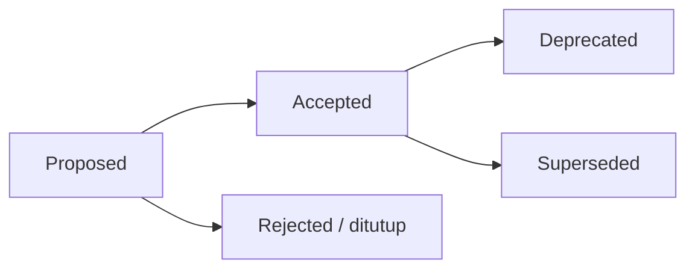

# Architecture Decision Records (ADR)

Folder ini menyimpan **catatan keputusan arsitektural** AWCMS (platform ERP & integrasi bisnis). Setiap keputusan penting (arsitektur, runtime, kontrak, keamanan, atau penyimpangan dari standar dasar awcms) dicatat sebagai satu berkas ADR agar konteks dan alasannya awet.

## Hubungan dengan ADR awcms

Repo ini dibangun di atas fondasi teknis [awcms](https://github.com/ahliweb/awcms) (lihat [ADR-0001](0001-rebuild-on-awcms-foundation-erp-scope.md)). Standar dasar — runtime, RLS, ABAC, offline-first, kontrak API/event — mengikuti ADR di [`awcms/docs/adr/`](https://github.com/ahliweb/awcms/tree/main/docs/adr) **kecuali** ada ADR lokal di sini yang menyatakan penyesuaian eksplisit. ADR di folder ini fokus pada keputusan yang **spesifik untuk skop ERP dan integrasi bisnis** repo ini.

Relevan khusus: awcms ADR-0013 sudah mendefinisikan lapisan ekstensi **"ERP Extension"** sebagai salah satu boundary model resmi — repo ini adalah realisasi dari lapisan tersebut.

## Aturan

1. Satu keputusan = satu berkas `NNNN-judul-kebab.md` (nomor urut, nol di depan).
2. ADR **tidak dihapus**. Bila sebuah keputusan diganti, ADR lama ditandai `Status: Superseded by ADR-XXXX` dan ADR baru mereferensikannya.
3. Status yang valid: `Proposed`, `Accepted`, `Deprecated`, `Superseded`.
4. Perubahan standar yang mengikat (lihat [`GOVERNANCE.md`](../../GOVERNANCE.md)) wajib punya ADR.
5. Gunakan template di [`0000-template.md`](0000-template.md).

## Alur

## Indeks

| ADR                                                                    | Judul                                                                | Status   |
| ----------------------------------------------------------------------- | --------------------------------------------------------------------- | -------- |
| [0001](0001-rebuild-on-awcms-foundation-erp-scope.md)              | Rebuild AWCMS di atas fondasi awcms dengan skop bisnis ERP      | Accepted |

ADR fondasi teknis (runtime, RLS, ABAC, offline-first, kontrak) selengkapnya ada di [indeks ADR awcms](https://github.com/ahliweb/awcms/blob/main/docs/adr/README.md).
