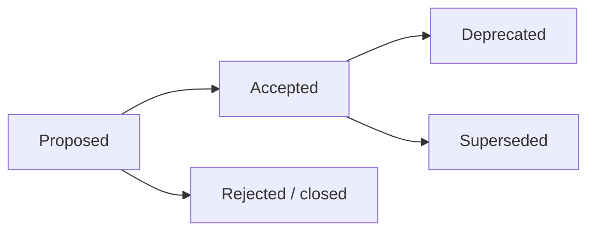

🇬🇧 English (default) · 🇮🇩 [Bahasa Indonesia (sumber)](README.id.md)

<!-- i18n-source-hash: sha256:c281daabbd6d0c2e89f6e6988319fa168b91a3c27c9b353110cfe7aa760f8334 -->

# Architecture Decision Records (ADR)

This folder holds AWCMS's **architectural decision records** — a **foundation/base platform that ERP & business solutions are built on top of** (not an ERP itself; see [ADR-0022](0022-erp-modules-live-in-extension-repos.md)). Every significant decision (architecture, runtime, contracts, security, or a deviation from the baseline standard) is recorded as one ADR file so the context and reasoning survive.

## Relationship to the awcms-mini reference repo

AWCMS was rebuilt (see [ADR-0001](0001-rebuild-on-awcms-foundation-erp-scope.md)) on the technical foundation of the modular monolith [`ahliweb/awcms-mini`](https://github.com/ahliweb/awcms-mini). This repo is, however, **standalone** — it carries its entire foundation itself (it does not share a separate base), so foundation ADRs (runtime, RLS, ABAC, offline-first, API/event contracts, module admission) **live locally in this folder** as ADR-0002…0021, adapted from awcms-mini's reference ADRs. ADRs **specific to the ERP & business-integration scope** are added on top of those.

> Numbering note: ADR-0001 in this repo is the **rebuild** decision. Its original framing ("ERP platform", ERP modules in `src/modules/`) has been **amended by [ADR-0022](0022-erp-modules-live-in-extension-repos.md)**: AWCMS is a **foundation** that ERP is built on (in a separate extension repo), not an ERP itself. The modular-monolith principles it establishes are adopted explicitly by ADR-0001 and detailed by foundation ADRs 0002–0021 plus [`../ARCHITECTURE.md`](../ARCHITECTURE.md).

## Rules

1. One decision = one `NNNN-kebab-title.md` file (sequential number, zero-padded).
2. ADRs are **never deleted**. When a decision is replaced, the old ADR is marked `Status: Superseded by ADR-XXXX` and the new ADR references it.
3. Valid statuses: `Proposed`, `Accepted`, `Deprecated`, `Superseded`.
4. Changes to binding standards (see [`GOVERNANCE.md`](../../GOVERNANCE.md)) require an ADR.
5. Use the template at [`0000-template.md`](0000-template.md).

## Flow

## Index

| ADR                                                                   | Title                                                                                                   | Status   |
| --------------------------------------------------------------------- | ------------------------------------------------------------------------------------------------------- | -------- |
| [0001](0001-rebuild-on-awcms-foundation-erp-scope.md)                 | Rebuild AWCMS as an ERP platform on a modular-monolith standard                                         | Accepted |
| [0002](0002-bun-only-runtime.md)                                      | Bun-only runtime & tooling                                                                              | Accepted |
| [0003](0003-postgresql-rls-multi-tenant.md)                           | PostgreSQL + RLS for multi-tenant isolation                                                             | Accepted |
| [0004](0004-rbac-abac-default-deny.md)                                | RBAC + ABAC default-deny as the access baseline                                                         | Accepted |
| [0005](0005-soft-delete-and-immutability.md)                          | Soft delete for master/config, immutability for posted data                                             | Accepted |
| [0006](0006-offline-first-sync-outbox.md)                             | Offline-first + transactional outbox + HMAC sync                                                        | Accepted |
| [0007](0007-openapi-asyncapi-contracts.md)                            | OpenAPI & AsyncAPI as mandatory contracts                                                               | Accepted |
| [0008](0008-independent-contract-and-module-versioning.md)            | Independent versioning: package, API/event contracts, module descriptor                                 | Accepted |
| [0009](0009-public-tenant-scoped-routes.md)                           | Tenant resolution for public routes (sessionless)                                                       | Accepted |
| [0010](0010-public-host-tenant-routing.md)                            | Host/domain-based public tenant routing                                                                 | Accepted |
| [0011](0011-capability-ports-for-cross-module-collaboration.md)       | Capability ports for cross-module collaboration                                                         | Accepted |
| [0012](0012-module-admission-and-trusted-registry-boundary.md)        | Module admission categories & trusted static registry boundary                                          | Accepted |
| [0013](0013-extension-layers-and-boundary-model.md)                   | Extension layers, tenant/business boundaries, service-extraction criteria                               | Accepted |
| [0014](0014-deterministic-build-time-module-composition.md)           | Deterministic build-time module composition (base registry + derived apps)                              | Accepted |
| [0015](0015-derived-application-compatibility-manifest.md)            | Derived-application compatibility manifest, test kit, semantic-version gates                            | Accepted |
| [0016](0016-organization-structure-module-admission.md)               | Admission of `organization_structure` (Official Optional Business Foundation)                           | Accepted |
| [0017](0017-document-infrastructure-module-admission.md)              | Admission of `document_infrastructure` (Official Optional Business Foundation)                          | Accepted |
| [0018](0018-data-exchange-module-admission.md)                        | Admission of `data_exchange` (Official Optional Business Foundation)                                    | Accepted |
| [0019](0019-integration-hub-module-admission.md)                      | Admission of `integration_hub` (System Foundation)                                                      | Accepted |
| [0020](0020-erp-extension-readiness-contracts.md)                     | ERP extension readiness contracts (business transaction, posting, period-lock, item, projection)        | Accepted |
| [0021](0021-reference-data-module-admission.md)                       | Admission of `reference_data` (Official Optional Business Foundation)                                   | Accepted |
| [0022](0022-erp-modules-live-in-extension-repos.md)                   | ERP domain modules live in extension repos, not the base (amends ADR-0001 point 3)                      | Accepted |
| [0023](0023-bilingual-docs-indonesian-source-english-default.md)      | Bilingual docs: Indonesian source, English default, staleness-gated                                     | Accepted |
| [0024](0024-semver-numbering-continues-legacy-major-line.md)          | SemVer numbering continues the legacy major line (jump to 5.0.0), not a reset to 1.0.0                  | Accepted |
| [0025](0025-implement-deterministic-build-time-module-composition.md) | Real implementation of deterministic build-time module composition in awcms (addendum to ADR-0014)      | Accepted |
| [0026](0026-modular-openapi-ownership-and-composition.md)             | Modular OpenAPI contract: per-module ownership, deterministic bundle, derived-app fragment contribution | Accepted |

ADRs specific to the ERP-foundation & business-integration scope are added starting at the next number as decisions are made.
