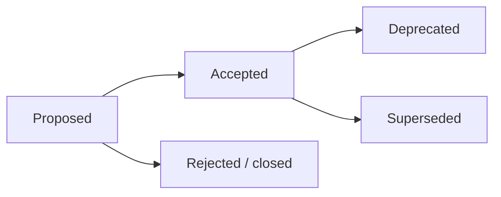

🇬🇧 English (default) · 🇮🇩 [Bahasa Indonesia (sumber)](README.id.md)

<!-- i18n-source-hash: sha256:0dba42187770c4da72bc46e9ca7ea250a352883739392b4b896e32f7c20d381e -->

# Architecture Decision Records (ADR)

This folder holds AWCMS's **architectural decision records** — one of the **three AWCMS-family templates used directly** — the ERP/back-office lineage, now the **online-first hybrid family superset** that absorbs awcms-micro's website/e-commerce cluster (see [ADR-0034](0034-awcms-family-direct-use-templates-and-derived-pathway-removal.md) & [ADR-0035](0035-awcms-online-first-erp-saas-superset-repositioning.md)). Every significant decision (architecture, runtime, contracts, security, or a deviation from the baseline standard) is recorded as one ADR file so the context and reasoning survive.

## Relationship to the awcms-mini reference repo

AWCMS was rebuilt (see [ADR-0001](0001-rebuild-on-awcms-foundation-erp-scope.md)) on the technical foundation of the modular monolith [`ahliweb/awcms-mini`](https://github.com/ahliweb/awcms-mini). This repo is **standalone** — it carries its entire foundation itself (it does not share a separate base), so foundation ADRs (runtime, RLS, ABAC, offline-first, API/event contracts, module admission) **live locally in this folder** as ADR-0002…0021, adapted from awcms-mini's reference ADRs. As of [ADR-0034](0034-awcms-family-direct-use-templates-and-derived-pathway-removal.md), `awcms-mini`, `awcms`, and `awcms-micro` are positioned as **three sibling templates used directly** (not a base-and-derivative hierarchy): `awcms` is the ERP/back-office lineage template. ADRs **specific to the ERP & business-integration scope** are added on top of that foundation.

> Numbering note: ADR-0001 in this repo is the **rebuild** decision. Its original framing ("ERP platform", ERP modules in `src/modules/`) was briefly **amended by [ADR-0022](0022-erp-modules-live-in-extension-repos.md)** (moving ERP modules to a separate extension repo), but ADR-0022 is now **superseded by [ADR-0034](0034-awcms-family-direct-use-templates-and-derived-pathway-removal.md)**: the AWCMS family are three direct-use templates and domain modules — ERP included — **may and should live directly in the used template's `src/modules/`**, not in a separate derived repo. The modular-monolith principles it establishes are adopted explicitly by ADR-0001 and detailed by foundation ADRs 0002–0021 plus [`../ARCHITECTURE.md`](../ARCHITECTURE.md).

## Rules

1. One decision = one `NNNN-kebab-title.md` file (sequential number, zero-padded).
2. ADRs are **never deleted**. When a decision is replaced, the old ADR is marked `Status: Superseded by ADR-XXXX` and the new ADR references it.
3. Valid statuses: `Proposed`, `Accepted`, `Deprecated`, `Superseded`.
4. Changes to binding standards (see [`GOVERNANCE.md`](../../GOVERNANCE.md)) require an ADR.
5. Use the template at [`0000-template.md`](0000-template.md).

## Flow

```mermaid
flowchart LR
  P[Proposed] --> A[Accepted]
  A --> D[Deprecated]
  A --> S[Superseded]
  P --> R[Rejected / closed]
```

## Index

| ADR                                                                           | Title                                                                                                                                                                                                                                                                                                                                                                                                                                                                                                                                                                                                                                                                                                                                                                                                                                                                                                                                                                                                                                             | Status                                                                                                       |
| ----------------------------------------------------------------------------- | ------------------------------------------------------------------------------------------------------------------------------------------------------------------------------------------------------------------------------------------------------------------------------------------------------------------------------------------------------------------------------------------------------------------------------------------------------------------------------------------------------------------------------------------------------------------------------------------------------------------------------------------------------------------------------------------------------------------------------------------------------------------------------------------------------------------------------------------------------------------------------------------------------------------------------------------------------------------------------------------------------------------------------------------------- | ------------------------------------------------------------------------------------------------------------ |
| [0001](0001-rebuild-on-awcms-foundation-erp-scope.md)                         | Rebuild AWCMS as an ERP platform on a modular-monolith standard                                                                                                                                                                                                                                                                                                                                                                                                                                                                                                                                                                                                                                                                                                                                                                                                                                                                                                                                                                                   | Accepted                                                                                                     |
| [0002](0002-bun-only-runtime.md)                                              | Bun-only runtime & tooling                                                                                                                                                                                                                                                                                                                                                                                                                                                                                                                                                                                                                                                                                                                                                                                                                                                                                                                                                                                                                        | Accepted                                                                                                     |
| [0003](0003-postgresql-rls-multi-tenant.md)                                   | PostgreSQL + RLS for multi-tenant isolation                                                                                                                                                                                                                                                                                                                                                                                                                                                                                                                                                                                                                                                                                                                                                                                                                                                                                                                                                                                                       | Accepted                                                                                                     |
| [0004](0004-rbac-abac-default-deny.md)                                        | RBAC + ABAC default-deny as the access baseline                                                                                                                                                                                                                                                                                                                                                                                                                                                                                                                                                                                                                                                                                                                                                                                                                                                                                                                                                                                                   | Accepted                                                                                                     |
| [0005](0005-soft-delete-and-immutability.md)                                  | Soft delete for master/config, immutability for posted data                                                                                                                                                                                                                                                                                                                                                                                                                                                                                                                                                                                                                                                                                                                                                                                                                                                                                                                                                                                       | Accepted                                                                                                     |
| [0006](0006-offline-first-sync-outbox.md)                                     | Offline-first + transactional outbox + HMAC sync                                                                                                                                                                                                                                                                                                                                                                                                                                                                                                                                                                                                                                                                                                                                                                                                                                                                                                                                                                                                  | Accepted                                                                                                     |
| [0007](0007-openapi-asyncapi-contracts.md)                                    | OpenAPI & AsyncAPI as mandatory contracts                                                                                                                                                                                                                                                                                                                                                                                                                                                                                                                                                                                                                                                                                                                                                                                                                                                                                                                                                                                                         | Accepted                                                                                                     |
| [0008](0008-independent-contract-and-module-versioning.md)                    | Independent versioning: package, API/event contracts, module descriptor                                                                                                                                                                                                                                                                                                                                                                                                                                                                                                                                                                                                                                                                                                                                                                                                                                                                                                                                                                           | Accepted                                                                                                     |
| [0009](0009-public-tenant-scoped-routes.md)                                   | Tenant resolution for public routes (sessionless)                                                                                                                                                                                                                                                                                                                                                                                                                                                                                                                                                                                                                                                                                                                                                                                                                                                                                                                                                                                                 | Accepted                                                                                                     |
| [0010](0010-public-host-tenant-routing.md)                                    | Host/domain-based public tenant routing                                                                                                                                                                                                                                                                                                                                                                                                                                                                                                                                                                                                                                                                                                                                                                                                                                                                                                                                                                                                           | Accepted                                                                                                     |
| [0011](0011-capability-ports-for-cross-module-collaboration.md)               | Capability ports for cross-module collaboration                                                                                                                                                                                                                                                                                                                                                                                                                                                                                                                                                                                                                                                                                                                                                                                                                                                                                                                                                                                                   | Accepted                                                                                                     |
| [0012](0012-module-admission-and-trusted-registry-boundary.md)                | Module admission categories & trusted static registry boundary                                                                                                                                                                                                                                                                                                                                                                                                                                                                                                                                                                                                                                                                                                                                                                                                                                                                                                                                                                                    | Accepted                                                                                                     |
| [0013](0013-extension-layers-and-boundary-model.md)                           | Extension layers, tenant/business boundaries, service-extraction criteria                                                                                                                                                                                                                                                                                                                                                                                                                                                                                                                                                                                                                                                                                                                                                                                                                                                                                                                                                                         | Accepted (derived pathway → [0034](0034-awcms-family-direct-use-templates-and-derived-pathway-removal.md))   |
| [0014](0014-deterministic-build-time-module-composition.md)                   | Deterministic build-time module composition (base registry + derived apps)                                                                                                                                                                                                                                                                                                                                                                                                                                                                                                                                                                                                                                                                                                                                                                                                                                                                                                                                                                        | Accepted (derived pathway → [0034](0034-awcms-family-direct-use-templates-and-derived-pathway-removal.md))   |
| [0015](0015-derived-application-compatibility-manifest.md)                    | Derived-application compatibility manifest, test kit, semantic-version gates                                                                                                                                                                                                                                                                                                                                                                                                                                                                                                                                                                                                                                                                                                                                                                                                                                                                                                                                                                      | Superseded → [0034](0034-awcms-family-direct-use-templates-and-derived-pathway-removal.md)                   |
| [0016](0016-organization-structure-module-admission.md)                       | Admission of `organization_structure` (Official Optional Business Foundation)                                                                                                                                                                                                                                                                                                                                                                                                                                                                                                                                                                                                                                                                                                                                                                                                                                                                                                                                                                     | Accepted                                                                                                     |
| [0017](0017-document-infrastructure-module-admission.md)                      | Admission of `document_infrastructure` (Official Optional Business Foundation)                                                                                                                                                                                                                                                                                                                                                                                                                                                                                                                                                                                                                                                                                                                                                                                                                                                                                                                                                                    | Accepted                                                                                                     |
| [0018](0018-data-exchange-module-admission.md)                                | Admission of `data_exchange` (Official Optional Business Foundation)                                                                                                                                                                                                                                                                                                                                                                                                                                                                                                                                                                                                                                                                                                                                                                                                                                                                                                                                                                              | Accepted                                                                                                     |
| [0019](0019-integration-hub-module-admission.md)                              | Admission of `integration_hub` (System Foundation)                                                                                                                                                                                                                                                                                                                                                                                                                                                                                                                                                                                                                                                                                                                                                                                                                                                                                                                                                                                                | Accepted                                                                                                     |
| [0020](0020-erp-extension-readiness-contracts.md)                             | ERP extension readiness contracts (business transaction, posting, period-lock, item, projection)                                                                                                                                                                                                                                                                                                                                                                                                                                                                                                                                                                                                                                                                                                                                                                                                                                                                                                                                                  | Accepted                                                                                                     |
| [0021](0021-reference-data-module-admission.md)                               | Admission of `reference_data` (Official Optional Business Foundation)                                                                                                                                                                                                                                                                                                                                                                                                                                                                                                                                                                                                                                                                                                                                                                                                                                                                                                                                                                             | Accepted                                                                                                     |
| [0022](0022-erp-modules-live-in-extension-repos.md)                           | ERP domain modules live in extension repos, not the base (amends ADR-0001 point 3)                                                                                                                                                                                                                                                                                                                                                                                                                                                                                                                                                                                                                                                                                                                                                                                                                                                                                                                                                                | Superseded → [0034](0034-awcms-family-direct-use-templates-and-derived-pathway-removal.md)                   |
| [0023](0023-bilingual-docs-indonesian-source-english-default.md)              | Bilingual docs: Indonesian source, English default, staleness-gated                                                                                                                                                                                                                                                                                                                                                                                                                                                                                                                                                                                                                                                                                                                                                                                                                                                                                                                                                                               | Accepted                                                                                                     |
| [0024](0024-semver-numbering-continues-legacy-major-line.md)                  | SemVer numbering continues the legacy major line (jump to 5.0.0), not a reset to 1.0.0                                                                                                                                                                                                                                                                                                                                                                                                                                                                                                                                                                                                                                                                                                                                                                                                                                                                                                                                                            | Accepted                                                                                                     |
| [0025](0025-implement-deterministic-build-time-module-composition.md)         | Real implementation of deterministic build-time module composition in awcms (addendum to ADR-0014)                                                                                                                                                                                                                                                                                                                                                                                                                                                                                                                                                                                                                                                                                                                                                                                                                                                                                                                                                | Accepted (derived pathway → [0034](0034-awcms-family-direct-use-templates-and-derived-pathway-removal.md))   |
| [0026](0026-modular-openapi-ownership-and-composition.md)                     | Modular OpenAPI contract: per-module ownership, deterministic bundle, derived-app fragment contribution                                                                                                                                                                                                                                                                                                                                                                                                                                                                                                                                                                                                                                                                                                                                                                                                                                                                                                                                           | Accepted                                                                                                     |
| [0027](0027-mfa-totp-session-assurance-step-up.md)                            | MFA TOTP, recovery codes, session assurance (aal1/aal2), and step-up                                                                                                                                                                                                                                                                                                                                                                                                                                                                                                                                                                                                                                                                                                                                                                                                                                                                                                                                                                              | Accepted                                                                                                     |
| [0028](0028-oidc-sso-tenant-aware-account-linking-break-glass.md)             | OIDC/SSO tenant-aware, fail-closed account linking, SSRF guard, and break-glass                                                                                                                                                                                                                                                                                                                                                                                                                                                                                                                                                                                                                                                                                                                                                                                                                                                                                                                                                                   | Accepted                                                                                                     |
| [0029](0029-deployment-profile-aware-turnstile-bot-protection.md)             | Deployment-profile-aware Cloudflare Turnstile bot protection (LAN/offline exempt)                                                                                                                                                                                                                                                                                                                                                                                                                                                                                                                                                                                                                                                                                                                                                                                                                                                                                                                                                                 | Accepted                                                                                                     |
| [0030](0030-business-scope-hierarchy-generic-authorization-layer.md)          | Generic business-scope hierarchy authorization layer (multi-entity/unit)                                                                                                                                                                                                                                                                                                                                                                                                                                                                                                                                                                                                                                                                                                                                                                                                                                                                                                                                                                          | Accepted                                                                                                     |
| [0031](0031-segregation-of-duties-conflict-enforcement.md)                    | Generic segregation of duties (SoD), exception/override, conflict enforcement                                                                                                                                                                                                                                                                                                                                                                                                                                                                                                                                                                                                                                                                                                                                                                                                                                                                                                                                                                     | Accepted                                                                                                     |
| [0032](0032-family-compatibility-manifest-and-ci-conformance.md)              | Family compatibility manifest + CI conformance to the AWCMS-Mini standard                                                                                                                                                                                                                                                                                                                                                                                                                                                                                                                                                                                                                                                                                                                                                                                                                                                                                                                                                                         | Accepted                                                                                                     |
| [0033](0033-abac-dynamic-policy-evaluator.md)                                 | Dynamic ABAC policy evaluator: bounded condition DSL, deny-overrides precedence, tenant-keyed cache                                                                                                                                                                                                                                                                                                                                                                                                                                                                                                                                                                                                                                                                                                                                                                                                                                                                                                                                               | Accepted                                                                                                     |
| [0034](0034-awcms-family-direct-use-templates-and-derived-pathway-removal.md) | AWCMS family = direct-use templates; derived-application pathway removed; no derivative repos                                                                                                                                                                                                                                                                                                                                                                                                                                                                                                                                                                                                                                                                                                                                                                                                                                                                                                                                                     | Accepted                                                                                                     |
| [0035](0035-awcms-online-first-erp-saas-superset-repositioning.md)            | `awcms` = online-first hybrid, ERP + integrated-SaaS ready, family superset (absorbs awcms-micro)                                                                                                                                                                                                                                                                                                                                                                                                                                                                                                                                                                                                                                                                                                                                                                                                                                                                                                                                                 | Accepted (refines [0034](0034-awcms-family-direct-use-templates-and-derived-pathway-removal.md) positioning) |
| [0036](0036-media-library-module-admission-ownership-inversion.md)            | Admit `media_library` via ownership inversion (extract media registry out of `news_portal`); retire `news_media`; migrations 052-054                                                                                                                                                                                                                                                                                                                                                                                                                                                                                                                                                                                                                                                                                                                                                                                                                                                                                                              | Accepted (adapts awcms-micro ADR-0026)                                                                       |
| [0037](0037-data-lifecycle-module-admission.md)                               | Admit `data_lifecycle` (retention governance + legal-hold, System Foundation); re-wire `visitor_analytics`/`logging` legal-hold coupling; migrations 055-056                                                                                                                                                                                                                                                                                                                                                                                                                                                                                                                                                                                                                                                                                                                                                                                                                                                                                      | Accepted (adapts awcms-micro Issue #745)                                                                     |
| [0038](0038-seo-distribution-module-admission-discovery-scope.md)             | Admit `seo_distribution` discovery scope (central SEO renderer + sitemap/robots/RSS/Atom/JSON + tenant config; `seo_facts` capability seam); redirect governance + 404 telemetry deferred; migrations 057-059                                                                                                                                                                                                                                                                                                                                                                                                                                                                                                                                                                                                                                                                                                                                                                                                                                     | Accepted (adapts awcms-micro ADR-0028)                                                                       |
| [0039](0039-seo-distribution-redirect-governance.md)                          | `seo_distribution` redirect-governance scope (exact-path redirect rules + URL-change capture + 404 telemetry, one fail-open `src/middleware.ts` edit); host-based-only, legacy-blog inert, locale=null; migrations 060-061                                                                                                                                                                                                                                                                                                                                                                                                                                                                                                                                                                                                                                                                                                                                                                                                                        | Accepted (adapts awcms-micro ADR-0028 §8/ADR-0010)                                                           |
| [0040](0040-site-search-module-admission.md)                                  | Admit `site_search` (Official Optional Module): cross-content PostgreSQL FTS index + public host-resolved query/suggest + admin index/settings/diagnostics; `searchSources` descriptor seam (MODULE_CONTRACT_VERSION 2.2.0), `:tenantCode` URL template, no inline typeahead; migrations 064-065                                                                                                                                                                                                                                                                                                                                                                                                                                                                                                                                                                                                                                                                                                                                                  | Accepted (adapts awcms-micro ADR-0031)                                                                       |
| [0041](0041-comments-module-admission.md)                                     | Admit `comments` (Official Optional Module): moderation-first commenting over PUBLISHED resources; `commentableResources` descriptor seam (MODULE_CONTRACT_VERSION 2.3.0), `:tenantCode` URL template, zero new `AccessAction`, store-plain-text/escape-on-render, uniform oracle-free public responses; migrations 066-067                                                                                                                                                                                                                                                                                                                                                                                                                                                                                                                                                                                                                                                                                                                       | Accepted (adapts awcms-micro ADR-0032)                                                                       |
| [0042](0042-varnish-edge-cache-auto-activation.md)                            | OPTIONAL Varnish edge-cache tier (off by default, no-op when off) with origin-pressure auto-activation: fail-closed surface allow-list kept separate from the load signal (pressure changes only HOW LONG, never WHAT), default-deny VCL plus explicit labelling of every response, anchored surrogate-key invalidation through an outbox-pattern durable queue; migration 068                                                                                                                                                                                                                                                                                                                                                                                                                                                                                                                                                                                                                                                                    | Accepted (awcms-native, not a port)                                                                          |
| [0043](0043-lib-boundary-and-module-presentation-layer.md)                    | `src/lib` boundary = technical infrastructure with no domain name; module presentation/delivery code moves to `src/modules/<m>/presentation/`. `modules:dag:check` extended: a `src/lib/<x>/` namespace colliding with a `moduleKey` (exactly or via a domain alias) FAILS; one recorded exception (`logging`). `tests/module-boundary.test.ts` extended to `src/pages` using `api.routes` (#256)                                                                                                                                                                                                                                                                                                                                                                                                                                                                                                                                                                                                                                                 | Accepted (awcms-native; awcms-micro ADR-0038 decides the same there)                                         |
| [0044](0044-merge-news-portal-into-blog-content.md)                           | Merge `news_portal` into `blog_content` (one content module, NO feature loss): `news_portal` (11 files, 3 tables, zero capabilities provided, required consumer of `public_content`) is retired; `awcms_news_portal_*` table names are KEPT per the ADR-0036 precedent; the two advertisement systems unify into the verified-media-FK table after it is widened with post/page targeting (ingest residue is reported, never silently dropped); `awcms_news_portal_tenant_state` (inert, no writer) is DROPPED; permissions are seeded AND backfilled for existing tenants; API paths are not renamed in the same change. The public site moves to `ahliweb/awcms-astro`                                                                                                                                                                                                                                                                                                                                                                          | Accepted (awcms-native; counterpart repo `ahliweb/awcms-astro`)                                              |
| [0045](0045-jualanku-porting-awcms-system-of-record-astro-bff.md)             | Jualanku.info porting: `awcms` as the system of record + internal admin, `awcms-astro` as the experience layer and the only BFF; static-by-default with on-demand routes (not "hybrid"); one operator tenant with **merchants modelled as business scopes** (filling the hierarchy resolver whose base implementation fails closed) plus an ownership predicate on every query — not tenant RLS and not a new ABAC attribute; five `jualanku_*` bounded contexts (not seven); a cross-origin session-introspection contract for the portals; public/portal/admin namespaces calling one application service. Blueprint: [`../awcms/jualanku/`](../awcms/jualanku/README.md).                                                                                                                                                                                                                                                                                                                                                                      | Accepted                                                                                                     |
| [0046](0046-idn-admin-regions-module-admission.md)                            | Admission of `idn_admin_regions` (Official Optional Module): Indonesia administrative region master data (province/regency-city/district/village) as **versioned GLOBAL reference data** — no `tenant_id`/RLS because the rows are identical for every tenant, replaced by mandatory registration in `GLOBAL_TABLE_FORBIDDEN_PRIVILEGES` (explicit per-role privileges, zero DELETE) while authorization stays per-tenant default-deny; the upstream `cahyadsn/wilayah` dataset (MIT) is VENDORED into the repo so imports are deterministic and offline, with the Kepmendagri decree recorded **per file** from each file's own header; import is a JOB (dry-run by default, refusing partial hierarchies), activation/rollback are audited admin actions with the single-active rule enforced by a partial unique index                                                                                                                                                                                                                         | Accepted                                                                                                     |
| [0047](0047-mini-micro-frozen-foundation-built-here.md)                       | `awcms-mini` and `awcms-micro` are frozen as **reference** (31 July 2026): they may be read and ported OUT, but receive no changes. The **mini-first** pathway in `AGENTS.md` is therefore SUSPENDED, not deleted — foundation features are prototyped directly here, because a freeze PLUS mini-first leaves foundation work with nowhere to land at all. Verified live, not inferred: `awcms-astro` cannot fetch its own content (`X-Tenant-Code` is never read — awcms reads `x-awcms-tenant-id`) and no machine credential exists in any repo of the family, so the build feed and the ADR-0045 session-introspection contract were both deadlocked. Every safeguard mini-first carried implicitly stays explicit: security review for auth/access, ADR, `family:conformance:check`. Each feature landed during the freeze is a deliberate divergence recorded in `awcms-family-compatibility.yaml` as it lands. `0046` is a reserved gap (in-flight work)                                                                                    | Accepted                                                                                                     |
| [0048](0048-frontend-role-split-awcms-astro-internal-admin.md)                | Frontend role split: `awcms-astro` owns the **owner/internal** admin screens, `awcms` owns the **public frontend + public (tenant) admin**. Complements ADR-0047 (which centralised development on two repos without saying which screens belong where) and corrects the "static site with no authenticated surface" premise for `awcms-astro`. Permissions do NOT move with the screen: internal screens still call this repo's `/api/v1/*` through the BFF (ADR-0045) and still pass session + tenant context + default-deny ABAC; the edge cache is never shared with an admin surface. Binds NEW screens; splitting today's `/admin/*` is deferred to its own ADR                                                                                                                                                                                                                                                                                                                                                                             | Superseded by ADR-0051                                                                                       |
| [0049](0049-machine-credentials-and-session-introspection.md)                 | Read-only machine credentials + cross-origin session introspection: a SECOND kind of bearer that is not a human session, bound to one service account, with a token that **carries its own tenant** (a build needs one env var) and a `mc-sha256:`-namespaced hash so the guard chokepoint can pick the right table from the hash alone — with no signature change across 183 routes. It AUTHENTICATES, never AUTHORIZES: effective permissions are the INTERSECTION with the service account's (narrowing, never widening), and every request is refused unless the action is `read`, decided BEFORE permissions are consulted — a leaked token cannot mutate anything even if the account is an `owner`. Expiry is mandatory (max 365 days), revocation takes effect on the next request, and the decision log records WHICH credential acted. Plus `GET /api/v1/auth/session` (safe claims only, one 401 shape for every failure). The first foundation feature prototyped directly here under ADR-0047, recorded as a divergence as it landed | Accepted                                                                                                     |
| [0050](0050-bff-session-handoff-code.md)                                      | The `awcms-astro` BFF obtains a human session through a **single-use handoff code**, not by proxying passwords. `awcms` stays the only place credentials are accepted: the user signs in AT `awcms` (password, MFA, OIDC, Turnstile — none of it reimplemented), then is redirected back with a ≤60-second `code` the BFF exchanges **server-to-server**. The session token never reaches the browser; ADR-0049 introspection is the per-request source of truth (deactivation revokes sessions immediately since #319) and logout calls `awcms` FIRST. Password proxying is rejected mainly because signing in here is not one step — proxying it means copying the MFA/OIDC/Turnstile flows into a second repo. Becoming an OIDC provider is rejected for a single trusted client; machine credentials are rejected as read-only and as erasing per-user attribution                                                                                                                                                                            | Accepted                                                                                                     |
| [0051](0051-admin-screens-consolidated-in-awcms.md)                           | Every admin screen — tenant as well as owner/internal/platform — is built in `awcms` under one `/admin/*` shell. **Supersedes ADR-0048**, which bound only new screens (leaving the existing `/admin/*` mixed) and which moved the dataset-activation SCREEN to another repo while its PERMISSION stayed seeded into every tenant's `owner` role — so it never held back the cross-tenant risk that justified it. That risk moves instead to a gate that does enforce: a cross-tenant action must have a platform-scoped gate and must not sit in the catalogue seeded to tenant roles. `awcms-astro`'s role as experience layer + BFF (ADR-0045) is unchanged.                                                                                                                                                                                                                                                                                                                                                                                   | Accepted                                                                                                     |
| [0052](0052-idn-region-dataset-lifecycle-is-an-operator-job.md)               | Region-dataset activation/rollback become **operator jobs**; their HTTP endpoints are removed and `dataset.configure`/`.restore` are revoked from the catalogue (`sql/084`). Both swapped the data served to ALL tenants, yet their permissions were seeded into the global catalogue granted wholesale to every tenant's `owner` role — so an ordinary tenant owner held authority over other tenants' served data. The "gate them on machine credentials" candidate was REJECTED: machine credentials are read-only (ADR-0049), so widening them would let a leaked build token swap the global dataset. Follows the ADR-0046 §5 precedent (import was already job-only). Accepted cost: the audit row is lost, because `awcms_audit_events` is tenant-scoped while the action is global.                                                                                                                                                                                                                                                       | Accepted                                                                                                     |
| [0053](0053-platform-scoped-permissions.md)                                   | Permission **scope** `tenant`/`platform` (`sql/085`): an action whose effect crosses tenant boundaries can no longer enter the blanket grant every new tenant owner receives, and the chokepoint refuses it unless the acting tenant IS the platform tenant (resolved `PLATFORM_TENANT_ID` → the public default-tenant chain). Closes the CLASS rather than the instance: `bootstrapPlatformTenant` still reads `SELECT id FROM awcms_permissions`, which is what produced ADR-0052's defect and would reproduce it for the next cross-tenant action. The gate trigger is read from the CODE declaration, not the DB column — were both the DB, one UPDATE would remove the gate along with the filter and nothing would go red. Restores the activate/rollback endpoints + the `/admin/idn-regions` screen; the operator jobs remain. Tenancy mode `single`/`multi` is DERIVED from the active-tenant count, never toggled.                                                                                                                      | Accepted                                                                                                     |
| [0054](0054-tenant-provisioning.md)                                           | Tenant provisioning: `POST`/`GET /api/v1/tenants` plus the `/admin/tenants` screen, both PLATFORM-scoped (`sql/086`). Until this ADR a second tenant COULD NOT BE CREATED at all — `setup/initialize` claims the `awcms_setup_state` singleton — so ADR-0053's `multi` mode was unreachable and its platform gate had never met a real second tenant. `createTenantWithOwner` is EXTRACTED and shared with the setup wizard: that is a security control rather than tidiness, because an independently written provisioning routine would carry a copy of the grant `INSERT` that for most of this repo's life lacked `WHERE scope = 'tenant'`. `read` is platform-scoped too, because the directory lists EVERY tenant. A duplicate `tenant_code` needs both a pre-check AND a savepoint (23505 aborts the transaction). The owner password never enters the stored idempotency hash.                                                                                                                                                            | Accepted                                                                                                     |
| [0055](0055-development-confined-to-awcms-and-awcms-astro.md)                 | AWCMS development happens in `ahliweb/awcms` (system of record) and `ahliweb/awcms-astro` (experience layer + BFF), and nowhere else. **Supersedes ADR-0047**, which froze mini/micro as references that could STILL be ported out — a half position that kept documents and gates maintaining a relationship with a repo that does not move: the manifest declared `standard: awcms-mini`, and nine divergences were scheduled for re-review with `reviewDate`s that turn CI red on expiry. mini/micro are now ARCHIVES: wanted capabilities are BUILT here with their own admission ADR, not ported. The manifest stays gated but self-anchored (its 23 contract-version checks against real constants are untouched); `intentionalDivergences` is emptied and preserved as a historical record in `family-compatibility.md`. ADR-0047 §4 (record a divergence as it lands) is retired — the ADR itself is the record; the other §3 guardrails STAY.                                                                                            | Accepted                                                                                                     |

| [0056](0056-media-library-admin-surface.md) | The `media_library` admin surface splits three ways, because "the screen is missing" turns out to be wrong for this module: **five of its eleven permissions are gated by nothing** (`media.attach`/`.detach`/`.delete`/`.restore`/`.purge` — no route, no function, no job), **five application functions have zero callers**, and there is **no list function at all** (`GET /api/v1/media/objects` demands `?ids=`; it is a batch resolver for the `awcms-astro` build). `attach`/`detach` are REVOKED — obsolete since ADR-0036's inversion, media attachment now being the consumer's FK; `delete`/`restore`/`purge` GET a surface, because they are real holes: today a mis-uploaded object disappears only if the reconciliation job happens to categorise it so. `purge` clears the registry, NOT the R2 bytes — the job stays the bucket's only writer. The list gets its own route rather than a dual mode on `?ids=`, since that would turn today's 400 into a dump of the whole registry. The `/admin/media` screen follows AFTER all three land. | Accepted |
| [0057](0057-blog-page-lifecycle.md) | `blog_content` pages get a lifecycle. Auditing `pages.*` before writing its screen found ADR-0056's pattern, sharper: **four of eight seeded permissions are gated by nothing** (`pages.publish`/`.archive`/`.restore`/`.purge`), and unlike `media_library` the application functions do not merely lack callers — they **do not exist**. The consequence is functional, not cosmetic: `createBlogPage` writes a literal `'draft'`, `updateBlogPage` never touches `status`, and the scheduled-publish job only reads `awcms_blog_posts`, so **no code path can publish a page** — which is why the public search's page branch, filtered on `status = 'published'`, has always returned zero rows against an index built for exactly that query. The four permissions GET a surface rather than being revoked: revoking `pages.publish` would bless that defect as design. The lifecycle is deliberately NARROWER than posts' — no `review`, no `scheduled`, since `sql/036` seeded no `pages.schedule` — and `purge` REPORTS rather than refuses: a first draft had it 409 while an ad placement still targeted the page, which reading `ad-placement-reference-validation.ts` refuted — that module already decided a target deleted later "is not an error and never becomes one", the render query never matches a placement whose page is not being rendered, and today's soft delete has the identical effect. The response instead carries the count of placements left inert, since a row silently going dead is exactly the "vanishes with no record" ADR-0044 §4 refuses. **Zero migrations**: columns, CHECK, index and catalogue rows all already exist. Surface first, `/admin/blog/pages` after — plus a gate for the CLASS: every declared permission needs an `authorizeInTransaction` call site or a reasoned exception. | Accepted |
| [0058](0058-unenforced-permissions-disposition.md) | Four declared permissions with no enforcer are decided together: **two get a surface, two are revoked**. ADR-0057 §F's gate found them, and its own first score carried **two false accusations** — `visitor_analytics.settings.read`/`.update` are fully gated by `analytics/settings.ts`, but the scanner read the whole repo's constants as one flat namespace and `MODULE_KEY` is bound in five files to four values, so the guard was invisible; both were written up as reasoned DECISIONS that the route refutes line by line (fixed in PR #359, file-first resolution). The remaining four were therefore re-verified against the code, and they are **not one class**: `profile_identity.profile_management.restore` and `comments.moderation.delete` have all of their machinery except the surface — the first leaves `softDeleteParty` without a counterpart, so `restored_at`/`restored_by` (`sql/003`) can never be written; the second has a `delete`→`deleted` transition legal from all four non-terminal statuses and an admin queue that can FILTER `deleted`, yet the only actor who can produce one is the AUTHOR, via `requestCommentDeletion`. Both GET a surface, and §B states plainly that `deleted` stays terminal — moderators gain one irreversible action, accepted because the state is already reachable through the author path, remains non-destructive, and without it there is no in-band answer for content that must be pulled permanently; `bulk-moderate` deliberately does NOT get it. Conversely `blog_content.seo.configure` is REVOKED as a second authorisation axis over columns `settings.configure` already manages (`seoDefaultTitle`/`seoDefaultDescription`), and `blog_content.posts.export` is REVOKED because there is zero export machinery anywhere — building the feature to justify the catalogue row is the tail wagging the dog. One single migration for both revocations (grants first, then the catalogue — FK), with no rollback. The order binds: surfaces first, revocation last, because the gate flags an exception whose permission has gained an enforcer as stale. Once all four land the exception list is **empty**. | Accepted |
| [0059](0059-host-resolved-public-content-routes.md) | The host-resolved public content family lands at **`/news/**`**, four routes (index, post detail, category, tag), and the backlog entry that asked for `/blog/{slug}` is answered with a refusal plus evidence. Two findings drive it. First, the recorded defect — "every sitemap `<loc>` 404s for a host-resolved tenant" — is **false**: `discovery-providers.ts` has scoped the adapter to `/blog/{tenantCode}` since #223, verified with `git log -S`, and the `/blog` default it was blamed on has zero callers in `src/`. Second, the real gap is that host-resolved deployments have **no content route at all**, so a tenant on its own domain publishes URLs carrying the identifier that domain exists to remove. `/blog/{slug}` cannot be the shape: probed in this repo, Astro warns the route "is defined in both" files and **still builds**, one silently shadowing the other ("a hard error in following versions"), and resolving the ambiguity at runtime would let a post slug shadow another tenant's listing URL. The archived `publicBasePath` setting is not adopted either — it moves links without moving routes, which manufactures per-tenant URLs that 404. The gate (`withHostResolvedBlogTenant`) is the same shape as `site_search`/`comments`, latency-padded; the new `publicRouteMode` switch is symmetric with `legacyTenantRouteEnabled`; and `seo_distribution` now **chooses** its base path from whichever family actually serves, contributing **no provider at all** when a tenant switches both off — an empty sitemap rather than one full of certain 404s, mutation-proven. Zero migrations, zero permissions, zero OpenAPI change; `/news/**` is deliberately not yet a declared edge-cache surface (host keying first). | Accepted |
| [0060](0060-business-scope-hierarchy-provided-by-tenant-admin.md) | `tenant_admin` becomes the `business_scope_hierarchy` provider, closing an endpoint whose **success path was never reachable**. `POST /api/v1/identity/business-scope/assignments` is permission-gated, audited, RLS-protected and SoD-evaluated — and refused EVERY input in EVERY deployment: its composition root injected a NO-OP adapter resolving every scope to `resolved: false`, while the reserved `tenant` scope type is rejected by the validator as unassignable (#180 F2). The NO-OP was correct when written — it waited for a DERIVED application to inject a resolver — and then ADR-0034 deleted the derived pathway and ADR-0055 confined development here, so the wait became a permanent refusal; its `providedBy` even named `organization_structure`, a module ADR-0016 accepted and nobody ever wrote. The base already had a real, hardened hierarchy: `awcms_offices` with `parent_office_id`, FORCE RLS (`sql/017`) and a composite cross-tenant-proof FK (`sql/020`). The new adapter resolves the `office` scope type only; just LIVE rows resolve (not soft-deleted, not `inactive`, same tenant), and dead rows are skipped anywhere in the chain so no coverage is borrowed through a resource its tenant switched off. **Every bound REFUSES rather than truncates** — cycle, depth, count — because a truncated list still claims `resolved: true`. Plus one read-path hardening: the reserved `tenant` sentinel mints a covers-everything fact only when its `scope_id` names this tenant. The NO-OP adapter is deleted (zero callers), zero migrations, zero new permissions. | Accepted |
| [0061](0061-host-resolved-public-surfaces-are-edge-cacheable.md) | Host-resolved public surfaces become edge-cacheable, via routes that **publish the tenant they already resolved** — which closes something larger than "one route family is not cached yet": **ADR-0042 §8's first-choice tenant source never had a writer**. `locals.edgeCacheTenantId` is declared in `src/env.d.ts`, read by `src/middleware.ts`, and preferred above everything by `resolveEdgeCacheTenantId` — while zero routes ever assigned it, so that first-priority branch has been unreachable since ADR-0042 landed. The result is the exact inverse of ADR-0059's direction: edge caching accelerates `/blog/{tenantCode}/**` (the legacy shape) and touches **none** of the surfaces that resolve their tenant from the request. §A wires the `/news/**` family (three registry entries mirroring the TTLs and reasoning of their `blog-*` counterparts, owned by `blog_content`, whose module purge already covers them); §B — the six root discovery routes, the best caching target in this codebase — follows, because `serveDiscovery` does not yet receive `locals` and `seo_distribution` has no purge call site, which `findOwnersWithoutPurges` will demand of it the moment it owns a surface. Two things do not read from the code, and are therefore what this ADR is for. First, the "the VCL hashes `Host`" prerequisite is **two** properties: `hash_data(req.http.host)` IS there, but that subroutine must also NOT `return (lookup)` — a custom sub that returns ends the chain, so `builtin.vcl`'s `vcl_hash` (which hashes `req.url`) never runs and every path on one host collapses onto a SINGLE entry; adding that line reads like completing the subroutine. Second, **when** a route publishes its tenant is a disclosure question rather than a style one: 404 is a cacheable status, so publishing before the "no such post/term" branch annotates the missing-resource 404 with `Surrogate-Control` while the unknown-host 404 gets `private, no-store` — answering "does this hostname map to a live tenant?" from ONE request, through a second channel over the very question `padUnresolvedHostRouteLatency` was built to close, and the mistake is one line placed a few lines too high that still compiles and passes every functional test. The rule "publish only on the serving path" is therefore held by a source-text contract test, mutation-proven. The "guess from the `Host` header" fallback stays REFUSED (ADR-0042 §8's prohibition). Zero migrations, zero permissions, zero OpenAPI change. | Accepted |

ADRs specific to the ERP-foundation & business-integration scope are added starting at the next number as decisions are made.
