> **Documentation Authority**: [SYSTEM_MODEL.md](../../SYSTEM_MODEL.md) Section 2 (Data Integrity)

# Database Schema

## Purpose

Describe the tenant-scoped PostgreSQL schema used by AWCMS.

## Audience

- Developers working with data models and migrations
- Operators reviewing RLS and data isolation

## Prerequisites

- [SYSTEM_MODEL.md](../../SYSTEM_MODEL.md) - **Primary authority** for database schema and data integrity
- [AGENTS.md](../../AGENTS.md) - Implementation patterns and Context7 references
- `docs/tenancy/overview.md`
- `docs/security/rls.md`

## Reference

AWCMS uses PostgreSQL via Supabase. This document describes the core database schema.

> **Schema Accuracy Note:** SQL blocks in this document are representative snapshots for developer orientation.
> Canonical executable schema truth is the migration history in `supabase/migrations/` (mirrored in `awcms/supabase/migrations/`).
> Before relying on a specific column, constraint, or policy shape, verify against the latest migration files.
> **2026-03-20 Baseline:** Migration inventory shows `145` root migrations and `145` mirrored migrations at full parity. Verified via `scripts/verify_supabase_migration_consistency.sh`.

---

## Entity Relationship Diagram

The diagram below covers all primary table groups. Junction/audit tables and FK arrows are selectively shown for readability. Full FK definitions are in the SQL blocks below.

```mermaid
erDiagram
    %% ── Control Plane ─────────────────────────────────────────────────────────
    platform_projects {
        uuid id PK
        text code UK
        text name
        text status
        text default_region
        timestamptz created_at
        timestamptz updated_at
    }
    deployment_cells {
        uuid id PK
        uuid project_id FK
        text environment
        text service_profile
        text supabase_mode
        text status
        timestamptz created_at
        timestamptz updated_at
    }
    tenants_control {
        uuid id PK
        uuid project_id FK
        uuid current_cell_id FK
        text tenant_code
        text display_name
        text status
        timestamptz created_at
        timestamptz updated_at
    }
    tenant_domains {
        uuid id PK
        uuid tenant_id FK
        uuid cell_id FK
        text hostname UK
        text domain_kind
        boolean is_primary
        text verification_status
        timestamptz created_at
    }
    tenant_service_contracts {
        uuid id PK
        uuid tenant_id FK
        text service_profile
        text runtime_isolation_level
        text data_isolation_level
        timestamptz effective_at
    }
    tenant_migrations {
        uuid id PK
        uuid tenant_id FK
        uuid source_cell_id FK
        uuid target_cell_id FK
        text migration_kind
        text status
        timestamptz planned_cutover_at
    }

    %% ── Application Tenancy ───────────────────────────────────────────────────
    tenants {
        uuid id PK
        text name
        text slug UK
        text domain UK
        uuid parent_tenant_id FK
        int level
        text subscription_tier
        text status
        jsonb config
        timestamptz deleted_at
        timestamptz created_at
        timestamptz updated_at
    }
    modules {
        uuid id PK
        uuid tenant_id FK
        text name
        text slug
        text status
        timestamptz created_at
        timestamptz updated_at
    }

    %% ── Identity & RBAC ──────────────────────────────────────────────────────
    users {
        uuid id PK
        uuid tenant_id FK
        uuid role_id FK
        text email UK
        text full_name
        text approval_status
        uuid region_id FK
        timestamptz deleted_at
        timestamptz created_at
    }
    roles {
        uuid id PK
        uuid tenant_id FK
        text name
        text scope
        boolean is_platform_admin
        boolean is_full_access
        boolean is_tenant_admin
        int staff_level
        timestamptz deleted_at
    }
    permissions {
        uuid id PK
        text name UK
        text resource
        text action
        text module
    }
    role_permissions {
        uuid id PK
        uuid role_id FK
        uuid permission_id FK
        uuid tenant_id FK
        timestamptz deleted_at
    }
    user_profiles {
        uuid id PK
        uuid user_id FK
        uuid tenant_id FK
        text job_title
        text department
        text phone
        timestamptz deleted_at
    }
    user_profile_admin {
        uuid id PK
        uuid user_id FK
        uuid tenant_id FK
        bytea admin_notes_encrypted
        bytea admin_flags_encrypted
        text admin_salt
    }
    account_requests {
        uuid id PK
        uuid tenant_id FK
        text email
        text status
        timestamptz deleted_at
        timestamptz created_at
    }

    %% ── Content ───────────────────────────────────────────────────────────────
    blogs {
        uuid id PK
        uuid tenant_id FK
        uuid author_id FK
        uuid category_id FK
        text title
        text slug
        text status
        text workflow_state
        jsonb puck_layout_jsonb
        jsonb tiptap_doc_jsonb
        timestamptz published_at
        timestamptz deleted_at
    }
    pages {
        uuid id PK
        uuid tenant_id FK
        uuid parent_id FK
        uuid category_id FK
        text title
        text slug
        text status
        jsonb puck_layout_jsonb
        timestamptz deleted_at
    }
    events {
        uuid id PK
        uuid tenant_id FK
        uuid author_id FK
        text title
        text slug
        text status
        timestamptz start_at
        timestamptz end_at
        timestamptz deleted_at
    }
    content_translations {
        uuid id PK
        uuid tenant_id FK
        text content_type
        uuid content_id
        text locale
        text title
        text slug
        timestamptz created_at
    }

    %% ── Taxonomy ──────────────────────────────────────────────────────────────
    categories {
        uuid id PK
        uuid tenant_id FK
        uuid parent_id FK
        text name
        text slug
        text type
        timestamptz deleted_at
    }
    tags {
        uuid id PK
        uuid tenant_id FK
        text name
        text slug
        boolean is_active
        timestamptz deleted_at
    }
    blog_tags {
        uuid blog_id FK
        uuid tag_id FK
        uuid tenant_id FK
    }
    page_tags {
        uuid page_id FK
        uuid tag_id FK
        uuid tenant_id FK
    }

    %% ── Media ─────────────────────────────────────────────────────────────────
    media_objects {
        uuid id PK
        uuid tenant_id FK
        uuid uploaded_by FK
        text filename
        text r2_key
        text mime_type
        bigint size_bytes
        text status
        jsonb metadata
        timestamptz deleted_at
        timestamptz created_at
    }

    %% ── Navigation ────────────────────────────────────────────────────────────
    menus {
        uuid id PK
        uuid tenant_id FK
        uuid parent_id FK
        uuid page_id FK
        text name
        text label
        text location
        boolean is_active
        timestamptz deleted_at
    }
    admin_menus {
        uuid id PK
        uuid tenant_id FK
        text key UK
        text label
        text path
        text icon
        text scope
        int order
        boolean is_visible
    }

    %% ── Templates & Widgets ──────────────────────────────────────────────────
    templates {
        uuid id PK
        uuid tenant_id FK
        text name
        text slug
        text type
        jsonb data
        boolean is_active
        timestamptz deleted_at
    }
    template_parts {
        uuid id PK
        uuid tenant_id FK
        text name
        text type
        jsonb data
        timestamptz deleted_at
    }
    template_assignments {
        uuid id PK
        uuid tenant_id FK
        uuid template_id FK
        text route_type
        text channel
    }
    widgets {
        uuid id PK
        uuid tenant_id FK
        uuid area_id FK
        text type
        jsonb config
        int sort_order
    }
    template_strings {
        uuid id PK
        uuid tenant_id FK
        text key
        text locale
        text value
    }

    %% ── Extensions ────────────────────────────────────────────────────────────
    platform_extension_catalog {
        uuid id PK
        text vendor
        text slug
        text name
        text version
        text kind
        text scope
        text status
        jsonb manifest
        jsonb capabilities
        timestamptz deleted_at
    }
    tenant_extensions {
        uuid id PK
        uuid tenant_id FK
        uuid catalog_id FK
        text installed_version
        text activation_state
        jsonb config
        text last_health_status
        timestamptz installed_at
        timestamptz deleted_at
    }
    extension_lifecycle_audit {
        uuid id PK
        uuid tenant_id FK
        uuid catalog_id FK
        uuid tenant_extension_id FK
        uuid actor_user_id FK
        text action
        text status
        jsonb metadata
    }
    extensions {
        uuid id PK
        uuid tenant_id FK
        text slug
        text name
        text version
        boolean is_active
        text extension_type
        jsonb manifest
        timestamptz deleted_at
    }
    extension_menu_items {
        uuid id PK
        uuid tenant_id FK
        uuid extension_id FK
        text label
        text path
        boolean is_active
    }

    %% ── Regions ───────────────────────────────────────────────────────────────
    regions {
        uuid id PK
        uuid tenant_id FK
        uuid parent_id FK
        uuid level_id FK
        text name
        text code
        text full_path
        boolean is_active
    }
    region_levels {
        uuid id PK
        text key UK
        text name
        int level_order
    }
    administrative_regions {
        uuid id PK
        uuid parent_id FK
        text code UK
        text name
        text level
        boolean is_active
    }

    %% ── Commerce ──────────────────────────────────────────────────────────────
    products {
        uuid id PK
        uuid tenant_id FK
        uuid category_id FK
        text name
        text slug UK
        decimal price
        int stock_quantity
        text status
        timestamptz deleted_at
    }
    orders {
        uuid id PK
        uuid tenant_id FK
        uuid user_id FK
        text status
        decimal total_amount
        timestamptz deleted_at
    }
    order_items {
        uuid id PK
        uuid order_id FK
        uuid product_id FK
        int quantity
        decimal unit_price
    }
    carts {
        uuid id PK
        uuid tenant_id FK
        uuid user_id FK
    }
    cart_items {
        uuid id PK
        uuid cart_id FK
        uuid product_id FK
        int quantity
    }

    %% ── Notifications & Audit ─────────────────────────────────────────────────
    notifications {
        uuid id PK
        uuid tenant_id FK
        uuid user_id FK
        text title
        text type
        boolean is_read
        timestamptz created_at
    }
    audit_logs {
        uuid id PK
        uuid tenant_id FK
        uuid user_id FK
        text action
        text resource_type
        uuid resource_id
        jsonb details
        timestamptz created_at
    }
    queue_dead_letters {
        uuid id PK
        text queue_name
        text job_id
        text event_type
        uuid tenant_id FK
        jsonb payload
        text failure_reason
        timestamptz failed_at
        timestamptz replayed_at
    }

    %% ── Dynamic UI ────────────────────────────────────────────────────────────
    resources_registry {
        uuid id PK
        text key UK
        text label
        text scope
        text type
        text db_table
        text permission_prefix
        boolean active
    }
    ui_configs {
        uuid id PK
        uuid tenant_id FK
        text resource_key FK
        text type
        text name
        jsonb schema
        boolean is_default
    }
    component_registry {
        uuid id PK
        uuid tenant_id FK
        text resource_key FK
        text editor_type
        jsonb config
    }

    %% ── Relationships ──────────────────────────────────────────────────────────
    platform_projects ||--o{ deployment_cells : "has cells"
    platform_projects ||--o{ tenants_control : "contains tenants"
    deployment_cells ||--o{ tenants_control : "hosts"
    tenants_control ||--o{ tenant_domains : "owns"
    tenants_control ||--o{ tenant_service_contracts : "governed by"
    tenants_control ||--o{ tenant_migrations : "migrates"
    deployment_cells ||--o{ tenant_domains : "in cell"

    tenants ||--o{ users : "has members"
    tenants ||--o{ roles : "owns"
    tenants ||--o{ modules : "enables"
    tenants }o--o| tenants : "parent"
    users }o--|| roles : "assigned"
    roles ||--o{ role_permissions : "has"
    permissions ||--o{ role_permissions : "assigned via"
    users ||--o| user_profiles : "extended by"
    users ||--o| user_profile_admin : "admin fields"

    tenants ||--o{ blogs : "owns"
    tenants ||--o{ pages : "owns"
    tenants ||--o{ events : "owns"
    users ||--o{ blogs : "authors"
    categories ||--o{ blogs : "categorises"
    categories ||--o{ pages : "categorises"
    blogs ||--o{ blog_tags : "tagged"
    pages ||--o{ page_tags : "tagged"
    tags ||--o{ blog_tags : "used in"
    tags ||--o{ page_tags : "used in"

    tenants ||--o{ media_objects : "owns"
    users ||--o{ media_objects : "uploads"

    tenants ||--o{ templates : "owns"
    tenants ||--o{ template_parts : "owns"
    tenants ||--o{ template_assignments : "configures"
    templates ||--o{ template_assignments : "assigned via"
    template_parts ||--o{ widgets : "contains"

    platform_extension_catalog ||--o{ tenant_extensions : "activated as"
    tenants ||--o{ tenant_extensions : "installs"
    tenants ||--o{ extensions : "registers"
    extensions ||--o{ extension_menu_items : "adds"

    tenants ||--o{ products : "sells"
    tenants ||--o{ orders : "receives"
    orders ||--o{ order_items : "contains"
    products ||--o{ order_items : "appears in"

    tenants ||--o{ audit_logs : "audited"
    tenants ||--o{ notifications : "receives"

    regions }o--o| regions : "parent"
    region_levels ||--o{ regions : "classifies"
    administrative_regions }o--o| administrative_regions : "parent"

    resources_registry ||--o{ ui_configs : "configured by"
    resources_registry ||--o{ component_registry : "has editor"
```



---

## Schema Groups

### 1. Control Plane

These tables track the infrastructure topology of AWCMS — projects, deployment cells, and the commercial tenant registry. They are separate from the application `tenants` table.

#### platform_projects

Top-level container for a multi-tenant product deployment. One project maps to one commercial product that may span many deployment cells and tenants.

```sql
CREATE TABLE IF NOT EXISTS public.platform_projects (
  id                      UUID PRIMARY KEY DEFAULT gen_random_uuid(),
  code                    TEXT NOT NULL UNIQUE,
  name                    TEXT NOT NULL,
  status                  TEXT NOT NULL DEFAULT 'active'
                            CHECK (status IN ('active', 'suspended', 'archived')),
  default_region          TEXT,
  default_edge_profile_id UUID,
  created_at              TIMESTAMPTZ NOT NULL DEFAULT now(),
  updated_at              TIMESTAMPTZ NOT NULL DEFAULT now()
);
```

#### deployment_cells

A specific runtime environment instance binding Cloudflare and Supabase references. A tenant is always associated with exactly one active cell.

```sql
CREATE TABLE IF NOT EXISTS public.deployment_cells (
  id                      UUID PRIMARY KEY DEFAULT gen_random_uuid(),
  project_id              UUID NOT NULL REFERENCES public.platform_projects(id) ON DELETE CASCADE,
  environment             TEXT NOT NULL CHECK (environment IN ('production', 'staging', 'preview', 'development')),
  service_profile         TEXT NOT NULL CHECK (service_profile IN (
                            'shared_managed', 'dedicated_managed', 'dedicated_hybrid',
                            'dedicated_self_hosted', 'vanity_domain_saas')),
  cloudflare_account_ref  TEXT,
  cloudflare_zone_ref     TEXT,
  supabase_mode           TEXT NOT NULL CHECK (supabase_mode IN ('managed', 'self_hosted')),
  supabase_project_ref    TEXT,
  status                  TEXT NOT NULL DEFAULT 'draft'
                            CHECK (status IN ('draft', 'provisioning', 'active', 'maintenance', 'decommissioned')),
  created_at              TIMESTAMPTZ NOT NULL DEFAULT now(),
  updated_at              TIMESTAMPTZ NOT NULL DEFAULT now()
);
```

#### tenants_control

The canonical commercial tenant registry. Links a business entity to a project and a deployment cell.

```sql
CREATE TABLE IF NOT EXISTS public.tenants_control (
  id               UUID PRIMARY KEY DEFAULT gen_random_uuid(),
  project_id       UUID NOT NULL REFERENCES public.platform_projects(id) ON DELETE CASCADE,
  tenant_code      TEXT NOT NULL,
  display_name     TEXT NOT NULL,
  status           TEXT NOT NULL DEFAULT 'draft'
                     CHECK (status IN ('draft', 'active', 'suspended', 'migrating', 'archived')),
  current_cell_id  UUID REFERENCES public.deployment_cells(id),
  primary_domain_id UUID,
  billing_model    TEXT,
  created_at       TIMESTAMPTZ NOT NULL DEFAULT now(),
  updated_at       TIMESTAMPTZ NOT NULL DEFAULT now(),
  UNIQUE (project_id, tenant_code)
);
```

#### tenant_domains

Canonical hostname registry. Every domain used by a tenant must have a verified entry here.

```sql
CREATE TABLE IF NOT EXISTS public.tenant_domains (
  id                      UUID PRIMARY KEY DEFAULT gen_random_uuid(),
  tenant_id               UUID NOT NULL REFERENCES public.tenants_control(id) ON DELETE CASCADE,
  cell_id                 UUID NOT NULL REFERENCES public.deployment_cells(id),
  hostname                TEXT NOT NULL UNIQUE,
  domain_kind             TEXT NOT NULL CHECK (domain_kind IN (
                            'platform_subdomain', 'custom_domain', 'admin_domain',
                            'api_domain', 'cdn_domain', 'preview_domain')),
  is_primary              BOOLEAN NOT NULL DEFAULT false,
  certificate_mode        TEXT,
  routing_mode            TEXT,
  verification_status     TEXT NOT NULL DEFAULT 'pending'
                            CHECK (verification_status IN ('pending', 'verified', 'failed', 'revoked')),
  cloudflare_hostname_ref TEXT,
  created_at              TIMESTAMPTZ NOT NULL DEFAULT now(),
  updated_at              TIMESTAMPTZ NOT NULL DEFAULT now()
);
```

#### tenant_service_contracts

Append-only ledger of service profile assignments. The row with the highest `effective_at` is the current contract.

```sql
CREATE TABLE IF NOT EXISTS public.tenant_service_contracts (
  id                       UUID PRIMARY KEY DEFAULT gen_random_uuid(),
  tenant_id                UUID NOT NULL REFERENCES public.tenants_control(id) ON DELETE CASCADE,
  service_profile          TEXT NOT NULL CHECK (service_profile IN (
                             'shared_managed', 'dedicated_managed', 'dedicated_hybrid',
                             'dedicated_self_hosted', 'vanity_domain_saas')),
  runtime_isolation_level  TEXT NOT NULL CHECK (runtime_isolation_level IN ('shared', 'scoped', 'dedicated')),
  data_isolation_level     TEXT NOT NULL CHECK (data_isolation_level IN ('shared', 'dedicated')),
  edge_isolation_level     TEXT NOT NULL CHECK (edge_isolation_level IN ('shared', 'byod', 'dedicated')),
  backup_tier              TEXT,
  support_tier             TEXT,
  effective_at             TIMESTAMPTZ NOT NULL DEFAULT now(),
  created_at               TIMESTAMPTZ NOT NULL DEFAULT now()
);
```

#### tenant_migrations

Tracks lifecycle of cell migration runbooks. Must define `rollback_deadline` before marking `in_progress`.

```sql
CREATE TABLE IF NOT EXISTS public.tenant_migrations (
  id                    UUID PRIMARY KEY DEFAULT gen_random_uuid(),
  tenant_id             UUID NOT NULL REFERENCES public.tenants_control(id) ON DELETE CASCADE,
  source_cell_id        UUID REFERENCES public.deployment_cells(id),
  target_cell_id        UUID REFERENCES public.deployment_cells(id),
  migration_kind        TEXT NOT NULL CHECK (migration_kind IN (
                          'shared_to_dedicated_managed', 'dedicated_managed_to_hybrid',
                          'dedicated_managed_to_self_hosted', 'self_hosted_to_dedicated_managed',
                          'cell_upgrade', 'cell_downgrade', 'profile_only_change')),
  status                TEXT NOT NULL DEFAULT 'planned'
                          CHECK (status IN ('planned', 'in_progress', 'validating',
                                            'completed', 'rolled_back', 'failed')),
  planned_cutover_at    TIMESTAMPTZ,
  actual_cutover_at     TIMESTAMPTZ,
  rollback_deadline     TIMESTAMPTZ,
  operator_notes        TEXT,
  created_at            TIMESTAMPTZ NOT NULL DEFAULT now(),
  updated_at            TIMESTAMPTZ NOT NULL DEFAULT now()
);
```

---

### 2. Application Tenancy

#### tenants

Application-level tenant table. Used for RLS scoping across all content tables. Separate from `tenants_control`.

```sql
CREATE TABLE tenants (
  id                    UUID PRIMARY KEY DEFAULT gen_random_uuid(),
  name                  TEXT NOT NULL,
  slug                  TEXT NOT NULL UNIQUE,
  domain                TEXT UNIQUE,
  host                  TEXT UNIQUE,
  parent_tenant_id      UUID REFERENCES tenants(id) ON DELETE SET NULL,
  level                 INTEGER DEFAULT 1 CHECK (level BETWEEN 1 AND 5),
  hierarchy_path        UUID[],
  role_inheritance_mode TEXT DEFAULT 'auto',
  subscription_tier     TEXT DEFAULT 'free',
  config                JSONB DEFAULT '{}',
  status                TEXT DEFAULT 'active',
  deleted_at            TIMESTAMPTZ,
  created_at            TIMESTAMPTZ DEFAULT NOW(),
  updated_at            TIMESTAMPTZ DEFAULT NOW()
);
```

#### modules

Per-tenant module registry. Populated via `sync_modules_from_sidebar()` RPC. Used by the admin sidebar to conditionally show menu items.

```sql
CREATE TABLE IF NOT EXISTS public.modules (
  id          UUID PRIMARY KEY DEFAULT gen_random_uuid(),
  tenant_id   UUID NOT NULL REFERENCES public.tenants(id) ON DELETE CASCADE,
  name        TEXT NOT NULL,
  slug        TEXT NOT NULL,
  description TEXT,
  status      TEXT DEFAULT 'active' CHECK (status IN ('active', 'inactive', 'maintenance')),
  created_at  TIMESTAMPTZ DEFAULT NOW(),
  updated_at  TIMESTAMPTZ DEFAULT NOW(),
  UNIQUE(tenant_id, slug)
);
```

#### tenant_resource_registry

Registry of resource keys and default sharing rules.

```sql
CREATE TABLE tenant_resource_registry (
  resource_key       TEXT PRIMARY KEY,
  description        TEXT,
  default_share_mode TEXT DEFAULT 'isolated',
  default_access_mode TEXT DEFAULT 'read_write',
  created_at         TIMESTAMPTZ DEFAULT NOW(),
  updated_at         TIMESTAMPTZ DEFAULT NOW()
);
```

#### tenant_resource_rules

Tenant-specific resource sharing rules.

```sql
CREATE TABLE tenant_resource_rules (
  tenant_id    UUID REFERENCES tenants(id) ON DELETE CASCADE,
  resource_key TEXT REFERENCES tenant_resource_registry(resource_key) ON DELETE CASCADE,
  share_mode   TEXT NOT NULL,
  access_mode  TEXT NOT NULL,
  updated_by   UUID,
  created_at   TIMESTAMPTZ DEFAULT NOW(),
  updated_at   TIMESTAMPTZ DEFAULT NOW(),
  PRIMARY KEY (tenant_id, resource_key)
);
```

---

### 3. Identity & RBAC

#### users

```sql
CREATE TABLE users (
  id                        UUID PRIMARY KEY DEFAULT gen_random_uuid(),
  email                     TEXT UNIQUE NOT NULL,
  full_name                 TEXT,
  avatar_url                TEXT,
  role_id                   UUID REFERENCES roles(id),
  language                  TEXT DEFAULT 'id',
  tenant_id                 UUID REFERENCES tenants(id) ON DELETE SET NULL,
  approval_status           TEXT DEFAULT 'approved',
  admin_approved_at         TIMESTAMPTZ,
  admin_approved_by         UUID REFERENCES users(id),
  super_admin_approved_at   TIMESTAMPTZ,
  super_admin_approved_by   UUID REFERENCES users(id),
  rejection_reason          TEXT,
  region_id                 UUID REFERENCES regions(id) ON DELETE SET NULL,
  administrative_region_id  UUID REFERENCES administrative_regions(id) ON DELETE SET NULL,
  created_by                UUID REFERENCES users(id),
  deleted_at                TIMESTAMPTZ,
  created_at                TIMESTAMPTZ DEFAULT NOW(),
  updated_at                TIMESTAMPTZ DEFAULT NOW()
);

CREATE INDEX idx_users_email ON users(email);
CREATE INDEX idx_users_role_id ON users(role_id);
CREATE INDEX idx_users_region_id ON users(region_id);
```

#### roles

```sql
CREATE TABLE roles (
  id                              UUID PRIMARY KEY DEFAULT gen_random_uuid(),
  name                            TEXT NOT NULL,
  description                     TEXT,
  tenant_id                       UUID REFERENCES tenants(id),
  scope                           TEXT DEFAULT 'tenant',
  is_system                       BOOLEAN DEFAULT FALSE,
  is_platform_admin               BOOLEAN DEFAULT FALSE,
  is_full_access                  BOOLEAN DEFAULT FALSE,
  is_tenant_admin                 BOOLEAN DEFAULT FALSE,
  is_public                       BOOLEAN DEFAULT FALSE,
  is_guest                        BOOLEAN DEFAULT FALSE,
  is_staff                        BOOLEAN DEFAULT FALSE,
  staff_level                     INTEGER,
  is_default_public_registration  BOOLEAN DEFAULT FALSE,
  is_default_invite               BOOLEAN DEFAULT FALSE,
  created_by                      UUID REFERENCES users(id),
  deleted_at                      TIMESTAMPTZ,
  created_at                      TIMESTAMPTZ DEFAULT NOW(),
  updated_at                      TIMESTAMPTZ DEFAULT NOW()
);
```

#### permissions

```sql
CREATE TABLE permissions (
  id          UUID PRIMARY KEY DEFAULT gen_random_uuid(),
  name        TEXT UNIQUE NOT NULL,
  description TEXT,
  resource    TEXT NOT NULL,
  action      TEXT NOT NULL,
  module      TEXT,
  created_by  UUID,
  deleted_at  TIMESTAMPTZ,
  created_at  TIMESTAMPTZ DEFAULT NOW(),
  updated_at  TIMESTAMPTZ DEFAULT NOW()
);
```

#### role_permissions

```sql
CREATE TABLE role_permissions (
  id            UUID PRIMARY KEY DEFAULT gen_random_uuid(),
  role_id       UUID REFERENCES roles(id) ON DELETE CASCADE,
  permission_id UUID REFERENCES permissions(id) ON DELETE CASCADE,
  tenant_id     UUID REFERENCES tenants(id),
  created_by    UUID REFERENCES users(id),
  deleted_at    TIMESTAMPTZ,
  created_at    TIMESTAMPTZ DEFAULT NOW()
);
-- Helper functions filter soft-deleted mappings with rp.deleted_at IS NULL.
```

#### user_profiles

Extended profile metadata, separate from `users` for scalability.

```sql
CREATE TABLE user_profiles (
  id              UUID PRIMARY KEY DEFAULT gen_random_uuid(),
  user_id         UUID NOT NULL UNIQUE REFERENCES users(id) ON DELETE RESTRICT,
  tenant_id       UUID REFERENCES tenants(id) ON DELETE RESTRICT,
  description     TEXT,
  job_title       TEXT,
  department      TEXT,
  phone           TEXT,
  alternate_email TEXT,
  location        TEXT,
  timezone        TEXT,
  website_url     TEXT,
  linkedin_url    TEXT,
  twitter_url     TEXT,
  github_url      TEXT,
  created_by      UUID REFERENCES users(id) ON DELETE SET NULL,
  deleted_at      TIMESTAMPTZ,
  created_at      TIMESTAMPTZ DEFAULT NOW(),
  updated_at      TIMESTAMPTZ DEFAULT NOW()
);

CREATE INDEX idx_user_profiles_tenant_id ON user_profiles(tenant_id);
```

#### user_profile_admin

Admin-only profile fields encrypted with pgcrypto. Encryption uses a per-user salt derived from `user_profiles.description`. Updates to `description` re-key these fields via trigger.

```sql
CREATE TABLE user_profile_admin (
  id                    UUID PRIMARY KEY DEFAULT gen_random_uuid(),
  user_id               UUID NOT NULL UNIQUE REFERENCES users(id) ON DELETE RESTRICT,
  tenant_id             UUID REFERENCES tenants(id) ON DELETE RESTRICT,
  admin_notes_encrypted BYTEA,
  admin_flags_encrypted BYTEA,
  admin_salt            TEXT NOT NULL,
  created_by            UUID REFERENCES users(id) ON DELETE SET NULL,
  deleted_at            TIMESTAMPTZ,
  created_at            TIMESTAMPTZ DEFAULT NOW(),
  updated_at            TIMESTAMPTZ DEFAULT NOW()
);
```

#### account_requests

Staging table for user account requests before invitation. Two-step approval: tenant admin → platform admin.

```sql
CREATE TABLE account_requests (
  id                    UUID PRIMARY KEY DEFAULT gen_random_uuid(),
  tenant_id             UUID REFERENCES tenants(id),
  email                 TEXT NOT NULL,
  full_name             TEXT,
  status                TEXT DEFAULT 'pending_admin'
                          CHECK (status IN ('pending_admin', 'pending_super_admin', 'completed', 'rejected')),
  admin_approved_at     TIMESTAMPTZ,
  admin_approved_by     UUID,
  super_admin_approved_at TIMESTAMPTZ,
  super_admin_approved_by UUID,
  rejection_reason      TEXT,
  deleted_at            TIMESTAMPTZ,
  created_at            TIMESTAMPTZ DEFAULT NOW(),
  updated_at            TIMESTAMPTZ DEFAULT NOW()
);

CREATE INDEX idx_account_requests_status ON account_requests(status);
CREATE INDEX idx_account_requests_email ON account_requests(email);
```

---

### 4. Content

#### blogs

```sql
CREATE TABLE blogs (
  id                  UUID PRIMARY KEY DEFAULT gen_random_uuid(),
  tenant_id           UUID REFERENCES tenants(id) ON DELETE CASCADE,
  author_id           UUID REFERENCES users(id),
  category_id         UUID REFERENCES categories(id),
  title               TEXT NOT NULL,
  slug                TEXT NOT NULL,
  content             TEXT,
  excerpt             TEXT,
  featured_image      TEXT,
  status              TEXT DEFAULT 'draft',
  workflow_state      TEXT DEFAULT 'draft',
  puck_layout_jsonb   JSONB DEFAULT '{}',
  tiptap_doc_jsonb    JSONB DEFAULT '{}',
  published_at        TIMESTAMPTZ,
  region_id           UUID REFERENCES regions(id),
  current_assignee_id UUID REFERENCES users(id),
  views               INTEGER DEFAULT 0,
  -- SEO fields
  meta_title          TEXT,
  meta_description    TEXT,
  og_title            TEXT,
  og_description      TEXT,
  og_image            TEXT,
  twitter_card_type   TEXT DEFAULT 'summary_large_image',
  robots              TEXT DEFAULT 'index, follow',
  canonical_url       TEXT,
  created_by          UUID REFERENCES users(id),
  deleted_at          TIMESTAMPTZ,
  created_at          TIMESTAMPTZ DEFAULT NOW(),
  updated_at          TIMESTAMPTZ DEFAULT NOW()
);

CREATE UNIQUE INDEX blogs_tenant_slug_key ON blogs(tenant_id, slug) WHERE deleted_at IS NULL;
CREATE INDEX idx_articles_tenant_status ON blogs(tenant_id, status);
```

#### pages

```sql
CREATE TABLE pages (
  id                UUID PRIMARY KEY DEFAULT gen_random_uuid(),
  tenant_id         UUID REFERENCES tenants(id) ON DELETE CASCADE,
  parent_id         UUID REFERENCES pages(id),
  category_id       UUID REFERENCES categories(id) ON DELETE SET NULL,
  title             TEXT NOT NULL,
  slug              TEXT NOT NULL,
  content           TEXT,
  template          TEXT DEFAULT 'default',
  puck_layout_jsonb JSONB DEFAULT '{}',
  status            TEXT DEFAULT 'draft',
  sort_order        INTEGER DEFAULT 0,
  page_type         TEXT DEFAULT 'regular',
  is_active         BOOLEAN DEFAULT FALSE,
  meta_title        TEXT,
  meta_description  TEXT,
  og_image          TEXT,
  canonical_url     TEXT,
  sync_source_id    UUID,
  created_by        UUID REFERENCES users(id),
  deleted_at        TIMESTAMPTZ,
  created_at        TIMESTAMPTZ DEFAULT NOW(),
  updated_at        TIMESTAMPTZ DEFAULT NOW()
);

CREATE UNIQUE INDEX pages_tenant_slug_key ON pages(tenant_id, slug) WHERE deleted_at IS NULL;
CREATE INDEX idx_pages_category_id ON pages(category_id);
```

#### events

Tenant-scoped event content type added in migration `20260315110000`.

```sql
CREATE TABLE IF NOT EXISTS public.events (
  id           UUID PRIMARY KEY DEFAULT gen_random_uuid(),
  tenant_id    UUID NOT NULL REFERENCES public.tenants(id) ON DELETE CASCADE,
  author_id    UUID REFERENCES auth.users(id) ON DELETE SET NULL,
  title        TEXT NOT NULL,
  slug         TEXT NOT NULL,
  summary      TEXT,
  location     TEXT,
  start_at     TIMESTAMPTZ NOT NULL,
  end_at       TIMESTAMPTZ,
  status       TEXT NOT NULL DEFAULT 'draft'
                 CHECK (status IN ('draft', 'published', 'archived')),
  config       JSONB NOT NULL DEFAULT '{}'::jsonb,
  published_at TIMESTAMPTZ,
  deleted_at   TIMESTAMPTZ,
  created_at   TIMESTAMPTZ NOT NULL DEFAULT now(),
  updated_at   TIMESTAMPTZ NOT NULL DEFAULT now()
);

CREATE UNIQUE INDEX events_tenant_slug_unique ON public.events (tenant_id, lower(slug)) WHERE deleted_at IS NULL;
```

#### content_translations

i18n translation records for blogs and pages.

```sql
CREATE TABLE content_translations (
  id               UUID PRIMARY KEY DEFAULT gen_random_uuid(),
  content_type     TEXT NOT NULL CHECK (content_type IN ('page', 'article')),
  content_id       UUID NOT NULL,
  locale           TEXT NOT NULL,
  title            TEXT,
  slug             TEXT,
  content          TEXT,
  excerpt          TEXT,
  meta_description TEXT,
  tenant_id        UUID NOT NULL REFERENCES tenants(id) ON DELETE CASCADE,
  created_at       TIMESTAMPTZ DEFAULT NOW(),
  updated_at       TIMESTAMPTZ DEFAULT NOW(),
  UNIQUE(content_type, content_id, locale, tenant_id)
);
```

Notes:

- `page` rows store localized overlays for `pages`.
- `article` rows store localized overlays for `blogs`.
- The admin/public code should not assume a `pages.locale` or `blogs.locale` column; locale variants live in `content_translations`.

#### page_tags / blog_tags

Junction tables linking content to tags.

```sql
CREATE TABLE blog_tags (
  blog_id    UUID REFERENCES blogs(id) ON DELETE CASCADE,
  tag_id     UUID REFERENCES tags(id) ON DELETE CASCADE,
  tenant_id  UUID REFERENCES tenants(id) ON DELETE CASCADE,
  created_by UUID REFERENCES users(id),
  PRIMARY KEY (blog_id, tag_id)
);

CREATE TABLE page_tags (
  page_id    UUID NOT NULL REFERENCES pages(id) ON DELETE CASCADE,
  tag_id     UUID NOT NULL REFERENCES tags(id) ON DELETE CASCADE,
  tenant_id  UUID NOT NULL REFERENCES tenants(id) ON DELETE CASCADE,
  created_by UUID REFERENCES users(id) ON DELETE SET NULL,
  created_at TIMESTAMPTZ DEFAULT NOW(),
  PRIMARY KEY (page_id, tag_id)
);
```

---

### 5. Taxonomy

#### categories

```sql
CREATE TABLE categories (
  id          UUID PRIMARY KEY DEFAULT gen_random_uuid(),
  tenant_id   UUID REFERENCES tenants(id) ON DELETE CASCADE,
  name        TEXT NOT NULL,
  slug        TEXT UNIQUE NOT NULL,
  description TEXT,
  parent_id   UUID REFERENCES categories(id),
  type        TEXT NOT NULL,
  sort_order  INTEGER DEFAULT 0,
  deleted_at  TIMESTAMPTZ,
  created_at  TIMESTAMPTZ DEFAULT NOW()
);
```

Notes: `content` categories are intentionally shared across blog and page selectors. Valid types include `content`, `blog`, `page`, `product`, `portfolio`, `announcement`, `promotion`, `testimony`, `media`, `contact`.

#### tags

Tenant-scoped; reused across supported modules.

```sql
CREATE TABLE tags (
  id          UUID PRIMARY KEY DEFAULT gen_random_uuid(),
  name        TEXT NOT NULL,
  slug        TEXT NOT NULL,
  description TEXT,
  color       TEXT DEFAULT '#3b82f6',
  icon        TEXT,
  is_active   BOOLEAN DEFAULT TRUE,
  tenant_id   UUID REFERENCES tenants(id),
  created_by  UUID REFERENCES users(id),
  deleted_at  TIMESTAMPTZ,
  created_at  TIMESTAMPTZ DEFAULT NOW(),
  updated_at  TIMESTAMPTZ DEFAULT NOW()
);

CREATE INDEX idx_tags_tenant_id ON tags(tenant_id);
CREATE INDEX idx_tags_is_active ON tags(is_active) WHERE deleted_at IS NULL;
```

---

### 6. Media

#### media_objects

Canonical media table backed by Cloudflare R2. Replaces legacy `files` / gallery tables for new uploads.

```sql
CREATE TABLE IF NOT EXISTS public.media_objects (
  id            UUID PRIMARY KEY DEFAULT gen_random_uuid(),
  tenant_id     UUID NOT NULL REFERENCES public.tenants(id) ON DELETE CASCADE,
  uploaded_by   UUID REFERENCES auth.users(id) ON DELETE SET NULL,
  filename      TEXT NOT NULL,
  r2_key        TEXT NOT NULL UNIQUE,
  mime_type     TEXT,
  size_bytes    BIGINT,
  alt_text      TEXT,
  caption       TEXT,
  status        TEXT DEFAULT 'pending' CHECK (status IN ('pending', 'ready', 'failed', 'deleted')),
  metadata      JSONB DEFAULT '{}',
  deleted_at    TIMESTAMPTZ,
  created_at    TIMESTAMPTZ NOT NULL DEFAULT now(),
  updated_at    TIMESTAMPTZ NOT NULL DEFAULT now()
);

CREATE INDEX idx_media_objects_tenant ON media_objects(tenant_id, status) WHERE deleted_at IS NULL;
```

---

### 7. Navigation

#### menus

```sql
CREATE TABLE menus (
  id          UUID PRIMARY KEY DEFAULT gen_random_uuid(),
  tenant_id   UUID REFERENCES tenants(id) ON DELETE CASCADE,
  name        TEXT NOT NULL,
  label       TEXT NOT NULL,
  slug        TEXT,
  url         TEXT NOT NULL,
  icon        TEXT,
  location    TEXT DEFAULT 'header',
  parent_id   UUID REFERENCES menus(id),
  "order"     INTEGER DEFAULT 0,
  is_active   BOOLEAN DEFAULT TRUE,
  is_public   BOOLEAN DEFAULT FALSE,
  group_label TEXT,
  role_id     UUID REFERENCES roles(id),
  page_id     UUID REFERENCES pages(id),
  created_by  UUID REFERENCES users(id),
  deleted_at  TIMESTAMPTZ,
  created_at  TIMESTAMPTZ DEFAULT NOW(),
  updated_at  TIMESTAMPTZ DEFAULT NOW()
);
```

#### menu_permissions

```sql
CREATE TABLE menu_permissions (
  menu_id  UUID REFERENCES menus(id) ON DELETE CASCADE,
  role_id  UUID REFERENCES roles(id) ON DELETE CASCADE,
  can_view BOOLEAN DEFAULT FALSE,
  PRIMARY KEY (menu_id, role_id)
);
```

#### admin_menus

Database-driven sidebar configuration for the admin panel.

```sql
CREATE TABLE IF NOT EXISTS public.admin_menus (
  id          UUID PRIMARY KEY DEFAULT gen_random_uuid(),
  tenant_id   UUID REFERENCES public.tenants(id) ON DELETE CASCADE,
  key         TEXT NOT NULL UNIQUE,
  label       TEXT NOT NULL,
  path        TEXT,
  icon        TEXT,
  scope       TEXT DEFAULT 'tenant',
  "order"     INTEGER DEFAULT 0,
  group_label TEXT,
  group_order INTEGER DEFAULT 0,
  permission  TEXT,
  is_visible  BOOLEAN DEFAULT TRUE,
  created_at  TIMESTAMPTZ DEFAULT NOW(),
  updated_at  TIMESTAMPTZ DEFAULT NOW()
);
```

---

### 8. Templates & Widgets

#### templates

Full page layouts using the Puck visual builder.

```sql
CREATE TABLE templates (
  id                   UUID PRIMARY KEY DEFAULT gen_random_uuid(),
  tenant_id            UUID REFERENCES tenants(id) ON DELETE CASCADE,
  name                 TEXT NOT NULL,
  slug                 TEXT NOT NULL,
  description          TEXT,
  type                 TEXT DEFAULT 'page',
  data                 JSONB DEFAULT '{}',
  parts                JSONB DEFAULT '{}',
  language             TEXT DEFAULT 'en',
  translation_group_id UUID,
  is_active            BOOLEAN DEFAULT FALSE,
  deleted_at           TIMESTAMPTZ,
  created_at           TIMESTAMPTZ DEFAULT NOW(),
  updated_at           TIMESTAMPTZ DEFAULT NOW()
);
```

#### template_parts

Reusable components (headers, footers, sidebars).

```sql
CREATE TABLE template_parts (
  id                   UUID PRIMARY KEY DEFAULT gen_random_uuid(),
  tenant_id            UUID REFERENCES tenants(id) ON DELETE CASCADE,
  name                 TEXT NOT NULL,
  type                 TEXT NOT NULL,
  data                 JSONB DEFAULT '{}',
  language             TEXT DEFAULT 'en',
  translation_group_id UUID,
  deleted_at           TIMESTAMPTZ,
  created_at           TIMESTAMPTZ DEFAULT NOW(),
  updated_at           TIMESTAMPTZ DEFAULT NOW()
);
```

#### template_assignments

Maps system route types to templates per channel.

```sql
CREATE TABLE template_assignments (
  id         UUID PRIMARY KEY DEFAULT gen_random_uuid(),
  tenant_id  UUID REFERENCES tenants(id) ON DELETE CASCADE,
  route_type TEXT NOT NULL,
  template_id UUID REFERENCES templates(id) ON DELETE SET NULL,
  channel    TEXT DEFAULT 'web',
  created_at TIMESTAMPTZ DEFAULT NOW(),
  updated_at TIMESTAMPTZ DEFAULT NOW(),
  UNIQUE(tenant_id, channel, route_type)
);
```

#### widgets

Widget instances for widget areas (template_parts of type `widget_area`).

```sql
CREATE TABLE widgets (
  id         UUID PRIMARY KEY DEFAULT gen_random_uuid(),
  tenant_id  UUID REFERENCES tenants(id) ON DELETE CASCADE,
  area_id    UUID REFERENCES template_parts(id) ON DELETE CASCADE,
  type       TEXT NOT NULL,
  config     JSONB DEFAULT '{}',
  sort_order INTEGER DEFAULT 0,
  is_active  BOOLEAN DEFAULT TRUE,
  created_at TIMESTAMPTZ DEFAULT NOW(),
  updated_at TIMESTAMPTZ DEFAULT NOW()
);
```

#### template_strings

Localized strings for template translations.

```sql
CREATE TABLE template_strings (
  id         UUID PRIMARY KEY DEFAULT gen_random_uuid(),
  tenant_id  UUID REFERENCES tenants(id) ON DELETE CASCADE,
  key        TEXT NOT NULL,
  locale     TEXT NOT NULL DEFAULT 'en',
  value      TEXT,
  context    TEXT,
  created_at TIMESTAMPTZ DEFAULT NOW(),
  updated_at TIMESTAMPTZ DEFAULT NOW()
);
```

---

### 9. Extensions

#### platform_extension_catalog

Platform-owned extension package catalog. Canonical source: migration `20260315110000`.

```sql
CREATE TABLE IF NOT EXISTS public.platform_extension_catalog (
  id            UUID PRIMARY KEY DEFAULT gen_random_uuid(),
  vendor        TEXT NOT NULL,
  slug          TEXT NOT NULL,
  name          TEXT NOT NULL,
  description   TEXT,
  version       TEXT NOT NULL DEFAULT '1.0.0',
  kind          TEXT NOT NULL DEFAULT 'external' CHECK (kind IN ('bundled', 'external')),
  scope         TEXT NOT NULL DEFAULT 'tenant' CHECK (scope IN ('platform', 'tenant')),
  source        TEXT NOT NULL DEFAULT 'workspace',
  package_path  TEXT,
  checksum      TEXT,
  status        TEXT NOT NULL DEFAULT 'active'
                  CHECK (status IN ('draft', 'active', 'deprecated', 'retired')),
  compatibility JSONB NOT NULL DEFAULT '{}'::jsonb,
  capabilities  JSONB NOT NULL DEFAULT '[]'::jsonb,
  manifest      JSONB NOT NULL DEFAULT '{}'::jsonb,
  created_by    UUID REFERENCES auth.users(id) ON DELETE SET NULL,
  deleted_at    TIMESTAMPTZ,
  created_at    TIMESTAMPTZ NOT NULL DEFAULT now(),
  updated_at    TIMESTAMPTZ NOT NULL DEFAULT now(),
  UNIQUE (vendor, slug)
);
```

#### tenant_extensions

Tenant-owned activation and configuration state for catalog entries.

```sql
CREATE TABLE IF NOT EXISTS public.tenant_extensions (
  id                     UUID PRIMARY KEY DEFAULT gen_random_uuid(),
  tenant_id              UUID NOT NULL REFERENCES public.tenants(id) ON DELETE CASCADE,
  catalog_id             UUID NOT NULL REFERENCES public.platform_extension_catalog(id) ON DELETE RESTRICT,
  installed_version      TEXT NOT NULL DEFAULT '1.0.0',
  activation_state       TEXT NOT NULL DEFAULT 'installed'
                           CHECK (activation_state IN (
                             'installed', 'active', 'inactive', 'error',
                             'upgrade_required', 'uninstall_requested')),
  config                 JSONB NOT NULL DEFAULT '{}'::jsonb,
  rollout                JSONB NOT NULL DEFAULT '{}'::jsonb,
  installed_at           TIMESTAMPTZ NOT NULL DEFAULT now(),
  activated_at           TIMESTAMPTZ,
  deactivated_at         TIMESTAMPTZ,
  last_health_status     TEXT NOT NULL DEFAULT 'unknown',
  last_health_checked_at TIMESTAMPTZ,
  created_by             UUID REFERENCES auth.users(id) ON DELETE SET NULL,
  updated_by             UUID REFERENCES auth.users(id) ON DELETE SET NULL,
  deleted_at             TIMESTAMPTZ,
  created_at             TIMESTAMPTZ NOT NULL DEFAULT now(),
  updated_at             TIMESTAMPTZ NOT NULL DEFAULT now(),
  UNIQUE (tenant_id, catalog_id)
);
```

#### extension_lifecycle_audit

Immutable lifecycle audit log for extension catalog and tenant activation actions.

```sql
CREATE TABLE IF NOT EXISTS public.extension_lifecycle_audit (
  id                  UUID PRIMARY KEY DEFAULT gen_random_uuid(),
  tenant_id           UUID REFERENCES public.tenants(id) ON DELETE CASCADE,
  catalog_id          UUID REFERENCES public.platform_extension_catalog(id) ON DELETE SET NULL,
  tenant_extension_id UUID REFERENCES public.tenant_extensions(id) ON DELETE SET NULL,
  actor_user_id       UUID REFERENCES auth.users(id) ON DELETE SET NULL,
  action              TEXT NOT NULL,
  status              TEXT NOT NULL DEFAULT 'succeeded',
  metadata            JSONB NOT NULL DEFAULT '{}'::jsonb,
  deleted_at          TIMESTAMPTZ,
  created_at          TIMESTAMPTZ NOT NULL DEFAULT now()
);
```

#### extensions (legacy runtime registry)

Tenant-registered extension instances. Distinct from the catalog entries above.

```sql
CREATE TABLE extensions (
  id             UUID PRIMARY KEY DEFAULT gen_random_uuid(),
  tenant_id      UUID NOT NULL REFERENCES tenants(id),
  name           TEXT NOT NULL,
  slug           TEXT NOT NULL,
  version        TEXT DEFAULT '1.0.0',
  is_active      BOOLEAN DEFAULT FALSE,
  extension_type TEXT DEFAULT 'core' CHECK (extension_type IN ('core', 'external')),
  external_path  TEXT,
  manifest       JSONB DEFAULT '{}',
  config         JSONB DEFAULT '{}',
  deleted_at     TIMESTAMPTZ,
  created_at     TIMESTAMPTZ DEFAULT NOW(),
  updated_at     TIMESTAMPTZ DEFAULT NOW()
);
```

#### extension_menu_items / extension_permissions / extension_rbac_integration / extension_routes_registry

See the full SQL in the migration files. These tables extend `extensions` with:

- `extension_menu_items` — sidebar items added by an extension
- `extension_permissions` — permission names declared by an extension
- `extension_rbac_integration` — role ↔ permission mappings for extension permissions
- `extension_routes_registry` — admin route declarations for extension pages

---

### 10. Regions

#### regions (Operational Hierarchy)

Ten-level operational hierarchy for global segmentation.

```sql
CREATE TABLE regions (
  id         UUID PRIMARY KEY DEFAULT gen_random_uuid(),
  tenant_id  UUID REFERENCES tenants(id),
  level_id   UUID REFERENCES region_levels(id),
  parent_id  UUID REFERENCES regions(id),
  code       TEXT,
  name       TEXT NOT NULL,
  full_path  TEXT,
  metadata   JSONB DEFAULT '{}',
  is_active  BOOLEAN DEFAULT TRUE,
  deleted_at TIMESTAMPTZ,
  created_at TIMESTAMPTZ DEFAULT NOW(),
  updated_at TIMESTAMPTZ DEFAULT NOW()
);

CREATE INDEX idx_regions_tenant ON regions(tenant_id);
CREATE INDEX idx_regions_parent ON regions(parent_id);
CREATE INDEX idx_regions_level ON regions(level_id);
```

#### region_levels

Master level configuration (Negara → Provinsi → Kota/Kab → ... → RT/RW).

```sql
CREATE TABLE region_levels (
  id          UUID PRIMARY KEY DEFAULT gen_random_uuid(),
  key         TEXT UNIQUE NOT NULL,
  name        TEXT NOT NULL,
  level_order INT NOT NULL,
  is_active   BOOLEAN DEFAULT TRUE
);
```

#### administrative_regions

Government hierarchy from the `cahyadsn/wilayah` dataset. Used for compliance and reporting.

```sql
CREATE TABLE administrative_regions (
  id          UUID PRIMARY KEY DEFAULT gen_random_uuid(),
  code        TEXT NOT NULL UNIQUE,
  name        TEXT NOT NULL,
  level       TEXT NOT NULL CHECK (level IN ('provinsi', 'kabupaten', 'kota', 'kecamatan', 'kelurahan', 'desa')),
  parent_id   UUID REFERENCES administrative_regions(id) ON DELETE SET NULL,
  postal_code TEXT,
  latitude    NUMERIC,
  longitude   NUMERIC,
  is_active   BOOLEAN DEFAULT TRUE,
  created_at  TIMESTAMPTZ DEFAULT NOW(),
  updated_at  TIMESTAMPTZ DEFAULT NOW()
);

CREATE INDEX idx_admin_regions_parent_id ON administrative_regions(parent_id);
CREATE INDEX idx_admin_regions_code ON administrative_regions(code);
```

---

### 11. Commerce

#### products

```sql
CREATE TABLE products (
  id             UUID PRIMARY KEY DEFAULT gen_random_uuid(),
  tenant_id      UUID REFERENCES tenants(id) ON DELETE CASCADE,
  name           TEXT NOT NULL,
  slug           TEXT UNIQUE NOT NULL,
  description    TEXT,
  sku            TEXT UNIQUE,
  price          DECIMAL(10,2),
  sale_price     DECIMAL(10,2),
  stock_quantity INTEGER DEFAULT 0,
  is_featured    BOOLEAN DEFAULT FALSE,
  status         TEXT DEFAULT 'draft',
  category_id    UUID REFERENCES categories(id),
  deleted_at     TIMESTAMPTZ,
  created_at     TIMESTAMPTZ DEFAULT NOW(),
  updated_at     TIMESTAMPTZ DEFAULT NOW()
);
```

#### orders / order_items / carts / cart_items

See migration `20260119230212_remote_schema.sql` for full column definitions. Relationships:

- `orders` → `tenants`, `users`
- `order_items` → `orders`, `products`
- `carts` → `tenants`, `users`
- `cart_items` → `carts`, `products`

---

### 12. Notifications & Audit

#### notifications

```sql
-- tenant_id, user_id, title, type, is_read, created_at
-- See migration 20260119230212_remote_schema.sql for full definition.
```

#### audit_logs

Tenant-scoped audit trail. Written by application code and Cloudflare Workers.

```sql
-- tenant_id, user_id, action, resource_type, resource_id, details, created_at
-- See migration 20260121053000_fix_audit_logs_advisor.sql for RLS and indexes.
```

#### queue_dead_letters

Dead-letter store for Cloudflare Queue messages that exhausted all retries. Populated by `dlqConsumer.ts`.

```sql
CREATE TABLE IF NOT EXISTS public.queue_dead_letters (
  id              UUID PRIMARY KEY DEFAULT gen_random_uuid(),
  queue_name      TEXT NOT NULL,
  job_id          TEXT NOT NULL,
  event_type      TEXT NOT NULL,
  tenant_id       UUID,
  resource_type   TEXT,
  resource_id     TEXT,
  trace_id        TEXT,
  payload         JSONB NOT NULL,
  failure_reason  TEXT,
  failed_at       TIMESTAMPTZ NOT NULL DEFAULT now(),
  replayed_at     TIMESTAMPTZ,
  replayed_by     UUID REFERENCES auth.users(id),
  replayed_job_id TEXT,
  created_at      TIMESTAMPTZ NOT NULL DEFAULT now()
);
```

RLS: `queue_dead_letters_platform_admin_select` — only `auth_is_platform_admin()` may read. Insert/update/delete via admin client only.

---

### 13. Dynamic UI

#### resources_registry

Registry of UI-facing resources for the database-driven admin UI.

```sql
CREATE TABLE resources_registry (
  id               UUID PRIMARY KEY DEFAULT gen_random_uuid(),
  key              TEXT NOT NULL UNIQUE,
  label            TEXT NOT NULL,
  scope            TEXT NOT NULL,
  type             TEXT NOT NULL,
  db_table         TEXT,
  icon             TEXT,
  permission_prefix TEXT,
  active           BOOLEAN DEFAULT TRUE,
  created_at       TIMESTAMPTZ DEFAULT NOW(),
  updated_at       TIMESTAMPTZ DEFAULT NOW()
);
```

#### ui_configs

JSON schemas for admin tables and forms per resource.

```sql
CREATE TABLE ui_configs (
  id           UUID PRIMARY KEY DEFAULT gen_random_uuid(),
  resource_key TEXT REFERENCES resources_registry(key) ON DELETE CASCADE,
  tenant_id    UUID REFERENCES tenants(id) ON DELETE CASCADE,
  type         TEXT NOT NULL,
  name         TEXT NOT NULL,
  schema       JSONB NOT NULL DEFAULT '{}'::jsonb,
  is_default   BOOLEAN DEFAULT FALSE,
  created_at   TIMESTAMPTZ DEFAULT NOW(),
  updated_at   TIMESTAMPTZ DEFAULT NOW(),
  UNIQUE(resource_key, type, tenant_id, name)
);
```

#### component_registry

TipTap/Puck editor configuration per tenant and resource.

```sql
CREATE TABLE component_registry (
  id           UUID PRIMARY KEY DEFAULT gen_random_uuid(),
  resource_key TEXT REFERENCES resources_registry(key) ON DELETE CASCADE,
  tenant_id    UUID REFERENCES tenants(id) ON DELETE CASCADE,
  editor_type  TEXT NOT NULL,
  config       JSONB NOT NULL DEFAULT '{}'::jsonb,
  created_at   TIMESTAMPTZ DEFAULT NOW(),
  updated_at   TIMESTAMPTZ DEFAULT NOW()
);
```

#### tenant_role_links

Explicit role inheritance when `role_inheritance_mode = 'linked'`.

```sql
CREATE TABLE tenant_role_links (
  id            UUID PRIMARY KEY DEFAULT gen_random_uuid(),
  tenant_id     UUID REFERENCES tenants(id) ON DELETE CASCADE,
  parent_role_id UUID REFERENCES roles(id) ON DELETE CASCADE,
  child_role_id  UUID REFERENCES roles(id) ON DELETE CASCADE,
  created_by    UUID,
  created_at    TIMESTAMPTZ DEFAULT NOW()
);
```

---

## Indexes

```sql
-- Full-text search on blogs
CREATE INDEX idx_blogs_search
  ON blogs USING GIN(to_tsvector('english', title || ' ' || content));

-- Published blogs listing
CREATE INDEX idx_blogs_published
  ON blogs(status, published_at DESC)
  WHERE deleted_at IS NULL;

-- Media objects by tenant
CREATE INDEX idx_media_objects_tenant
  ON media_objects(tenant_id, status)
  WHERE deleted_at IS NULL;

-- Dead-letter queue lookups
CREATE INDEX queue_dead_letters_tenant_idx
  ON queue_dead_letters(tenant_id, failed_at DESC)
  WHERE tenant_id IS NOT NULL;

CREATE INDEX queue_dead_letters_queue_replayed_idx
  ON queue_dead_letters(queue_name, replayed_at NULLS FIRST, failed_at DESC);
```

---

## Row Level Security (RLS)

All tenant-scoped tables use a standard ABAC pattern:

```sql
-- Enable RLS
ALTER TABLE public.blogs ENABLE ROW LEVEL SECURITY;

-- Read: tenant-scoped + permission check
CREATE POLICY blogs_select_abac ON public.blogs
FOR SELECT USING (
  tenant_id = public.current_tenant_id()
  AND deleted_at IS NULL
  AND (
    public.has_permission('tenant.blog.read')
    OR public.auth_is_admin()
  )
);

-- Update: ownership semantics via update_own
CREATE POLICY blogs_update_abac ON public.blogs
FOR UPDATE USING (
  tenant_id = public.current_tenant_id()
  AND deleted_at IS NULL
  AND (
    public.has_permission('tenant.blog.update')
    OR (public.has_permission('tenant.blog.update_own') AND author_id = auth.uid())
    OR public.auth_is_admin()
  )
)
WITH CHECK (tenant_id = public.current_tenant_id());
```

Public write-only telemetry pattern:

```sql
CREATE POLICY analytics_events_public_insert ON public.analytics_events
FOR INSERT TO anon, authenticated
WITH CHECK (tenant_id = public.current_tenant_id());
```

Helper function source baselines:

| Function | Migration |
|---|---|
| `public.current_tenant_id()` | `20260307070000_fix_users_rls_recursion.sql` (updated in `20260316100000`) |
| `public.has_permission()` | `20260127090000_role_flags_staff_hierarchy.sql` |
| `public.auth_is_admin()` | `20260127090000_role_flags_staff_hierarchy.sql` |
| `public.auth_is_platform_admin()` | `20260127090000_role_flags_staff_hierarchy.sql` |

---

## Public Views

#### published_blogs_view

Allows the Public Portal to fetch blog content without exposing internal columns.

```sql
CREATE VIEW published_blogs_view AS
SELECT
  id, tenant_id, title, slug, excerpt, featured_image,
  puck_layout_jsonb, tiptap_doc_jsonb,
  published_at, author_id, category_id
FROM blogs
WHERE status = 'published' AND deleted_at IS NULL;
```

---

## Soft Delete Pattern

All major tables use soft delete:

```sql
-- Soft delete
UPDATE table_name SET deleted_at = NOW() WHERE id = $1;

-- Active records
SELECT * FROM table_name WHERE deleted_at IS NULL;
```

---

## Migration Source of Truth

- Author migrations in `supabase/migrations/` only.
- Mirror each migration to `awcms/supabase/migrations/` with identical filename and SQL content.
- Validate parity before PR merge:

```bash
scripts/verify_supabase_migration_consistency.sh
```

---

## References

- `docs/security/rls.md`
- `docs/tenancy/overview.md`
- `docs/tenancy/supabase.md`
- `docs/architecture/deployment-cells/schema.md`
- `supabase/migrations/`
