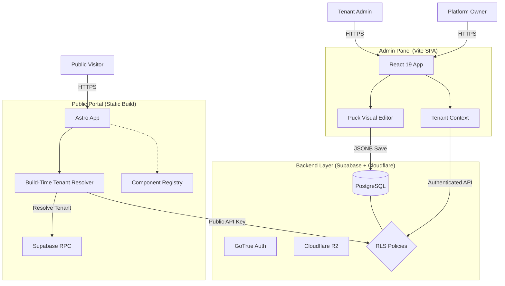

# System Architecture

> **Documentation Authority**: [SYSTEM_MODEL.md](../../SYSTEM_MODEL.md) - Complete architecture, tech stack, and security mandates

## Purpose

Describe the runtime architecture and data flow across the AWCMS Ecosystem.

## Audience

- Developers working across admin/public/mobile/IoT
- Operators configuring deployments

## Prerequisites

- [SYSTEM_MODEL.md](../../SYSTEM_MODEL.md) - **Primary authority** for system architecture
- [AGENTS.md](../../AGENTS.md) - Implementation patterns and Context7 references
- [docs/architecture/standards.md](./standards.md) - Core standards
- [docs/tenancy/overview.md](../tenancy/overview.md) - Multi-tenancy details

## Core Concepts

AWCMS is a multi-client platform with Supabase as the system of record and Cloudflare handling the maintained edge/object-storage runtime:

- Admin Panel: React 19 SPA (Vite)
- Public Portal: Astro static output + React islands (Cloudflare Pages)
- Mobile: Flutter app
- IoT: ESP32 firmware
- Edge/API runtime: Cloudflare Workers (`awcms-edge/`)
- Object storage: Cloudflare R2 with tenant-scoped metadata in Postgres

## How It Works

### Architecture Diagram

### Admin Panel Flow

1. TenantContext resolves tenant via `get_tenant_by_domain`.
2. `setGlobalTenantId()` injects `x-tenant-id` on Supabase requests.
3. UI components enforce ABAC with `usePermissions()`.
4. All writes use soft delete for removal.

### Public Portal Flow

1. Build-time tenant resolution uses `PUBLIC_TENANT_ID` or `VITE_PUBLIC_TENANT_ID` and `getStaticPaths` for tenant routes.
2. Supabase clients are created via `createClientFromEnv(import.meta.env)` (static builds).
3. Pages render with `PuckRenderer` and a registry allow-list.
4. Static builds render published tenant content; middleware-based analytics logging applies only to non-canonical runtime experiments.
5. Consent banner is rendered client-side via `ConsentNotice`.

## Implementation Patterns

- Admin client: `awcms/src/lib/customSupabaseClient.js`
- Public client: `awcms-public/primary/src/lib/supabase.ts`
- Tenant resolution: `awcms/src/contexts/TenantContext.jsx` and `awcms-public/primary/src/lib/publicTenant.ts`

## Security and Compliance Notes

- Tenant isolation is enforced at UI, API, and database layers.
- ABAC checks are mandatory at entry points and on data operations.
- Supabase remains the system of record for Auth, Postgres, RLS, and ABAC, while Cloudflare Workers are the maintained edge runtime and Cloudflare R2 is the maintained object storage layer.

## Operational Concerns

- Admin and public apps are deployed as separate Cloudflare Pages projects.
- Worker deployment is handled from `awcms-edge/` via Wrangler.
- Supabase migrations are authored in `supabase/migrations/` and mirrored into `awcms/supabase/migrations/` for CI parity.

## Troubleshooting

- See `docs/dev/troubleshooting.md`.

## References

- `docs/tenancy/overview.md`
- `docs/tenancy/supabase.md`
- `docs/modules/PUBLIC_PORTAL_ARCHITECTURE.md`
