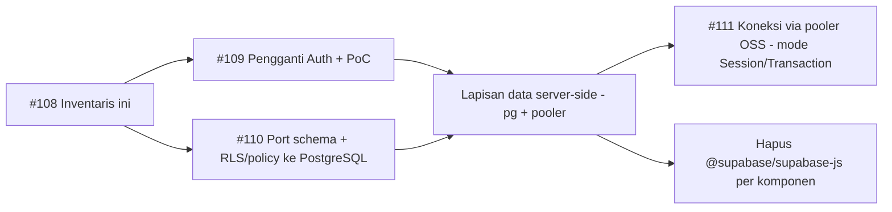

# Inventaris Pemakaian Supabase — AWCMS

**Tujuan:** Memetakan **semua titik** `awcms` yang bergantung pada Supabase (klien `@supabase/supabase-js`, Auth/GoTrue, PostgREST `.from`/`.rpc`, Storage, Realtime), sebagai dasar migrasi keluar Supabase ke **PostgreSQL murni** (ADR-014). Output **#108** dari epic off-Supabase (#103).

> Rujukan: personal-coding `docs/concepts/canvas-arsitektur-...` (ADR-014/022), `docs/architecture/awcms-architecture-references.md` (Supabase = rujukan pola, bukan layanan hosted).

---

## Document Control

| Field | Value |
|---|---|
| Status | Inventaris (audit) |
| Berlaku untuk | `ahliweb/awcms` |
| Tanggal audit | 2026-06-18 |
| Classification | internal |

---

## 0. Ringkasan kuantitatif

| Kategori | Volume (perkiraan) | Sub-issue |
|---|---|---|
| Data — `.from(` (query tabel PostgREST) | ~674 call-site | #110 (schema+RLS) + lapisan akses baru |
| Data — `.rpc(` (Postgres function) | ~48 call-site | #110 |
| Auth (GoTrue) | ~30 call-site (lihat §2) | #109 (pengganti Auth) |
| Realtime — `.channel(` | ~7 call-site | evaluasi (opsional / drop) |
| Storage — `.storage.from(` | ~1 call-site | R2 (sudah ada pola R2) |
| File pemakai klien Supabase | `awcms` 69 · `awcms-edge` 15 · `awcms-public` 9 · `packages` 3 | semua |

> Volume diukur via grep (`.from(`, `.rpc(`, `.auth.*`, dst); angka indikatif untuk perencanaan, bukan hitung pasti.

---

## 1. Per komponen

| Komponen | Peran | Pemakaian Supabase | Target |
|---|---|---|---|
| `awcms/` (admin React+Vite) | admin SPA | terbanyak (~69 file): data `.from`/`.rpc`, auth, beberapa realtime | Akses data via **API edge** (bukan klien DB langsung di browser) + auth sendiri |
| `awcms-edge/` (Workers + Hono) | API edge | klien Supabase di middleware auth + queues + scripts | Ganti ke **pg via pooler** (Session/Transaction) + auth sendiri; akses DB hanya dari edge/backend |
| `awcms-public/` (Astro) | portal publik | `lib/` klien Supabase (read publik) | Baca via API publik / SSG; tanpa klien Supabase |
| `packages/awcms-shared` | util bersama | helper klien Supabase | Ganti helper → kontrak akses data baru |

---

## 2. Auth (GoTrue) — pemetaan ke pengganti (#109)

| Pemakaian Supabase Auth | Jumlah | Pengganti (auth sendiri, JWT/claims) |
|---|---|---|
| `auth.getSession` | ~10 | Verifikasi sesi/JWT sendiri |
| `auth.getUser` | ~7 | Resolusi user dari token |
| `auth.updateUser` | ~4 | Endpoint update profil/credential |
| `auth.signOut` | ~4 | Revoke sesi/token |
| `auth.signInWithPassword` | ~3 | Login password sendiri (sudah ada pola di awcms-mini) |
| `auth.admin` | ~3 | Admin user management |
| `auth.signUp` / `setSession` / `resetPasswordForEmail` / `onAuthStateChange` | masing-masing 1 | Endpoint registrasi/reset + state klien |

> Pola auth PostgreSQL-native (JWT/claims + RBAC/ABAC + RLS) sudah terbukti di `awcms-mini` — jadikan rujukan implementasi (ADR-022 Supabase-pattern).

---

## 3. Data (`.from` / `.rpc`) — strategi (#110)

- **674 `.from(`**: query PostgREST langsung dari klien. Target: **tidak ada akses DB langsung dari browser**. Pindahkan ke:
  - **API edge** (`awcms-edge` Hono) yang mengakses PostgreSQL via **pg + pooler** (ADR-013) dengan **RLS wajib** (ADR-015) dan **CQRS-lite** untuk pencarian (ADR-023).
  - Lapisan akses data server-side (repository + query service), bukan PostgREST.
- **48 `.rpc(`**: fungsi PostgreSQL. Pertahankan fungsi di DB; panggil via lapisan data server-side (bukan klien).
- **RLS/policy**: port policy Supabase (`auth.uid()` dsb) ke RLS PostgreSQL murni dengan konteks sesi (`set_config`), selaras awcms-mini.

---

## 4. Realtime & Storage

- **Realtime (`.channel`, ~7)**: evaluasi kebutuhan nyata. Opsi: WebSocket/SSE sendiri di edge, atau **drop** bila tidak esensial MVP. Tandai per fitur.
- **Storage (`.storage.from`, ~1)**: pindahkan ke **R2** (pola R2 sudah ada di `awcms-edge`).

---

## 5. Urutan migrasi (selaras sub-issue)

1. **#109** — pengganti Supabase Auth (JWT/claims) + PoC; rujuk pola awcms-mini.
2. **#110** — port schema + RLS/policy ke PostgreSQL murni.
3. **Lapisan data** — ganti `.from`/`.rpc` klien → API edge + repository/query service (RLS, CQRS-lite).
4. **#111** — koneksi via pooler OSS (Session untuk admin/service Node; Transaction untuk edge Workers; aturan `prepare:false`).
5. **Hapus `@supabase/supabase-js`** per komponen setelah semua call-site dipindah; bersihkan `supabase/` → `db/`.

---

## 6. Aturan keras

- **Tidak ada akses DB langsung dari browser** setelah migrasi (semua via API edge/backend).
- **RLS wajib** pada semua tabel (ADR-015); port policy Supabase, jangan hilang.
- **PostgreSQL-only**, tanpa SQLite; pola Supabase tetap **dirujuk** (ADR-022), layanannya dilepas (ADR-014).
- Jangan commit secret/koneksi mentah; gunakan env + pooler.

---

## 7. Referensi

- Epic: #103; sub-issue: #109 (Auth), #110 (schema+RLS), #111 (pooler).
- personal-coding: ADR-014 (PostgreSQL murni), ADR-015 (RLS), ADR-013 (pooler), ADR-022 (Supabase = rujukan), ADR-023 (CQRS).
