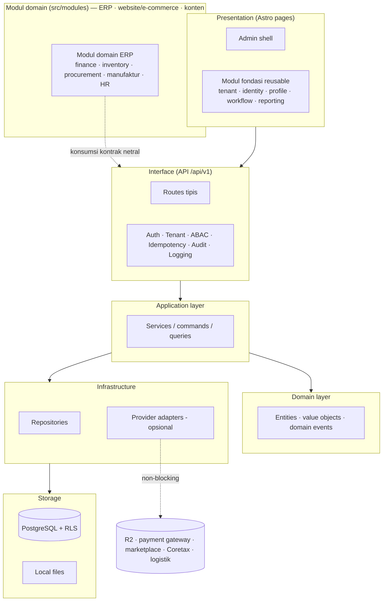
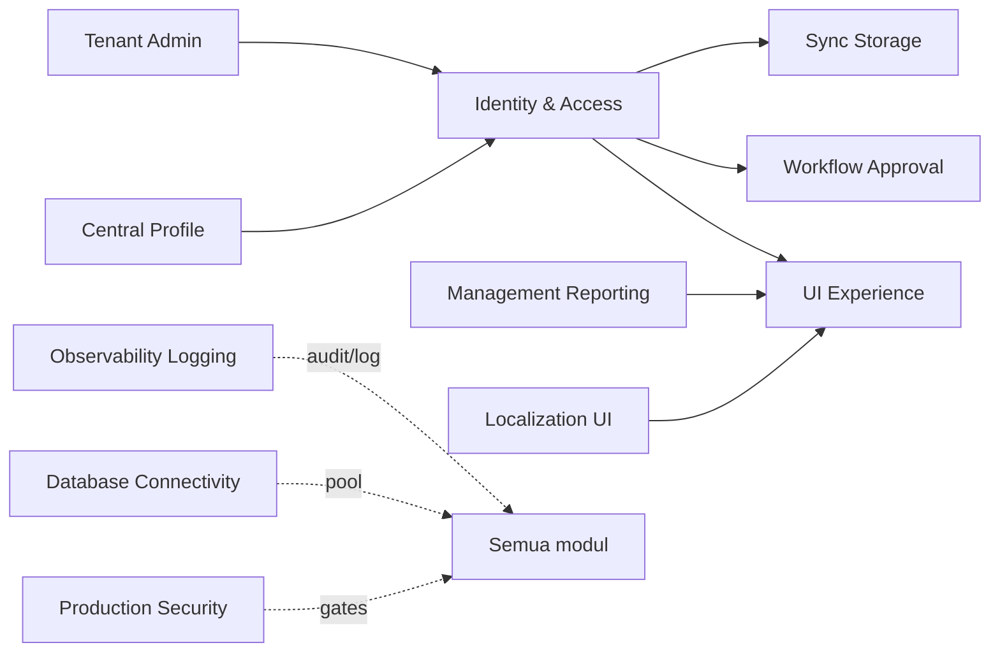

# Bagian 1 — Canvas Induk Tahapan Pengembangan AWCMS

> **Status dokumen:** target/rencana arsitektur; untuk status kode aktual lihat [`docs/ARCHITECTURE.md`](../ARCHITECTURE.md). Dokumen ini menggambarkan **fondasi base + modul domain** template `awcms`, dikembangkan dari basis teknis awcms-mini. `awcms` adalah **template ERP/back-office keluarga AWCMS yang dipakai langsung** ([ADR-0035](../adr/0035-awcms-online-first-erp-saas-superset-repositioning.md), [ADR-0034](../adr/0034-awcms-family-direct-use-templates-and-derived-pathway-removal.md)): modul domain (ERP, website/e-commerce, konten) ditambahkan **langsung di `src/modules/`** template ini — tidak ada repo ekstensi/turunan terpisah.

## Objective

Membangun **AWCMS Modular Monolith** sebagai template **ERP/back-office keluarga AWCMS yang dipakai langsung** — aman, **hybrid online + offline dengan prioritas online-first** (online = jalur utama; offline/LAN = mode ketahanan), multi-tenant (RBAC/ABAC, audit, sync), dan **siap ERP + SaaS terintegrasi** ([ADR-0035](../adr/0035-awcms-online-first-erp-saas-superset-repositioning.md)). `awcms` adalah template **superset** keluarga: ia **menyerap** klaster modul website/e-commerce, UI/UX, dan pengerasan auth dari awcms-micro langsung ke `src/modules/`. Domain ERP & solusi bisnis (keuangan/akuntansi, inventori/gudang, procurement, manufaktur, HR/payroll) dan integrasi bisnis (payment gateway, marketplace, pajak/Coretax, logistik) dibangun **langsung sebagai modul `domain` di `src/modules/`** template ini ([ADR-0034](../adr/0034-awcms-family-direct-use-templates-and-derived-pathway-removal.md)) — bukan di repo terpisah.

## Stack final (rencana)

| Area             | Keputusan                                                                      |
| ---------------- | ------------------------------------------------------------------------------ |
| Runtime          | Bun                                                                            |
| Backend platform | Bun-only; Node.js hanya lewat pengecualian tertulis                            |
| Web              | Astro 7                                                                        |
| Database         | PostgreSQL                                                                     |
| Arsitektur       | Modular monolith, microservice-ready                                           |
| Mode operasi     | Hybrid online + offline, prioritas online-first (offline/LAN = mode ketahanan) |
| Sync             | Optional online sync                                                           |
| Storage          | Local file, optional Cloudflare R2                                             |
| Security         | RBAC + ABAC + PostgreSQL RLS + Audit Log                                       |
| API docs         | OpenAPI                                                                        |
| Event docs       | AsyncAPI                                                                       |

## Arsitektur logis (rencana)



## Ketergantungan antar modul (base)



> Modul domain (ERP: finance/GL, inventory/warehouse, procurement, manufaktur, HR/payroll, integrasi payment gateway/marketplace/pajak/logistik; website/e-commerce; konten) kini **hidup langsung di `src/modules/` template ini** sebagai modul bertipe `domain` ([ADR-0034](../adr/0034-awcms-family-direct-use-templates-and-derived-pathway-removal.md)/[ADR-0035](../adr/0035-awcms-online-first-erp-saas-superset-repositioning.md)), bukan di repo ekstensi terpisah.

> Desain teknis implementasi base mengikuti pola dokumen lanjutan setara: UI/UX, frontend & integrasi (hybrid online-first), backend data access & database, seed/RBAC/ABAC, konfigurasi/environment. Modul domain yang ditambahkan langsung di `src/modules/` mengikuti pola dokumen yang sama di dalam template ini.

## Prinsip desain

1. Sistem harus bisa berjalan lokal tanpa internet.
2. Internet hanya dibutuhkan untuk sync, R2, atau integrasi eksternal opsional (payment gateway, marketplace, Coretax, logistik).
3. Modul (base maupun domain) tidak boleh bergantung pada provider eksternal untuk operasi intinya.
4. Semua transaksi/dokumen yang sudah posted (jurnal, faktur, dokumen gudang, dsb.) harus immutable.
5. Mutation high-risk wajib idempotent.
6. Database harus tenant-aware.
7. Perubahan data append-only (stok, jurnal, movement) harus tercatat sebagai movement/event, bukan overwrite.
8. Semua akses sensitif harus melewati ABAC dan audit.
9. Resource master/config/draft yang bisa dihapus memakai soft delete; dokumen posted tetap immutable.
10. Dokumen, kode, migration, OpenAPI, AsyncAPI, dan SOP harus konsisten.

## Modul utama (base, reusable)

| Modul                 | Fungsi                                             |
| --------------------- | -------------------------------------------------- |
| Tenant Admin          | Tenant, office, setup wizard                       |
| Identity & Access     | Login, tenant user, RBAC, ABAC, decision log       |
| Central Profile       | Profil user/customer/supplier/contact terpusat     |
| Sync Storage          | Sync node, outbox/inbox, conflict, R2 object queue |
| Localization UI       | i18n, locale, theme                                |
| UI Experience         | Admin shell, navigation registry, theme, i18n      |
| Observability Logging | Log, audit, security event, troubleshooting        |
| Database Connectivity | Pooling, queue, PgBouncer profile, health          |
| Workflow Approval     | Approval high-risk action                          |
| Management Reporting  | Dashboard dan laporan generik                      |
| Production Security   | Readiness, finding, go-live gates                  |

Modul domain (ERP: finance/GL, inventory/warehouse, procurement, manufaktur, HR/payroll, integrasi payment gateway/marketplace/pajak-Coretax/logistik; website/e-commerce; konten) **ditambahkan langsung di `src/modules/` template ini** sebagai modul bertipe `domain` ([ADR-0034](../adr/0034-awcms-family-direct-use-templates-and-derived-pathway-removal.md)/[ADR-0035](../adr/0035-awcms-online-first-erp-saas-superset-repositioning.md)), disusun lewat registry modul base — tidak ada repo ekstensi/turunan terpisah. `awcms` adalah template **superset** yang menyerap klaster website/e-commerce awcms-micro; `awcms-mini` tetap fondasi **hybrid offline-first** (SaaS-ready) dan `awcms-micro` tetap template website **full-online**.

## Fase pengembangan (base, rencana)


### Fase 0 — Foundation

- Repository skeleton.
- Module contract.
- SQL migration runner.
- OpenAPI/AsyncAPI baseline.
- Docker Compose PostgreSQL.
- Health endpoint.

### Fase 1 — Tenant, Identity, Profile

- Tenant dan office.
- Setup wizard.
- Owner/admin login.
- Central profile.
- Profile resolver.
- RBAC dan ABAC.

### Fase 2 — Reliability dan Operasional

- Structured logging.
- Audit trail.
- Database pooling.
- Backpressure.
- Backup/restore SOP.

### Fase 3 — Sync Storage

- Offline sync outbox/inbox.
- Conflict resolution.
- R2 object queue.

### Fase 4 — UI/UX dan Reporting

- Admin shell.
- Navigation registry.
- Management reporting views generik.

### Fase 5 — Workflow, Security, Deployment

- Workflow approval.
- Security readiness.
- Go-live gates.
- Deployment profile.
- Handover.

Setelah fondasi base matang, modul domain (ERP: finance, inventory, procurement, manufaktur, HR/payroll; website/e-commerce; konten) dan modul integrasi bisnis ditambahkan **langsung di `src/modules/` template ini** sebagai modul bertipe `domain` ([ADR-0034](../adr/0034-awcms-family-direct-use-templates-and-derived-pathway-removal.md)/[ADR-0035](../adr/0035-awcms-online-first-erp-saas-superset-repositioning.md)) — masing-masing dengan fase pengembangannya sendiri, mengikuti pola modul base.

## Base-ready boundary (target)

AWCMS base akan dianggap siap dipakai (untuk mulai menambah modul domain ERP langsung di `src/modules/`) jika:

- Tenant setup berhasil.
- Owner/admin login.
- Role dasar dan ABAC default deny berjalan.
- Central profile resolver bekerja.
- Audit log high-risk tersedia.
- Master data yang dihapus tidak hilang fisik dan dapat dipulihkan oleh role berizin.
- Backup/restore diuji.

## Production-ready boundary (target)

Production-ready jika:

- Base ready selesai.
- RLS tested.
- ABAC tested.
- Audit high-risk aktif.
- Soft delete, restore, dan purge policy diuji untuk resource yang deletable.
- No critical security finding.
- Backup restore pass.
- Pool health OK.
- Concurrency/load test dasar OK (mutation high-risk idempotent di bawah beban paralel).
- SOP dan handover selesai.

## Next action

Mulai implementasi dari:

```text
Issue 0.1 — Initialize AWCMS Modular Monolith Repository Structure
```
