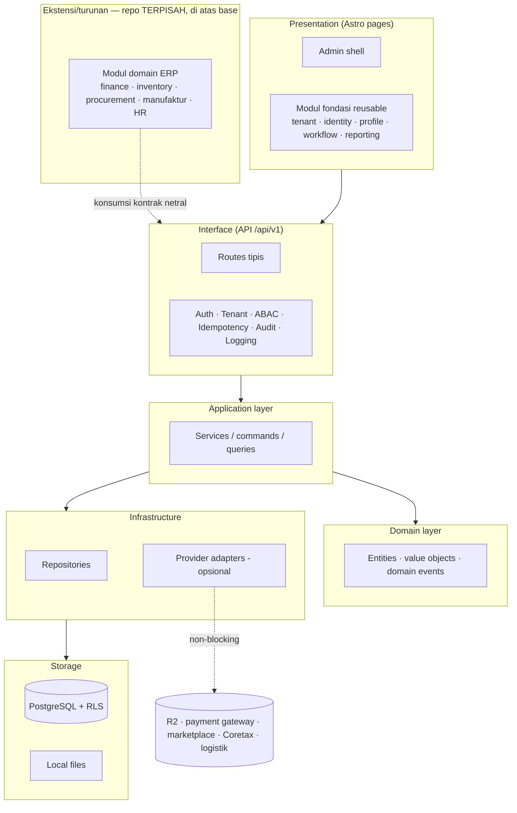
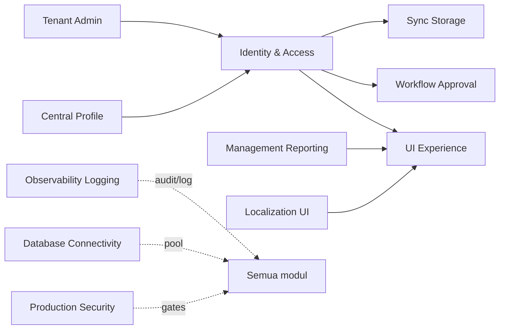

# Bagian 1 — Canvas Induk Tahapan Pengembangan AWCMS

> **Status dokumen:** target/rencana arsitektur, bukan status implementasi. Dokumen ini menggambarkan **fondasi base** (modul reusable + kontrak kesiapan ERP) yang direncanakan/dibangun di repo ini, diadaptasi dari standar base modular monolith yang sudah terbukti (lihat riwayat migrasi ADR-013..023). **Modul domain ERP tidak diimplementasikan di repo ini** — ia dibangun di repo ekstensi/turunan terpisah di atas base ini ([ADR-0022](../adr/0022-erp-modules-live-in-extension-repos.md)); yang direncanakan di sini adalah fondasi dan kontrak yang dikonsumsi ekstensi itu.

## Objective

Membangun **AWCMS Modular Monolith** sebagai **basis/fondasi** yang aman, offline-first, dan multi-tenant (RBAC/ABAC, audit, sync) tempat aplikasi **ERP & solusi bisnis dibangun di atasnya** — di repo ekstensi/turunan terpisah, bukan di dalam base ini ([ADR-0013](../adr/0013-extension-layers-and-boundary-model.md), [ADR-0022](../adr/0022-erp-modules-live-in-extension-repos.md)). AWCMS **bukan sebuah ERP** dan bukan sekadar CMS: ia menyediakan modul fondasi reusable + **kontrak netral** kesiapan ERP (business transaction, posting, period-lock, item/UoM, inventory movement, reporting projection — [ADR-0020](../adr/0020-erp-extension-readiness-contracts.md)). Domain ERP sesungguhnya (keuangan/akuntansi, inventori/gudang, procurement, manufaktur, HR/payroll) dan integrasi bisnis (payment gateway, marketplace, pajak/Coretax, logistik) diimplementasikan oleh ekstensi di repo terpisah yang mengonsumsi kontrak itu.

## Stack final (rencana)

| Area             | Keputusan                                           |
| ---------------- | --------------------------------------------------- |
| Runtime          | Bun                                                 |
| Backend platform | Bun-only; Node.js hanya lewat pengecualian tertulis |
| Web              | Astro 7                                             |
| Database         | PostgreSQL                                          |
| Arsitektur       | Modular monolith, microservice-ready                |
| Mode operasi     | Offline-first / LAN-first                           |
| Sync             | Optional online sync                                |
| Storage          | Local file, optional Cloudflare R2                  |
| Security         | RBAC + ABAC + PostgreSQL RLS + Audit Log            |
| API docs         | OpenAPI                                             |
| Event docs       | AsyncAPI                                            |

## Arsitektur logis (rencana)



## Ketergantungan antar modul (base)



> Modul domain ERP (finance/GL, inventory/warehouse, procurement, manufaktur, HR/payroll, integrasi payment gateway/marketplace/pajak/logistik) **tidak digambar sebagai node base** — ia hidup di repo ekstensi terpisah dan bergantung pada base ini hanya lewat kontrak netral (port/event berversi), bukan sebagai modul internal `src/modules/`.

> Desain teknis implementasi base mengikuti pola dokumen lanjutan setara: UI/UX, frontend & integrasi/offline-first, backend data access & database, seed/RBAC/ABAC, konfigurasi/environment. Aplikasi turunan menambah dokumen setara miliknya sendiri di repo-nya (pola: [`docs/awcms/derived-application-guide.md`](derived-application-guide.md)).

## Prinsip desain

1. Sistem harus bisa berjalan lokal tanpa internet.
2. Internet hanya dibutuhkan untuk sync, R2, atau integrasi eksternal opsional (payment gateway, marketplace, Coretax, logistik).
3. Modul (base maupun ekstensi turunan) tidak boleh bergantung pada provider eksternal untuk operasi intinya.
4. Semua transaksi/dokumen yang sudah posted (jurnal, faktur, dokumen gudang, dsb.) harus immutable.
5. Mutation high-risk wajib idempotent.
6. Database harus tenant-aware.
7. Perubahan data append-only (stok, jurnal, movement) harus tercatat sebagai movement/event, bukan overwrite.
8. Semua akses sensitif harus melewati ABAC dan audit.
9. Resource master/config/draft yang bisa dihapus memakai soft delete; dokumen posted tetap immutable.
10. Dokumen, kode, migration, OpenAPI, AsyncAPI, dan SOP harus konsisten.

## Modul utama (base, reusable)

| Modul                 | Fungsi                                             |
| --------------------- | -------------------------------------------------- |
| Tenant Admin          | Tenant, office, setup wizard                       |
| Identity & Access     | Login, tenant user, RBAC, ABAC, decision log       |
| Central Profile       | Profil user/customer/supplier/contact terpusat     |
| Sync Storage          | Sync node, outbox/inbox, conflict, R2 object queue |
| Localization UI       | i18n, locale, theme                                |
| UI Experience         | Admin shell, navigation registry, theme, i18n      |
| Observability Logging | Log, audit, security event, troubleshooting        |
| Database Connectivity | Pooling, queue, PgBouncer profile, health          |
| Workflow Approval     | Approval high-risk action                          |
| Management Reporting  | Dashboard dan laporan generik                      |
| Production Security   | Readiness, finding, go-live gates                  |

Modul domain ERP (finance/GL, inventory/warehouse, procurement, manufaktur, HR/payroll, integrasi payment gateway/marketplace/pajak-Coretax/logistik) **bukan bagian base ini dan tidak dibangun di `src/modules/` repo ini** — ia dikembangkan di **repo ekstensi/turunan terpisah** (lapisan _ERP Extension_/_Derived Application_, [ADR-0013](../adr/0013-extension-layers-and-boundary-model.md)/[ADR-0022](../adr/0022-erp-modules-live-in-extension-repos.md)), disusun lewat komposisi modul build-time ([ADR-0014](../adr/0014-deterministic-build-time-module-composition.md)) dan mengonsumsi kontrak netral kesiapan ERP base ([ADR-0020](../adr/0020-erp-extension-readiness-contracts.md)). Base ini sendiri **bukan ERP** — tidak ada GL, jurnal, AR/AP, valuasi inventori, payroll, atau perhitungan pajak di sini.

## Fase pengembangan (base, rencana)


### Fase 0 — Foundation

- Repository skeleton.
- Module contract.
- SQL migration runner.
- OpenAPI/AsyncAPI baseline.
- Docker Compose PostgreSQL.
- Health endpoint.

### Fase 1 — Tenant, Identity, Profile

- Tenant dan office.
- Setup wizard.
- Owner/admin login.
- Central profile.
- Profile resolver.
- RBAC dan ABAC.

### Fase 2 — Reliability dan Operasional

- Structured logging.
- Audit trail.
- Database pooling.
- Backpressure.
- Backup/restore SOP.

### Fase 3 — Sync Storage

- Offline sync outbox/inbox.
- Conflict resolution.
- R2 object queue.

### Fase 4 — UI/UX dan Reporting

- Admin shell.
- Navigation registry.
- Management reporting views generik.

### Fase 5 — Workflow, Security, Deployment

- Workflow approval.
- Security readiness.
- Go-live gates.
- Deployment profile.
- Handover.

Setelah Fase 0–5 (base) selesai, modul ERP domain (finance, inventory, procurement, manufaktur, HR/payroll) dan modul integrasi bisnis dibangun **di repo ekstensi/turunan terpisah di atas base ini** — masing-masing dengan fase pengembangannya sendiri, mengikuti [`docs/awcms/derived-application-guide.md`](derived-application-guide.md). Base ini tidak menambah modul ERP ke `src/modules/`-nya sendiri.

## Base-ready boundary (target)

AWCMS base akan dianggap siap dipakai (untuk mulai membangun ekstensi/aplikasi turunan ERP di atasnya) jika:

- Tenant setup berhasil.
- Owner/admin login.
- Role dasar dan ABAC default deny berjalan.
- Central profile resolver bekerja.
- Audit log high-risk tersedia.
- Master data yang dihapus tidak hilang fisik dan dapat dipulihkan oleh role berizin.
- Backup/restore diuji.

## Production-ready boundary (target)

Production-ready jika:

- Base ready selesai.
- RLS tested.
- ABAC tested.
- Audit high-risk aktif.
- Soft delete, restore, dan purge policy diuji untuk resource yang deletable.
- No critical security finding.
- Backup restore pass.
- Pool health OK.
- Concurrency/load test dasar OK (mutation high-risk idempotent di bawah beban paralel).
- SOP dan handover selesai.

## Next action

Mulai implementasi dari:

```text
Issue 0.1 — Initialize AWCMS Modular Monolith Repository Structure
```
