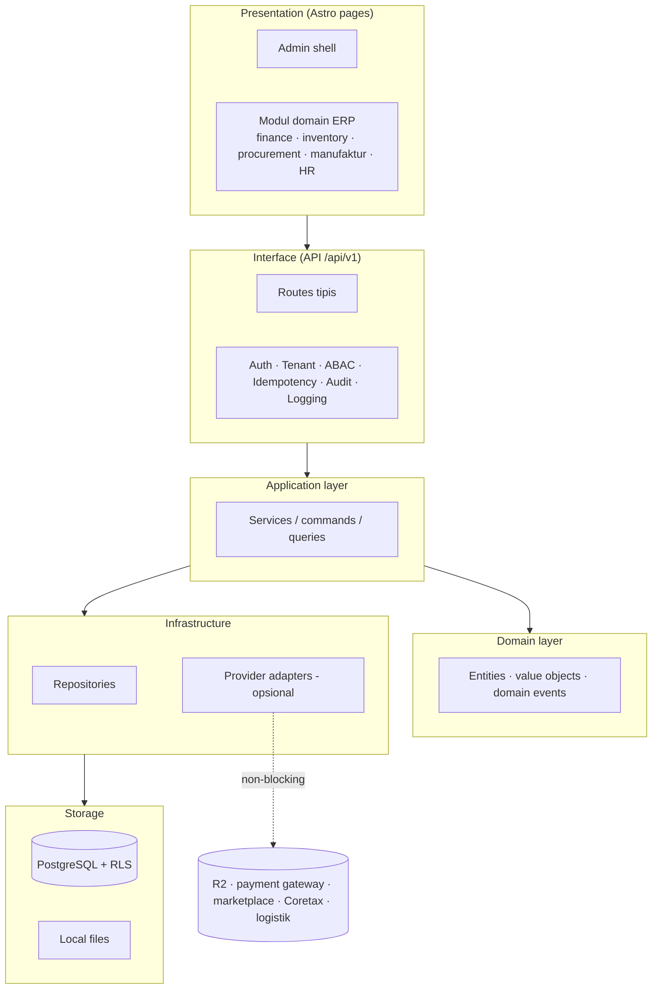
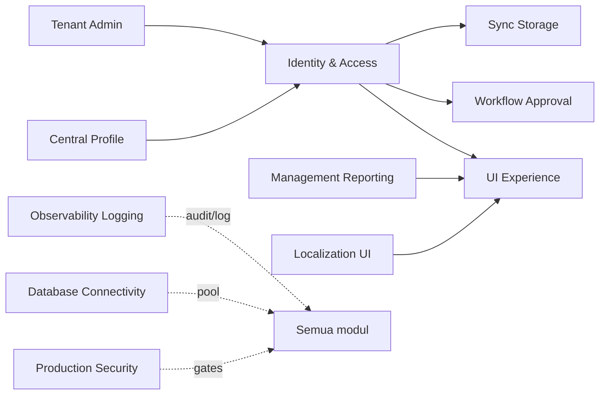
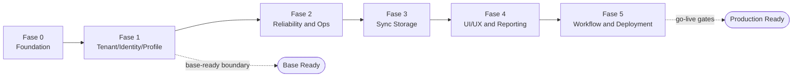

# Bagian 1 — Canvas Induk Tahapan Pengembangan AWCMS

> **Status dokumen:** target/rencana arsitektur, bukan status implementasi. Repo `awcms` saat ini baru berisi keputusan rebuild (`docs/adr/0001-rebuild-on-awcms-foundation-erp-scope.md`), `AGENTS.md`, dan dokumen governance — **belum ada kode modul ERP yang diimplementasikan**. Dokumen ini menggambarkan fondasi teknis dan modul yang **direncanakan dibangun**, diadaptasi dari standar base modular monolith yang sudah terbukti (lihat riwayat migrasi ADR-013..023).

## Objective

Membangun **AWCMS Modular Monolith Platform ERP** sebagai fondasi yang aman, offline-first, dan siap dikembangkan bertahap untuk menjadi basis platform ERP (multi-tenant, RBAC/ABAC, audit, sync) sekaligus mengakomodasi modul bisnis yang lebih luas: keuangan/akuntansi, inventori/gudang, procurement, manufaktur, HR/payroll, serta integrasi dengan payment gateway, marketplace, sistem pajak/Coretax, dan logistik. AWCMS bukan sekadar CMS — cakupan bisnisnya adalah **platform ERP dan integrasi solusi bisnis**.

## Stack final (rencana)

| Area             | Keputusan                                           |
| ---------------- | --------------------------------------------------- |
| Runtime          | Bun                                                 |
| Backend platform | Bun-only; Node.js hanya lewat pengecualian tertulis |
| Web              | Astro 7                                             |
| Database         | PostgreSQL                                          |
| Arsitektur       | Modular monolith, microservice-ready                |
| Mode operasi     | Offline-first / LAN-first                           |
| Sync             | Optional online sync                                |
| Storage          | Local file, optional Cloudflare R2                  |
| Security         | RBAC + ABAC + PostgreSQL RLS + Audit Log            |
| API docs         | OpenAPI                                             |
| Event docs       | AsyncAPI                                            |

## Arsitektur logis (rencana)



## Ketergantungan antar modul (base)



> Modul domain ERP (finance/GL, inventory/warehouse, procurement, manufaktur, HR/payroll, integrasi payment gateway/marketplace/pajak/logistik) menambah node-nya sendiri di diagram ketergantungan modul-modul tersebut — belum digambar di sini karena belum diimplementasikan; mengikuti fondasi base yang sama.

> Desain teknis implementasi mengikuti pola dokumen lanjutan setara: UI/UX, frontend & integrasi/offline-first, backend data access & database, seed/RBAC/ABAC, konfigurasi/environment — akan ditambahkan di repo ini seiring modul ERP dibangun.

## Prinsip desain

1. Sistem harus bisa berjalan lokal tanpa internet.
2. Internet hanya dibutuhkan untuk sync, R2, atau integrasi eksternal opsional (payment gateway, marketplace, Coretax, logistik).
3. Modul ERP tidak boleh bergantung pada provider eksternal untuk operasi intinya.
4. Semua transaksi/dokumen yang sudah posted (jurnal, faktur, dokumen gudang, dsb.) harus immutable.
5. Mutation high-risk wajib idempotent.
6. Database harus tenant-aware.
7. Perubahan data append-only (stok, jurnal, movement) harus tercatat sebagai movement/event, bukan overwrite.
8. Semua akses sensitif harus melewati ABAC dan audit.
9. Resource master/config/draft yang bisa dihapus memakai soft delete; dokumen posted tetap immutable.
10. Dokumen, kode, migration, OpenAPI, AsyncAPI, dan SOP harus konsisten.

## Modul utama (base, reusable)

| Modul                 | Fungsi                                             |
| --------------------- | -------------------------------------------------- |
| Tenant Admin          | Tenant, office, setup wizard                       |
| Identity & Access     | Login, tenant user, RBAC, ABAC, decision log       |
| Central Profile       | Profil user/customer/supplier/contact terpusat     |
| Sync Storage          | Sync node, outbox/inbox, conflict, R2 object queue |
| Localization UI       | i18n, locale, theme                                |
| UI Experience         | Admin shell, navigation registry, theme, i18n      |
| Observability Logging | Log, audit, security event, troubleshooting        |
| Database Connectivity | Pooling, queue, PgBouncer profile, health          |
| Workflow Approval     | Approval high-risk action                          |
| Management Reporting  | Dashboard dan laporan generik                      |
| Production Security   | Readiness, finding, go-live gates                  |

Modul domain ERP (finance/GL, inventory/warehouse, procurement, manufaktur, HR/payroll, integrasi payment gateway/marketplace/pajak-Coretax/logistik) **bukan bagian base ini** — direncanakan ditambahkan sebagai modul di `src/modules/` di atas base yang sama, mengikuti kontrak modular monolith (module.ts + domain/application/infrastructure/api).

## Fase pengembangan (base, rencana)



### Fase 0 — Foundation

- Repository skeleton.
- Module contract.
- SQL migration runner.
- OpenAPI/AsyncAPI baseline.
- Docker Compose PostgreSQL.
- Health endpoint.

### Fase 1 — Tenant, Identity, Profile

- Tenant dan office.
- Setup wizard.
- Owner/admin login.
- Central profile.
- Profile resolver.
- RBAC dan ABAC.

### Fase 2 — Reliability dan Operasional

- Structured logging.
- Audit trail.
- Database pooling.
- Backpressure.
- Backup/restore SOP.

### Fase 3 — Sync Storage

- Offline sync outbox/inbox.
- Conflict resolution.
- R2 object queue.

### Fase 4 — UI/UX dan Reporting

- Admin shell.
- Navigation registry.
- Management reporting views generik.

### Fase 5 — Workflow, Security, Deployment

- Workflow approval.
- Security readiness.
- Go-live gates.
- Deployment profile.
- Handover.

Setelah Fase 0–5 (base) selesai, modul ERP domain (finance, inventory, procurement, manufaktur, HR/payroll) dan modul integrasi bisnis eksternal direncanakan dibangun bertahap di atas base ini, masing-masing sebagai modul terpisah dengan fase pengembangannya sendiri.

## Base-ready boundary (target)

AWCMS base akan dianggap siap dipakai (untuk mulai membangun modul ERP) jika:

- Tenant setup berhasil.
- Owner/admin login.
- Role dasar dan ABAC default deny berjalan.
- Central profile resolver bekerja.
- Audit log high-risk tersedia.
- Master data yang dihapus tidak hilang fisik dan dapat dipulihkan oleh role berizin.
- Backup/restore diuji.

## Production-ready boundary (target)

Production-ready jika:

- Base ready selesai.
- RLS tested.
- ABAC tested.
- Audit high-risk aktif.
- Soft delete, restore, dan purge policy diuji untuk resource yang deletable.
- No critical security finding.
- Backup restore pass.
- Pool health OK.
- Concurrency/load test dasar OK (mutation high-risk idempotent di bawah beban paralel).
- SOP dan handover selesai.

## Next action

Mulai implementasi dari:

```text
Issue 0.1 — Initialize AWCMS Modular Monolith Repository Structure
```
