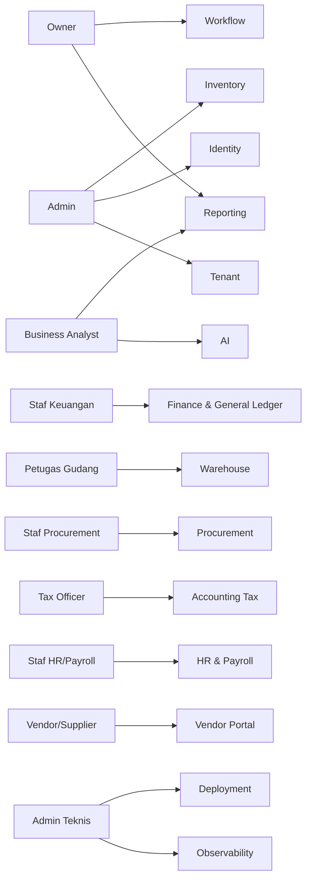
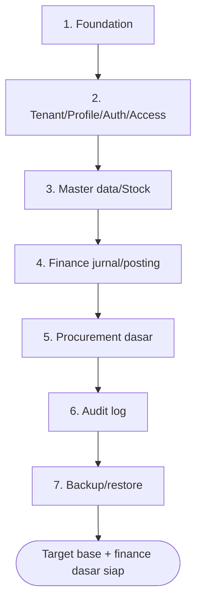

# Bagian 2 — PRD Detail Per Modul

> **Status dokumen:** target/rencana produk, bukan status implementasi. Belum ada modul ERP yang diimplementasikan di repo ini — dokumen ini menjabarkan kebutuhan produk yang **akan** dibangun bertahap di atas base modular monolith (lihat `01_canvas_induk.md`).

> **Contoh domain (ilustratif).** Dokumen ini memakai domain ERP (keuangan/akuntansi, inventori/gudang, procurement, manufaktur, HR/payroll) sebagai contoh berjalan. **Pola & standar**-nya reusable untuk base AWCMS; **entitas, endpoint, layar, dan istilah domain** (produk, gudang, pajak, procurement, payroll, dsb.) adalah ilustrasi awal yang akan disempurnakan seiring modul dibangun. Lihat [README paket dokumen](README.md) §Reusable vs domain ERP.

## Tujuan PRD

Dokumen ini menjelaskan kebutuhan produk AWCMS dari sisi bisnis, pengguna, fitur, prioritas, dan acceptance criteria per modul.

## Peta persona ke modul

## Persona utama

| Persona          | Kebutuhan                                                        |
| ---------------- | ------------------------------------------------------------------ |
| Owner            | Monitoring kinerja bisnis, kas, stok, approval, laporan, risiko    |
| Admin            | Setup tenant, user, master data, konfigurasi                       |
| Staf Keuangan    | Jurnal, AP/AR, rekonsiliasi, laporan keuangan                      |
| Petugas Gudang   | Transfer, receiving, cycle count, stok bin/lot                    |
| Staf Procurement | Purchase request, purchase order, penerimaan barang, vendor        |
| Tax Officer      | Tax profile, faktur pajak, Coretax batch export                   |
| Staf HR/Payroll  | Data karyawan, absensi, komponen gaji, payroll run                 |
| Business Analyst | Laporan agregat dan AI insight aman                                |
| Vendor/Supplier  | Melihat status PO, invoice, pembayaran                             |
| Admin Teknis     | Deployment, backup, restore, troubleshooting                       |

## Modul 1 — Tenant Admin

### Problem

AWCMS harus mendukung tenant, entitas bisnis, cabang, office, gudang, dan lokasi fisik.

### Scope

- Tenant master.
- Office/cabang/gudang/pabrik.
- Physical location.
- Setup wizard awal.
- Setup lock.

### Acceptance criteria

- Tenant pertama dapat dibuat.
- Owner pertama dapat dibuat.
- Office pertama dapat dibuat.
- Setup tidak dapat dijalankan ulang setelah locked.
- Tenant inactive tidak dapat melakukan transaksi.
- Office/lokasi yang tidak dipakai dapat diarsipkan via soft delete tanpa menghapus riwayat transaksi.

## Modul 2 — Identity & Access

### Problem

Setiap user harus memiliki login dan hak akses sesuai tugas.

### Scope

- Identity login.
- Tenant user membership.
- Role.
- Permission.
- ABAC policy.
- Access decision log.

### Acceptance criteria

- Owner/admin/operator dapat login.
- ABAC default deny.
- Deny overrides allow.
- Staf gudang tidak bisa akses data payroll/pajak sensitif.
- Access denied tercatat.

## Modul 3 — Central Profile

### Problem

Data user, karyawan, customer, supplier/vendor, dan tax party tidak boleh terduplikasi.

### Scope

- Profile person/organization.
- Identifier email, phone, WhatsApp, NPWP, NIK.
- Masked value.
- Entity link.
- Dedup/merge request.

### Acceptance criteria

- Vendor/supplier bisa di-resolve dari email/NPWP.
- Identifier duplicate tidak membuat profile baru.
- Profile bisa di-link ke user/karyawan/vendor/tax.
- Merge high-risk membutuhkan approval.
- Profile/contact yang tidak aktif dapat diarsipkan; identifier sensitif tetap masked dan tidak dihapus fisik sebelum retention.

## Modul 4 — Master Data & Inventory

### Problem

Modul ERP (procurement, manufaktur, gudang) membutuhkan master item/produk, satuan, harga, stok, dan movement yang konsisten.

### Scope

- Category.
- Brand/vendor.
- Unit.
- Item/produk (bahan baku, barang jadi, jasa).
- Item price/cost.
- Stock balance.
- Stock movement.

### Acceptance criteria

- Item bisa dibuat.
- Kode item unik per tenant.
- Barcode unik jika diisi.
- Item inactive tidak bisa dipakai transaksi baru.
- Movement stok append-only.
- Item/kategori/brand/unit dapat diarsipkan via soft delete jika tidak sedang dipakai transaksi aktif.

## Modul 5 — Finance & General Ledger

### Problem

Bisnis membutuhkan pencatatan jurnal, AP/AR, dan penutupan periode yang akurat dan tidak dobel.

### Scope

- Chart of account.
- Jurnal umum dan jurnal otomatis dari modul lain.
- Account payable (AP) dan account receivable (AR).
- Posting jurnal.
- Idempotency.
- Period closing.
- Financial document (invoice, payment voucher).

### Acceptance criteria

- Staf keuangan bisa membuat jurnal manual.
- Total debit/kredit divalidasi server-side (balance check).
- Posting mengunci periode sesuai kebijakan.
- Double submit tidak membuat jurnal ganda.
- Saldo tidak seimbang menghasilkan error validasi.
- Jurnal posted immutable.
- Draft jurnal dapat dibatalkan/diarsipkan; jurnal posted tidak boleh di-soft-delete, koreksi lewat jurnal balik (reversing entry).

## Modul 6 — Shared Stock Routing (Multi-entitas)

### Problem

Beberapa tenant/entitas bisnis bisa berbagi stok di lokasi fisik yang sama (mis. grup usaha dengan gudang bersama), dengan transaksi diarahkan ke entitas tertentu.

### Scope

- Stock pool.
- Stock pool member.
- Item mapping antar entitas.
- Routing rule.
- Routing decision.
- Settlement guardrail.

### Acceptance criteria

- Stock pool memiliki member tenant/entitas.
- Routing rule memilih entitas berdasarkan kondisi.
- Legal basis dicatat.
- Routing decision diaudit.
- Rule lama diarsipkan via soft delete agar histori routing tetap dapat diaudit.

## Modul 7 — Warehouse Management

### Problem

Multi gudang (termasuk gudang bahan baku dan barang jadi manufaktur) memerlukan warehouse, zone, bin, lot, serial, transfer, in-transit, dan cycle count.

### Scope

- Warehouse.
- Zone.
- Bin.
- Bin balance.
- Lot/batch/expired.
- Serial.
- Transfer order.
- Shipment/receipt.
- Cycle count.
- Stock adjustment request.

### Acceptance criteria

- Warehouse dibuat dari office.
- Bin code unik per warehouse.
- Transfer antar gudang dapat shipped/received.
- Partial receipt didukung.
- Damaged/expired masuk quarantine.
- Cycle count menghasilkan variance dan adjustment request.
- Zone/bin master dapat diarsipkan via soft delete jika tidak memiliki stok aktif; movement tetap append-only.

## Modul 8 — Accounting Tax/Coretax

### Problem

AWCMS perlu siap pajak Indonesia dan Coretax tanpa mengasumsikan upload API resmi.

### Scope

- Tax profile.
- NITKU/ID TKU.
- Party tax profile (vendor, customer, karyawan untuk PPh).
- Product/item tax profile.
- VAT invoice staging.
- Coretax batch XML-ready.
- Checksum dan approval.

### Acceptance criteria

- NPWP/NIK/NITKU dimasking.
- VAT invoice dapat digenerate dari transaksi penjualan/pembelian posted.
- Missing tax data terdeteksi.
- Coretax batch membutuhkan approval jika policy aktif.
- Tax profile lama diarsipkan via soft delete; faktur dan batch exported tetap immutable.

## Modul 9 — Procurement & Vendor Management

### Problem

Bisnis membutuhkan alur pengadaan barang/jasa yang terstruktur, dari permintaan hingga penerimaan dan pembayaran ke vendor.

### Scope

- Purchase request.
- Purchase order.
- Vendor/supplier master.
- Penerimaan barang (goods receipt).
- Vendor invoice matching.
- Notifikasi status PO (email/WhatsApp) ke vendor.
- Vendor portal.

### Acceptance criteria

- Purchase request dapat diajukan dan disetujui via workflow.
- Purchase order dibuat dari purchase request yang disetujui.
- Goods receipt tidak boleh melebihi quantity PO tanpa approval.
- Vendor invoice dicocokkan (three-way match: PO, receipt, invoice).
- Vendor hanya melihat PO/invoice miliknya di portal.
- Vendor/PR/PO draft dapat dibatalkan/diarsipkan; PO yang sudah diterima sebagian tidak boleh di-soft-delete.

## Modul 10 — Sync Storage

### Problem

Node offline (cabang/pabrik/gudang) perlu sinkron ke server pusat saat online.

### Scope

- Sync node.
- Outbox/inbox.
- Push/pull.
- HMAC signature.
- Checkpoint.
- Conflict.
- Object queue/R2.

### Acceptance criteria

- Push/pull signed.
- Duplicate batch tidak dobel.
- Conflict immutable tercatat.
- File checksum diverifikasi.

## Modul 11 — AI Business Analyst

### Problem

Owner membutuhkan insight bisnis cepat (kas, stok, procurement, payroll cost) tanpa membuka data mentah sensitif.

### Scope

- Safe aggregate views.
- Read-only tools.
- Tool policy.
- Tool call audit.
- Adapter penyedia AI eksternal opsional.

### Acceptance criteria

- AI tidak bisa raw SQL.
- AI tidak bisa mutation.
- AI tidak expose PII/data payroll mentah.
- Semua tool call diaudit.

## Modul 12 — UI Experience

### Scope

- Admin shell.
- Layar operasional per modul (finance, gudang, procurement) fullscreen/keyboard-first.
- Vendor/employee self-service portal.
- Theme light/dark/system.
- Locale ID/EN awal.
- Navigation role-aware.

### Acceptance criteria

- Admin melihat dashboard.
- Staf operasional bisa bekerja keyboard-first untuk transaksi volume tinggi.
- Vendor/employee portal mobile-friendly.
- UI punya loading/empty/error state.

## Modul 13 — Observability, Pooling, Workflow, Security

### Scope

- Structured log.
- Audit log.
- DB pool.
- Backpressure.
- Workflow approval.
- Production security readiness.
- Go-live gates.

### Acceptance criteria

- Correlation ID tersedia.
- Secret diredaksi.
- Pool health dapat dicek.
- High-risk action approval.
- Critical security finding memblokir go-live.

## Modul ERP lanjutan (rencana, belum dirinci penuh)

Modul berikut termasuk cakupan bisnis AWCMS tetapi belum dirinci per-PRD pada revisi dokumen ini; akan ditambahkan sebagai bagian terpisah saat prioritas roadmap sampai ke sana:

- **Manufacturing** — bill of material, work order, production tracking, konsumsi bahan baku.
- **HR & Payroll** — data karyawan, absensi, komponen gaji, payroll run, slip gaji.
- **Integrasi eksternal** — payment gateway, marketplace, logistik/pengiriman.

## Target prioritas awal (roadmap, bukan MVP terimplementasi)

1. Foundation.
2. Tenant/profile/auth/access.
3. Master data/stock.
4. Finance jurnal/posting.
5. Procurement dasar.
6. Audit log.
7. Backup/restore.

## Out of scope tahap awal

- Payment gateway.
- Native mobile app.
- Advanced BI.
- Upload langsung Coretax.
- AI mutation.
- Microservice split.
- Manufacturing dan HR/payroll penuh (menyusul setelah base + finance/procurement/inventory stabil).
