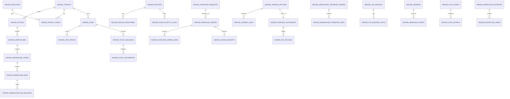
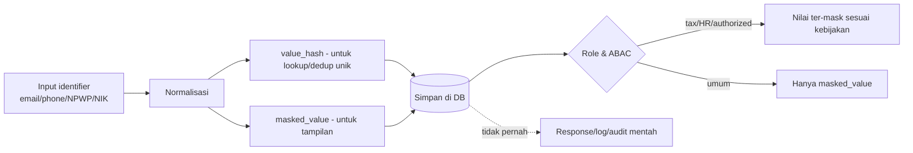

# Bagian 4 — ERD dan Data Dictionary Detail

> **Status dokumen:** target/rencana skema database, bukan status implementasi. Belum ada migration modul ERP yang dijalankan di repo ini — dokumen ini menjabarkan baseline skema yang **direncanakan**, mengikuti pola base modular monolith yang sudah terbukti pada base sebelumnya.

> **Contoh domain (ilustratif).** Dokumen ini memakai domain ERP (keuangan/akuntansi, inventori/gudang, procurement, manufaktur, HR/payroll) sebagai contoh berjalan. **Pola & standar**-nya reusable untuk base AWCMS; **entitas, tabel, dan istilah domain** adalah ilustrasi awal yang akan disempurnakan seiring modul dibangun. Lihat [README paket dokumen](README.md) §Reusable vs domain ERP.

## Tujuan

Dokumen ini menjadi baseline database AWCMS: ERD konseptual, ownership tabel, data dictionary ringkas, index, RLS, klasifikasi data, migration order, dan retention — sebagai target rancangan sebelum implementasi dimulai.

## Prinsip database

1. Semua tabel tenant-scoped wajib `tenant_id`.
2. Primary key menggunakan UUID.
3. Timestamp menggunakan `timestamptz`.
4. Monetary/quantity menggunakan `numeric`, bukan floating point.
5. Posted jurnal dan posted stock movement append-only.
6. Koreksi memakai reversal/return/adjustment.
7. FK child wajib index.
8. Tabel tenant-scoped wajib RLS.
9. Data sensitif dimasking, di-hash untuk lookup/dedup jika relevan.
10. Migration harus berurutan dan audit-ready.
11. Resource yang deletable memakai soft delete; physical delete hanya untuk purge retention/legal yang berizin.

## ERD konseptual utama (rencana)



## Global column standard

| Kolom             | Tipe        | Fungsi                                        |
| ----------------- | ----------- | --------------------------------------------- |
| `id`              | uuid        | Primary key                                   |
| `tenant_id`       | uuid        | Isolasi tenant                                |
| `code`            | text        | Kode bisnis                                   |
| `status`          | text        | Status lifecycle                              |
| `created_at`      | timestamptz | Waktu dibuat                                  |
| `updated_at`      | timestamptz | Waktu update                                  |
| `created_by`      | uuid        | Actor pembuat                                 |
| `updated_by`      | uuid        | Actor update                                  |
| `deleted_at`      | timestamptz | Soft delete jika relevan                      |
| `deleted_by`      | uuid        | Actor yang mengarsipkan/menghapus soft        |
| `delete_reason`   | text        | Alasan soft delete/purge                      |
| `restored_at`     | timestamptz | Waktu restore jika resource mendukung restore |
| `restored_by`     | uuid        | Actor restore                                 |
| `sync_version`    | bigint      | Version untuk sync                            |
| `origin_node_id`  | uuid        | Node asal offline/sync                        |
| `idempotency_key` | text        | Idempotency mutation                          |

## Table ownership matrix (rencana)

| Module                | Table utama (rencana)                                                                                                                                                                                                |
| --------------------- | -------------------------------------------------------------------------------------------------------------------------------------------------------------------------------------------------------------------- |
| Foundation            | `awcms_modules`, `awcms_schema_migrations`, `awcms_system_events`                                                                                                                                                    |
| Tenant Admin          | `awcms_tenants`, `awcms_offices`, `awcms_physical_locations`, `awcms_tenant_settings`                                                                                                                                |
| Profile Identity      | `awcms_profiles`, `awcms_profile_identifiers`, `awcms_profile_channels`, `awcms_profile_addresses`, `awcms_profile_entity_links`, `awcms_profile_merge_requests`                                                     |
| Identity Access       | `awcms_identities`, `awcms_tenant_users`, `awcms_sessions`, `awcms_password_reset_tokens`, `awcms_roles`, `awcms_permissions`, `awcms_abac_policies`, `awcms_abac_decision_logs`                                     |
| Master Data Inventory | `awcms_items`, `awcms_item_categories`, `awcms_units`, `awcms_item_prices`, `awcms_stock_balances`, `awcms_stock_movements`                                                                                          |
| Finance & GL          | `awcms_chart_of_accounts`, `awcms_journal_batches`, `awcms_journal_lines`, `awcms_financial_documents`, `awcms_idempotency_keys`                                                                                     |
| Shared Stock Routing  | `awcms_stock_pools`, `awcms_stock_pool_members`, `awcms_transaction_routing_rules`, `awcms_transaction_routing_decisions`                                                                                            |
| Warehouse             | `awcms_warehouses`, `awcms_warehouse_zones`, `awcms_warehouse_bins`, `awcms_inventory_lots`, `awcms_inventory_serials`, `awcms_warehouse_bin_balances`, `awcms_warehouse_transfer_orders`, `awcms_cycle_count_plans` |
| Accounting Tax        | `awcms_tax_profiles`, `awcms_tax_business_units`, `awcms_party_tax_profiles`, `awcms_product_tax_profiles`, `awcms_vat_invoices`, `awcms_coretax_batches`                                                            |
| Procurement           | `awcms_vendors`, `awcms_purchase_requests`, `awcms_purchase_orders`, `awcms_purchase_order_lines`, `awcms_goods_receipts`, `awcms_message_outbox`, `awcms_message_attempts`                                          |
| Sync Storage          | `awcms_sync_nodes`, `awcms_sync_outbox`, `awcms_sync_inbox`, `awcms_sync_conflicts`, `awcms_object_sync_queue`                                                                                                       |
| Email (base)          | `awcms_email_templates`, `awcms_email_messages`, `awcms_email_delivery_attempts`, `awcms_email_suppression_list`                                                                                                     |
| AI Analyst            | `awcms_ai_sessions`, `awcms_ai_messages`, `awcms_ai_tool_calls`, `awcms_ai_tool_policies`                                                                                                                            |
| Logging               | `awcms_log_events`, `awcms_audit_events`, `awcms_security_events`                                                                                                                                                    |
| Workflow              | `awcms_workflow_definitions`, `awcms_workflow_instances`, `awcms_workflow_tasks`, `awcms_workflow_decisions`                                                                                                         |
| Reporting             | report views/materialized views                                                                                                                                                                                      |
| Production Security   | `awcms_security_controls`, `awcms_security_readiness_assessments`, `awcms_security_findings`, `awcms_go_live_gates`                                                                                                  |
| Module Management     | `awcms_modules` (extended), `awcms_tenant_modules`, `awcms_module_dependencies`, `awcms_module_settings`, `awcms_module_navigation`, `awcms_module_jobs`, `awcms_module_health_checks`                               |
| Data Lifecycle        | `awcms_data_lifecycle_legal_holds`, `awcms_data_lifecycle_cursors`, `awcms_data_lifecycle_archive_manifests`, `awcms_data_lifecycle_runs`                                                                            |

Modul lanjutan seperti Manufacturing dan HR/Payroll belum memiliki table ownership matrix final — akan ditambahkan saat modul tersebut dirancang detail (mengikuti pola penamaan `awcms_<domain>_<entity>` yang sama).

## Data dictionary ringkas per modul (rencana)

### `awcms_tenants`

| Kolom            | Tipe | Keterangan                |
| ---------------- | ---- | ------------------------- |
| `id`             | uuid | PK                        |
| `tenant_code`    | text | Unik global               |
| `tenant_name`    | text | Nama operasional          |
| `legal_name`     | text | Nama legal                |
| `status`         | text | active/inactive/suspended |
| `default_locale` | text | en/id/ms/ar               |
| `default_theme`  | text | light/dark/system         |

Index: unique `tenant_code`.

`default_locale` — locale default tenant (min **en**, **id**), target default `'en'`. Locale efektif = preferensi per-user (bila ada) → `default_locale` tenant.

### `awcms_offices`

| Kolom              | Tipe | Keterangan                                       |
| ------------------ | ---- | ------------------------------------------------ |
| `tenant_id`        | uuid | Tenant scope                                     |
| `office_code`      | text | Unik per tenant                                  |
| `office_name`      | text | Nama kantor/toko/gudang/pabrik                   |
| `office_type`      | text | head_office/branch/store/warehouse/factory/other |
| `parent_office_id` | uuid | Hierarki                                         |
| `status`           | text | active/inactive                                  |

Index: `(tenant_id, office_code)`, `(tenant_id, office_type)`.

### `awcms_profiles`

Canonical profile untuk user/karyawan/vendor/customer/contact.

Kolom penting: `tenant_id`, `profile_type`, `display_name`, `legal_name`, `status`, `verification_status`, `risk_level`, `merged_into_profile_id`.

### `awcms_profile_identifiers`

Identifier sensitif seperti email, phone, WhatsApp, NPWP, NIK.

Kolom penting: `identifier_type`, `normalized_value`, `value_hash`, `masked_value`, `is_primary`, `verification_status`.

Constraint: unique `(tenant_id, identifier_type, value_hash)`.

### `awcms_identities`

Login identity.

Kolom penting: `profile_id`, `login_identifier`, `password_hash`, `status`, `failed_login_count`, `locked_until`, `last_login_at`.

Catatan: `password_hash` tidak pernah keluar response/API/log.

### `awcms_password_reset_tokens`

Token reset password sekali-pakai. Kolom penting: `identity_id`, `token_hash` (unik — hanya hash yang disimpan), `expires_at`, `used_at` (single-use). RLS FORCE. Request baru menandai token outstanding sebelumnya sebagai `used_at = now()` (superseded) sebelum membuat yang baru.

### `awcms_items`

Item/produk master (bahan baku, barang jadi, jasa).

Kolom penting: `tenant_id`, `sku`, `barcode`, `item_name`, `category_id`, `base_unit_id`, `tracking_type`, `status`.

Constraint: unique `(tenant_id, sku)`, unique `(tenant_id, barcode)` jika barcode tidak null.

### `awcms_stock_balances`

Saldo stok per office/gudang.

Kolom penting: `tenant_id`, `item_id`, `office_id`, `quantity_on_hand`, `quantity_reserved`, `quantity_available`.

Constraint: unique `(tenant_id, item_id, office_id)`.

### `awcms_stock_movements`

Mutasi stok append-only.

Kolom penting: `item_id`, `office_id`, `movement_type`, `quantity_delta`, `reference_module`, `reference_type`, `reference_id`, `posted_at`.

### `awcms_journal_batches`

Batch jurnal draft/posted.

Kolom penting: `tenant_id`, `office_id`, `period_id`, `status`, `total_debit`, `total_credit`, `posted_at`.

### `awcms_financial_documents`

Dokumen keuangan posted immutable (invoice, payment voucher).

Kolom penting: `source_journal_batch_id`, `document_no`, `office_id`, `party_profile_id`, `status`, `gross_total`, `tax_total`, `net_total`, `posted_at`.

Constraint: unique `(tenant_id, document_no)`.

### `awcms_warehouse_bin_balances`

Saldo stok detail per bin/lot/serial.

Kolom penting: `warehouse_id`, `zone_id`, `bin_id`, `item_id`, `lot_id`, `serial_id`, `quantity_on_hand`, `quantity_reserved`, `quantity_available`.

### `awcms_vat_invoices`

VAT invoice staging.

Kolom penting: `financial_document_id`, `tax_profile_id`, `tax_business_unit_id`, `invoice_no`, `status`, `dpp_total`, `vat_total`, `luxury_tax_total`.

### `awcms_purchase_orders`

Purchase order ke vendor.

Kolom penting: `vendor_profile_id`, `source_purchase_request_id`, `office_id`, `status`, `gross_total`, `tax_total`, `net_total`, `approved_at`.

### `awcms_message_outbox`

Queue notifikasi vendor/karyawan (WhatsApp/email).

Kolom penting: `contact_id`, `channel_type`, `provider_code`, `message_type`, `payload_json`, `status`, `next_retry_at`.

### Email (base, generik)

Infrastruktur base reusable untuk password reset, system announcement, dan workflow notification — berbeda dari `awcms_message_outbox` di atas (contoh domain procurement/HR). RLS FORCE di keempat tabel; hanya `email_templates` yang soft-deletable, tiga lainnya berbasis status transition + purge fisik.

- **`awcms_email_templates`** — `template_key` (format `area.name`, mis. `auth.password_reset`), `subject_template`/`text_body_template`/`html_body_template` **jsonb per-locale** (`{"en": "...", "id": "..."}`), `is_active`. Unik `(tenant_id, template_key)` WHERE `deleted_at IS NULL`.
- **`awcms_email_messages`** — outbox, satu baris = satu unit pengiriman ke satu alamat. `category`, `template_key` (denormalized, bukan FK), `to_address`/`to_address_hash`/`to_address_masked`, `variables` (jsonb, untuk rendering ulang oleh dispatcher — bukan rendered body tersimpan), `variables_hash`, `status` (`queued → sending → sent | failed → retry_wait → cancelled | suppressed`), `retry_count`, `next_attempt_at`.
- **`awcms_email_delivery_attempts`** — riwayat percobaan per pesan (`message_id` FK), `outcome` (`success`/`failure`), `provider_response_snippet` (sudah diredaksi sebelum insert).
- **`awcms_email_suppression_list`** — block-list bounce/complaint/manual/unsubscribe, key lookup `recipient_hash` (bukan raw address).

### `awcms_sync_outbox`

Event lokal yang perlu disinkronkan.

Kolom penting: `node_id`, `event_type`, `aggregate_type`, `aggregate_id`, `payload_json`, `status`.

### Module Management

Registry modul database-backed sekaligus tenant-aware (perluasan `awcms_modules` sejak migration foundation). Tabel "registry" (dependencies/navigation/jobs/health-checks) RLS-free — metadata code-derived, sama untuk semua tenant; dua tabel tenant-writable (`tenant_modules`/`module_settings`) RLS FORCE.

- **`awcms_tenant_modules`** — status aktif/nonaktif modul per tenant. Baris tidak ada = default enabled. Unik `(tenant_id, module_key)`. RLS FORCE.
- **`awcms_module_dependencies`** — graph dependency antar modul. Composite PK `(module_key, depends_on_module_key)`, `CHECK` menolak self-dependency.
- **`awcms_module_settings`** — override pengaturan non-secret per tenant (`settings` jsonb, `schema_version`). Tidak boleh berisi secret/token mentah — ditegakkan di application layer. Unik `(tenant_id, module_key)`. RLS FORCE.
- **`awcms_module_navigation`** — entri navigasi admin per modul (`label_key`, `path`, `sort_order`, `nav_group`, `required_permission`).
- **`awcms_module_jobs`** — registry command operasional (dokumentasi, tidak eksekusi).
- **`awcms_module_health_checks`** — riwayat hasil health check, instance-level. `status` (`healthy`/`degraded`/`failed`/`unknown`), `message` (redaction-ready).

Aksi lifecycle/config modul tercatat lewat `awcms_audit_events` generik (`module_key = 'module_management'`), bukan tabel event terpisah.

### Business scope (Issue #180, base, generik)

Lapis authorization organisasi **generik** milik `identity_access` — membatasi akses berdasarkan hierarki organisasi tanpa memasukkan entitas domain ERP nyata ke base. `scope_type`/`scope_id` adalah **referensi generik** (text + uuid), **bukan** FK ke tabel modul organisasi mana pun: validitas/ancestry di-resolve di application layer lewat capability port `BusinessScopeHierarchyPort` yang disediakan aplikasi turunan (base mengirim resolver no-op → `resolved: false`). Kedua tabel RLS `ENABLE`+`FORCE`. Lihat ADR-0030.

- **`awcms_business_scope_assignments`** — satu baris = satu `tenant_user` diberi role/permission context yang dibatasi pada satu business scope. Kolom: `tenant_user_id`, `role_id` (nullable), `scope_type` (snake_case, CHECK `^[a-z][a-z0-9_]*$`), `scope_id`, `effective_from`/`effective_to` (effective dating; `effective_to > effective_from`; assignment temporer WAJIB `effective_to`), `is_temporary`, `status` (`active`/`expired`/`revoked`), `revoked_at`/`revoked_by_tenant_user_id`/`revoke_reason` (konsisten via CHECK), `granted_by_tenant_user_id`, `approved_by_tenant_user_id`. **FK komposit `(tenant_id, …)`** untuk subject/role/grantor/approver/revoker (target `UNIQUE (tenant_id, id)` di `awcms_tenant_users`/`awcms_roles`/tabel ini sendiri) — RI check PostgreSQL melewati RLS, jadi FK single-column bisa lintas-tenant (GHSA-r7cx-c4jh-cvvw); komposit memaksa baris tereferensi sated tenant yang sama. Gerbang otoritatif "sedang berlaku" adalah `now` vs effective dating, bukan `status` (revocation/expiry berdampak segera). Tidak dihapus fisik — hanya transisi status.
- **`awcms_business_scope_assignment_events`** — riwayat lifecycle **append-only** (`granted`/`revoked`/`expired`/`renewed`), FK komposit `(tenant_id, assignment_id)` + `(tenant_id, actor_tenant_user_id)`. Tidak pernah UPDATE/DELETE.

Job `identity-access:business-scope:expiry` (worker, sql/027 grants `SELECT,UPDATE` assignments + `INSERT` events) membalik assignment `active` yang `effective_to`-nya lewat menjadi `expired` + tulis event + audit agregat per tenant. Segregation-of-duties (tabel exception/evaluation) adalah **Issue #181**, tidak di sini.

## Konten multi-bahasa (translatable content)

Berbeda dari **string UI statis** (label/tombol/pesan error) yang memakai katalog `.po` gettext di sisi aplikasi, **data input pengguna** yang perlu tampil multi-bahasa (mis. deskripsi item, term & condition vendor) disimpan **di database, satu nilai per bahasa aktif**.

Pola yang diizinkan (pilih per kebutuhan, konsisten dalam satu modul):

- **JSONB per-locale** — kolom `<field>_i18n jsonb` berisi `{ "en": "...", "id": "..." }` untuk semua bahasa aktif tenant. Cocok untuk field bebas yang jarang di-query per-bahasa. Fallback ke `default_locale` bila key locale aktif kosong.
- **Tabel translasi terpisah** — `<entity>_translations (entity_id, locale, field, value)` dengan unique `(entity_id, locale, field)`. Cocok bila konten di-query/urut/cari per-bahasa. Tetap tenant-scoped + RLS.
- **Baris-per-locale + link group** — untuk entitas yang keseluruhannya berbeda per bahasa dan perlu jadi baris independen dengan slug/status/lifecycle sendiri: satu kolom `locale` di baris utama, slug unik per `(tenant_id, locale, slug)`, dan kolom penaut opsional (`translation_group_id uuid`, nullable) untuk mengelompokkan beberapa baris locale-variant.

Aturan:

- Wajib menyimpan nilai untuk setiap locale aktif tenant (minimal `en`+`id`); tampilan memilih nilai locale aktif dengan fallback ke `default_locale`.
- Tetap ikut RLS tenant isolation, soft delete (bila entity-nya soft-deletable), dan masking bila field sensitif.
- Nilai locale bukan secret; tetap divalidasi & di-escape saat render (anti-XSS, auto-escape Astro).

## Soft delete standard

Soft delete adalah mekanisme default untuk master/config/draft tenant-scoped yang perlu bisa diarsipkan tanpa memutus referensi historis.

| Kategori data                                                                                              | Kebijakan                                                                                |
| ---------------------------------------------------------------------------------------------------------- | ---------------------------------------------------------------------------------------- |
| Tenant/office/location, profile/contact/channel, item/category/brand/unit, warehouse zone/bin, rule/config | Soft delete didukung jika tidak melanggar constraint bisnis aktif                        |
| Draft jurnal/PO/PR                                                                                         | Boleh cancel/soft delete sesuai lifecycle                                                |
| Posted jurnal, posted financial document, posted stock movement, audit/security log, exported tax batch    | Tidak boleh soft delete; gunakan reversal/cancel/return/adjustment/status                |
| Data sensitif PII/tax/payroll                                                                              | Soft delete tidak menghapus kewajiban masking; purge/anonymize mengikuti retention/legal |

Aturan implementasi:

- Kolom minimum: `deleted_at`, `deleted_by`, `delete_reason`; tambahkan `restored_at`/`restored_by` bila restore didukung.
- Query list/detail default wajib menambahkan `deleted_at IS NULL`.
- API hanya boleh menampilkan soft-deleted record bila ada permission eksplisit dan parameter seperti `includeDeleted=true`.
- Unique business key yang boleh dipakai ulang setelah delete memakai partial unique index, contoh `UNIQUE (tenant_id, sku) WHERE deleted_at IS NULL`.
- FK dari transaksi historis tetap mengarah ke record soft-deleted; mapper menampilkan status archived tanpa membuka data sensitif.
- Restore wajib validasi konflik partial unique index, status lifecycle, dan ABAC.
- Purge hanya untuk retention/legal hold yang memenuhi syarat, harus diaudit, dan tidak boleh memutus FK penting.
- Untuk sync, soft delete dikirim sebagai tombstone event; jangan physical delete sebelum semua node menerima tombstone atau retention terpenuhi.

## RLS standard

Setiap tabel tenant-scoped:

```sql
ALTER TABLE table_name ENABLE ROW LEVEL SECURITY;

CREATE POLICY table_name_tenant_isolation
  ON table_name
  USING (tenant_id = current_setting('app.current_tenant_id')::uuid);
```

RLS mengisolasi tenant; filter soft delete tetap wajib di query/repository agar arsip tidak bocor pada list/detail default.

## Index standard

- `(tenant_id)` untuk semua tabel tenant-scoped.
- `(tenant_id, created_at DESC)` untuk transaksi/log/event.
- `(tenant_id, status, created_at)` untuk workflow/outbox/task.
- `(tenant_id, deleted_at)` atau partial index `WHERE deleted_at IS NULL` untuk tabel soft-deletable yang sering di-list.
- FK child index.
- Search index untuk item/profile jika data besar.

## Alur perlindungan data sensitif



## Sensitive data classification

| Data                   | Level       | Kontrol                   |
| ---------------------- | ----------- | ------------------------- |
| Password hash          | Critical    | Never expose              |
| API key/provider token | Critical    | Env only                  |
| NPWP/NIK/NITKU         | High        | Mask, ABAC tax role       |
| Data gaji/payroll      | Critical    | Mask, ABAC HR role        |
| Phone/WhatsApp/email   | High        | Mask/hash lookup          |
| Address                | Medium/High | Need-to-know              |
| Transaksi finance      | Medium      | Tenant RLS, audit         |
| Tax invoice/XML        | High        | Tax role, audit, checksum |
| AI prompt/tool call    | Medium      | No raw PII                |

## Retention awal

| Data                                        | Retention                                                                                                                                                                                         |
| ------------------------------------------- | ------------------------------------------------------------------------------------------------------------------------------------------------------------------------------------------------- |
| Idempotency key                             | 7–30 hari                                                                                                                                                                                         |
| HTTP request log                            | 30–90 hari                                                                                                                                                                                        |
| Security/audit log                          | 1–5 tahun sesuai kebutuhan                                                                                                                                                                        |
| `awcms_audit_events`                        | Default 730 hari (2 tahun), dikonfigurasi via `AUDIT_LOG_RETENTION_DAYS`; dipurge oleh job terjadwal internal, batch per tenant per pass, aksi purge itu sendiri direkam sebagai audit event baru |
| Tax records                                 | Sesuai regulasi dan SOP                                                                                                                                                                           |
| Notifikasi vendor/HR log                    | 1 tahun                                                                                                                                                                                           |
| `awcms_email_messages`/`_delivery_attempts` | Kandidat purge fisik setelah status terminal melewati retention window, meniru pola `awcms_audit_events`                                                                                          |
| AI session                                  | 90–365 hari                                                                                                                                                                                       |
| Sync conflict                               | Resolved + 1 tahun                                                                                                                                                                                |
| Jurnal/stock movement                       | Long-term/archive                                                                                                                                                                                 |

Catatan: kebijakan retensi detail per tabel modul ERP baru (finance, procurement, manufaktur, HR/payroll) akan ditetapkan saat modul tersebut dirancang, mengikuti mekanisme `data_lifecycle` generik yang sama (legal hold, dry-run, archive-purge) yang sudah terbukti pada base sebelumnya.
