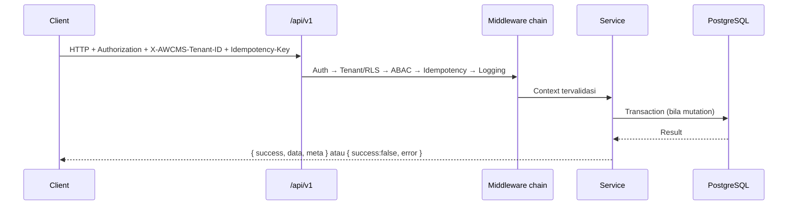
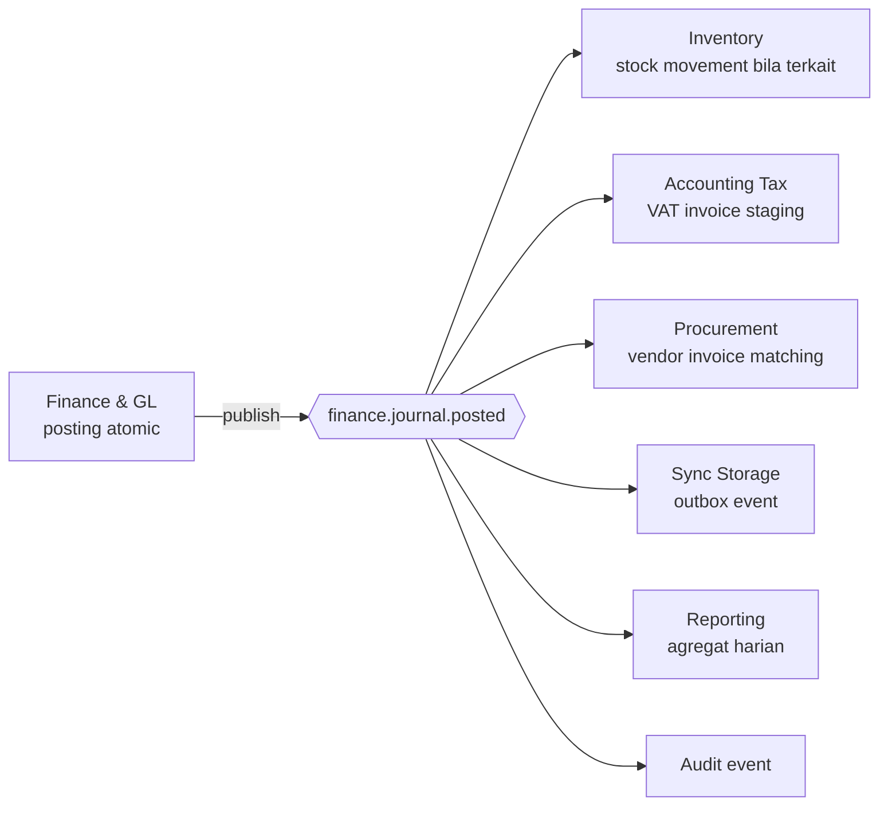

# Bagian 5 — OpenAPI dan AsyncAPI Detail

> **Status dokumen:** target/rencana kontrak API dan event, bukan status implementasi. Belum ada endpoint atau event modul ERP yang diimplementasikan di repo ini — dokumen ini menjabarkan baseline kontrak yang **direncanakan** dibangun bertahap.

> **Contoh domain (ilustratif).** Dokumen ini memakai domain ERP (keuangan/akuntansi, inventori/gudang, procurement, manufaktur, HR/payroll) sebagai contoh berjalan. **Pola & standar**-nya reusable untuk base AWCMS; **entitas, endpoint, dan istilah domain** adalah ilustrasi awal yang akan disempurnakan seiring modul dibangun. Lihat [README paket dokumen](README.md) §Reusable vs domain ERP.

## Tujuan

Dokumen ini menjadi baseline kontrak API dan domain event AWCMS. Semua API baru wajib diperbarui di OpenAPI. Semua event baru wajib diperbarui di AsyncAPI.

## Versi kontrak

`info.version` OpenAPI/AsyncAPI adalah SemVer independen dari versi rilis `package.json` — kebijakan lengkap + aturan bump akan dicatat sebagai ADR tersendiri di repo ini (mengikuti pola ADR versioning kontrak pada base sebelumnya). Divalidasi otomatis oleh `bun run api:spec:check` (harus berbentuk `X.Y.Z`).

## Standard API

Base path:

```text
/api/v1
```

Response sukses:

```json
{
  "success": true,
  "data": {},
  "meta": {
    "correlationId": "corr_...",
    "requestId": "req_..."
  }
}
```

Response error:

```json
{
  "success": false,
  "error": {
    "code": "VALIDATION_ERROR",
    "message": "Data tidak valid.",
    "details": [],
    "correlationId": "corr_..."
  }
}
```

## Header standard

| Header              |                       Wajib | Fungsi                  |
| ------------------- | --------------------------: | ----------------------- |
| `Authorization`     |           Ya kecuali public | Bearer token            |
| `X-AWCMS-Tenant-ID` |  Ya untuk tenant-scoped API | Tenant aktif            |
| `Idempotency-Key`   | Ya untuk mutation high-risk | Anti duplicate mutation |
| `X-Correlation-ID`  |                    Opsional | Trace request           |
| `X-Request-ID`      |                    Opsional | Trace client request    |
| `Accept-Language`   |                    Opsional | Locale                  |
| `X-AWCMS-Node-ID`   |               Ya untuk sync | Sync node               |
| `X-AWCMS-Timestamp` |        Ya untuk signed sync | Anti replay             |
| `X-AWCMS-Signature` |               Ya untuk sync | HMAC signature          |

## Soft delete API standard

DELETE pada resource tenant-scoped yang deletable berarti **soft delete**, bukan physical delete. Endpoint harus terdokumentasi di OpenAPI dengan perilaku berikut:

| Pola                                   | Fungsi                  | Catatan                                                                            |
| -------------------------------------- | ----------------------- | ---------------------------------------------------------------------------------- |
| `DELETE /<resources>/{id}`             | Soft delete resource    | Isi `deleted_at`, `deleted_by`, `delete_reason`; high-risk perlu `Idempotency-Key` |
| `POST /<resources>/{id}/restore`       | Restore resource        | Validasi konflik unique key, status lifecycle, ABAC, dan audit                     |
| `POST /<resources>/{id}/purge-request` | Request purge/anonymize | Hanya retention/legal; approval bila policy aktif                                  |
| `GET /<resources>?includeDeleted=true` | List termasuk arsip     | Hanya role berizin; default `false`                                                |

Default response list/detail tidak menampilkan soft-deleted record. Detail soft-deleted tanpa permission mengembalikan `RESOURCE_NOT_FOUND`; dengan permission arsip boleh mengembalikan data masked dengan status `deleted`.

## Endpoint wajib idempotency (rencana)

- `POST /finance/journal-batches/{id}/post`
- `POST /finance/documents/{id}/cancel-request`
- `POST /profiles/resolve`
- `POST /profiles/{id}/links`
- `POST /profiles/merge-requests`
- `DELETE /profiles/{id}`
- `POST /profiles/{id}/restore`
- `DELETE /inventory/items/{id}`
- `POST /inventory/items/{id}/restore`
- `POST /warehouse-transfers`
- `POST /warehouse-transfers/{id}/approve`
- `POST /warehouse-transfers/{id}/ship`
- `POST /warehouse-transfers/{id}/receive`
- `POST /cycle-counts`
- `POST /stock-adjustment-requests`
- `POST /tax/vat-invoices/generate`
- `POST /tax/coretax/batches`
- `POST /procurement/purchase-orders`
- `POST /procurement/purchase-orders/{id}/approve`
- `POST /procurement/purchase-orders/{id}/receive`
- `POST /sync/push`
- `POST /workflow/tasks/{id}/decision`

## Error code standard

| Code                         | HTTP | Keterangan                                                       |
| ---------------------------- | ---: | ---------------------------------------------------------------- |
| `VALIDATION_ERROR`           |  400 | Data tidak valid                                                 |
| `AUTH_REQUIRED`              |  401 | Belum login                                                      |
| `TOKEN_EXPIRED`              |  401 | Token kadaluarsa                                                 |
| `ACCESS_DENIED`              |  403 | Tidak punya akses                                                |
| `TENANT_REQUIRED`            |  400 | Tenant wajib                                                     |
| `RESOURCE_NOT_FOUND`         |  404 | Resource tidak ditemukan                                         |
| `RESOURCE_DELETED`           |  410 | Resource sudah di-soft-delete dan butuh restore/arsip permission |
| `IDEMPOTENCY_REQUIRED`       |  400 | Header idempotency wajib                                         |
| `IDEMPOTENCY_CONFLICT`       |  409 | Key dipakai request berbeda                                      |
| `WORKFLOW_APPROVAL_REQUIRED` |  409 | Perlu approval                                                   |
| `STOCK_NOT_AVAILABLE`        |  409 | Stok tidak cukup                                                 |
| `SYNC_CONFLICT`              |  409 | Konflik sync                                                     |
| `PAYLOAD_TOO_LARGE`          |  413 | Body request melebihi batas ukuran                               |
| `DATABASE_BUSY`              |  503 | Pool/DB sibuk                                                    |
| `PROVIDER_ERROR`             |  502 | Provider eksternal gagal                                         |
| `INTERNAL_ERROR`             |  500 | Error internal                                                   |

## API endpoint summary per modul (rencana)

### Foundation

| Method | Endpoint  | Fungsi       |
| ------ | --------- | ------------ |
| GET    | `/health` | Health check |

### Tenant Admin

| Method   | Endpoint                      | Fungsi                       |
| -------- | ----------------------------- | ---------------------------- |
| GET      | `/setup/status`               | Status setup                 |
| POST     | `/setup/initialize`           | Setup tenant pertama         |
| GET      | `/tenants/current`            | Tenant aktif                 |
| GET/POST | `/offices`                    | List/create office           |
| PATCH    | `/offices/{officeId}`         | Update office                |
| DELETE   | `/offices/{officeId}`         | Soft delete office jika aman |
| POST     | `/offices/{officeId}/restore` | Restore office               |

### Identity & Access

| Method | Endpoint                | Fungsi                 |
| ------ | ----------------------- | ---------------------- |
| POST   | `/auth/login`           | Login                  |
| POST   | `/auth/logout`          | Logout                 |
| GET    | `/auth/me`              | User aktif             |
| GET    | `/access/modules`       | Daftar module/activity |
| POST   | `/access/evaluate`      | Evaluasi ABAC          |
| POST   | `/access/assignments`   | Assign access          |
| GET    | `/access/decision-logs` | Decision log           |

### Profile Identity

| Method   | Endpoint                        | Fungsi                             |
| -------- | ------------------------------- | ---------------------------------- |
| GET/POST | `/profiles`                     | List/create profile                |
| GET      | `/profiles/{profileId}`         | Detail profile                     |
| POST     | `/profiles/resolve`             | Resolve/create profile             |
| POST     | `/profiles/{profileId}/links`   | Link entity                        |
| GET      | `/profiles/dedup-candidates`    | Kandidat duplikat                  |
| POST     | `/profiles/merge-requests`      | Request merge                      |
| DELETE   | `/profiles/{profileId}`         | Soft delete profile/contact master |
| POST     | `/profiles/{profileId}/restore` | Restore profile                    |

### Master Data & Inventory

| Method    | Endpoint                               | Fungsi             |
| --------- | -------------------------------------- | ------------------ |
| GET/POST  | `/inventory/items`                     | List/create item   |
| GET/PATCH | `/inventory/items/{itemId}`            | Detail/update item |
| DELETE    | `/inventory/items/{itemId}`            | Soft delete item   |
| POST      | `/inventory/items/{itemId}/restore`    | Restore item       |
| GET       | `/inventory/stock-balances`            | Stok               |
| GET       | `/inventory/stock-movements`           | Mutasi stok        |
| POST      | `/inventory/stock-adjustment-requests` | Request adjustment |
| GET       | `/inventory/lots`                      | Lot/batch          |

### Finance & General Ledger

| Method | Endpoint                                       | Fungsi                    |
| ------ | ---------------------------------------------- | ------------------------- |
| POST   | `/finance/journal-batches`                     | Buat jurnal draft         |
| GET    | `/finance/journal-batches/{id}`                | Detail jurnal             |
| POST   | `/finance/journal-batches/{id}/lines`          | Tambah baris jurnal       |
| PATCH  | `/finance/journal-batches/{id}/lines/{lineId}` | Update baris jurnal       |
| DELETE | `/finance/journal-batches/{id}/lines/{lineId}` | Hapus baris jurnal        |
| POST   | `/finance/journal-batches/{id}/post`           | Posting jurnal            |
| GET    | `/finance/documents/{id}`                      | Detail financial document |
| POST   | `/finance/documents/{id}/cancel-request`       | Request cancel            |

### Warehouse Management

| Method   | Endpoint                                         | Fungsi                            |
| -------- | ------------------------------------------------ | --------------------------------- |
| GET/POST | `/warehouses`                                    | List/create warehouse             |
| GET      | `/warehouses/{warehouseId}/stock`                | Stok gudang                       |
| GET/POST | `/warehouses/{warehouseId}/bins`                 | Bin list/create                   |
| DELETE   | `/warehouses/{warehouseId}/bins/{binId}`         | Soft delete bin jika saldo kosong |
| POST     | `/warehouses/{warehouseId}/bins/{binId}/restore` | Restore bin                       |
| POST     | `/warehouse-transfers`                           | Buat transfer                     |
| POST     | `/warehouse-transfers/{id}/approve`              | Approve                           |
| POST     | `/warehouse-transfers/{id}/ship`                 | Ship                              |
| POST     | `/warehouse-transfers/{id}/receive`              | Receive                           |
| POST     | `/cycle-counts`                                  | Buat cycle count                  |

### Accounting Tax/Coretax

| Method   | Endpoint                          | Fungsi               |
| -------- | --------------------------------- | -------------------- |
| GET/POST | `/tax/profiles`                   | Tax profile          |
| GET/POST | `/tax/business-units`             | NITKU/ID TKU         |
| GET/POST | `/tax/party-profiles`             | Party tax profile    |
| POST     | `/tax/vat-invoices/generate`      | Generate VAT invoice |
| GET      | `/tax/vat-invoices`               | List invoice         |
| POST     | `/tax/vat-invoices/{id}/validate` | Validasi             |
| POST     | `/tax/coretax/batches`            | Coretax batch export |

### Procurement & Vendor Management

| Method   | Endpoint                                      | Fungsi                        |
| -------- | --------------------------------------------- | ----------------------------- |
| GET/POST | `/procurement/vendors`                        | Vendor master                 |
| GET/POST | `/procurement/purchase-requests`              | Purchase request              |
| POST     | `/procurement/purchase-requests/{id}/approve` | Approve PR                    |
| GET/POST | `/procurement/purchase-orders`                | Purchase order                |
| POST     | `/procurement/purchase-orders/{id}/approve`   | Approve PO                    |
| POST     | `/procurement/purchase-orders/{id}/receive`   | Terima barang (goods receipt) |
| GET      | `/procurement/vendors/{id}/invoices`          | Invoice vendor                |
| DELETE   | `/procurement/vendors/{id}`                   | Soft delete vendor            |
| POST     | `/procurement/vendors/{id}/restore`           | Restore vendor                |
| POST     | `/webhooks/procurement/vendor-portal`         | Webhook vendor portal         |

### Sync Storage

| Method | Endpoint                       | Fungsi                |
| ------ | ------------------------------ | --------------------- |
| POST   | `/sync/push`                   | Push event            |
| POST   | `/sync/pull`                   | Pull event            |
| GET    | `/sync/status`                 | Sync status           |
| GET    | `/sync/conflicts`              | List conflict         |
| POST   | `/sync/conflicts/{id}/resolve` | Resolve conflict      |
| POST   | `/sync/objects/presign`        | Object upload/presign |

### Module Management

Database-backed, tenant-aware module registry — generic infrastructure for managing every other registered module, not a domain-specific feature.

| Method | Endpoint                               | Fungsi                                                     |
| ------ | -------------------------------------- | ---------------------------------------------------------- |
| GET    | `/modules`                             | Katalog modul (code + DB registry)                         |
| GET    | `/modules/{moduleKey}`                 | Detail satu modul                                          |
| POST   | `/modules/sync`                        | Sync descriptor code → DB registry                         |
| GET    | `/modules/{moduleKey}/permissions`     | Status sinkron permission (synced/missing/orphaned)        |
| GET    | `/modules/{moduleKey}/jobs`            | Registry command operasional (dokumentasi, tidak eksekusi) |
| GET    | `/modules/{moduleKey}/health`          | Health/readiness cepat, read-only                          |
| POST   | `/modules/{moduleKey}/health/check`    | Trigger health check eksplisit (+ provider check bila ada) |
| GET    | `/tenant/modules`                      | Status enable/disable modul untuk tenant pemanggil         |
| POST   | `/tenant/modules/{moduleKey}/enable`   | Aktifkan modul untuk tenant                                |
| POST   | `/tenant/modules/{moduleKey}/disable`  | Nonaktifkan modul untuk tenant (butuh `reason`)            |
| GET    | `/tenant/modules/{moduleKey}/settings` | Effective settings (default + override tenant)             |
| PATCH  | `/tenant/modules/{moduleKey}/settings` | Update override settings tenant                            |

Tidak ada event AsyncAPI baru untuk modul ini — perubahan lifecycle/config modul tercatat lewat `awcms_audit_events` generik, bukan domain event terpisah.

### AI, Reports, Logs, Workflow, Security

| Modul    | Endpoint utama                                                   |
| -------- | ---------------------------------------------------------------- |
| AI       | `POST /ai/business-analyst/chat`                                 |
| Reports  | `GET /reports/finance/daily`, `GET /reports/warehouse/dashboard` |
| Logs     | `GET /logs/recent`, `GET /logs/audit`, `GET /logs/security`      |
| DB Pool  | `GET /database/pool/health`                                      |
| Workflow | `GET /workflow/tasks`, `POST /workflow/tasks/{id}/decision`      |
| Security | `POST /security/go-live-gates/evaluate`                          |

Modul lanjutan (Manufacturing, HR & Payroll, integrasi payment gateway/marketplace/logistik) belum memiliki daftar endpoint final — akan ditambahkan saat modul tersebut dirancang detail, mengikuti pola base path `/api/v1/<module>` yang sama.

## Siklus request API



## AsyncAPI event envelope

```json
{
  "eventId": "uuid",
  "eventType": "finance.journal.posted",
  "eventVersion": "1.0",
  "tenantId": "uuid",
  "nodeId": "uuid-node",
  "aggregateType": "journal_batch",
  "aggregateId": "uuid",
  "occurredAt": "2026-07-14T09:00:00+07:00",
  "actor": {
    "tenantUserId": "uuid",
    "profileId": "uuid"
  },
  "correlationId": "corr_001",
  "causationId": "event-before-id",
  "payload": {},
  "metadata": {
    "sourceModule": "finance_gl",
    "schemaVersion": "1.0"
  }
}
```

Soft delete event memakai envelope yang sama. Pola nama event: `<module>.<resource>.soft_deleted`, `<module>.<resource>.restored`, dan `<module>.<resource>.purge_requested` bila event perlu disinkronkan atau dikonsumsi modul lain. Payload tidak boleh membawa PII mentah; gunakan identifier, status, dan metadata audit yang sudah diredaksi.

## Event fan-out — `finance.journal.posted`



## Event utama (rencana)

| Event                                 | Producer        | Consumer                                     |
| ------------------------------------- | --------------- | -------------------------------------------- |
| `tenant.created`                      | Tenant Admin    | Audit, reporting                             |
| `identity.login.succeeded`            | Identity        | Audit/security                               |
| `profile.created`                     | Profile         | Procurement, reporting                       |
| `inventory.item.created`              | Master Data     | Reporting, sync                              |
| `inventory.item.soft_deleted`         | Master Data     | Reporting, sync                              |
| `inventory.item.restored`             | Master Data     | Reporting, sync                              |
| `finance.journal.posted`              | Finance & GL    | Inventory, Tax, Procurement, Sync, Reporting |
| `finance.document.generated`          | Finance & GL    | Reporting, sync                              |
| `warehouse.transfer.shipped`          | Warehouse       | Inventory, Sync, Reporting                   |
| `warehouse.transfer.received`         | Warehouse       | Inventory, Sync, Reporting                   |
| `tax.vat_invoice.generated`           | Tax             | Reporting, audit                             |
| `tax.coretax.batch_exported`          | Tax             | Sync, audit                                  |
| `procurement.purchase_order.approved` | Procurement     | Reporting, audit                             |
| `procurement.goods_receipt.posted`    | Procurement     | Inventory, Reporting                         |
| `sync.conflict.detected`              | Sync            | Workflow, audit                              |
| `workflow.task.approved`              | Workflow        | Requesting module                            |
| `database.pool.saturated`             | DB Connectivity | Observability, security                      |
| `database.pool.rejected`              | DB Connectivity | Observability, security                      |
| `security.golive.blocked`             | Security        | Owner/admin                                  |

## Contract testing requirement

- Semua endpoint punya success/error response schema.
- Tenant-scoped API wajib tenant header.
- Mutation high-risk wajib idempotency.
- Sensitive fields tidak tampil penuh.
- Event envelope lengkap.
- Event payload sesuai schema.
- Event tidak membawa raw sensitive data.
