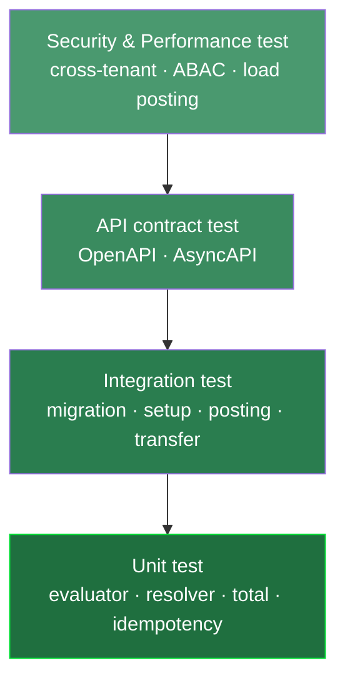
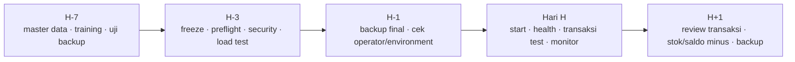

# Bagian 7 — Sprint Plan, Testing Checklist, dan Production Readiness

> **Status dokumen (AWCMS, tahap foundation-rebuild).** AWCMS baru berada
> pada tahap fondasi (lihat [ADR-0001](../adr/0001-rebuild-on-awcms-foundation-erp-scope.md))
> — **belum ada modul ERP (finance, inventory, procurement, manufacturing,
> HR/payroll) yang diimplementasikan**. Dokumen ini diadaptasi dari standar
> `awcms-mini` (base teknis yang sudah fully-implemented dan terverifikasi
> live di repo asalnya). Di sini, checklist/prosedur/target performa yang
> pada sumbernya berstatus "sudah terverifikasi live"/"tersedia" harus
> dibaca sebagai **rencana/target yang akan dijalankan begitu modul terkait
> ada** — bukan klaim bahwa AWCMS hari ini sudah lulus semuanya. Bagian yang
> menyebut sesuatu "sudah berjalan" merujuk pada mekanisme milik base
> `awcms-mini` yang diwarisi AWCMS, bukan pada modul ERP itu sendiri.

> **Contoh domain.** Dokumen sumber (`awcms-mini`) memakai domain
> retail/POS sebagai ilustrasi generik untuk aplikasi turunan apa pun. Untuk
> AWCMS, domain ERP (finance/accounting, inventory/warehouse, procurement,
> manufacturing, HR/payroll, dan integrasi payment gateway/marketplace/
> Coretax/logistik) BUKAN lagi ilustrasi — itu adalah skop produk
> sesungguhnya (lihat ADR-0001). **Pola & standar** di bawah (sprint
> discipline, testing pyramid, migration checklist, production readiness
> gate, go-live plan) tetap reusable dari `awcms-mini`; entitas/nama modul
> di bawah sudah disesuaikan ke ERP.

## Tujuan

Dokumen ini menetapkan rencana sprint, strategi testing, migration checklist, production readiness, backup/restore SOP, dan go-live checklist AWCMS.

## Prinsip sprint

1. Satu sprint menghasilkan progress nyata.
2. Semua perubahan database lewat migration.
3. API baru update OpenAPI.
4. Event baru update AsyncAPI.
5. High-risk mutation idempotent.
6. High-risk action audit log.
7. Soft delete untuk resource deletable; posted/append-only tetap immutable.
8. Dokumentasi sesuai implementasi.

## Sprint Plan 1–12 (target, ERP)

> Roadmap di bawah adalah **target perencanaan**, bukan status implementasi saat ini — Sprint 1 (Foundation) adalah satu-satunya sprint yang tumpang tindih dengan pekerjaan yang sudah ada di repo (docs/ADR/governance).

```mermaid
gantt
  title Roadmap Sprint AWCMS (target ERP)
  dateFormat X
  axisFormat S%s
  section Foundation
  S1 Foundation            :s1, 0, 1
  section Core
  S2 Tenant/Identity/Profile :s2, after s1, 1
  S3 RBAC/ABAC/RLS         :s3, after s2, 1
  S4 Finance/Accounting Core :s4, after s3, 1
  S5 Inventory & Warehouse MVP :s5, after s4, 1
  section Reliability
  S6 Logging & Pooling     :s6, after s5, 1
  S7 Procurement & Vendor  :s7, after s6, 1
  S8 Offline Sync & R2     :s8, after s7, 1
  section Ext modules
  S9 Manufacturing         :s9, after s8, 1
  S10 HR/Payroll & Tax/Coretax :s10, after s9, 1
  S11 UI/Reporting/Integrations :s11, after s10, 1
  S12 Production Readiness  :s12, after s11, 1
```



| Sprint | Fokus                        | Output utama                                              |
| -----: | ---------------------------- | ----------------------------------------------------------- |
|      1 | Repository Foundation        | Skeleton, migration runner, OpenAPI/AsyncAPI, health        |
|      2 | Tenant, Identity, Profile     | Tenant, office, setup, login, profile resolver               |
|      3 | RBAC, ABAC, RLS               | Role, policy, evaluator, decision log                        |
|      4 | Finance/Accounting Core       | Chart of account, jurnal, ledger entry, posting              |
|      5 | Inventory & Warehouse MVP     | Item master, stock balance, movement, warehouse/bin          |
|      6 | Logging & Pooling             | Structured log, audit, DB pool, backpressure                 |
|      7 | Procurement & Vendor          | PO, vendor, penerimaan barang, approval workflow             |
|      8 | Offline Sync & R2             | Sync push/pull, conflict, object queue                       |
|      9 | Manufacturing                 | BOM, work order, production posting                          |
|     10 | HR/Payroll & Tax/Coretax      | Payroll run, komponen gaji, tax profile, Coretax batch        |
|     11 | UI/UX, Reporting, Integrasi   | Admin UI, reports, integrasi payment gateway/marketplace/logistik |
|     12 | Production Readiness          | Workflow, security readiness, deployment, handover           |

## Sprint acceptance criteria ringkas

### Sprint 1

- `bun install` berhasil.
- `bun run build` berhasil.
- `bun run db:migrate` tersedia.
- `bun run api:spec:check` tersedia.
- `/api/v1/health` aktif.
- No secret committed.

### Sprint 2

- Tenant, office, owner dapat dibuat.
- Owner login berhasil.
- Profile resolver berjalan.
- Identifier dimasking.
- Setup locked.

### Sprint 3

- Role dan permission tersedia.
- ABAC default deny.
- Deny overrides allow.
- Decision log tercatat.
- Cross-tenant access blocked.

### Sprint 4

- Chart of account CRUD berjalan.
- Kode akun unique.
- Jurnal dan ledger entry berjalan.
- Akun inactive tidak bisa dipakai posting.
- Akun soft-deleted tidak muncul di list/search default dan tidak bisa dipakai posting.

### Sprint 5

- Item master, stock balance, dan movement berjalan.
- Posting stock movement atomic.
- Idempotency same key aman.
- Idempotency conflict 409.
- Stock lock dan rollback diuji.

### Sprint 6

- Correlation ID tersedia.
- Log diredaksi.
- Audit helper berjalan.
- Audit soft delete/restore/purge berjalan.
- Pool health endpoint aktif.
- Pool saturation terdeteksi.

### Sprint 7

- PO dan vendor CRUD berjalan.
- Approval workflow procurement berjalan.
- Penerimaan barang (goods receipt) berjalan.
- Idempotency pada posting penerimaan.

### Sprint 8

- Sync HMAC valid.
- Push/pull event berjalan.
- Duplicate event aman.
- Conflict tercatat.
- Object checksum diverifikasi.

### Sprint 9

- BOM dibuat.
- Work order dibuat dan diposting.
- Konsumsi bahan baku dan output produksi tercatat sebagai stock movement.

### Sprint 10

- Payroll run dan komponen gaji dibuat.
- Tax profile dan NITKU dibuat.
- Coretax batch XML-ready dan checksum.
- Data gaji/pajak dimasking.

### Sprint 11

- Admin shell tampil.
- Reports tenant-aware.
- Integrasi payment gateway/marketplace/logistik lewat outbox.

### Sprint 12

- Workflow approve/reject.
- Security readiness pass.
- Go-live gate blocking critical fail.
- Backup/restore SOP dan deployment profile tersedia.

## Testing Strategy



Piramida: banyak unit test di dasar, sedikit end-to-end di puncak; security & performance test mengawal.

> **E2E browser sungguhan (Playwright + Bun).** Base `awcms-mini` yang
> menjadi fondasi teknis AWCMS sudah menyediakan tooling nyata untuk lapisan
> ini (`playwright.config.ts` + `tests/e2e/*.e2e.ts`), dijalankan lewat
> `bun run test:e2e`, terpisah dari `bun test` (unit/integration/API-
> contract). AWCMS akan mengikuti pola yang sama begitu layar/endpoint ERP
> pertama ada — saat ini belum ada target E2E domain ERP untuk dijalankan.

> **Runner test.** Runner = **`bun test`** (`bun:test`), berkas di
> `tests/`. Daftar target di bawah bersifat **target rencana modul ERP**,
> bukan status implementasi hari ini — belum ada satu pun modul ERP
> (finance, inventory, procurement, manufacturing, HR/payroll) yang
> berjalan di repo AWCMS.

> **Belum ada modul domain nyata di AWCMS (berbeda dari `awcms-mini`).**
> Base sumber (`awcms-mini`) punya modul `blog_content` (CMS) yang sudah
> berjalan penuh dengan suite integration test lengkap sebagai contoh nyata
> non-ilustratif. AWCMS tidak mewarisi modul CMS tersebut sebagai bagian
> dari skop produk — modul pertama yang akan menjadi "contoh nyata, bukan
> ilustratif" di AWCMS adalah salah satu modul ERP inti (kandidat: Finance/
> Accounting Core, Sprint 4). Sampai modul itu ada, seluruh target
> unit/integration/contract di bawah adalah rencana.

### Unit test target

- ABAC evaluator.
- Profile resolver.
- Perhitungan harga/kurs.
- Perhitungan stock movement.
- Perhitungan total jurnal/ledger.
- Idempotency service.
- Transaction posting guard.
- Perhitungan VAT/PPh.
- Procurement/manufacturing status machine.
- Payroll component calculation.
- HMAC signature.
- AI tool policy (jika modul AI analyst diaktifkan).

### Integration test target

- Migration dari database kosong.
- Setup wizard.
- Login owner/operator.
- Chart of account & jurnal create.
- Opening stock/opening balance.
- Posting transaksi finansial.
- Stock berkurang/bertambah sesuai movement.
- Payroll run posting.
- Sync outbox event.
- VAT/tax invoice draft.
- Procurement/manufacturing workflow.
- ABAC dan RLS.

### API contract test

- OpenAPI valid.
- Success/error response standard.
- Tenant header ada.
- Idempotency header ada.
- Pagination konsisten.
- `includeDeleted`/restore/purge contract konsisten untuk resource soft-deletable.
- Sensitive data tidak tampil penuh.

### Security test

- Tenant A tidak bisa baca Tenant B.
- Role non-finance tidak bisa export Coretax/payroll.
- Role operasional tidak bisa assign role.
- Soft-deleted record tenant lain tetap tidak terlihat; archive view butuh permission.
- Password/token/API key tidak masuk response/log.
- NPWP/NIK/rekening bank/gaji dimasking.
- Sync HMAC invalid ditolak.
- AI raw PII/SQL ditolak (jika modul AI analyst diaktifkan).

### Performance test awal

| Area                          |               Target awal |
| ------------------------------ | -------------------------: |
| Pencarian item/produk           |                   < 300 ms |
| Tambah baris dokumen transaksi  |                   < 300 ms |
| Post transaksi finansial normal |                    < 1.5 s |
| Cetak dokumen (invoice/slip)    |                      < 3 s |
| Laporan keuangan harian         | < 2 s data kecil-menengah  |
| Pool acquire critical           |            < 500 ms normal |
| Sync push small batch           |                      < 2 s |

> **Suite performa berbasis generik (diwarisi dari `awcms-mini`).** Base
> teknis sudah menyediakan suite performa nyata dan berjalan:
> `bun run performance:suite`/`bun run performance:query-plan:check` —
> lihat dokumentasi base untuk detail mekanisme (fixture multi-tenant,
> skenario load/soak/saturasi, budget regresi query-plan). Tabel di atas
> adalah target ilustratif domain ERP AWCMS; suite performa itu sendiri
> perlu di-retarget dengan fixture/skenario ERP begitu modul terkait ada.

## Migration checklist

### Sebelum migration

- Backup database dibuat.
- Backup diverifikasi.
- Migration direview.
- Nomor migration benar.
- Tidak ada destructive SQL tanpa rencana.
- Soft-delete table memiliki kolom/index/partial unique yang benar bila diperlukan.
- RLS, index, constraint dicek.
- Recovery plan disiapkan.

### Saat migration

- Jalankan staging dulu.
- Jalankan berurutan.
- Catat start/end time.
- Stop jika error.

### Setelah migration

- Row count penting dicek.
- Constraint/index dicek.
- RLS aktif.
- API smoke test.
- Login test.
- Smoke test transaksi domain (mis. posting jurnal/stock movement begitu modul ada).
- Backup baru dibuat.

Mekanisme `bun run production:preflight` (diwarisi dari base) bersifat
**read-only** (config/security/connectivity/spec/test/build/pool-health/
migration-plan — tidak ada stage yang menulis). Menerapkan migrasi adalah
langkah terpisah dan eksplisit (`--apply-migrations --backup-verified
--acknowledge-target=<APP_ENV>`), hanya berjalan bila verdict preflight
`GO-LIVE DIIZINKAN`. Prosedur rehearsal staging → bukti backup → apply →
rollback lengkap: [`production-preflight-runbook.md`](production-preflight-runbook.md).

## Legacy migration checklist

- Backup legacy tersedia.
- Import ke schema `legacy` berhasil.
- Row count dihitung.
- Mapping table/field tersedia.
- Password legacy tidak digunakan ulang.
- Duplicate profile/master-data scan.
- Stock/saldo negative scan.
- Dry-run tanpa menulis final.
- Error/warning dicatat.

## Production readiness checklist

### Application

- Build pass.
- Migration pass (`migration:plan` stage bersih, dan apply — langkah
  terpisah, lihat §Migration checklist di atas — berhasil).
- API spec valid.
- Production preflight pass (`bun run production:preflight`, read-only;
  `APP_ENV=production` memblokir go-live bila `db:pool:health` skip).
- Setup wizard locked.
- Role default tersedia.
- ABAC default deny tested.
- RLS tested.
- Logging aktif.

### Database

- PostgreSQL version sesuai target.
- PostgreSQL tidak public.
- Least privilege DB user.
- Backup aktif.
- Restore tested.
- Index utama tersedia.
- Partial index soft delete tersedia untuk resource yang sering di-list.
- Pool sehat.
- Slow query monitoring.

### Security

- No hardcoded secret.
- `.env` permission aman.
- Password hash modern.
- Login lockout.
- RLS aktif.
- ABAC aktif.
- Audit log aktif.
- Soft delete/restore/purge audit aktif; purge dibatasi retention/legal (lihat [`data-lifecycle.md`](data-lifecycle.md) — retensi finansial/payroll ERP umumnya lebih ketat daripada retensi konten CMS).
- Tax data masking.
- Data payroll/HR masking.
- AI read-only (jika modul AI analyst diaktifkan).
- Sync HMAC jika hybrid.
- Error tidak expose stack trace.

## Backup SOP ringkas

Command contoh (konsep dasar; implementasi nyata diwarisi dari base
`deploy/backup/backup-postgres.sh`, dikeraskan dengan enkripsi + manifest
bertanda tangan — lihat `deploy/backup/README.md` untuk command lengkap
dan model keamanannya, jangan jalankan `pg_dump` polos di bawah ini
langsung terhadap production):

```bash
pg_dump --format=custom --file=/backup/awcms_$(date +%Y%m%d_%H%M%S).dump "$DATABASE_URL"
```

Checklist:

- File backup terbentuk.
- Ukuran masuk akal.
- Checksum dibuat.
- Disimpan aman.
- Tidak public.
- Retention diterapkan.
- Restore diuji.

## Restore SOP ringkas

Command contoh (konsep dasar; implementasi nyata adalah
`deploy/backup/restore-postgres.sh`, yang memverifikasi manifest HMAC +
checksum dump SEBELUM mutasi apa pun — lihat `deploy/backup/README.md`):

```bash
createdb awcms_restore_test
pg_restore --dbname=awcms_restore_test --clean --if-exists /backup/awcms_YYYYMMDD_HHMMSS.dump
```

Validasi:

- Tenant terbaca.
- User terbaca.
- Master data/transaksi ERP terbaca (begitu modul terkait ada).
- Login test.
- Smoke test modul aktif.
- Report smoke test.

`deploy/backup/restore-drill.sh` mengotomasi restore drill terjadwal:
backup → restore ke database disposable → verifikasi migrasi schema,
tenant isolation (RLS), dan sample record → laporan RTO/RPO.

`bun run resilience:dr-drill` (lihat
[`resilience-dr-verification.md`](resilience-dr-verification.md))
memperluas ini menjadi failure-injection terkontrol: disconnect
PostgreSQL (level klien), pool saturation, worker interruption (SIGTERM
nyata), dan partial provider outage (SSO/email — R2 cross-verified),
plus tier `--full` yang menjalankan `restore-drill.sh` di atas. Interlock
keamanannya menolak eksekusi secara default terhadap target mirip-produksi
tanpa kemungkinan override untuk `APP_ENV=production`.

## Go-live plan



### H-7

- Finalisasi master data (akun, item, vendor, karyawan) dan user.
- Training admin/operator.
- Uji backup restore.
- Uji posting transaksi domain aktif.

### H-3

- Freeze fitur besar.
- Production preflight.
- Security readiness.
- Pool load test.
- Review critical finding.
- Rollback plan.

### H-1

- Backup final.
- Saldo/stok awal final.
- Cek user operator.
- Cek integrasi eksternal (payment gateway/marketplace/logistik/Coretax).
- Cek SOP darurat.

### Hari H

- Start aplikasi.
- Health check.
- Login admin/operator.
- Transaksi kecil test.
- Cetak dokumen test (jika ada).
- Monitor log/error/pool.

### H+1

- Review transaksi hari pertama.
- Review stok/saldo minus.
- Review failed integration/outbox.
- Review sync conflict.
- Backup setelah hari pertama.

## Definition of MVP Ready

- Tenant setup.
- Owner/operator login.
- Master data dan saldo/stok awal.
- Posting transaksi domain inti (mis. jurnal atau stock movement).
- Idempotency berjalan.
- Audit log.
- Backup/restore tested.

## Definition of Production Ready

- MVP selesai.
- Security readiness pass.
- No critical finding.
- Pool health pass.
- RLS dan ABAC tested.
- Modul aktif (finance/inventory/procurement/manufacturing/HR-payroll/integrasi) tested sesuai skop yang di-deploy.
- SOP dan handover selesai.
</content>
