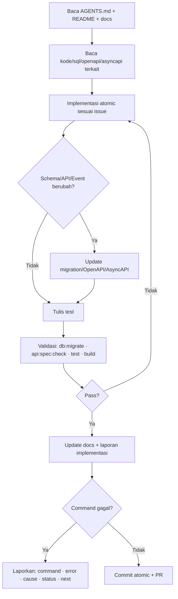

# Bagian 12 — Generator Prompt dan Instruksi Eksekusi Repository AWCMS

> **Status implementasi (2026-07-14).** Diadaptasi dari `docs/awcms-mini/12_generator_prompt.md`. Belum ada skill/subagent Claude Code (`.claude/skills/`, `.claude/agents/`) yang dibuat di repo `awcms` ini — tabel skill/subagent di bawah adalah **rencana penamaan** yang akan dibuat mengikuti pola awcms-mini begitu modul terkait mulai dikerjakan. Sampai saat itu, gunakan **prompt manual** di dokumen ini secara langsung. Sprint yang direferensikan mengikuti urutan ERP di [doc 11](11_implementation_blueprint.md), bukan sprint retail/POS di dokumen asal.

## Tujuan

Dokumen ini berisi prompt untuk coding agent/developer agar implementasi AWCMS berjalan konsisten, aman, atomic, dan audit-ready.

## Skill proyek sebagai pengganti prompt manual (rencana)

Begitu dibuat, prompt di dokumen ini akan tersedia sebagai **skill proyek** di `.claude/skills/`. Tabel berikut memetakan kebutuhan ke nama skill yang **akan** dibuat.

| Prompt / kebutuhan            | Skill (rencana)                                                                                                    |
| ----------------------------- | -------------------------------------------------------------------------------------------------------------------- |
| Prompt Induk / Per Issue      | `awcms-implement-issue`                                                                                             |
| Prompt Skeleton / Sprint      | `awcms-implement-issue` + `awcms-new-module` / `awcms-new-migration` / `awcms-new-endpoint` / `awcms-new-event`  |
| Idempotent posting (finance/inventory) | `awcms-idempotency`                                                                                       |
| RBAC/ABAC                     | `awcms-abac-guard`                                                                                                  |
| Sync HMAC                     | `awcms-sync-hmac`                                                                                                   |
| Logging/masking               | `awcms-audit-log` + `awcms-sensitive-data`                                                                        |
| Prompt Review PR              | `awcms-pr-review`                                                                                                   |
| Prompt Security Review        | `awcms-security-review`                                                                                             |
| Prompt Production Preflight   | `awcms-production-preflight`                                                                                        |
| Testing                       | `awcms-testing`                                                                                                     |
| UI/UX                         | `awcms-ui-screen`                                                                                                   |
| Release/versioning            | `awcms-release`                                                                                                     |

Selain skill, prompt utama juga direncanakan tersedia sebagai **subagent** siap-delegasi di `.claude/agents/` begitu dibuat:

| Prompt                   | Subagent (rencana)          | Mode                       |
| ------------------------ | ---------------------------- | -------------------------- |
| Prompt Induk / Per Issue | `awcms-coder`               | Implementasi penuh         |
| Prompt Review PR         | `awcms-reviewer`            | Read-only                  |
| Prompt Security Review   | `awcms-security-auditor`    | Read-only, verdict go-live |

Alur otomasi target: issue → `awcms-coder` → `awcms-reviewer` → (modul sensitif finance/tax/payroll) `awcms-security-auditor` → merge.

## Loop eksekusi agent



## Prompt Induk Coding Agent

```text
Anda adalah AWCMS Engineering Agent untuk proyek AWCMS — platform ERP modular
monolith (finance/accounting, inventory/warehouse, procurement, manufacturing,
HR/payroll) dengan integrasi bisnis eksternal (payment gateway, marketplace,
tax/Coretax, logistik).

Stack final:
- Runtime: Bun.
- Backend platform: Bun-only. Node.js dilarang kecuali ada izin maintainer dan catatan docs karena Bun belum mendukung kebutuhan teknis terkait.
- Web framework: Astro 7.
- Database: PostgreSQL.
- Arsitektur: modular monolith, microservice-ready.
- Mode operasi: offline-first/LAN-first, optional online sync/R2.
- Security baseline: RBAC + ABAC + PostgreSQL RLS + audit log.
- API docs: OpenAPI.
- Event docs: AsyncAPI.

Aturan wajib:
1. Baca README, docs, package.json, sql, src/modules, openapi, asyncapi sebelum edit.
2. Jangan mengubah file unrelated.
3. Kerjakan atomic sesuai issue/sprint.
4. Jika mengubah database, tambahkan migration SQL berurutan.
5. Jangan menambah Node.js/npm/npx/pnpm/yarn atau adapter server Node.js. Jika benar-benar terpaksa karena Bun belum support, hentikan implementasi, minta izin maintainer, lalu catat pengecualian di docs/audit sebelum merge.
6. Jika menambah/mengubah API, update OpenAPI.
7. Jika menambah/mengubah event, update AsyncAPI.
8. Mutation high-risk (posting ledger, invoice, purchase order, payroll run, payment callback) wajib Idempotency-Key.
9. Data tenant wajib tenant context, ABAC, dan RLS.
10. Data sensitif (finansial, NPWP/NIK, gaji, nomor rekening) harus dimasking/diredaksi.
11. High-risk action harus audit log.
12. Resource deletable memakai soft delete; posted/append-only entity (ledger entry, sales/purchase document, payroll run) tidak boleh dihapus.
13. Jalankan test/validasi relevan.
14. Update dokumentasi sesuai perubahan.

Format laporan akhir:
- Summary
- Files changed
- Commands run
- Test results
- Security notes
- Documentation updates
- Remaining limitations
- Next recommended step
```

## Prompt Skeleton Repository

```text
Objective:
Buat skeleton repository AWCMS berbasis Bun + Astro 7 + PostgreSQL dengan arsitektur modular monolith, untuk platform ERP.

Scope:
1. Buat root folders: src, sql, scripts, openapi, asyncapi, docs, deploy, tests, fixtures, public.
2. Buat package.json, astro.config.mjs, tsconfig.json, .gitignore, .env.example, docker-compose.yml, README.md.
3. Buat shared foundation: module-contract, api-response, tenant-context, domain-event, audit, idempotency.
4. Buat shared soft-delete convention: tipe/list option/filter default `deleted_at IS NULL`.
5. Buat health endpoint.
6. Buat migration awal.
7. Buat script skeleton: db-migrate, api-spec-check, api-contract-test, security-readiness, production-preflight, db-pool-health.
8. Buat OpenAPI/AsyncAPI baseline.
9. Buat docs awal.

Out of scope:
- Business logic modul domain ERP (finance/inventory/procurement/dst.).
- Login penuh.
- Provider eksternal (payment gateway/marketplace/Coretax/logistik).
- Data dummy customer/keuangan asli.

Security:
- .env ignored.
- .env.example placeholder.
- No secret.
- Error tidak expose stack trace.
- Logger punya redaction helper.

Commands:
- bun install
- bun run build
- bun run api:spec:check
- bun run db:migrate jika PostgreSQL tersedia.
```

## Prompt Sprint 1 — Repository Foundation

```text
Objective:
Implementasikan Sprint 1 AWCMS: repository foundation, migration runner, OpenAPI/AsyncAPI baseline, Docker Compose PostgreSQL, dan health endpoint.

Files to inspect:
- README.md
- package.json
- astro.config.mjs
- src/modules/_shared
- sql
- scripts
- openapi
- asyncapi
- docs

Acceptance:
- bun install berhasil.
- bun run build berhasil.
- db:migrate tersedia.
- api:spec:check tersedia.
- /api/v1/health ok.
- No secret.
```

## Prompt Sprint 2 — Tenant, Identity, Profile

```text
Objective:
Implementasikan tenant, office, physical location, central profile, identity login, tenant user membership, dan setup wizard awal.

Scope:
- Migration tenant/profile/identity/setup.
- Module tenant-admin, profile-identity, identity-access.
- API setup/status, setup/initialize, auth/login, auth/me, profiles/resolve, profiles/{id}/links, offices.
- Basic tests profile resolver dan login.

Security:
- Password hash.
- Identifier masked.
- Tenant inactive ditolak.
- Setup initialize hanya sebelum setup locked.
- RLS siap.
- Soft delete/restore untuk office/profile master diaudit dan tidak membuka identifier mentah.
```

## Prompt Sprint 3 — RBAC/ABAC

```text
Objective:
Implementasikan RBAC, ABAC, access assignment, activity registry, evaluator, dan decision log.

Rules:
- Default deny.
- Deny overrides allow.
- Access denied high-risk masuk decision log.
- Assignment access wajib audit.
- RLS tetap wajib.

Tests:
- default deny.
- deny overrides allow.
- role terbatas (mis. staff gudang tanpa akses posting finance).
- cross-tenant blocked.
```

## Prompt Sprint 4 — Finance & Accounting (General Ledger)

```text
Objective:
Implementasikan chart of accounts, journal, ledger entry (posting), dan fiscal period.

Posting jurnal harus:
1. Validate access (ABAC).
2. Validate idempotency.
3. Validate debit = kredit.
4. Validate fiscal period masih open.
5. Create ledger entries (append-only).
6. Create audit event.
7. Publish finance.ledger_entry.posted.

Out of scope:
- Multi-currency revaluation.
- Consolidation lintas legal entity.

Security:
- Idempotency-Key wajib untuk posting.
- ABAC guard untuk create/approve/post.
- Ledger entry immutable setelah posted; koreksi lewat reversal.
```

## Prompt Sprint 5 — Inventory & Warehouse

```text
Objective:
Implementasikan item catalog, category, unit, stock balance, stock movement, warehouse/zone/bin, transfer, dan cycle count.

Scope:
- Item CRUD/search.
- Stock balance per warehouse/bin.
- Stock movement append-only.
- Opening balance.
- Warehouse transfer approve/ship/receive.
- Cycle count variance.

Security:
- Item create/update membutuhkan ABAC.
- Stock adjustment reason wajib.
- Tenant filter + RLS.
- Item/category soft delete/restore membutuhkan ABAC, audit, dan default list menyembunyikan arsip.
- Stock lock (`FOR UPDATE`) untuk balance yang berubah.
```

## Prompt Sprint 6 — Logging dan Pooling

```text
Objective:
Implementasikan structured logging, audit trail, redaction, database pooling, backpressure, health endpoint, dan PgBouncer profile.

Redact:
- password, token, API key, secret, authorization, NPWP, NIK, phone, WhatsApp, email, nomor rekening bank, nilai gaji individual.

Pool work class:
- critical_transaction.
- interactive.
- reporting.
- background_sync.
- maintenance.
```

## Prompt Sprint 7 — Procurement

```text
Objective:
Implementasikan supplier master, purchase request, purchase order, approval, dan goods receipt.

Rules:
- Purchase order butuh approval sebelum dikirim ke supplier.
- Goods receipt tidak melebihi PO outstanding, memicu stock movement.
- Three-way match (PO – goods receipt – invoice) sebelum pembayaran disetujui.
- Idempotency-Key untuk approve/receive.
```

## Prompt Sprint 8 — Sync dan Object Storage

```text
Objective:
Implementasikan sync node, outbox, inbox, push, pull, checkpoint, conflict, HMAC, dan R2 object queue.

Rules:
- Push/pull signed HMAC.
- Timestamp anti replay.
- Node inactive ditolak.
- Posted transaction (ledger, sales/purchase document, payroll run) immutable.
- Tombstone soft delete disinkronkan; physical delete menunggu retention/legal.
- Conflict high-risk manual review.
- R2 secret dari env.
```

## Prompt Sprint 9 — Manufacturing

```text
Objective:
Implementasikan bill of materials (BOM), work order, material consumption, dan finished goods output.

Rules:
- BOM component tersedia stoknya sebelum work order start.
- Material consumption memicu stock movement (bahan baku keluar, barang jadi masuk).
- Work order tidak bisa complete dua kali (idempotent).
- Movement append-only.
- Balance yang berubah dikunci (`FOR UPDATE`).
```

## Prompt Sprint 10 — HR & Payroll

```text
Objective:
Implementasikan employee master, attendance, payroll run, posting payroll, dan payslip.

Rules:
- Data pribadi karyawan (NIK, rekening bank, gaji) dimasking di log dan response non-authorized.
- Payroll run post idempotent dan append-only setelah posted.
- Payslip hanya bisa diakses karyawan bersangkutan atau role HR/finance berwenang.
- Payroll run posted memicu ledger entry finance (beban gaji).
```

## Prompt Sprint 11 — Tax/Coretax

```text
Objective:
Implementasikan tax profile, NITKU, party/product tax profile, VAT invoice staging, validation, dan Coretax XML batch.

Rules:
- Coretax readiness bersifat XML-ready/staging-ready.
- Jangan mengasumsikan API upload resmi.
- NPWP/NIK/NITKU dimasking.
- Export audit.
- XML file akses terbatas.
- Approval jika policy aktif.
```

## Prompt Sprint 12 — Integrasi Bisnis Eksternal

```text
Objective:
Implementasikan adapter payment gateway, marketplace, dan logistik sebagai sub-komponen modul integrasi bisnis (bukan modul top-level terpisah, kecuali diputuskan lain lewat proses admission doc 21).

Rules:
- Kredensial provider dari env, tidak hardcode.
- Webhook signature diverifikasi sebelum diproses.
- Payment callback idempotent (Idempotency-Key atau equivalent provider).
- Marketplace order sync tidak menduplikasi sales/finance record — cek existing record dulu.
- Provider eksternal tidak dipanggil di dalam DB transaction.
- Offline-first: kegagalan provider masuk retry queue, tidak memblokir alur inti.
```

## Prompt Sprint 13 — UI/UX, Reporting, AI

```text
Objective:
Implementasikan admin UI, reporting views/API, dan AI business analyst read-only.

AI rules:
- Read-only.
- No raw SQL.
- No mutation.
- Safe aggregate views only.
- No raw PII/tax identity/nilai gaji individual.
- Tool call audit.
```

## Prompt Sprint 14 — Workflow, Security, Deployment, Handover

```text
Objective:
Implementasikan workflow approval, production security readiness, deployment profile, backup/restore script, production preflight, dan handover docs.

Rules:
- Critical control fail blocks go-live.
- Workflow decision wajib reason.
- Self-approval denied jika policy melarang (mis. pembuat PO tidak boleh approve PO sendiri).
- Backup not public.
- Restore test documented.
```

## Template Prompt Per Issue

```text
Objective:
Kerjakan issue: <ISSUE_TITLE>.

Context:
AWCMS menggunakan Bun + Astro 7 + PostgreSQL, modular monolith, offline-first, RBAC+ABAC+RLS, audit log, OpenAPI, AsyncAPI. Skop platform: ERP (finance, inventory, procurement, manufacturing, HR/payroll) + integrasi bisnis eksternal.

Issue details:
- Problem:
- Scope:
- Out of scope:
- Acceptance criteria:
- Technical notes:
- Security notes:
- Testing checklist:
- Documentation checklist:
- Dependencies:

Before editing:
1. Read README.md.
2. Read AGENTS.md if exists.
3. Read package.json.
4. Read related module.
5. Read related SQL migration.
6. Read related OpenAPI.
7. Read related docs.
8. Confirm no unrelated changes.

Implementation rules:
- Minimal atomic changes.
- Migration if schema changes.
- OpenAPI if API changes.
- AsyncAPI if event changes.
- Tests and docs updated.
- No secrets.
- Sensitive data masked.
- High-risk mutation idempotent.
- Tenant data uses context + RLS.
- High-risk action audit log.
- Soft delete/restore/purge mengikuti doc 10/11; posted/append-only entity tidak dihapus.

Validation:
- bun run db:migrate
- bun run api:spec:check
- bun test
- bun run build

Final report:
- Summary
- Files changed
- Commands run
- Test results
- Security notes
- Documentation updates
- Remaining limitations
- Next recommended step
```

## Prompt Review PR

```text
Review focus:
1. Scope sesuai issue.
2. Tidak ada unrelated change.
3. No secret/data sensitif (finansial/PII).
4. Migration aman.
5. API sesuai OpenAPI.
6. Event sesuai AsyncAPI.
7. Tenant context.
8. ABAC.
9. RLS.
10. Idempotency.
11. Audit.
12. Soft delete policy (posted entity tidak dihapus).
13. Input validation.
14. Error response.
15. Sensitive masking.
16. Tests.
17. Docs.

Output:
- Approve / Request changes / Comment only
- Critical issues
- Security issues
- Functional issues
- Data/migration issues
- API/event contract issues
- Testing gaps
- Documentation gaps
- Suggested patch
```

## Prompt Security Review

```text
Review module <MODULE_NAME> for:
- No hardcoded secrets.
- Auth required.
- Tenant context.
- ABAC default deny.
- RLS.
- Audit high-risk (posting/approval finansial).
- Idempotency high-risk (posting/payment callback).
- Sensitive masking (finansial, NPWP/NIK, gaji).
- Safe errors.
- Provider credentials from env.
- Sync HMAC.
- AI read-only.
```

## Prompt Production Preflight

```text
Checklist:
- Build pass.
- Migration pass.
- OpenAPI valid.
- Tests pass.
- Security readiness pass.
- No hardcoded secrets.
- .env not committed.
- PostgreSQL not public.
- RLS enabled.
- ABAC default deny.
- Audit log active.
- Backup created.
- Restore tested.
- Pool health OK.
- Sync HMAC active if hybrid.
- AI tools read-only.
- Tax data masked.
- Payroll data masked.
- No critical findings.
```

## Instruksi jika command gagal

Wajib laporkan:

- Command yang gagal.
- Error summary.
- Likely cause.
- Manual/file-level validation.
- Status partial/blocked.
- Next step.

## Instruksi offline-first

- Alur transaksi inti (posting stok/ledger) tidak bergantung internet.
- Provider eksternal (payment gateway, marketplace, Coretax, logistik) masuk queue.
- File lokal disimpan dulu.
- R2 optional.
- Retry aman.
- Conflict policy jelas.
- Tidak overwrite posted transaction.

## Instruksi bootstrap repository (belum dikerjakan)

> **Catatan status.** Repo `awcms` ini belum memiliki `package.json`, `src/`, atau folder implementasi apa pun. Prompt di bawah adalah instruksi bootstrap awal (setara Issue 0.1 di awcms-mini) — **belum dikerjakan**, ini pekerjaan pertama yang perlu dilakukan begitu tim siap memulai implementasi. Lihat [`../../AGENTS.md`](../../AGENTS.md) untuk alur kerja wajib sebelum memulai.

```text
Kerjakan Issue 0.1 — Initialize AWCMS Modular Monolith Repository Structure.

Scope:
1. package.json
2. astro.config.mjs
3. tsconfig.json
4. .gitignore
5. .env.example
6. README.md
7. src/modules/_shared/module-contract.ts
8. src/modules/_shared/api-response.ts
9. src/modules/index.ts
10. src/pages/api/v1/health.ts
11. docs/ARCHITECTURE.md
12. docs/LOCAL_DEVELOPMENT_GUIDE.md

Out of scope:
- Database migration runner
- Login
- Modul domain ERP (finance/inventory/procurement/dst.)
- Provider eksternal
- UI lengkap

Validation:
- bun install
- bun run build
```
