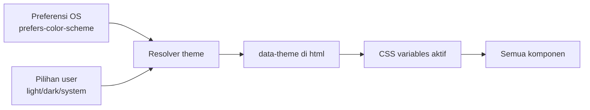
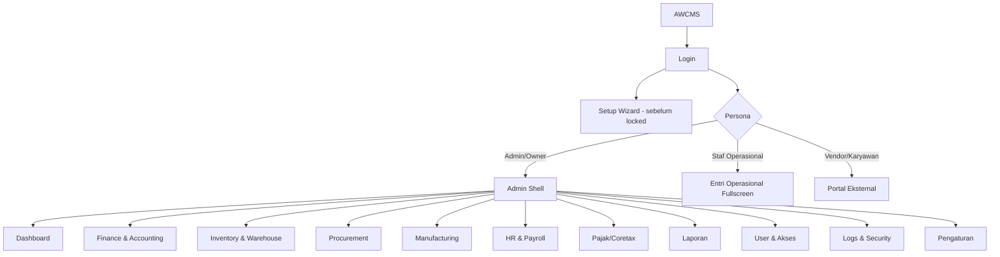
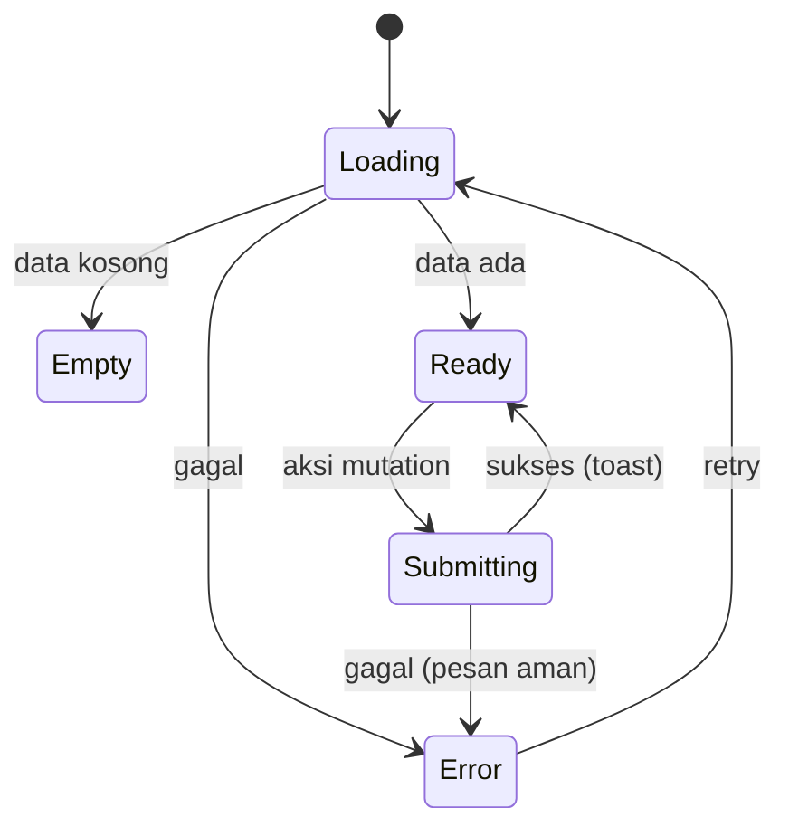
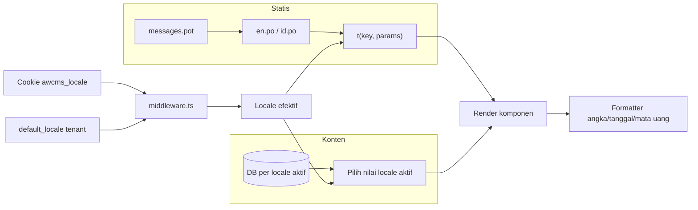

# Bagian 14 — UI/UX Design System dan Spesifikasi Layar

> **Status dokumen (2026-07-14):** Repo `awcms` masih pada tahap fondasi ulang ([ADR-0001](../adr/0001-rebuild-on-awcms-foundation-erp-scope.md)) — **belum ada kode modul ERP yang diimplementasikan**. Dokumen ini mengadaptasi standar/pola design system yang sudah terbukti di base [awcms-mini](https://github.com/ahliweb/awcms-mini) menjadi **arsitektur target** untuk platform ERP AWCMS. Bagian yang di awcms-mini sudah live (token, komponen konkret seperti `DataTable.astro`/`ConfirmDialog.astro`, i18n) di sini direframe sebagai **rencana yang mengikat** saat modul terkait mulai dibangun, bukan sesuatu yang sudah berjalan di repo ini. Contoh layar/komponen diganti ke domain ERP (ledger, purchase order, stock adjustment, payroll run) menggantikan contoh retail/POS di sumber.

## Tujuan

Dokumen ini menetapkan kebutuhan **desain UI/UX** AWCMS yang akan melengkapi SOP operasional dan blueprint modul saat ditulis. Berisi design principle, design token, component library, information architecture, spesifikasi layar (wireframe), state pattern, aksesibilitas, i18n, dan theming — agar frontend ERP dapat diimplementasikan konsisten sejak modul pertama dibangun.

Terkait: `15_frontend_architecture_integration.md` (arsitektur & wiring), dokumen SOP operasional (menyusul). Skill penegak yang direncanakan: **`awcms-ui-screen`** (`.claude/skills/`, mengikuti pola `awcms-mini-ui-screen`).

## Prinsip desain UI/UX

1. **Offline-first terlihat** — status koneksi & sync selalu jelas; aksi tetap bisa saat offline (mis. input stok gudang tanpa koneksi LAN).
2. **Keyboard-first untuk operator entri tinggi-volume** — semua aksi entri jurnal/kasir gudang/hitung stok dapat tanpa mouse.
3. **Role-aware** — navigasi & aksi menyesuaikan permission (bukan kontrol utama; backend tetap validasi RBAC/ABAC).
4. **State eksplisit** — setiap layar punya loading, empty, error, dan success state.
5. **Aman** — tidak menampilkan data sensitif penuh (gaji, rekening, NPWP); mengikuti aturan masking data.
6. **Aksesibel** — target WCAG 2.1 AA, kontras cukup, fokus terlihat, navigasi keyboard.
7. **Responsif** — admin/back-office desktop-first, entri lapangan (gudang/produksi) fullscreen-tablet, portal vendor/karyawan mobile-first.
8. **Konsisten** — semua layar memakai token & komponen yang sama lintas modul ERP (finance, inventory, procurement, manufacturing, HR/payroll).

## Design tokens

Token diimplementasikan sebagai CSS custom properties, di-scope ke `:root` dan override via `:root[data-theme="dark"]`. Nilai berikut adalah **placeholder brand-neutral** yang boleh diganti brand tenant.

### Warna semantik

| Token                      | Light     | Dark      | Fungsi                  |
| --------------------------- | --------- | --------- | ------------------------ |
| `--color-bg`               | `#f7f8fa` | `#0e1116` | Latar aplikasi          |
| `--color-surface`          | `#ffffff` | `#161b22` | Kartu/panel             |
| `--color-surface-2`        | `#eef1f5` | `#1f262e` | Panel sekunder          |
| `--color-border`           | `#d8dee6` | `#2b333c` | Garis/pembatas          |
| `--color-text`             | `#1a1f26` | `#e6edf3` | Teks utama              |
| `--color-text-muted`       | `#5b6672` | `#9aa7b2` | Teks sekunder           |
| `--color-primary`          | `#2563eb` | `#3b82f6` | Aksi utama              |
| `--color-primary-contrast` | `#ffffff` | `#ffffff` | Teks di atas primary    |
| `--color-success`          | `#16a34a` | `#22c55e` | Sukses/posted           |
| `--color-warning`          | `#d97706` | `#f59e0b` | Peringatan/held/pending approval |
| `--color-danger`           | `#dc2626` | `#ef4444` | Error/saldo tidak cukup |
| `--color-info`             | `#0891b2` | `#06b6d4` | Info/sync               |
| `--color-focus`            | `#2563eb` | `#60a5fa` | Cincin fokus            |
| `--color-primary-strong`   | `#2563eb` | `#3472d8` | Fill solid + teks putih |
| `--color-success-strong`   | `#12873d` | `#178841` | Fill solid + teks putih |
| `--color-danger-strong`    | `#dc2626` | `#d73d3d` | Fill solid + teks putih |

> **`-strong` vs token polos.** `--color-primary`/`--color-success`/`--color-danger` polos ditujukan untuk dipakai sebagai _teks/ikon/border_ di atas `--color-surface`/`--color-surface-2` — kontras yang diperlukan berbeda dari kasus _fill solid_ + `--color-primary-contrast` (putih) di atasnya (tombol CTA, banner error, status pill solid seperti "Posted"/"Rejected"). Diukur (formula WCAG relative-luminance): token polos dengan teks putih hanya 3.19–3.76:1 di beberapa kombinasi (di bawah AA 4.5:1). Token `-strong` adalah varian yang di-gelapkan secukupnya (khusus tema gelap; tema terang sebagian sudah lulus tanpa perlu digelapkan) agar teks putih di atasnya selalu ≥4.5:1 — pakai token ini, bukan yang polos, setiap kali `--color-primary-contrast` dirender langsung di atas fill warna semantik. **Rencana**: audit kontrasnya sendiri harus diulang saat token ini diimplementasikan di repo ini, bukan diasumsikan otomatis identik.

### Skala lain

| Kategori    | Token                                   | Nilai                                     |
| ----------- | ---------------------------------------- | ------------------------------------------ |
| Font family | `--font-sans`                           | system-ui, Inter, sans-serif              |
| Font mono   | `--font-mono`                           | ui-monospace, monospace (angka/kode akun/SKU) |
| Font size   | `--fs-xs..2xl`                          | 12 · 14 · 16 · 18 · 20 · 24 · 32 px       |
| Spacing     | `--sp-1..8`                             | 4 · 8 · 12 · 16 · 24 · 32 · 48 · 64 px    |
| Radius      | `--radius-sm/md/lg/full`                | 4 · 8 · 12 · 9999 px                      |
| Shadow      | `--shadow-sm/md/lg`                     | elevasi kartu/dialog                      |
| Z-index     | `--z-nav/drawer/dropdown/dialog/toast`  | 100 · 150 · 200 · 300 · 400               |
| Breakpoint  | `sm/md/lg/xl`                           | 640 · 768 · 1024 · 1280 px                |

### Theming



Aturan yang direncanakan: default `system`; pilihan personal per-browser disimpan di localStorage (selalu menang bila ada) dengan fallback ke preferensi tenant `awcms_tenants.default_theme` (dapat diubah admin di `/admin/settings`) untuk browser yang belum pernah memilih; `data-theme` di-set pada `<html>` sebelum paint untuk mencegah flash.

## Component library

Komponen dasar direncanakan di `src/components/ui`, dipakai lintas persona dan lintas modul ERP.

| Komponen                                  | Catatan penting                                                                                                                                                                                                                                                                                                                                                                                                                                                                                                                                                                                                                                     |
| ------------------------------------------ | ---------------------------------------------------------------------------------------------------------------------------------------------------------------------------------------------------------------------------------------------------------------------------------------------------------------------------------------------------------------------------------------------------------------------------------------------------------------------------------------------------------------------------------------------------------------------------------------------------------------------------------------------------- |
| Button                                    | varian primary/secondary/ghost/danger; state loading & disabled                                                                                                                                                                                                                                                                                                                                                                                                                                                                                                                                                                                     |
| Input / NumberInput                       | label, hint, error; NumberInput untuk qty/harga/nominal jurnal (mono)                                                                                                                                                                                                                                                                                                                                                                                                                                                                                                                                                                               |
| Select / Combobox                         | Combobox mendukung search akun/produk/vendor/karyawan                                                                                                                                                                                                                                                                                                                                                                                                                                                                                                                                                                                               |
| Checkbox / Radio / Switch                 | switch untuk consent & feature toggle                                                                                                                                                                                                                                                                                                                                                                                                                                                                                                                                                                                                               |
| Dialog / Drawer                           | fokus terperangkap, `Esc` menutup — direncanakan sebagai `<dialog>` native (`showModal()` menyediakan focus trap + Esc-to-close bawaan browser) untuk konfirmasi aksi destruktif (mis. void jurnal, batalkan PO), menggantikan pola `window.confirm`/`window.prompt`. Sidebar admin sendiri (drawer mobile) BUKAN `<dialog>` — tetap `<nav>` statis di desktop, focus trap-nya ditulis manual.                                                                                                                                                                                                                                                    |
| Toast                                     | sukses/error/info; non-blocking                                                                                                                                                                                                                                                                                                                                                                                                                                                                                                                                                                                                                     |
| Table / DataGrid                          | sort, pagination keyset, kolom sticky, row density — dipakai untuk daftar entri jurnal, purchase order, stock adjustment, payroll run; shell scroll-container + `<caption>` aksesibel + empty-row standar; row rendering (badge, form, tombol per baris) tetap tanggung jawab pemanggil                                                                                                                                                                                                                                                                                                                                                          |
| Badge / StatusPill                        | status lifecycle (draft/pending approval/posted/rejected/void/quarantine) berkode warna — varian `success/warning/danger/info/neutral`, memakai token `-strong` untuk fill+teks putih kecuali `warning` yang memakai teks gelap tetap agar AA di kedua tema                                                                                                                                                                                                                                                                                                                                                                                        |
| ArchiveFilter                             | toggle/filter `aktif`, `arsip`, `semua` untuk role berizin                                                                                                                                                                                                                                                                                                                                                                                                                                                                                                                                                                                          |
| Card / Panel                              | kontainer konten                                                                                                                                                                                                                                                                                                                                                                                                                                                                                                                                                                                                                                     |
| FormField                                 | membungkus label+input+error konsisten — wrapper label/hint/error dengan slot default untuk kontrol asli (caller tetap mengatur `type`/`name`/`required`)                                                                                                                                                                                                                                                                                                                                                                                                                                                                                          |
| Tabs                                      | detail entity (akun, purchase order, produk, karyawan)                                                                                                                                                                                                                                                                                                                                                                                                                                                                                                                                                                                              |
| Pagination                                | keyset (next/prev), bukan offset besar — dua tombol prev/next yang men-dispatch `CustomEvent("awcms:paginate")`                                                                                                                                                                                                                                                                                                                                                                                                                                                                                                                                     |
| `FilterBar`                               | toolbar kontainer untuk kontrol filter list (`role="search"` + label wajib); tidak menangani logic filter itu sendiri — tetap tanggung jawab halaman, sama seperti `DataTable`                                                                                                                                                                                                                                                                                                                                                                                                                                                                     |
| `ActionBanner`                            | banner feedback sukses/error pasca-mutation (`role="alert"`); dipakai konsisten oleh `showBanner()` di helper klien admin (lihat doc 15) tanpa duplikasi manual per layar                                                                                                                                                                                                                                                                                                                                                                                                                                                                          |
| SearchBar                                 | debounce, hasil cepat (target <300ms)                                                                                                                                                                                                                                                                                                                                                                                                                                                                                                                                                                                                               |
| EmptyState / ErrorState / LoadingSkeleton | wajib untuk tiap list/detail                                                                                                                                                                                                                                                                                                                                                                                                                                                                                                                                                                                                                         |
| KeyboardHint                              | menampilkan shortcut aktif di layar entri tinggi-volume (jurnal, penerimaan barang, stock opname)                                                                                                                                                                                                                                                                                                                                                                                                                                                                                                                                                   |
| SyncIndicator / OfflineBanner             | status koneksi & antrean sync                                                                                                                                                                                                                                                                                                                                                                                                                                                                                                                                                                                                                       |
| MoneyText / MaskedText                    | format IDR & masking data sensitif (gaji, rekening bank, NPWP)                                                                                                                                                                                                                                                                                                                                                                                                                                                                                                                                                                                      |
| `StateNotice`                             | denied/error banner bersama; `kind="error"` menutup cabang Error state pattern di layar SSR (lihat §State pattern wajib)                                                                                                                                                                                                                                                                                                                                                                                                                                                                                                                           |

Helper klien non-visual yang direncanakan (`src/lib/ui/admin-form-client.ts`, mengikuti pola awcms-mini) — `submitJson`/`showBanner`/`lockElement` dipakai bersama oleh `<script>` tiap layar admin untuk fetch+banner+anti-double-submit; bukan komponen Astro, tapi sumber kebenaran yang sama untuk pola "kunci tombol pemicu selama mutation in-flight" di §Form UX. Pasangan non-visual untuk `ConfirmDialog.astro` (mis. `confirm-dialog-client.ts`) mengikuti pola yang sama.

### Migrasi bertahap layar besar (pola, bukan status)

Saat layar admin ERP besar (mis. entri jurnal, form purchase order multi-baris) diimplementasikan, ikuti pola atomic-per-issue yang terbukti di awcms-mini: bangun langsung dengan primitive di atas (`DataTable`, `StatusBadge`, `ActionBanner`, `FormField`, `ConfirmDialog`) alih-alih markup ad-hoc, dan migrasikan layar lama satu per satu bila ada — jangan redesign penuh sekaligus. Pola SSR-read-langsung/mutation-lewat-API (doc 15) tidak berubah oleh migrasi markup/CSS/script client.

## Information architecture (navigasi role-aware)



Item menu difilter oleh permission efektif user (RBAC/ABAC). Menu tanpa akses disembunyikan, tetapi endpoint tetap dilindungi ABAC.

## Layout shell

### Admin shell (desktop-first, responsive drawer di bawah `--bp-md`)

```text
┌───────────────────────────────────────────────────────────┐
│ Topbar: [Logo] [Tenant badge] [Search] [Sync●] [🔔] [👤]  │
├───────────┬───────────────────────────────────────────────┤
│ Sidebar   │  Breadcrumb                                    │
│  Dashboard│  ┌─────────────────────────────────────────┐  │
│  Finance  │  │  Konten (list/detail/form)              │  │
│  Inventory│  │  - LoadingSkeleton / EmptyState / Error │  │
│  Procure  │  │                                         │  │
│  HR       │  └─────────────────────────────────────────┘  │
│  Laporan  │                                               │
└───────────┴───────────────────────────────────────────────┘
```

**Responsif (direncanakan)**: di bawah `--bp-md` (768px), sidebar di atas berubah jadi off-canvas drawer — disembunyikan (`transform: translateX(-100%)`) sampai tombol hamburger topbar (`#admin-nav-toggle`, `aria-expanded`/`aria-controls`) ditekan. Saat terbuka: scrim (`#admin-sidebar-scrim`) menutup drawer bila diklik, `Esc` menutup dan mengembalikan fokus ke tombol toggle, fokus berpindah ke item nav pertama saat dibuka, dan sisa halaman (topbar/main) diberi `inert` selama drawer terbuka (focus trap manual). Skip-link (`.skip-link`) dan `aria-current="page"` pada link aktif konsisten di kedua breakpoint. Di `--bp-md` ke atas, sidebar tetap statis-selalu-tampil, tombol toggle disembunyikan (`display: none`, otomatis keluar dari urutan tab).

**Tenant badge, bukan tenant switcher**: topbar menampilkan `TenantBadge.astro` — badge non-interaktif (`<div role="status">`) pada deployment single-tenant, BUKAN kontrol dropdown yang seolah aktif tapi `disabled`. Alasan: kontrol switcher SUNGGUHAN hanya boleh dirender bila `availableTenants` (prop komponen) berisi daftar yang dihitung SERVER-side dari data otorisasi nyata — menampilkan kontrol interaktif (walau disabled) tanpa kapabilitas switch tenant yang sungguhan akan menyiratkan kapabilitas keamanan yang tidak ada dan tidak diperiksa di manapun, melanggar acceptance criterion "No authorization decision relies on hidden/disabled UI alone".

### Entri operasional fullscreen (keyboard-first) — contoh: penerimaan barang gudang

```text
┌───────────────────────────────────────────────────────────┐
│ Petugas: <nama> · Gudang: <lokasi> · Sync● · [F1 Bantuan]  │
├──────────────────────────────┬────────────────────────────┤
│ [F2] Cari/scan SKU/PO....... │  Baris penerimaan           │
│ ┌──────────────────────────┐ │  1. SKU-A     x20   diterima│
│ │ Hasil pencarian          │ │  2. SKU-B     x5    diterima│
│ └──────────────────────────┘ │  ------------------------- │
│                              │  Total baris        25     │
│                              │  Selisih vs PO        0    │
├──────────────────────────────┴────────────────────────────┤
│ [F4] Qty  [F6] Catatan  [F8] Simpan draft  [F10] Posting   │
└───────────────────────────────────────────────────────────┘
```

### Portal vendor/karyawan (mobile-first)

```text
┌─────────────────────┐
│  Slip Gaji #PR-000123│
│  Periode · Juli 2026 │
├─────────────────────┤
│  Komponen ........   │
│  Total netto  8.850  │
│  [⬇ Download PDF]    │
│  Consent WA  [switch]│
│  Consent Email[switch]│
└─────────────────────┘
```

## Screen inventory

> **Rencana**, bukan implementasi. Route, komponen, dan endpoint di bawah adalah target arsitektur untuk modul ERP yang belum dibangun — akan diperbarui/diperinci saat modul terkait masuk sprint implementasi (lihat doc `06_github_issues_detail.md`, saat ditulis).

| Route                       | Persona            | Tujuan                                                                          | Komponen utama                      | API utama (rencana)                                    |
| ---------------------------- | -------------------- | ---------------------------------------------------------------------------------- | ------------------------------------- | -------------------------------------------------------- |
| `/login`                    | Semua               | Autentikasi                                                                     | FormField, Button                   | `POST /auth/login`                                     |
| `/setup`                    | Owner awal          | Setup wizard                                                                    | Stepper, FormField                  | `GET/POST /setup/*`                                    |
| `/admin`                    | Admin/Owner         | Dashboard                                                                       | Card, Chart, Table                  | `GET /reports/*`                                       |
| `/admin/finance/ledger`     | Finance staff       | Data table entri jurnal (buku besar)                                            | DataGrid, SearchBar, Dialog         | `/finance/journal-entries`                             |
| `/admin/finance/coa`        | Finance staff       | Chart of accounts                                                               | Tabs, DataGrid                      | `/finance/accounts`                                    |
| `/admin/inventory/products` | Admin/Inventory     | List/CRUD produk & bahan baku                                                    | DataGrid, SearchBar, Dialog         | `/inventory/products`                                  |
| `/admin/inventory/stock`    | Admin/Inventory     | Stock adjustment & opening balance                                              | DataGrid, NumberInput               | `/inventory/stock-adjustment-requests`                 |
| `/admin/warehouse`          | Gudang              | Transfer, bin, cycle count                                                      | Tabs, StatusPill                    | `/warehouses`, `/warehouse-transfers`                  |
| `/admin/procurement/po`     | Purchasing          | Purchase order form (multi-baris) & approval                                    | FormField, DataGrid, StatusPill     | `/procurement/purchase-orders`                         |
| `/admin/manufacturing`      | Produksi            | Work order, BOM, konsumsi bahan                                                 | Tabs, DataGrid                      | `/manufacturing/work-orders`                            |
| `/admin/hr/payroll`         | HR/Payroll          | Payroll run wizard                                                              | Stepper, DataGrid, StatusPill       | `/hr/payroll-runs`                                     |
| `/admin/tax`                | Tax Officer         | Faktur pajak, Coretax                                                           | DataGrid, MaskedText                | `/tax/*`                                               |
| `/admin/reports`            | Analyst/Owner       | Laporan keuangan & operasional                                                  | Chart, Table                        | `/reports/*`                                           |
| `/admin/access-users`       | Admin/Owner         | User & akses                                                                    | Table, FormField                    | `/users/*`, `/roles/*`, `/permissions`, `/access/assignments` |
| `/admin/sync`               | Admin/Owner         | Node, konflik, antrean sync                                                     | Table, StatusPill, FormField        | `/sync/nodes`, `/sync/conflicts/*`, `/sync/object-queue/*` |
| `/admin/logs`               | Auditor/Admin       | Logs & security                                                                 | DataGrid, Badge                     | `/logs/*`, `/security/*`                               |
| `/admin/modules`            | Admin/Owner         | List, filter modul + health                                                     | DataGrid, StatusPill                | `/modules`, `/modules/{moduleKey}/health`              |
| `/portal/vendor/{token}`    | Vendor              | Status PO & pembayaran                                                          | Card, Table                         | `/procurement/vendor-portal/*`                         |
| `/portal/employee/{token}`  | Karyawan            | Slip gaji & consent                                                             | Card, Switch                        | `/hr/payslips/*`                                        |

## State pattern wajib



- **Loading**: skeleton, bukan spinner kosong untuk list.
- **Empty**: pesan + call-to-action (mis. "Belum ada purchase order. Buat PO baru").
- **Error**: pesan user-friendly (petakan error code standar), tanpa detail teknis.
- **Optimistic**: baris entri operasional (mis. penerimaan barang) update instan; rollback bila server menolak.
- **Offline**: banner + antrean; aksi tetap tersimpan lokal (doc 15).
- **Archived/deleted**: list default menyembunyikan item; role berizin dapat membuka filter arsip, melihat badge `Diarsipkan`, dan menjalankan restore.

## Aksesibilitas (WCAG 2.1 AA)

- Kontras teks minimal 4.5:1 (cek token).
- Semua kontrol dapat difokus & dioperasikan keyboard; urutan tab logis.
- Cincin fokus terlihat (`--color-focus`), jangan `outline:none` tanpa pengganti.
- Label eksplisit untuk setiap input; error diumumkan (`aria-live`).
- Dialog memerangkap fokus; `Esc` menutup; fokus kembali ke pemicu.
- Target sentuh ≥ 44px untuk portal mobile.
- Jangan mengandalkan warna saja untuk status (tambah ikon/teks).

## Internationalization (i18n)

> **Status:** direncanakan mengikuti pola i18n awcms-mini yang sudah terbukti (parser `.po` murni tanpa dependency, katalog loader, `t()`, resolusi locale, formatter) — **belum diimplementasikan di repo ini**. Saat dibangun, ikuti desain berikut sebagai baseline yang mengikat, bukan draf terbuka.

i18n memakai **dua lapisan terpisah** sesuai sumber teksnya:

**1. String UI statis** (chrome aplikasi: label, tombol, judul, pesan error, navigasi) → **file katalog `.po`/`.pot` standar gettext**, di-**bundle bersama aplikasi**, bukan di database. Satu template `messages.pot` + satu berkas per locale (`en.po`, `id.po`). Kunci pesan `namespace.key` (mis. `auth.login.submit`, `error.access_denied`). Semua string UI dirender lewat helper `t(key, params)`; **tidak ada teks hardcode**.

**2. Data input pengguna** (konten yang diketik user dan perlu tampil multi-bahasa, mis. deskripsi produk/catatan approval) → disimpan **di database untuk setiap locale aktif** (satu nilai per bahasa aktif), **bukan** di `.po`. Pola penyimpanan per-bahasa akan didokumentasikan di `docs/awcms/04_erd_data_dictionary.md` §Konten multi-bahasa (saat ditulis). `.po` hanya untuk teks statis pengembang, DB untuk konten dinamis pengguna.

- **Locale minimal (rencana)**: **en** dan **id** (arsitektur siap ms/ar — kolom `default_locale` tetap `text` bebas, bukan `enum`/`CHECK`, agar ms/ar bisa ditambah tanpa migration schema; UI hanya menampilkan locale yang benar-benar punya katalog). **Default = `en`** (`awcms_tenants.default_locale`).
- **Resolusi locale**: cookie `awcms_locale` (diset language switcher) → `default_locale` tenant → fallback `en`. Direncanakan diresolusi di `src/middleware.ts` **sebelum** halaman `/admin/*` mana pun dirender — bukan di dalam layout, karena frontmatter halaman berjalan lebih dulu daripada frontmatter layout yang membungkusnya.
- **Cookie, bukan localStorage**: berbeda dari toggle tema (CSS murni, bisa "diperbaiki" di klien sebelum paint), locale mengubah teks yang sudah di-render SSR — server harus tahu locale **sebelum** merender, dan hanya cookie yang ikut terkirim bersama request.
- **Language switcher** (`LanguageSwitcher.astro`) menampilkan **ikon bendera** per bahasa + nama asli bahasa itu sendiri, bukan diterjemahkan ke locale aktif (mis. 🇬🇧 English, 🇮🇩 Bahasa Indonesia); memilih men-set cookie lalu reload penuh (bukan swap instan seperti tema).
- **Pesan error ter-i18n**: kode error dipetakan ke key `error.*` (`src/lib/i18n/error-messages.ts`); untuk banner aksi client-side, peta `{code: pesan}` di-inject sebagai `<script type="application/json">` di halaman (katalog `.po` hanya bisa dibaca server-side via `Bun.file`).
- **Format lokal**: angka/mata uang (IDR + pemisah ribuan sesuai locale) dan tanggal (`Asia/Jakarta`, `Intl.DateTimeFormat`/`NumberFormat`) sadar-locale — `src/lib/i18n/format.ts`.

### Extraction, parity, dan obsolete key (rencana pipeline)

`i18n/messages.pot` **tidak ditulis tangan** — pipeline `scripts/i18n-extract.ts` (`bun run i18n:extract`) akan men-scan seluruh `.astro`/`.ts`/`.tsx` di `src/` untuk setiap pemanggilan `t("key")`, lalu menulis ulang `messages.pot` (terurut alfabetis, satu komentar `#: file:line` per key, deterministik).

**Menambah string UI baru** (alur yang direncanakan):

1. Pakai `t("namespace.key", params?)` di source seperti biasa.
2. Jalankan `bun run i18n:extract` — key baru otomatis masuk `i18n/messages.pot`.
3. Isi `msgstr` untuk key baru itu di `i18n/en.po` **dan** `i18n/id.po` (langkah manual — extraction hanya mengurus inventaris key, bukan menerjemahkan).
4. Commit ketiga berkas (`messages.pot`, `en.po`, `id.po`) bersamaan.
5. `bun run i18n:pot:check` (bagian dari `bun run check`) akan memverifikasi `messages.pot` yang di-commit identik dengan hasil regenerasi dari source. `bun run i18n:parity:check` akan memverifikasi: (a) key set `en.po`/`id.po`/`messages.pot` identik, (b) setiap key yang punya placeholder `{name}`-style di `en.po` punya placeholder yang sama persis di `id.po` (dan sebaliknya).

**Pola dynamic key** (`t(\`namespace.${variable}\`)`, `t(entry.labelKey)`, `t(key)` dari map seperti `ERROR_CODE_KEYS`) tidak bisa ditemukan lewat scan string literal biasa — akan ditangani lewat `DYNAMIC_KEY_FAMILIES` table dan scan `labelKey:`/`ERROR_CODE_KEYS` eksplisit, mengikuti pola awcms-mini.

**Key obsolete** (ada di `en.po`/`id.po` tapi sudah tidak ditemukan `bun run i18n:extract` di source manapun) akan dilaporkan sebagai peringatan, bukan dihapus otomatis; ditandai prefix `#~ ` (konvensi gettext) alih-alih dihapus langsung.

**Plural forms**: mengikuti keputusan awcms-mini, katalog ini direncanakan **tidak** memakai `msgid_plural`/`msgstr[n]` gettext pada tahap awal — keputusan desain eksplisit, dengan tripwire di `i18n:parity:check` yang gagal kalau `msgid_plural` pernah muncul tanpa implementasi parser yang lengkap.



## Peta keyboard entri operasional (contoh: penerimaan barang gudang)

| Shortcut | Fungsi                          |
| -------- | -------------------------------- |
| F1       | Bantuan/shortcut                |
| F2       | Fokus search/scan SKU/PO         |
| F4       | Ubah quantity baris terpilih     |
| F6       | Catatan/selisih (sesuai izin)    |
| F8       | Simpan draft                     |
| F10      | Posting                          |
| Enter    | Tambah baris terpilih            |
| ↑/↓      | Navigasi hasil/daftar baris      |
| Esc      | Tutup dialog                     |

## Acceptance criteria UI/UX

- Design token terpasang & theming light/dark/system tanpa flash.
- Komponen dasar tersedia dengan state loading/disabled/error.
- Admin shell, layar entri operasional fullscreen, dan portal eksternal render sesuai layout.
- Setiap list/detail memiliki loading/empty/error state.
- Navigasi difilter permission; endpoint tetap dilindungi ABAC.
- Layar entri operasional dapat dioperasikan penuh via keyboard.
- Kontras & fokus memenuhi AA.
- Semua string melalui i18n; angka/mata uang/tanggal terformat lokal.
- Data sensitif tampil ter-mask sesuai role.
- Soft-deleted resource tidak muncul di list/search default; archive filter dan restore hanya muncul bila permission efektif mengizinkan.
