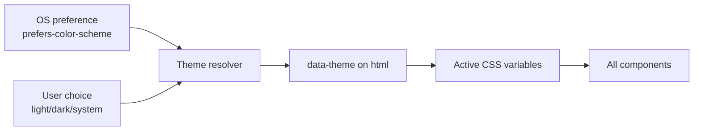
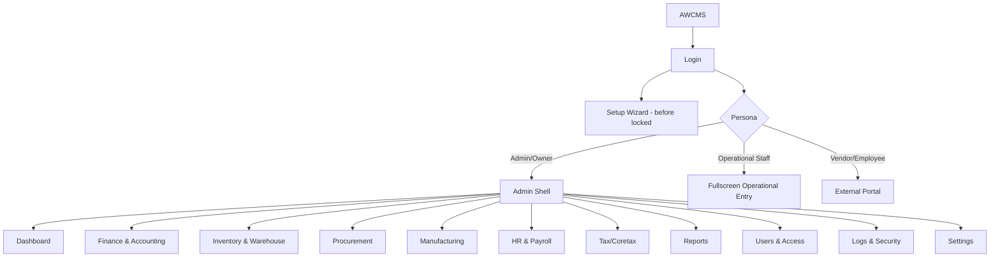
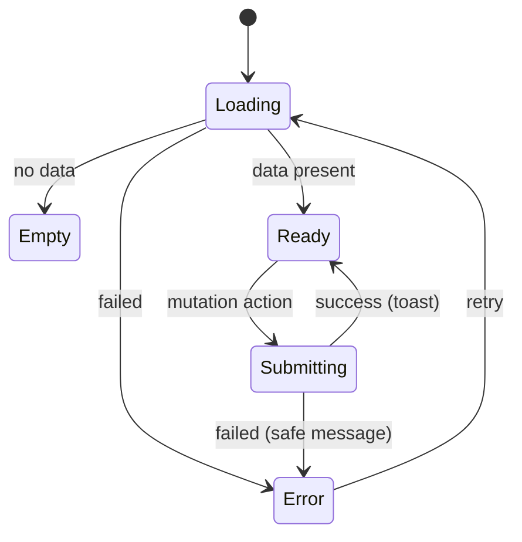
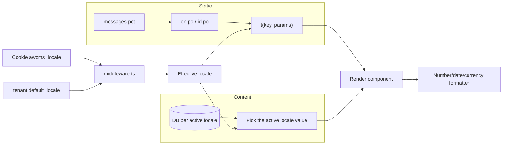

🇬🇧 English (source) · 🇮🇩 [Bahasa Indonesia](14_ui_ux_design_system.id.md)

# Part 14 — UI/UX Design System and Screen Specifications

> **Document status (2026-07-14):** The `awcms` repo is still at the re-foundation stage ([ADR-0001](../adr/0001-rebuild-on-awcms-foundation-erp-scope.md)) — **no ERP module code has been implemented yet**. This document adapts the design system standards/patterns already proven in the [awcms-mini](https://github.com/ahliweb/awcms-mini) base into the **target architecture** for the AWCMS ERP platform. The parts that are already live in awcms-mini (tokens, concrete components such as `DataTable.astro`/`ConfirmDialog.astro`, i18n) are reframed here as a **binding plan** for when the relevant module starts being built, not as something already running in this repo. The screen/component examples are switched to the ERP domain (ledger, purchase order, stock adjustment, payroll run), replacing the retail/POS examples in the source.

## Purpose

This document defines the AWCMS **UI/UX design** requirements that will complement the operational SOP and the module blueprint when they are written. It covers design principles, design tokens, the component library, information architecture, screen specifications (wireframes), state patterns, accessibility, i18n, and theming — so that the ERP frontend can be implemented consistently from the first module onwards.

Related: `15_frontend_architecture_integration.md` (architecture & wiring), the operational SOP document (to follow). The planned enforcing skill: **`awcms-ui-screen`** (`.claude/skills/`, following the `awcms-mini-ui-screen` pattern).

## UI/UX design principles

1. **Offline-first is visible** — connection & sync status is always clear; actions still work while offline (e.g. warehouse stock entry with no LAN connection).
2. **Keyboard-first for high-volume entry operators** — every journal entry/warehouse cashier/stock count action can be done without a mouse.
3. **Role-aware** — navigation & actions follow permissions (not the primary control; the backend still validates RBAC/ABAC).
4. **Explicit state** — every screen has a loading, empty, error, and success state.
5. **Safe** — never shows sensitive data in full (salary, bank account, NPWP); follows the data masking rules.
6. **Accessible** — targets WCAG 2.1 AA, sufficient contrast, visible focus, keyboard navigation.
7. **Responsive** — admin/back-office desktop-first, field entry (warehouse/production) fullscreen-tablet, vendor/employee portal mobile-first.
8. **Consistent** — every screen uses the same tokens & components across all ERP modules (finance, inventory, procurement, manufacturing, HR/payroll).

## Design tokens

Tokens are implemented as CSS custom properties, scoped to `:root` and overridden via `:root[data-theme="dark"]`. The values below are **brand-neutral placeholders** that a tenant's brand may replace.

### Semantic colours

| Token                      | Light     | Dark      | Function                         |
| -------------------------- | --------- | --------- | -------------------------------- |
| `--color-bg`               | `#f5f7fa` | `#0d1117` | Application background           |
| `--color-surface`          | `#ffffff` | `#151b23` | Card/panel                       |
| `--color-surface-2`        | `#eef1f5` | `#1c232c` | Secondary panel, chips           |
| `--color-surface-3`        | `#f7f9fc` | `#11171e` | Recessed: `<thead>`, input fill  |
| `--color-border`           | `#dde3ea` | `#2a323c` | Decorative line/divider          |
| `--color-border-soft`      | `#e8edf3` | `#232a33` | Internal rule (table/panel rows) |
| `--color-border-strong`    | `#858b92` | `#656d77` | Control boundary (WCAG 1.4.11)   |
| `--color-text`             | `#141a21` | `#e6edf3` | Primary text                     |
| `--color-text-muted`       | `#5b6672` | `#9aa7b2` | Secondary text                   |
| `--color-text-faint`       | `#646f7a` | `#808a95` | Column labels, timestamps, hints |
| `--color-primary`          | `#2563eb` | `#3b82f6` | Primary action                   |
| `--color-primary-contrast` | `#ffffff` | `#ffffff` | Text on top of primary           |
| `--color-success`          | `#12873d` | `#3fbf6b` | Success/posted                   |
| `--color-warning`          | `#b45309` | `#e0a13a` | Warning/held/pending approval    |
| `--color-danger`           | `#dc2626` | `#f26a6a` | Error/insufficient balance       |
| `--color-info`             | `#0e7490` | `#3cb8cf` | Info/sync                        |
| `--color-focus`            | `#2563eb` | `#60a5fa` | Focus ring                       |
| `--color-primary-strong`   | `#2563eb` | `#3472d8` | Solid fill + white text          |
| `--color-success-strong`   | `#12873d` | `#178841` | Solid fill + white text          |
| `--color-danger-strong`    | `#dc2626` | `#d73d3d` | Solid fill + white text          |
| `--color-info-strong`      | `#0e7490` | `#0e7490` | Solid fill + white text          |
| `--color-primary-soft`     | `#e8effc` | `#16233b` | Tinted background for a state    |
| `--color-success-soft`     | `#e4f5ea` | `#12301d` | Tinted background for a state    |
| `--color-warning-soft`     | `#fdf1de` | `#2e2312` | Tinted background for a state    |
| `--color-danger-soft`      | `#fdeaea` | `#331818` | Tinted background for a state    |
| `--color-info-soft`        | `#e0f2f6` | `#0f2a30` | Tinted background for a state    |
| `--color-primary-on-soft`  | `#1d4ed8` | `#60a5fa` | Text on `--color-primary-soft`   |
| `--color-success-on-soft`  | `#0f7434` | `#3fbf6b` | Text on `--color-success-soft`   |
| `--color-warning-on-soft`  | `#9a4507` | `#e0a13a` | Text on `--color-warning-soft`   |
| `--color-danger-on-soft`   | `#c81e1e` | `#f26a6a` | Text on `--color-danger-soft`    |
| `--color-info-on-soft`     | `#0b6076` | `#3cb8cf` | Text on `--color-info-soft`      |

> **One hue, three roles ([ADR-0120](../adr/0120-the-admin-redesign-splits-one-hue-into-three-roles.md)).** A semantic colour carries up to three values, because the contrast arithmetic differs by what it sits on:
>
> | Family      | Job                                         | Used by                                |
> | ----------- | ------------------------------------------- | -------------------------------------- |
> | `--color-X` | text/icon/border on `--color-surface`       | links; the outlined `.btn-danger`      |
> | `-strong`   | solid fill under `--color-primary-contrast` | `.btn-primary`; the topbar avatar disc |
> | `-on-soft`  | text on `--color-X-soft`                    | status badges; the active sidebar link |
>
> Using the wrong one of the three is the single most-repeated defect in this repo's UI history — Issue #434, PR #720, and twice more during the ADR-0120 redesign. **It is no longer a matter of remembering.** `bun run design:token-contrast:check` (part of `bun run check`) measures a registry of 25 pairs across both themes and fails below WCAG 2.1 AA. Adding a pairing to CSS means adding a line to that registry.
>
> `--color-border` vs `--color-border-strong` is the same split applied to lines. WCAG 2.1 **1.4.11 Non-text Contrast** requires 3:1 for a boundary that identifies an operable component; `--color-border` measures 1.29:1 and deliberately stays that way, because 1.4.11 governs controls, not decorative separators. Inputs, selects, textareas and the search shell use `--color-border-strong`; card edges and table rules use `--color-border`.

### Other scales

| Category    | Token                                  | Value                                            |
| ----------- | -------------------------------------- | ------------------------------------------------ |
| Font family | `--font-sans`                          | Public Sans (self-hosted), system-ui, sans-serif |
| Font mono   | `--font-mono`                          | JetBrains Mono (self-hosted), ui-monospace       |
| Font size   | `--fs-2xs..3xl`                        | 11 · 12 · 14 · 16 · 18 · 20 · 24 · 32 · 40 px    |
| Spacing     | `--sp-1..8`                            | 4 · 8 · 12 · 16 · 24 · 32 · 48 · 64 px           |
| Radius      | `--radius-sm/md/lg/full`               | 4 · 8 · 12 · 9999 px                             |
| Shadow      | `--shadow-sm/md/lg`                    | card/dialog elevation                            |
| Z-index     | `--z-nav/drawer/dropdown/dialog/toast` | 100 · 150 · 200 · 300 · 400                      |
| Breakpoint  | `sm/md/lg/xl`                          | 640 · 768 · 1024 · 1280 px                       |

> **The typeface is self-hosted, and that is a CSP requirement rather than a preference.** This repo's `default-src 'self'` policy names no `font-src` or `style-src`, so both fall through to it and `fonts.googleapis.com`/`fonts.gstatic.com` are blocked with no visible error on the page. Five latin/latin-ext `woff2` subsets live in `public/fonts/` (104,004 B), are `unicode-range`-gated, and are measured against their own `FONT_BUDGET_BYTES` in `scripts/client-asset-budget.ts`. A public content page loads none of them — `css/public-content.css` declares no `@font-face`. The system stack stays behind them and is what renders during `font-display: swap` and on a LAN/offline deployment whose font files fail.

### Theming


```mermaid
flowchart LR
  Sys[OS preference<br/>prefers-color-scheme] --> Resolve
  Pref[User choice<br/>light/dark/system] --> Resolve[Theme resolver]
  Resolve --> Attr[data-theme on html]
  Attr --> Tokens[Active CSS variables]
  Tokens --> UI[All components]
```

The planned rules: default `system`; the personal per-browser choice is stored in localStorage (it always wins when present) with a fallback to the tenant preference `awcms_tenants.default_theme` (changeable by an admin at `/admin/settings`) for browsers that have never chosen; `data-theme` is set on `<html>` before paint to prevent a flash.

### Motion & animation

The motion system lives in `src/styles/motion.css` (imported globally): the duration tokens `--motion-instant/fast/base/slow` (80/140/240/400ms) + the easings `--ease-standard/out/in/spring`, keyframes prefixed with `awcms-` (`awcms-fade-in`, `awcms-fade-in-up`, `awcms-scale-in`, `awcms-slide-in-left`, etc.), and their matching utility classes (`.fade-in-up`, `.scale-in`, `.hover-lift`, `.transition-base`, `.skeleton`). Animation = micro-interaction: subtle, fast, clarifying a state change — not a performance.

Rules:

- **`prefers-reduced-motion: reduce` MUST be honoured** — `motion.css` already neutralises its motion utilities in the reduced-motion block. That block targets the utility classes (not `*`), so a new animation that is **scoped** to a single page/component must carry its own local reduced-motion guard.
- **No layout shift** — animate only `opacity`/`transform`/colour/`box-shadow`, never `width`/`height`/`top`/`left`.
- **The entrance of main content that is already visible at SSR should be `transform`-only (e.g. `translateY`), not from `opacity: 0`.** An axe-core scan can read half-transparent text mid-animation as a contrast violation if it happens to scan before the animation finishes. The login card (`login.astro`) uses `@keyframes auth-card-rise` (translateY-only) as the canonical example. An `opacity:0` fade (e.g. the `.fade-in-up` utility) is still fine for elements revealed **after** load (post-action banners/dialogs) or for secondary elements — avoid it only for the main text content of auth/entry screens.

## Component library

The base components are planned to live in `src/components/ui`, used across personas and across ERP modules.

| Component                                 | Key notes                                                                                                                                                                                                                                                                                                                                                                                                         |
| ----------------------------------------- | ----------------------------------------------------------------------------------------------------------------------------------------------------------------------------------------------------------------------------------------------------------------------------------------------------------------------------------------------------------------------------------------------------------------- |
| Button                                    | primary/secondary/ghost/danger variants; loading & disabled states                                                                                                                                                                                                                                                                                                                                                |
| Input / NumberInput                       | label, hint, error; NumberInput for qty/price/journal amounts (mono)                                                                                                                                                                                                                                                                                                                                              |
| Select / Combobox                         | Combobox supports account/product/vendor/employee search                                                                                                                                                                                                                                                                                                                                                          |
| Checkbox / Radio / Switch                 | switch for consent & feature toggles                                                                                                                                                                                                                                                                                                                                                                              |
| Dialog / Drawer                           | focus trapped, `Esc` closes — planned as a native `<dialog>` (`showModal()` provides the browser's built-in focus trap + Esc-to-close) for confirming destructive actions (e.g. voiding a journal, cancelling a PO), replacing the `window.confirm`/`window.prompt` pattern. The admin sidebar itself (mobile drawer) is NOT a `<dialog>` — it stays a static `<nav>` on desktop, its focus trap written by hand. |
| Toast                                     | success/error/info; non-blocking                                                                                                                                                                                                                                                                                                                                                                                  |
| Table / DataGrid                          | sorting, keyset pagination, sticky columns, row density — used for the journal entry, purchase order, stock adjustment and payroll run lists; scroll-container shell + accessible `<caption>` + standard empty row; row rendering (badges, forms, per-row buttons) remains the caller's responsibility                                                                                                            |
| Badge / StatusPill                        | colour-coded lifecycle status (draft/pending approval/posted/rejected/void/quarantine) — `success/warning/danger/info/neutral` variants, using the `-strong` tokens for fill+white text except `warning`, which keeps dark text so it stays AA in both themes                                                                                                                                                     |
| ArchiveFilter                             | `active`, `archived`, `all` toggle/filter for permitted roles                                                                                                                                                                                                                                                                                                                                                     |
| Card / Panel                              | content container                                                                                                                                                                                                                                                                                                                                                                                                 |
| FormField                                 | wraps label+input+error consistently — a label/hint/error wrapper with a default slot for the native control (the caller still sets `type`/`name`/`required`)                                                                                                                                                                                                                                                     |
| Tabs                                      | entity detail (account, purchase order, product, employee)                                                                                                                                                                                                                                                                                                                                                        |
| Pagination                                | keyset (next/prev), not large offsets — two prev/next buttons dispatching `CustomEvent("awcms:paginate")`                                                                                                                                                                                                                                                                                                         |
| `FilterBar`                               | container toolbar for list filter controls (`role="search"` + a mandatory label); it does not handle the filter logic itself — that remains the page's responsibility, same as `DataTable`                                                                                                                                                                                                                        |
| `ActionBanner`                            | post-mutation success/error feedback banner (`role="alert"`); used consistently by `showBanner()` in the admin client helper (see doc 15) without manual duplication per screen                                                                                                                                                                                                                                   |
| SearchBar                                 | debounced, fast results (target <300ms)                                                                                                                                                                                                                                                                                                                                                                           |
| EmptyState / ErrorState / LoadingSkeleton | mandatory for every list/detail                                                                                                                                                                                                                                                                                                                                                                                   |
| KeyboardHint                              | shows the active shortcuts on high-volume entry screens (journal, goods receipt, stock count)                                                                                                                                                                                                                                                                                                                     |
| SyncIndicator / OfflineBanner             | connection status & sync queue                                                                                                                                                                                                                                                                                                                                                                                    |
| MoneyText / MaskedText                    | IDR formatting & masking of sensitive data (salary, bank account, NPWP)                                                                                                                                                                                                                                                                                                                                           |
| `StateNotice`                             | shared denied/error banner; `kind="error"` closes the Error branch of the state pattern on SSR screens (see §Mandatory state pattern)                                                                                                                                                                                                                                                                             |

The planned non-visual client helper (`src/lib/ui/admin-form-client.ts`, following the awcms-mini pattern) — `submitJson`/`showBanner`/`lockElement` are shared by the `<script>` of every admin screen for fetch+banner+anti-double-submit; not an Astro component, but the same source of truth for the "lock the triggering button while a mutation is in flight" pattern in §Form UX. The non-visual counterpart for `ConfirmDialog.astro` (e.g. `confirm-dialog-client.ts`) follows the same pattern.

### Incremental migration of large screens (a pattern, not a status)

When a large ERP admin screen (e.g. journal entry, a multi-line purchase order form) is implemented, follow the atomic-per-issue pattern proven in awcms-mini: build it directly out of the primitives above (`DataTable`, `StatusBadge`, `ActionBanner`, `FormField`, `ConfirmDialog`) instead of ad-hoc markup, and migrate old screens one at a time if any exist — do not do a full redesign all at once. The SSR-read-directly/mutation-through-the-API pattern (doc 15) is not changed by a markup/CSS/client-script migration.

## Information architecture (role-aware navigation)


```mermaid
flowchart TD
  Root[AWCMS] --> Auth[Login]
  Auth --> Setup[Setup Wizard - before locked]
  Auth --> Shell{Persona}
  Shell -->|Admin/Owner| Admin[Admin Shell]
  Shell -->|Operational Staff| Ops[Fullscreen Operational Entry]
  Shell -->|Vendor/Employee| Portal[External Portal]

  Admin --> Dash[Dashboard]
  Admin --> Fin[Finance & Accounting]
  Admin --> Inv[Inventory & Warehouse]
  Admin --> Proc[Procurement]
  Admin --> Mfg[Manufacturing]
  Admin --> Hr[HR & Payroll]
  Admin --> Tax[Tax/Coretax]
  Admin --> Rep[Reports]
  Admin --> Usr[Users & Access]
  Admin --> Logs[Logs & Security]
  Admin --> Setg[Settings]
```

Menu items are filtered by the user's effective permissions (RBAC/ABAC). Menus without access are hidden, but the endpoints stay protected by ABAC.

## Layout shell

### Auth screen (login) — modern, mobile-first

`src/pages/login.astro` is the **canonical** public auth screen pattern (UI/UX overhaul, Issue #166/#215): an `.auth-card` centred on top of a subtle radial-gradient background (`--color-primary-soft` + `--color-surface-2` + `--color-bg`), elevation `--shadow-lg`, radius `--radius-xl`. Other public auth screens (forgot/reset password, if added later) follow this pattern.

```text
┌───────────────────────────┐
│  [A]  AWCMS                │  ← brand: .auth-mark (gradient badge) + .auth-wordmark
│  Sign in                   │  ← .auth-title (h1)
│  Welcome back. Sign in…    │  ← .auth-subtitle
│  ┌───────────────────────┐ │
│  │ SIGNING IN TO         │ │  ← .auth-tenant-context (single-tenant mode)
│  │ <Tenant name>         │ │
│  └───────────────────────┘ │
│  Login identifier  [_____] │
│  Password     [____] [Show]│  ← .auth-password + show/hide toggle
│  [      Sign in         ]  │  ← .auth-submit (primary)
│  Secured workspace access  │  ← .auth-foot
└───────────────────────────┘
```

Pattern rules (already implemented — follow them, do not regress):

- **Stable DOM contract** (do not rename — the client script + the E2E spec `tests/e2e/login.e2e.ts` depend on it): `#login-form`, `#tenant-id`, `#login-identifier`, `#password`, `#login-submit`, `#login-error`. The tenant field is ALWAYS `id="tenant-id"` + `name="tenantId"` in all three of its shapes so that the submit (`FormData`) keeps working and the `X-AWCMS-Tenant-ID` header is still sent.
- **Adaptive tenant field** (`awcms_tenants` = the RLS-free root table, read SSR read-only without a tenant context, bounded by `TENANT_PICKER_LIMIT`): 0 rows / DB error / > limit → a manual text input (backwards-compatible + avoids mass tenant enumeration); exactly 1 → a read-only "Signing in to <name>" readout (`.auth-tenant-context`) + a hidden `#tenant-id`; 2..limit → a `<select>` of tenant names (value = UUID). Rendering tenant names to an unauthenticated visitor when count > 1 is an accepted product decision for the base repo (the query is bounded + read-only).
- **The show/hide password toggle** is wired in the bundled MODULE script (not an inline `onclick` — the CSP is `default-src 'self'` without `'unsafe-inline'`), with `aria-pressed` + `aria-label` that change when the state changes.
- **Custom select**: the caret is drawn via CSS (`.auth-select::after`, a border trick), not a `data:` URI SVG — staying CSP-safe; the native `<select>` is still used.
- **Card entrance** `@keyframes auth-card-rise` = `transform`-only (translateY), NOT the `.fade-in-up` utility which starts from `opacity:0` (see §Motion — avoid axe contrast flags on main text). Include a local reduced-motion guard.
- **Strict CSP (single-owner)**: `tokens.css`/`motion.css` + the scoped `<style>` are all emitted as external same-origin `<link>`s (`build.inlineStylesheets: "never"`, `astro.config.mjs`); the login script is a bundled module (not `is:inline`); the only `is:inline` `<script src>` is the Cloudflare Turnstile loader, and only when `isTurnstileRequired()` (`src/lib/security/turnstile.ts`).
- **i18n**: the strings on this screen are still hardcoded EN — following the `.po`/`.pot` extraction pipeline (§Internationalization, "planned pipeline"); when that pipeline is switched on, move them to `t("auth.login.*")` all at once (not partially).

### Admin shell (desktop-first, responsive drawer below `--bp-md`)

```text
┌───────────────────────────────────────────────────────────┐
│ Topbar: [Logo] [Tenant badge] [Search] [Sync●] [🔔] [👤]  │
├───────────┬───────────────────────────────────────────────┤
│ Sidebar   │  Breadcrumb                                    │
│  Dashboard│  ┌─────────────────────────────────────────┐  │
│  Finance  │  │  Content (list/detail/form)             │  │
│  Inventory│  │  - LoadingSkeleton / EmptyState / Error │  │
│  Procure  │  │                                         │  │
│  HR       │  └─────────────────────────────────────────┘  │
│  Reports  │                                               │
└───────────┴───────────────────────────────────────────────┘
```

**Responsive (planned)**: below `--bp-md` (768px), the sidebar above turns into an off-canvas drawer — hidden (`transform: translateX(-100%)`) until the topbar hamburger button (`#admin-nav-toggle`, `aria-expanded`/`aria-controls`) is pressed. While open: a scrim (`#admin-sidebar-scrim`) closes the drawer when clicked, `Esc` closes it and returns focus to the toggle button, focus moves to the first nav item when it opens, and the rest of the page (topbar/main) is marked `inert` while the drawer is open (a hand-written focus trap). The skip link (`.skip-link`) and `aria-current="page"` on the active link are consistent at both breakpoints. At `--bp-md` and above, the sidebar stays static-always-visible and the toggle button is hidden (`display: none`, which automatically removes it from the tab order).

**Tenant badge, not a tenant switcher**: the topbar shows `TenantBadge.astro` — a non-interactive badge (`<div role="status">`) on a single-tenant deployment, NOT a dropdown control that looks active but is `disabled`. The reason: a REAL switcher control may only be rendered when `availableTenants` (a component prop) holds a list computed SERVER-side from real authorization data — showing an interactive control (even a disabled one) without a genuine tenant-switch capability would imply a security capability that does not exist and is not checked anywhere, violating the acceptance criterion "No authorization decision relies on hidden/disabled UI alone".

### Fullscreen operational entry (keyboard-first) — example: warehouse goods receipt

```text
┌───────────────────────────────────────────────────────────┐
│ Staff: <name> · Warehouse: <location> · Sync● · [F1 Help]  │
├──────────────────────────────┬────────────────────────────┤
│ [F2] Search/scan SKU/PO..... │  Receipt lines              │
│ ┌──────────────────────────┐ │  1. SKU-A     x20   received│
│ │ Search results           │ │  2. SKU-B     x5    received│
│ └──────────────────────────┘ │  ------------------------- │
│                              │  Total lines        25     │
│                              │  Variance vs PO       0    │
├──────────────────────────────┴────────────────────────────┤
│ [F4] Qty  [F6] Notes  [F8] Save draft  [F10] Post          │
└───────────────────────────────────────────────────────────┘
```

### Vendor/employee portal (mobile-first)

```text
┌─────────────────────┐
│  Payslip #PR-000123  │
│  Period · July 2026  │
├─────────────────────┤
│  Components ......   │
│  Net total   8.850   │
│  [⬇ Download PDF]    │
│  Consent WA  [switch]│
│  Consent Email[switch]│
└─────────────────────┘
```

## Screen inventory

> **A plan**, not an implementation. The routes, components, and endpoints below are the target architecture for ERP modules that have not been built — they will be updated/refined when the relevant module enters an implementation sprint (see doc `06_github_issues_detail.md`, once written).

| Route                           | Persona         | Purpose                                           | Main components                 | Main API (planned)                                            |
| ------------------------------- | --------------- | ------------------------------------------------- | ------------------------------- | ------------------------------------------------------------- |
| `/login`                        | Everyone        | Authentication                                    | FormField, Button               | `POST /auth/login`                                            |
| `/setup`                        | Initial owner   | Setup wizard                                      | Stepper, FormField              | `GET/POST /setup/*`                                           |
| `/admin`                        | Admin/Owner     | Dashboard                                         | Card, Chart, Table              | `GET /reports/*`                                              |
| `/admin/finance/ledger`         | Finance staff   | Journal entry data table (general ledger)         | DataGrid, SearchBar, Dialog     | `/finance/journal-entries`                                    |
| `/admin/finance/coa`            | Finance staff   | Chart of accounts                                 | Tabs, DataGrid                  | `/finance/accounts`                                           |
| `/admin/inventory/products`     | Admin/Inventory | Product & raw material list/CRUD                  | DataGrid, SearchBar, Dialog     | `/inventory/products`                                         |
| `/admin/inventory/stock`        | Admin/Inventory | Stock adjustment & opening balance                | DataGrid, NumberInput           | `/inventory/stock-adjustment-requests`                        |
| `/admin/warehouse`              | Warehouse       | Transfer, bin, cycle count                        | Tabs, StatusPill                | `/warehouses`, `/warehouse-transfers`                         |
| `/admin/procurement/po`         | Purchasing      | Purchase order form (multi-line) & approval       | FormField, DataGrid, StatusPill | `/procurement/purchase-orders`                                |
| `/admin/manufacturing`          | Production      | Work order, BOM, material consumption             | Tabs, DataGrid                  | `/manufacturing/work-orders`                                  |
| `/admin/hr/payroll`             | HR/Payroll      | Payroll run wizard                                | Stepper, DataGrid, StatusPill   | `/hr/payroll-runs`                                            |
| `/admin/tax`                    | Tax Officer     | Tax invoice, Coretax                              | DataGrid, MaskedText            | `/tax/*`                                                      |
| `/admin/reports`                | Analyst/Owner   | Financial & operational reports                   | Chart, Table                    | `/reports/*`                                                  |
| `/admin/users` + `/admin/roles` | Admin/Owner     | Users & access (two separate screens, not merged) | Table, FormField                | `/users/*`, `/roles/*`, `/permissions`, `/access/assignments` |
| `/admin/sync`                   | Admin/Owner     | Nodes, conflicts, sync queue                      | Table, StatusPill, FormField    | `/sync/nodes`, `/sync/conflicts/*`, `/sync/object-queue/*`    |
| `/admin/logs`                   | Auditor/Admin   | Logs & security                                   | DataGrid, Badge                 | `/logs/*`, `/security/*`                                      |
| `/admin/modules`                | Admin/Owner     | Module list, filter + health                      | DataGrid, StatusPill            | `/modules`, `/modules/{moduleKey}/health`                     |
| `/portal/vendor/{token}`        | Vendor          | PO & payment status                               | Card, Table                     | `/procurement/vendor-portal/*`                                |
| `/portal/employee/{token}`      | Employee        | Payslip & consent                                 | Card, Switch                    | `/hr/payslips/*`                                              |

## Mandatory state pattern


```mermaid
stateDiagram-v2
  [*] --> Loading
  Loading --> Empty: no data
  Loading --> Ready: data present
  Loading --> Error: failed
  Ready --> Submitting: mutation action
  Submitting --> Ready: success (toast)
  Submitting --> Error: failed (safe message)
  Error --> Loading: retry
```

- **Loading**: a skeleton, not an empty spinner, for lists.
- **Empty**: a message + call-to-action (e.g. "No purchase orders yet. Create a new PO").
- **Error**: a user-friendly message (map the standard error codes), without technical details.
- **Optimistic**: operational entry rows (e.g. goods receipt) update instantly; roll back if the server rejects.
- **Offline**: banner + queue; the action is still stored locally (doc 15).
- **Archived/deleted**: the list hides the items by default; a permitted role can open the archive filter, see the `Archived` badge, and run a restore.

## Accessibility (WCAG 2.1 AA)

- Text contrast at least 4.5:1 (check the tokens).
- Every control is focusable & keyboard-operable; the tab order is logical.
- The focus ring is visible (`--color-focus`); never `outline:none` without a replacement.
- Explicit labels for every input; errors are announced (`aria-live`).
- Dialogs trap focus; `Esc` closes; focus returns to the trigger.
- Touch targets ≥ 44px for the mobile portal.
- Do not rely on colour alone for status (add an icon/text).
- Show/hide password toggle: `aria-pressed` + `aria-label` that follow the state, wired via `addEventListener` (not an inline `onclick` — the CSP is `default-src 'self'`). Example: `login.astro` `#password-toggle`.
- Custom controls that hide the native one (e.g. a styled `<select>`): draw the affordance (caret) via CSS `::after`, not a `data:` URI; the native `<select>` is still used so the built-in keyboard + a11y behaviour remains.

## Internationalization (i18n)

> **Status:** planned to follow the proven awcms-mini i18n pattern (a pure `.po` parser with no dependencies, a catalogue loader, `t()`, locale resolution, formatters) — **not yet implemented in this repo**. When it is built, follow the design below as a binding baseline, not an open draft.

i18n uses **two separate layers** according to the source of the text:

**1. Static UI strings** (application chrome: labels, buttons, titles, error messages, navigation) → **standard gettext `.po`/`.pot` catalogue files**, **bundled with the application**, not in the database. One `messages.pot` template + one file per locale (`en.po`, `id.po`). Message keys are `namespace.key` (e.g. `auth.login.submit`, `error.access_denied`). Every UI string is rendered through the `t(key, params)` helper; **there is no hardcoded text**.

**2. User-entered data** (content typed by users that must appear in multiple languages, e.g. product descriptions/approval notes) → stored **in the database for every active locale** (one value per active language), **not** in `.po`. The per-language storage pattern will be documented in `docs/awcms/04_erd_data_dictionary.md` §Multi-language content (once written). `.po` is only for the developers' static text, the DB is for dynamic user content.

- **Minimum locales (planned)**: **en** and **id** (the architecture is ready for ms/ar — the `default_locale` column stays free `text`, not an `enum`/`CHECK`, so ms/ar can be added without a schema migration; the UI only shows locales that actually have a catalogue). **Default = `en`** (`awcms_tenants.default_locale`).
- **Locale resolution**: the `awcms_locale` cookie (set by the language switcher) → the tenant's `default_locale` → fallback `en`. Planned to be resolved in `src/middleware.ts` **before** any `/admin/*` page renders — not inside the layout, because a page's frontmatter runs before the frontmatter of the layout that wraps it.
- **Cookie, not localStorage**: unlike the theme toggle (pure CSS, which can be "fixed up" on the client before paint), the locale changes text that has already been SSR-rendered — the server must know the locale **before** rendering, and only a cookie is sent along with the request.
- **The language switcher** (`LanguageSwitcher.astro`) shows a **flag icon** per language + that language's own native name, not translated into the active locale (e.g. 🇬🇧 English, 🇮🇩 Bahasa Indonesia); choosing one sets the cookie and then does a full reload (not an instant swap like the theme).
- **i18n'd error messages**: error codes are mapped to `error.*` keys (`src/lib/i18n/error-messages.ts`); for client-side action banners, the `{code: message}` map is injected as a `<script type="application/json">` in the page (the `.po` catalogue can only be read server-side via `Bun.file`).
- **Local formatting**: numbers/currency (IDR + locale-appropriate thousands separators) and dates (`Asia/Jakarta`, `Intl.DateTimeFormat`/`NumberFormat`) are locale-aware — `src/lib/i18n/format.ts`.

### Extraction, parity, and obsolete keys (planned pipeline)

> **Not implemented yet.** This whole subsection is a pipeline
> plan, not tooling you can call today: there is no
> `i18n/` directory in this repo, and there is no `i18n:extract`,
> `i18n:pot:check`, or `i18n:parity:check` key in `package.json` — nor
> is there a `scripts/i18n-extract.ts`. Read every `bun run i18n:*` below
> as a target specification, not as a step-by-step guide
> that can already be run.

`i18n/messages.pot` is **not hand-written** — the `scripts/i18n-extract.ts` pipeline (`bun run i18n:extract`) will scan every `.astro`/`.ts`/`.tsx` under `src/` for each `t("key")` call, then rewrite `messages.pot` (alphabetically sorted, one `#: file:line` comment per key, deterministic).

**Adding a new UI string** (the planned flow):

1. Use `t("namespace.key", params?)` in the source as usual.
2. Run `bun run i18n:extract` — the new key is added to `i18n/messages.pot` automatically.
3. Fill in the `msgstr` for that new key in `i18n/en.po` **and** `i18n/id.po` (a manual step — extraction only manages the key inventory, it does not translate).
4. Commit all three files (`messages.pot`, `en.po`, `id.po`) together.
5. `bun run i18n:pot:check` (part of `bun run check`) will verify that the committed `messages.pot` is identical to the result of regenerating it from source. `bun run i18n:parity:check` will verify: (a) the key sets of `en.po`/`id.po`/`messages.pot` are identical, (b) every key that has a `{name}`-style placeholder in `en.po` has exactly the same placeholder in `id.po` (and vice versa).

**Dynamic key patterns** (`t(\`namespace.${variable}\`)`, `t(entry.labelKey)`, `t(key)`from a map such as`ERROR_CODE_KEYS`) cannot be found by a plain string-literal scan — they will be handled through a `DYNAMIC_KEY_FAMILIES`table and an explicit`labelKey:`/`ERROR_CODE_KEYS` scan, following the awcms-mini pattern.

**Obsolete keys** (present in `en.po`/`id.po` but no longer found by `bun run i18n:extract` anywhere in the source) will be reported as a warning, not deleted automatically; they are marked with the `#~ ` prefix (the gettext convention) instead of being removed outright.

**Plural forms**: following the awcms-mini decision, this catalogue is planned **not** to use gettext `msgid_plural`/`msgstr[n]` in the early stage — an explicit design decision, with a tripwire in `i18n:parity:check` that fails if `msgid_plural` ever appears without a complete parser implementation.


```mermaid
flowchart LR
  subgraph Static
    POT[messages.pot] --> PO[en.po / id.po]
    PO --> T["t(key, params)"]
  end
  subgraph Content
    DB[(DB per active locale)] --> Pick[Pick the active locale value]
  end
  Cookie[Cookie awcms_locale] --> Mid[middleware.ts]
  Tenant[tenant default_locale] --> Mid
  Mid --> Loc[Effective locale]
  Loc --> T
  Loc --> Pick
  T --> Render[Render component]
  Pick --> Render
  Render --> Fmt[Number/date/currency formatter]
```

## Operational entry keyboard map (example: warehouse goods receipt)

| Shortcut | Function                           |
| -------- | ---------------------------------- |
| F1       | Help/shortcuts                     |
| F2       | Focus SKU/PO search/scan           |
| F4       | Change the selected row's quantity |
| F6       | Notes/variance (per permission)    |
| F8       | Save draft                         |
| F10      | Post                               |
| Enter    | Add the selected row               |
| ↑/↓      | Navigate results/row list          |
| Esc      | Close dialog                       |

## UI/UX acceptance criteria

- Design tokens installed & light/dark/system theming with no flash.
- Base components available with loading/disabled/error states.
- The admin shell, the fullscreen operational entry screen, and the external portal render according to the layouts.
- Every list/detail has a loading/empty/error state.
- Navigation is permission-filtered; the endpoints stay protected by ABAC.
- The operational entry screen can be fully operated via keyboard.
- Contrast & focus meet AA.
- All strings go through i18n; numbers/currency/dates are locally formatted.
- Sensitive data is displayed masked according to role.
- Soft-deleted resources do not appear in the default list/search; the archive filter and restore only appear when the effective permissions allow it.
