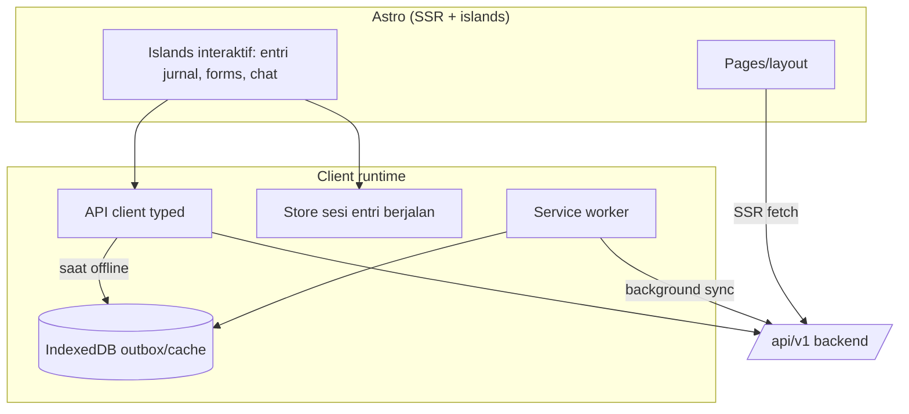
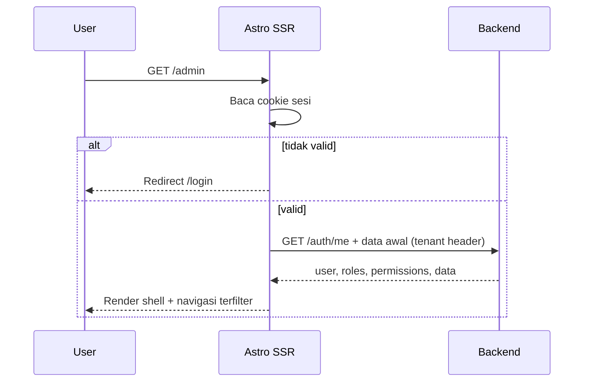
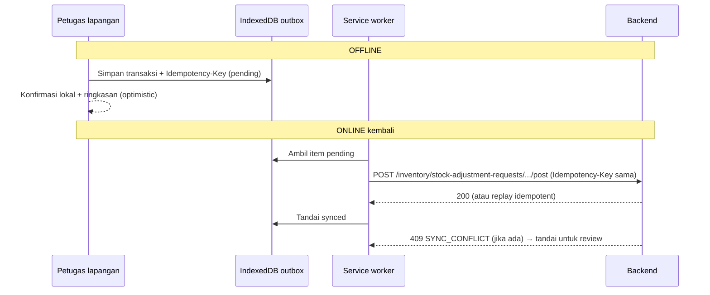

# Bagian 15 — Arsitektur Frontend dan Integrasi Frontend–Backend

> **Status dokumen (2026-07-14):** Repo `awcms` adalah **template ERP/back-office keluarga AWCMS yang dipakai langsung** ([ADR-0035](../adr/0035-awcms-online-first-erp-saas-superset-repositioning.md)/[ADR-0034](../adr/0034-awcms-family-direct-use-templates-and-derived-pathway-removal.md)) — base sudah menyertakan **admin SSR + modul website/konten** dan sedang **menyerap** klaster website/e-commerce awcms-micro ke `src/modules/` (status kode aktual: [`docs/ARCHITECTURE.md`](../ARCHITECTURE.md)). Dokumen ini mengadaptasi arsitektur frontend base [awcms-mini](https://github.com/ahliweb/awcms-mini) (Astro SSR di atas Bun, islands, offline-first) menjadi arsitektur untuk platform AWCMS yang **hybrid online-first**: jalur utama online, dengan ketahanan offline/LAN sebagai pelengkap. Klaim "sudah live"/"diverifikasi" di sumber tetap perlu diverifikasi ke `docs/ARCHITECTURE.md`. Contoh route/endpoint domain mencakup ERP (finance, inventory, procurement, manufacturing, HR/payroll) dan website/e-commerce.

## Tujuan

Dokumen ini menetapkan **arsitektur frontend** dan **integrasi frontend ↔ backend** AWCMS: strategi rendering Astro, API client, autentikasi/sesi, **mekanisme ketahanan offline (service worker + IndexedDB + outbox)** sebagai pelengkap jalur online-first, state, form/validasi, dan kontrak layar→endpoint→event — sebagai baseline yang mengikat untuk modul base maupun modul domain (ERP, website/e-commerce, konten).

Terkait: `14_ui_ux_design_system.md` (desain), `16_backend_data_access_integration.md` (sisi backend/DB), dokumen kontrak API/event (menyusul, mengikuti pola `05_openapi_asyncapi_detail.md` di awcms-mini). Skill penegak yang direncanakan: **`awcms-ui-screen`** (`.claude/skills/`).

## Keputusan arsitektur frontend

| Aspek          | Keputusan                                                                                                                                |
| -------------- | ---------------------------------------------------------------------------------------------------------------------------------------- |
| Framework      | Astro 7, output **server (SSR)** dijalankan di runtime Bun                                                                               |
| Interaktivitas | **Astro islands** + TypeScript; framework island opsional (mis. Preact) hanya untuk pulau kompleks (entri jurnal cepat, chat AI analyst) |
| Styling        | CSS variables (design token doc 14), scoped styles                                                                                       |
| Rendering      | Halaman authed = SSR; portal vendor/karyawan = SSR; aset statis di-cache SW                                                              |
| Data fetching  | SSR initial load + client mutation via API client                                                                                        |
| Offline        | PWA: service worker + IndexedDB outbox untuk entri operasional lapangan (gudang, stock opname)                                           |
| State          | Lokal per-island + store ringan untuk sesi entri berjalan; hindari SPA global besar                                                      |

Alasan: SSR menjaga waktu muat cepat di LAN, aman untuk cookie httpOnly, dan tetap ringan; islands membatasi JS hanya di area interaktif. Backend/SSR dijalankan dengan **Bun** sebagai platform runtime; Node.js bukan target platform server utama.

## Astro SSR di atas runtime Bun

Astro **berjalan penuh di Bun** untuk semua fase: `bun install`, dev, build, dan runtime. Panggil bin Astro/Vite via `bun --bun astro …` (dev/build/preview) agar Bun yang mengeksekusi, bukan binary `node` (shebang bin default `#!/usr/bin/env node`).

Nuansa satu-satunya: Astro **belum punya adapter SSR Bun first-party** (yang resmi: `@astrojs/node`, Cloudflare, Vercel, Netlify — verifikasi versi saat implementasi). Dua opsi tersanksi, keduanya tetap runtime Bun:

| Opsi                               | Cara                                                                                                                | Kapan                                                                           |
| ---------------------------------- | ------------------------------------------------------------------------------------------------------------------- | ------------------------------------------------------------------------------- |
| **A. Pisahkan seam (rekomendasi)** | API/backend native `Bun.serve` (+Hono); Astro hanya frontend/SSR                                                    | Default base — paling "Bun-murni", cocok jalur online-first + ketahanan offline |
| **B. `@astrojs/node` di atas Bun** | `output: "server"` + adapter node standalone; jalankan `bun ./dist/server/entry.mjs`; build `bun --bun astro build` | Bila ingin SSR Astro terpadu tanpa server terpisah                              |

Opsi B memakai paket ber-nama "node" tetapi **binary `node` tidak dipakai** — output-nya jalan di atas Node-compat Bun. Ini satu-satunya pemakaian paket "node" yang diizinkan; catat sebagai pengecualian di dokumen audit standar pengembangan bila dipilih (lihat doc 10 §Standar platform backend, saat ditulis; doc 18 §Runtime & tooling, saat ditulis). Output `static` (tanpa SSR) tidak butuh adapter dan bisa dilayani `Bun.serve` langsung.

## Lapisan frontend



## API client

**Rencana, bukan kontrak yang sudah dibangun.** Bagian ini menetapkan kontrak
target untuk typed fetch wrapper `src/lib/ui/admin-form-client.ts` (mengikuti
pola `submitJson`/`fetchJson` yang terbukti di awcms-mini), untuk dipakai oleh
script inline halaman admin (`login.astro`, `admin/access-users.astro`,
`admin/finance/*.astro`, dan halaman admin lain). Perilaku yang ditetapkan:

1. **Auth**: `credentials: "same-origin"` — mengandalkan cookie httpOnly
   sesi yang browser kirim otomatis. TIDAK ADA header `Authorization`
   yang di-inject manual oleh client ini.
2. **Tenant/correlation header**: TIDAK ADA injeksi otomatis
   `X-AWCMS-Tenant-ID`/`X-Correlation-ID` dari client. Tenant selalu
   diresolusi server-side dari sesi (`src/middleware.ts`) — never a
   client-supplied value, menutup risiko cross-tenant; correlation ID
   dibaca-atau-dibuat server-side juga (`src/middleware.ts`,
   `CORRELATION_ID_HEADER`).
3. **Idempotency**: **tidak otomatis** — pemanggil membuat sendiri lewat
   `newIdempotencyKey()` (`crypto.randomUUID()`) dan mengirimnya manual
   per-panggilan lewat parameter `extraHeaders` ke `submitJson(url,
method, body, strings, extraHeaders)` (pola dipakai untuk lifecycle action
   mutasi high-risk, mis. posting jurnal, approve PO).
4. **Retry**: **tidak ada** retry otomatis sama sekali (GET maupun
   mutation) — satu percobaan; kegagalan network dipetakan ke `{ ok:
false, message: strings.networkError }`.
5. **Offline-outbox**: **tidak ada** integrasi IndexedDB/service-worker
   outbox di client dasar ini — outbox offline adalah lapisan terpisah
   (lihat §Offline-first).
6. **Response envelope**: `submitJson`/`fetchJson` mem-parse envelope
   standar `{ success, data }` / `{ success: false, error }`
   (`modules/_shared/api-response.ts`) dan memetakan `error.code` lewat
   `strings.errorMessages` (i18n) — tidak pernah membocorkan stack/detail
   internal ke UI (doc 10, saat ditulis).
7. **UX pendukung**: `lockElement` men-disable tombol + `aria-busy` selama
   request in-flight (cegah double-submit dari klik/Enter ganda);
   `showBanner`/`reloadAfterDelay` untuk feedback sukses/gagal.

```ts
// src/lib/ui/admin-form-client.ts — kontrak target (belum diimplementasikan)
async function submitJson(
  url: string,
  method: string,
  body: unknown,
  strings: ClientErrorStrings,
  extraHeaders?: Record<string, string> // mis. { "Idempotency-Key": newIdempotencyKey() }
): Promise<{ ok: boolean; code?: string; message: string }> {
  /* fetch same-origin, parse envelope, tidak pernah throw */
}

async function fetchJson<TData = unknown>(
  url: string,
  strings: ClientErrorStrings
): Promise<{
  ok: boolean;
  status: number;
  code?: string;
  message: string;
  data: TData | null;
}> {
  /* GET same-origin, parse envelope, tidak pernah throw */
}
```

**Belum dibangun, aspirasi masa depan.** Sebuah typed API client generik
lintas-modul dengan tanggung jawab lebih luas — base URL `/api/v1`
terpusat, injeksi header Authorization/tenant/correlation otomatis, retry
aman untuk GET, timeout + deteksi offline dengan fallback outbox — adalah
**target masa depan yang legitimate** bila kompleksitas client-side
bertambah (mis. island entri lapangan yang butuh retry/offline sungguhan),
tapi bukan prioritas fase awal. Jangan berasumsi client generik semacam
itu sudah ada saat menulis kode atau panduan baru — rujuk kontrak
`admin-form-client.ts` di atas sebagai pola dasar yang harus dibangun
lebih dulu.

## Autentikasi dan sesi

- Login `POST /auth/login` → server set **cookie httpOnly + SameSite=Lax** (akses token) dan menyediakan konteks user.
- Tenant aktif dipilih setelah login (bila user multi-tenant) → dikirim sebagai `X-AWCMS-Tenant-ID` dan disimpan di sesi.
- SSR membaca cookie untuk render terproteksi; 401 → redirect `/login`.
- `GET /auth/me` untuk hidrasi konteks (roles, default entitas/gudang, permission untuk filter navigasi).
- Logout `POST /auth/logout` → invalidasi sesi + hapus cookie.
- Token/secret **tidak pernah** disimpan di localStorage yang dapat diakses skrip pihak ketiga.
- Halaman `/login` (`src/pages/login.astro`) = kartu auth mobile-first (doc 14 §Auth screen): brand + judul/subjudul, field tenant adaptif (readout single-tenant / `<select>` / manual, dibaca SSR dari tabel root `awcms_tenants`), toggle show/hide password CSP-safe, dan submit anti-double-submit (`lockElement` + `sendJson`/`postJson`). Script-nya modul yang di-bundle (bukan inline — patuh CSP `default-src 'self'`); `tokens.css`/`motion.css`/`<style>` scoped semua di-emit `<link>` eksternal (`build.inlineStylesheets: "never"`).



## Rute publik tenant-scoped (tanpa sesi)

Berbeda dari `/admin/*` (sesi cookie) dan API client terautentikasi
(header `X-AWCMS-Tenant-ID`) di atas — keduanya mengasumsikan
pemanggil sudah tahu tenant-nya. Rute publik untuk pengunjung anonim
(mis. halaman status tracking pengiriman publik, portal vendor tanpa
login penuh) **belum punya contoh implementasi di repo ini**; ADR
terkait (mengikuti pola `ADR-0009-public-tenant-scoped-routes.md` di
awcms-mini, akan ditulis sebagai ADR terpisah di `docs/adr/` repo ini
bila dibutuhkan) menetapkan polanya: tenant di-resolve dari segmen path
eksplisit yang membawa `tenantCode` (`/<prefix>/{tenantCode}/...`, look
up ke `awcms_tenants` yang RLS-free), **bukan** subdomain — subdomain
butuh wildcard DNS/TLS yang bertentangan dengan topologi LAN (mode ketahanan)
default. `tenantCode` tidak ditemukan/tenant tidak aktif → `404`, bukan
bocor keberadaan tenant.

## Offline-first (mode ketahanan)

Entri operasional lapangan (mis. penerimaan barang gudang, stock opname, entri jurnal kasir di lokasi tanpa koneksi stabil) **wajib** berjalan tanpa internet. Mekanisme yang direncanakan:

1. **App shell + aset** di-cache service worker (cache-first) agar UI entri operasional terbuka offline.
2. **Data master** (produk, akun, harga, stok terakhir, vendor/karyawan yang relevan) di-cache ke IndexedDB saat online (stale-while-revalidate) untuk pencarian/scan offline.
3. **Transaksi** yang di-post saat offline ditulis ke **IndexedDB outbox** dengan `Idempotency-Key` yang digenerate klien + status `pending`.
4. **Background sync** (atau retry saat online) mengirim outbox ke backend; server idempotent (doc 10, saat ditulis) mencegah duplikasi.
5. **SyncIndicator** menampilkan jumlah antrean & status; konflik high-risk ditandai untuk resolusi manual.



Aturan offline:

- Hanya operasi yang aman offline yang didukung (entri stok/jurnal draft, catatan lapangan). Operasi yang butuh server otoritatif (approval multi-level, export pajak/Coretax, posting final ke buku besar) **tidak** dijalankan offline.
- Stok/saldo yang ditampilkan offline adalah snapshot; server tetap otoritatif dan dapat menolak (mis. `STOCK_NOT_AVAILABLE`) saat sync.
- Provider eksternal (WA/email/R2/payment gateway) selalu lewat outbox server, bukan dari klien.
- Soft delete yang terjadi offline disimpan sebagai mutation/tombstone dengan `Idempotency-Key`; UI lokal menyembunyikan resource sampai server menerima atau menolak saat sync.

## State management

- **Store sesi entri berjalan**: store ringan (signals/nanostores) per sesi entri operasional (mis. draft penerimaan barang); sumber kebenaran total tetap server saat posting.
- **Server state**: di-fetch per halaman (SSR) + refetch pada mutation; hindari cache global yang basi.
- **Form state**: lokal di island; submit → API client.

## Form dan validasi

- Skema validasi bersama (mis. Zod) didefinisikan di `_shared` dan dipakai **klien & server** agar konsisten.
- Klien memvalidasi untuk UX cepat; **server tetap otoritatif** (semua input divalidasi backend).
- Error field dari `VALIDATION_ERROR.details` dipetakan ke FormField.

## Kontrak integrasi layar → endpoint → event

> Kontrak berikut adalah **rencana target** per modul ERP; akan diperinci lebih lanjut per modul di dokumen OpenAPI/AsyncAPI saat ditulis.

| Layar               | Aksi                 | Endpoint                                                                   | Event dihasilkan                          |
| ------------------- | -------------------- | -------------------------------------------------------------------------- | ----------------------------------------- |
| Setup wizard        | Inisialisasi         | `POST /setup/initialize`                                                   | `tenant.created`                          |
| Login               | Masuk                | `POST /auth/login`                                                         | `identity.login.succeeded`                |
| Produk & bahan baku | CRUD                 | `/inventory/products`                                                      | `inventory.product.created`               |
| Produk & bahan baku | Soft delete/restore  | `DELETE /inventory/products/{id}`, `POST /inventory/products/{id}/restore` | `inventory.product.soft_deleted/restored` |
| Stock adjustment    | Opening balance      | `/inventory/stock-adjustment-requests`                                     | `inventory.stock.adjustment.posted`       |
| Purchase order      | Approval & posting   | `POST /procurement/purchase-orders/{id}/approve`                           | `procurement.purchase_order.approved`     |
| Jurnal keuangan     | Posting              | `POST /finance/journal-entries/{id}/post`                                  | `finance.journal_entry.posted`            |
| Payroll             | Jalankan payroll run | `POST /hr/payroll-runs/{id}/execute`                                       | `hr.payroll_run.executed`                 |
| Warehouse           | Transfer             | `/warehouse-transfers/*`                                                   | `warehouse.transfer.shipped/received`     |
| Pajak               | VAT/Coretax          | `/tax/*`                                                                   | `tax.vat_invoice.generated`               |
| Sync                | Push/pull            | `/sync/push`, `/sync/pull`                                                 | `sync.conflict.detected`                  |

## Keamanan frontend

- Tidak ada secret/API key provider di klien (doc 10/18, saat ditulis).
- CSP ketat; sanitasi input; hindari `innerHTML` tak aman (XSS).
- Cookie httpOnly + SameSite untuk token; CSRF token untuk mutation berbasis cookie.
- Navigasi/aksi disembunyikan sesuai permission, **bukan** kontrol utama — backend ABAC tetap wajib.
- Data sensitif ditampilkan ter-mask (mis. gaji, rekening bank, NPWP); jangan cache PII mentah di IndexedDB.
- Archive view tidak boleh menjadi bypass tenant/ABAC; soft-deleted PII tetap masked dan tidak disimpan mentah di IndexedDB.

## Acceptance criteria

- Astro SSR render halaman authed; islands hanya di area interaktif.
- API client menyuntik header wajib & idempotency; error termetakan ke UI.
- Login berbasis cookie httpOnly; 401 redirect; navigasi terfilter permission.
- Entri operasional lapangan terbuka & memposting transaksi **offline**, lalu tersinkron tanpa duplikasi.
- SyncIndicator menampilkan antrean & status; konflik ditandai.
- Validasi klien mengikuti skema bersama; server tetap otoritatif.
- Tidak ada secret di klien; PII mentah tidak di-cache.
- Archive/list restore flow memakai permission efektif, `includeDeleted`, dan state UI yang jelas.
