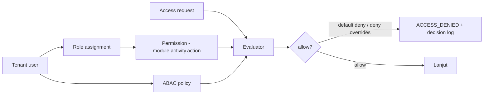
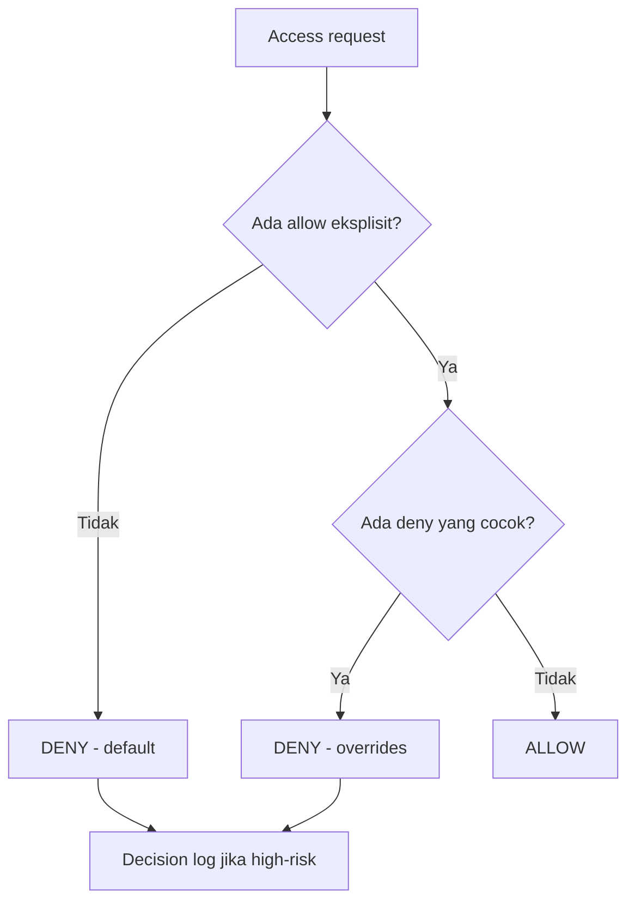
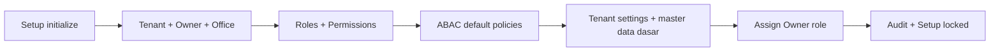

# Bagian 17 — Default Seed, RBAC, dan ABAC Policy

> **Status dokumen.** Repo `awcms` baru pada tahap fondasi ulang ([ADR-0001](../adr/0001-rebuild-on-awcms-foundation-erp-scope.md)) — belum ada modul ERP yang diimplementasikan. Dokumen ini adalah **desain target** untuk mekanisme RBAC/ABAC dan seed default yang akan dibangun mengikuti standar dasar awcms-mini (base yang sudah terverifikasi berjalan), diadaptasi untuk skop **ERP + integrasi bisnis** (finance/accounting, inventory/warehouse, procurement, manufaktur, HR/payroll, serta integrasi payment gateway, marketplace, pajak/Coretax, logistik). Belum ada baris kode/migrasi yang mengimplementasikan role, permission, atau policy di bawah ini — semua **rencana untuk diverifikasi saat modul terkait benar-benar dibangun**, bukan klaim status berjalan.

## Tujuan

Dokumen ini melengkapi data awal yang diperlukan agar **Setup Wizard** dan **RBAC/ABAC** dapat diimplementasikan di awcms: registry module/activity, daftar permission, matriks role → permission, ABAC default policy, dan seed default. Tanpa ini, akses tidak dapat dievaluasi secara konkret begitu modul-modul ERP mulai dikerjakan.

Terkait: `03_srs_detail_per_modul.md` (aturan akses, belum ditulis — akan ditambahkan bertahap mengikuti modul yang dibangun), `10_template_kode_coding_standard.md` (ABAC guard, belum ditulis).

## Model akses

- **RBAC** memberi baseline permission per role.
- **ABAC** menyaring lebih lanjut berdasarkan atribut (office/plant scope, kepemilikan resource, environment) dengan **default deny** dan **deny overrides allow**.

Mekanisme evaluator ini (default deny, deny overrides allow, `module_key.activity_code.action`) adalah pola generik yang diwarisi langsung dari base awcms-mini — reusable apa adanya. Yang berubah untuk skop ERP adalah **daftar module/activity** dan **daftar role**, karena domain bisnisnya finance/inventory/procurement/manufaktur/HR alih-alih retail/POS.

## Registry module & activity (rencana, skop ERP)

`module_key.activity_code` mengidentifikasi kemampuan. Contoh awal yang perlu diseed begitu modul terkait mulai dibangun (akan diperluas/direvisi seiring implementasi nyata — bukan daftar final):

| Module key                      | Activity code          | Action tersedia                       |
| -------------------------------- | ----------------------- | -------------------------------------- |
| `tenant_admin`                   | `office_management`    | read, create, update                  |
| `identity_access`                | `user_management`      | read, create, update, assign          |
| `identity_access`                | `access_control`       | read, assign, configure               |
| `profile_identity`               | `profile_management`   | read, create, update, delete, restore |
| `profile_identity`               | `profile_merge`        | read, approve                         |
| `finance_accounting`             | `general_ledger`       | read, create, update, post            |
| `finance_accounting`             | `journal_posting`      | post, reverse                         |
| `finance_accounting`             | `approval_matrix`      | read, configure, approve              |
| `finance_accounting`             | `bank_reconciliation`  | read, create, approve                 |
| `procurement`                    | `purchase_requisition` | read, create, update, approve         |
| `procurement`                    | `purchase_order`       | read, create, update, approve, cancel |
| `procurement`                    | `vendor_management`    | read, create, update, delete, restore |
| `inventory_warehouse`            | `stock_management`     | read, update, adjust                  |
| `inventory_warehouse`            | `transfer`             | read, create, approve, send, receive  |
| `inventory_warehouse`            | `cycle_count`          | read, create, approve                 |
| `manufacturing`                  | `production_order`     | read, create, update, approve, close  |
| `manufacturing`                  | `bom_routing`          | read, create, update, approve         |
| `hr_payroll`                     | `employee_management`  | read, create, update, delete, restore |
| `hr_payroll`                     | `payroll_run`          | read, create, approve, post           |
| `hr_payroll`                     | `payslip`              | read, export                          |
| `accounting_tax`                 | `tax_profile`          | read, configure                       |
| `accounting_tax`                 | `vat_invoice`          | read, create                          |
| `accounting_tax`                 | `coretax_export`       | export, approve                       |
| `integration_gateway`            | `payment_gateway`      | read, configure, reconcile            |
| `integration_gateway`            | `marketplace_sync`     | read, configure, sync                 |
| `integration_gateway`            | `logistics_provider`   | read, configure, sync                 |
| `integration_gateway`            | `webhook_inbound`      | read, verify                          |
| `sync_storage`                   | `sync`                 | read, configure                       |
| `sync_storage`                   | `conflict_resolution`  | read, approve                         |
| `management_reporting`           | `reports`              | read                                  |
| `workflow_approval`              | `approval`             | read, approve                         |
| `observability_logging`          | `logs`                 | read                                  |
| `production_security_readiness`  | `go_live`              | read, approve                         |
| `module_management`              | `modules`              | read, sync                            |
| `module_management`              | `tenant_modules`       | read, enable, disable                 |
| `module_management`              | `settings`             | read, update                          |
| `module_management`              | `permissions`          | read                                  |
| `module_management`              | `navigation`           | read                                  |
| `module_management`              | `jobs`                 | read                                  |
| `module_management`              | `health`               | read, check                           |

## Role default (rencana)

Base generik (`tenant_admin`, `identity_access`, dst.) dipertahankan apa adanya dari awcms-mini. Role bisnis diganti dari domain retail ke domain ERP:

| Role                  | Ringkasan akses                                                                     |
| --------------------- | ------------------------------------------------------------------------------------ |
| Owner                 | Semua module, termasuk approval & go-live                                           |
| Admin                 | Setup, user, master data, laporan, konfigurasi (bukan approval keuangan tertentu)    |
| Finance Approver      | Approval jurnal, rekonsiliasi bank, approval matrix keuangan; **tanpa** posting langsung |
| Finance Staff         | Input jurnal, draft rekonsiliasi; **tanpa** approval/post final                      |
| Procurement Officer   | PR/PO, vendor management; approval PO di atas ambang butuh Finance Approver          |
| Warehouse Supervisor  | Approval transfer stok & cycle count, receiving                                      |
| Warehouse Staff       | Transfer, receiving, cycle count operasional                                        |
| Production Planner    | Production order & BOM/routing                                                       |
| Payroll Admin         | Payroll run, payslip, employee management (akses PII sensitif)                       |
| Tax Officer           | Pajak & Coretax                                                                       |
| Integration Operator  | Konfigurasi payment gateway/marketplace/logistik/webhook (bukan approval keuangan)    |
| Business Analyst      | Laporan (read-only)                                                                   |
| Auditor               | Audit trail & logs read-only                                                         |

## Matriks role → permission (ringkas, rencana)

Legenda action: R=read, C=create, U=update, P=post, X=cancel/reverse, A=approve, E=export, S=send/sync, G=assign, F=configure, Y=sync, I=enable, D=disable, K=health check.

Permission `delete`, `restore`, dan `purge` untuk soft delete tidak tersirat dari `U`; seed harus memberikannya eksplisit per resource dan ABAC tetap default deny untuk archive/restore/purge — pola ini dipertahankan sama dari base awcms-mini.

| Module.activity                  | Owner | Admin | Fin. Approver | Fin. Staff | Procurement | Wh. Supervisor | Wh. Staff | Production | Payroll | Tax | Integration | Analyst | Auditor |
| ---------------------------------- | ----- | ----- | -------------- | ---------- | ----------- | --------------- | --------- | ----------- | ------- | --- | ------------ | ------- | ------- |
| tenant_admin.office                | RCU   | RCU   | –              | –          | –           | –               | –         | –           | –       | –   | –            | –       | R       |
| identity_access.user               | RCUG  | RCUG  | –              | –          | –           | –               | –         | –           | –       | –   | –            | –       | R       |
| finance.general_ledger             | RCUP  | R     | R              | RCU        | –           | –               | –         | –           | –       | –   | –            | R       | R       |
| finance.journal_posting            | PX    | –     | PX             | –          | –           | –               | –         | –           | –       | –   | –            | –       | R       |
| finance.approval_matrix            | RFA   | RF    | RFA            | –          | –           | –               | –         | –           | –       | –   | –            | –       | R       |
| finance.bank_reconciliation        | RCA   | RC    | RCA            | RC         | –           | –               | –         | –           | –       | –   | –            | R       | R       |
| procurement.requisition            | RCUA  | RCU   | –              | –          | RCU         | –               | –         | –           | –       | –   | –            | R       | R       |
| procurement.purchase_order         | RCUAX | RCU   | A*             | –          | RCUX        | –               | –         | –           | –       | –   | –            | R       | R       |
| procurement.vendor                 | RCU   | RCU   | –              | –          | RCU         | –               | –         | –           | –       | –   | –            | R       | R       |
| inventory.stock                    | RUadj | RUadj | –              | –          | R           | RUadj           | RUadj     | R           | –       | –   | –            | R       | R       |
| inventory.transfer                 | RCASR | RC    | –              | –          | –           | RCASR           | RC        | –           | –       | –   | –            | –       | R       |
| inventory.cycle_count              | RCA   | RC    | –              | –          | –           | RCA             | RC        | –           | –       | –   | –            | –       | R       |
| manufacturing.production_order     | RCUA  | RCU   | –              | –          | –           | –               | –         | RCUA        | –       | –   | –            | R       | R       |
| manufacturing.bom_routing          | RCUA  | RCU   | –              | –          | –           | –               | –         | RCUA        | –       | –   | –            | R       | R       |
| hr_payroll.employee                | RCU   | RCU   | –              | –          | –           | –               | –         | –           | RCU     | –   | –            | –       | R       |
| hr_payroll.payroll_run             | RCA   | –     | –              | –          | –           | –               | –         | –           | RCAP    | –   | –            | –       | R       |
| hr_payroll.payslip                 | RE    | –     | –              | –          | –           | –               | –         | –           | RE      | –   | –            | –       | R       |
| accounting_tax.tax_profile         | RF    | RF    | –              | –          | –           | –               | –         | –           | –       | RF  | –            | –       | R       |
| accounting_tax.vat_invoice         | RC    | R     | –              | –          | –           | –               | –         | –           | –       | RC  | –            | –       | R       |
| accounting_tax.coretax_export      | EA    | –     | A              | –          | –           | –               | –         | –           | –       | E   | –            | –       | R       |
| integration.payment_gateway        | RF    | RF    | –              | –          | –           | –               | –         | –           | –       | –   | RF           | –       | R       |
| integration.marketplace_sync       | RFS   | RFS   | –              | –          | –           | –               | –         | –           | –       | –   | RFS          | –       | R       |
| integration.logistics_provider     | RFS   | RFS   | –              | –          | –           | –               | –         | –           | –       | –   | RFS          | –       | R       |
| integration.webhook_inbound        | R     | R     | –              | –          | –           | –               | –         | –           | –       | –   | RV           | –       | R       |
| reporting.reports                  | R     | R     | R              | R          | R           | R               | R         | R           | R       | R   | R            | R       | R       |
| workflow.approval                  | RA    | R     | RA             | –          | RA          | RA              | –         | RA          | RA      | –   | –            | –       | R       |
| logs.logs                          | R     | R     | –              | –          | –           | –               | –         | –           | –       | –   | –            | –       | R       |

`*` Approval PO oleh Finance Approver berlaku hanya di atas ambang nominal yang dikonfigurasi ABAC (lihat policy #6 di bawah).

## ABAC default policy (rencana)

Prinsip: **default deny**, **deny overrides allow**, RLS tetap wajib — dipertahankan sama dari base awcms-mini.

| #   | Policy                       | Efek                                                                                                                    |
| --- | ----------------------------- | -------------------------------------------------------------------------------------------------------------------- |
| 1   | Default                      | **Deny** semua yang tidak diizinkan eksplisit                                                                         |
| 2   | Role allow                   | Allow sesuai matriks role → permission                                                                                |
| 3   | Tenant isolation              | Deny bila `resource.tenant_id != context.tenant_id`                                                                   |
| 4   | Office/plant scope            | Deny bila resource office/plant di luar scope user (kecuali role lintas-office)                                       |
| 5   | Segregation of duties (SoD)   | Deny bila actor yang membuat jurnal/PO juga menjadi approver-nya (pemisahan create vs approve wajib untuk finance/procurement) |
| 6   | Approval threshold            | Deny approval PO/jurnal di atas ambang nominal tanpa role approval yang sesuai                                        |
| 7   | Self-approval                 | Deny bila `approver == requester` pada workflow apa pun                                                               |
| 8   | Tax/PII masking               | Deny tampilkan tax identity/data payroll (NPWP, NIK, gaji) penuh untuk non-tax/non-payroll role                       |
| 9   | AI safety                     | Deny AI mengakses raw SQL/mutation/PII/data finansial mentah                                                          |
| 10  | Export approval                | Deny Coretax export atau payroll export tanpa approval bila policy aktif                                              |
| 11  | Soft delete archive            | Deny `includeDeleted`, `restore`, atau `purge` tanpa permission eksplisit; deny delete untuk posted/append-only entity |
| 12  | Webhook integrity              | Deny pemrosesan webhook inbound (payment/marketplace/tax/logistik) tanpa verifikasi signature/HMAC yang valid          |
| 13  | Double-posting guard           | Deny posting jurnal/pembayaran duplikat (idempotency key wajib untuk seluruh mutasi finansial high-risk)              |

Policy #5, #6, #12, #13 baru untuk skop ERP (SoD, approval threshold, webhook integrity, double-posting guard) — memperluas prinsip generik "self-approval ditolak" dan "high-risk mutation butuh idempotency" dari base awcms-mini ke risiko finansial yang lebih tinggi konsekuensinya di ERP.

Setiap **deny high-risk** dicatat di decision log tenant-scoped (mengikuti pola `*_abac_decision_logs` dari base, nama tabel disesuaikan saat skema awcms dibangun).

## Seed default saat Setup Wizard (rencana)

Setup wizard akan membuat data awal berikut (idempotent, sekali sebelum locked) — mengikuti pola base awcms-mini:

1. **Tenant** + owner **identity** + **tenant_user** owner.
2. **Office/plant** pertama (`head_office`).
3. **Role default** (role di atas) + **permission** + **role_permission**.
4. **ABAC default policy** (policy di atas).
5. **Tenant settings**: `default_locale`, `default_theme=system`, timezone, chart of account default (spesifik ERP, detail di dokumen finance/accounting yang belum ditulis).
6. **Master data dasar**: unit ukur, mata uang dasar, akun COA minimal.
7. **Assignment**: owner → role Owner.
8. **Audit**: `tenant.created`, `access.assignment` awal.

## Acceptance criteria (target, belum diverifikasi terhadap kode)

- Setup wizard menghasilkan tenant, owner, office, role default, permission, dan ABAC default; lalu terkunci.
- Evaluator menegakkan default deny & deny overrides allow sesuai matriks & policy.
- SoD ditegakkan: pembuat jurnal/PO tidak bisa merangkap approver; self-approval ditolak.
- Approval di atas ambang nominal ditolak tanpa role approval yang sesuai; export Coretax/payroll butuh approval bila policy aktif.
- Cross-tenant & cross-office/plant ditolak.
- Webhook inbound (payment/marketplace/tax/logistik) ditolak tanpa verifikasi signature valid.
- Soft delete/restore hanya untuk role berizin; archive view default deny untuk role operasional.
- Deny high-risk tercatat di decision log.
- Seed idempotent; tidak dapat dijalankan ulang setelah locked.

Semua kriteria di atas **akan diverifikasi ulang secara konkret** (test otomatis + live verification) saat modul RBAC/ABAC dan modul ERP terkait benar-benar diimplementasikan di awcms — dokumen ini adalah desain, bukan laporan hasil uji.
