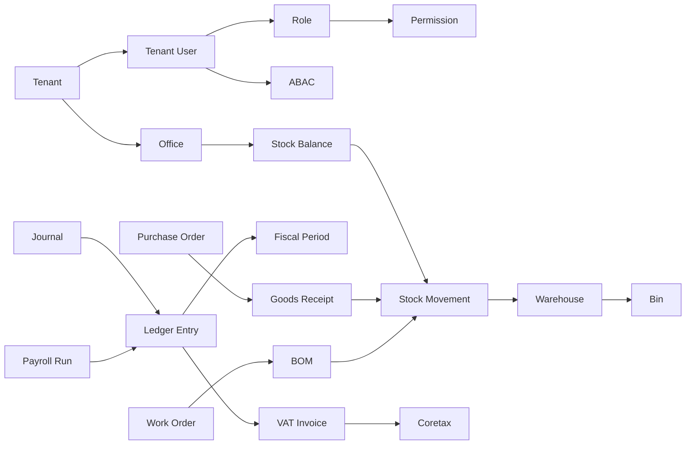

# Bagian 19 — Glossary dan Terminologi

> **Status implementasi (2026-07-14).** Diadaptasi dari `docs/awcms-mini/19_glossary_terminology.md`. Istilah arsitektur/keamanan generik dipertahankan apa adanya (sudah terbukti di base asal). Istilah domain CMS/retail-POS (blog, article, news portal, visitor analytics, checkout POS) **dihapus/diganti** dengan istilah domain ERP (general ledger, SKU, purchase order, BOM, payroll run) yang menjadi skop platform `awcms`. Belum ada satu pun modul di bawah yang terimplementasi — tabel di dokumen ini adalah rujukan terminologi untuk pekerjaan mendatang, bukan cerminan kode yang sudah berjalan.

## Tujuan

Dokumen ini menjadi rujukan istilah AWCMS agar seluruh paket dokumen dan implementasi memakai definisi yang sama. Istilah dikelompokkan: arsitektur, keamanan/akses, finance & accounting, inventory & warehouse, procurement, manufacturing, HR & payroll, pajak/Coretax, integrasi bisnis eksternal, sync/offline, database, dan frontend/UI.

## Peta konsep inti

## Arsitektur

| Istilah                           | Definisi                                                                                                                          |
| --------------------------------- | --------------------------------------------------------------------------------------------------------------------------------- |
| **AWCMS**                         | Platform ERP modular monolith (finance, inventory, procurement, manufacturing, HR/payroll) + integrasi bisnis eksternal yang dirancang paket dokumen ini. |
| **Modular monolith**              | Satu aplikasi yang dibagi menjadi modul berbatas jelas, siap dipecah ke microservice bila perlu, tetapi tidak dipisah sejak awal. |
| **Module descriptor**             | Metadata modul (`module.ts`): key, versi, dependency, path OpenAPI/AsyncAPI, event publish/subscribe.                             |
| **Offline-first / LAN-first**     | Prinsip bahwa sistem berjalan penuh di jaringan lokal tanpa internet; internet hanya untuk sync/provider opsional.                |
| **Domain event**                  | Fakta bisnis yang sudah terjadi (mis. `finance.ledger_entry.posted`), dikirim via envelope AsyncAPI.                              |
| **Envelope**                      | Struktur pembungkus standar event (eventId, eventType, tenantId, payload, metadata).                                              |
| **OpenAPI**                       | Kontrak REST API. **AsyncAPI**                                                                                                    | Kontrak domain event. |
| **Correlation ID / Causation ID** | ID untuk menelusuri satu request lintas log/event; causation menghubungkan event ke event pemicunya.                              |

## Arsitektur ekstensi

> Konsep lapisan ekstensi (Core/System/Official Optional/SaaS Control Plane/ERP Extension/Derived Application) mengikuti pola yang sama dengan base `awcms-mini`. Karena `awcms` **sendiri** adalah platform ERP (bukan aplikasi turunan di atas base lain), konsep "ERP Extension" dan "Derived Application" di sini merujuk pada modul domain ERP dan integrasi bisnis di dalam repo ini sendiri, bukan repo eksternal. Lihat doc 21 §Lima kategori modul untuk pemetaan definitif.

| Istilah                                    | Definisi                                                                                                                                                                                                                           |
| ------------------------------------------ | ----------------------------------------------------------------------------------------------------------------------------------------------------------------------------------------------------------------------------------- |
| **Tenant**                                 | Unit isolasi data & langganan platform (`awcms_tenants`) — **batas keamanan (RLS)**, satu tenant = satu dataset terisolasi. Tidak pernah dilemahkan oleh legal entity/organization unit.                                          |
| **Legal entity**                           | Badan hukum/usaha di **dalam** satu tenant (mis. satu PT/CV dalam grup usaha) — batas bisnis/akuntansi, bukan batas keamanan. Relevan untuk konsolidasi finance multi-entitas.                                                     |
| **Organization unit**                      | Subdivisi bisnis (departemen/cabang/cost center) di dalam legal entity/tenant — batas bisnis/akuntansi/workflow, berbeda dari `awcms_offices` (register lokasi fisik).                                                             |
| **Profile / Party**                        | Entitas kanonis (orang/organisasi — karyawan, supplier, customer) yang dikenal platform, dimiliki `profile_identity` (Core) — lapisan lain mereferensikan lewat `profile_entity_links`/capability port, tidak membuat registry sendiri. |
| **Business-role**                          | Kapasitas fungsional seorang profile/party di dalam legal entity/organization unit (mis. approver PO, approver payroll) untuk segregation-of-duties/workflow — berbeda dari RBAC **Role** (permission sistem).                    |
| **Extension layer**                        | Salah satu dari kategori Core, System Foundation, Official Optional Business Foundation, ERP domain module, Integration — arah dependency selalu DAG menuju Core.                                                                 |
| **ERP domain module**                      | Modul domain inti platform: finance-accounting, inventory-warehouse, procurement, manufacturing, hr-payroll. Hidup **di dalam** repo ini (bukan di repo turunan terpisah).                                                       |
| **Business integration module**            | Adapter integrasi bisnis eksternal: payment gateway, marketplace, tax/Coretax, logistik.                                                                                                                                            |
| **Capability port**                        | Interface TypeScript murni (`_shared/ports/*.ts`) yang memisahkan kapabilitas dari implementasi modul pemiliknya — mekanisme kolaborasi lintas-modul yang diizinkan, pengganti import langsung.                                    |
| **Lifecycle dependency**                   | `ModuleDescriptor.dependencies` — urutan enable/disable, selalu required (doc 21).                                                                                                                                                  |
| **Capability dependency**                  | `ModuleDescriptor.capabilities.consumes` — hubungan level-source lewat port/adapter, `optional` dinyatakan eksplisit (doc 21).                                                                                                      |
| **No shared-table write**                  | Aturan: hanya kode modul pemilik yang boleh menulis tabelnya sendiri; pemilik lain berkolaborasi lewat capability port/API/event, tidak pernah tabel bersama.                                                                       |

## Keamanan dan akses

| Istilah                  | Definisi                                                                                                                  |
| ------------------------ | ------------------------------------------------------------------------------------------------------------------------- |
| **RBAC**                 | Role-Based Access Control — akses berdasarkan peran user.                                                                 |
| **ABAC**                 | Attribute-Based Access Control — akses berdasarkan atribut (module, activity, resource, office, environment).             |
| **Default deny**         | Semua akses ditolak kecuali diizinkan eksplisit.                                                                          |
| **Deny overrides allow** | Bila ada aturan deny yang cocok, ia mengalahkan semua allow.                                                              |
| **RLS**                  | Row-Level Security PostgreSQL — filter baris per tenant di level database.                                                |
| **Tenant context**       | Konteks tenant aktif yang diset di transaction (`app.current_tenant_id`) untuk RLS.                                       |
| **Decision log**         | Catatan keputusan ABAC (terutama deny high-risk).                                                                         |
| **Audit log**            | Catatan aksi high-risk untuk akuntabilitas (`awcms_audit_events`).                                                        |
| **Masking / Redaction**  | Menyembunyikan sebagian/seluruh data sensitif pada tampilan (mask) dan pada log (redact).                                 |
| **HMAC**                 | Hash-based Message Authentication Code — tanda tangan integritas untuk sync.                                              |
| **Idempotency**          | Sifat mutation yang menghasilkan efek sama walau diulang dengan `Idempotency-Key` sama.                                   |
| **Soft delete**          | Penghapusan logis dengan `deleted_at`/actor/reason; list default menyembunyikan data, restore/purge butuh izin dan audit. |
| **Segregation of duties**| Prinsip pemisahan wewenang (mis. pembuat PO tidak boleh sekaligus approver-nya) untuk mencegah fraud finansial.           |

## Finance & Accounting

| Istilah                     | Definisi                                                                                                    |
| ---------------------------- | ------------------------------------------------------------------------------------------------------------ |
| **Chart of accounts**        | Daftar akun buku besar (aset, liabilitas, ekuitas, pendapatan, beban) per tenant/legal entity.                |
| **Journal**                  | Header transaksi akuntansi sebelum diposting (kumpulan ledger entry berpasangan debit/kredit).                |
| **Ledger entry**             | Baris posting buku besar, **append-only** setelah journal diposting; koreksi lewat reversal, bukan edit.      |
| **Posting**                  | Mengubah journal menjadi ledger entry final secara atomic dan immutable.                                      |
| **Fiscal period**            | Periode akuntansi (bulan/kuartal/tahun) yang bisa berstatus open/closed; period closed menolak posting baru. |
| **General ledger (GL)**      | Kumpulan seluruh ledger entry — sumber kebenaran laporan keuangan.                                            |
| **AR / AP**                  | Account Receivable (piutang) / Account Payable (utang).                                                       |
| **Reversal / Adjustment**    | Mekanisme koreksi resmi tanpa mengubah entry yang sudah posted.                                               |

## Inventory & Warehouse

| Istilah                            | Definisi                                                                                                                 |
| ---------------------------------- | ------------------------------------------------------------------------------------------------------------------------ |
| **Item / SKU**                     | Kode unik barang/jasa per tenant (item master) — pengganti istilah "produk" pada domain retail.                          |
| **Stock balance**                  | Saldo stok per item per warehouse/bin (on hand, reserved, available).                                                    |
| **Stock movement**                 | Mutasi stok **append-only** (opening, purchase receipt, sale, adjustment, transfer, production consumption/output).      |
| **Opening balance**                | Saldo stok awal saat implementasi.                                                                                       |
| **Tracking type**                  | Cara pelacakan item: none / lot / serial / lot_serial.                                                                   |
| **Warehouse / Zone / Bin**         | Hierarki lokasi fisik gudang; bin = lokasi rak terkecil.                                                                  |
| **Bin balance**                    | Saldo stok detail per bin/lot/serial.                                                                                    |
| **Lot / Batch**                    | Kelompok stok dengan atribut sama (mis. tanggal produksi/expired).                                                       |
| **Serial**                         | Identitas unit tunggal yang dilacak individual.                                                                          |
| **Transfer order**                 | Perintah pemindahan stok antar gudang (draft→...→received).                                                              |
| **In-transit**                     | Stok yang sudah dikirim (shipped) tetapi belum diterima.                                                                  |
| **Partial receipt**                | Penerimaan sebagian dari yang dikirim.                                                                                    |
| **Quarantine**                     | Lokasi karantina untuk barang rusak/expired.                                                                             |
| **Cycle count**                    | Perhitungan stok berkala untuk menemukan variance.                                                                       |
| **Variance**                       | Selisih antara stok sistem dan hasil hitung fisik.                                                                       |
| **FEFO**                           | First Expired First Out — prioritas keluar untuk stok yang lebih dulu kedaluwarsa.                                       |

## Procurement

| Istilah                     | Definisi                                                                                       |
| ---------------------------- | ------------------------------------------------------------------------------------------------ |
| **Supplier / Vendor**        | Pihak eksternal pemasok barang/jasa.                                                             |
| **Purchase request (PR)**    | Permintaan pembelian internal sebelum menjadi purchase order.                                    |
| **Purchase order (PO)**      | Pesanan resmi ke supplier setelah PR disetujui.                                                  |
| **Goods receipt**            | Penerimaan barang dari PO, memicu stock movement masuk.                                          |
| **Three-way match**          | Verifikasi kecocokan PO – goods receipt – invoice supplier sebelum pembayaran disetujui.          |

## Manufacturing

| Istilah                     | Definisi                                                                                       |
| ---------------------------- | ------------------------------------------------------------------------------------------------ |
| **Bill of materials (BOM)**  | Daftar komponen/bahan baku yang dibutuhkan untuk memproduksi satu unit item jadi.                 |
| **Work order**               | Perintah produksi yang mengonsumsi bahan baku sesuai BOM dan menghasilkan barang jadi.            |
| **Material consumption**     | Mutasi stok keluar bahan baku saat work order berjalan (append-only).                             |
| **Finished goods output**    | Mutasi stok masuk barang jadi hasil produksi.                                                     |

## HR & Payroll

| Istilah                     | Definisi                                                                                       |
| ---------------------------- | ------------------------------------------------------------------------------------------------ |
| **Employee**                 | Profil karyawan (subset dari Profile/Party) dengan data kepegawaian.                             |
| **Attendance**                | Catatan kehadiran karyawan, dasar perhitungan payroll.                                           |
| **Payroll run**               | Proses batch perhitungan & posting gaji periode tertentu; append-only setelah posted.            |
| **Payslip**                   | Dokumen rincian gaji per karyawan per payroll run; akses terbatas (karyawan bersangkutan/HR/finance). |

## Pajak / Coretax

| Istilah                         | Definisi                                                                                                                    |
| ------------------------------- | ------------------------------------------------------------------------------------------------------------------------------- |
| **Coretax**                     | Sistem administrasi pajak DJP Indonesia; AWCMS bersifat **Coretax-ready** (XML/staging), bukan integrasi upload resmi.        |
| **NPWP**                        | Nomor Pokok Wajib Pajak. **NIK**                                                                                                | Nomor Induk Kependudukan. |
| **NITKU / ID TKU**              | Nomor Identitas Tempat Kegiatan Usaha — identitas unit usaha untuk pajak.                                                       |
| **PPN / VAT**                   | Pajak Pertambahan Nilai / Value Added Tax.                                                                                       |
| **DPP**                         | Dasar Pengenaan Pajak — basis nilai untuk menghitung PPN.                                                                        |
| **VAT invoice (faktur)**        | Faktur pajak yang di-stage dari transaksi finance/sales posted.                                                                  |
| **Coretax batch**               | Kumpulan VAT invoice tervalidasi yang diekspor sebagai XML + checksum.                                                          |
| **Party / Product tax profile** | Konfigurasi pajak untuk pihak (customer/supplier) / item.                                                                       |
| **Checksum**                    | Nilai verifikasi integritas file ekspor.                                                                                        |

## Integrasi bisnis eksternal

| Istilah                     | Definisi                                                                                       |
| ---------------------------- | ------------------------------------------------------------------------------------------------ |
| **Payment gateway**          | Provider pembayaran online (mis. gaya Midtrans/Xendit) — adapter di dalam modul integrasi bisnis. |
| **Marketplace channel**      | Adapter integrasi ke marketplace (mis. gaya Tokopedia/Shopee) untuk sinkronisasi order/produk.    |
| **Logistics provider**       | Adapter integrasi ke penyedia jasa logistik/ekspedisi untuk tracking pengiriman.                  |
| **Webhook**                  | Callback HTTP dari provider eksternal; wajib diverifikasi signature-nya sebelum diproses.          |
| **Idempotent callback**      | Callback yang aman diproses ulang tanpa efek ganda (mis. payment settlement).                      |

## Sync dan offline

| Istilah                    | Definisi                                                                                    |
| -------------------------- | ------------------------------------------------------------------------------------------- |
| **Sync node**              | Instance offline/LAN yang bersinkron dengan server pusat.                                   |
| **Outbox / Inbox**         | Antrean event keluar / masuk untuk sinkronisasi.                                            |
| **Transactional outbox**   | Pola menulis event dalam transaction yang sama dengan data, lalu dikirim worker terpisah.   |
| **Push / Pull**            | Mengirim / menarik event antar node dan server.                                             |
| **Checkpoint**             | Penanda posisi sinkronisasi terakhir.                                                       |
| **Conflict**               | Perbedaan data antar node yang perlu diselesaikan (high-risk = manual + audit).             |
| **Anti-replay / Skew**     | Perlindungan terhadap pengiriman ulang; skew = toleransi selisih waktu (default 300 detik). |
| **Object sync queue / R2** | Antrean upload file ke object storage (Cloudflare R2 opsional).                             |
| **Tombstone**              | Event/penanda bahwa resource di-soft-delete agar node sync lain ikut menyembunyikan data tanpa physical delete langsung. |
| **Immutable**              | Tidak dapat diubah/dihapus; koreksi lewat cancel/return/reversal/adjustment.                |

## Database dan performa

| Istilah                     | Definisi                                                                                                                   |
| --------------------------- | -------------------------------------------------------------------------------------------------------------------------- |
| **Migration**               | Perubahan schema berurutan (`NNN_awcms_<area>_<desc>.sql`) yang tercatat & audit-ready.                                    |
| **Partial unique index**    | Unique index dengan kondisi, mis. `WHERE deleted_at IS NULL`, agar kode bisnis aktif tetap unik saat data lama diarsipkan. |
| **Schema migrations table** | `awcms_schema_migrations` — catatan migration yang sudah dijalankan + checksum.                                            |
| **`SET LOCAL`**             | Menetapkan variabel hanya untuk transaction berjalan (aman dengan PgBouncer transaction pooling).                          |
| **`FOR UPDATE`**            | Mengunci baris terpilih hingga transaction selesai (mencegah race pada stok/saldo).                                        |
| **Connection pool**         | Kumpulan koneksi DB yang dipakai ulang.                                                                                    |
| **Work class**              | Kategori beban (critical_transaction, interactive, reporting, background_sync, maintenance) untuk prioritas pool.          |
| **Backpressure**            | Menahan/menolak beban saat pool jenuh (`503 DATABASE_BUSY`).                                                               |
| **Circuit breaker**         | Memutus akses sementara saat DB tidak sehat.                                                                               |
| **PgBouncer**               | Connection pooler eksternal (mode transaction) opsional.                                                                   |
| **Keyset pagination**       | Paginasi berbasis kunci (bukan offset besar) untuk data besar.                                                             |
| **Idempotency store**       | `awcms_idempotency_keys` — penyimpanan hasil mutation high-risk.                                                            |

## Frontend dan UI

| Istilah                  | Definisi                                                                                                                                         |
| ------------------------ | ------------------------------------------------------------------------------------------------------------------------------------------------ |
| **SSR**                  | Server-Side Rendering — halaman dirender di server (Astro output server).                                                                        |
| **Island**               | Bagian interaktif yang di-hydrate di klien (Astro islands).                                                                                      |
| **PWA / Service worker** | Progressive Web App; service worker meng-cache app shell & mengelola background sync.                                                            |
| **IndexedDB**            | Penyimpanan klien untuk outbox transaksi offline & cache master.                                                                                 |
| **Design token**         | Variabel desain (warna, tipografi, spacing) sebagai CSS custom properties.                                                                       |
| **State pattern**        | Loading / empty / error / success yang wajib di tiap layar.                                                                                      |
| **Optimistic UI**        | Menampilkan hasil sebelum konfirmasi server, rollback bila ditolak.                                                                              |
| **i18n / locale**        | Internasionalisasi; min en+id (default **en**). String UI statis via `.po` gettext; konten data multi-bahasa di DB per locale aktif.             |
| **WCAG 2.1 AA**          | Standar aksesibilitas target AWCMS.                                                                                                               |
| **Sync indicator**       | Komponen UI penunjuk status koneksi & antrean sync.                                                                                              |

## Peran (persona)

| Peran                | Ringkas                                              |
| --------------------- | ------------------------------------------------------ |
| **Owner**             | Akses penuh & approval utama.                          |
| **Admin**             | Kelola sistem, user, master data, laporan.             |
| **Finance/Accounting**| Posting jurnal, closing period, rekonsiliasi.          |
| **Procurement Staff** | PR/PO, goods receipt.                                  |
| **Inventory Staff**   | Item, stok, adjustment terbatas.                       |
| **Petugas Gudang**    | Transfer, receiving, cycle count.                      |
| **Production Staff**  | Work order, material consumption.                      |
| **HR/Payroll Staff**  | Employee master, attendance, payroll run.               |
| **Tax Officer**       | Pajak & Coretax.                                        |
| **Manager**           | Approval transaksi/stok/operasional/PO.                |
| **Business Analyst**  | Laporan agregat & AI analyst.                           |
| **Auditor**           | Audit trail read-only.                                  |

## Singkatan cepat

`ABAC` · `RBAC` · `RLS` · `GL` · `AR` · `AP` · `PO` · `BOM` · `WMS` · `PPN/VAT` · `DPP` · `NPWP` · `NIK` · `NITKU` · `HMAC` · `FEFO` · `SSR` · `PWA` · `R2` · `SKU` · `DTO` · `SOP` · `PRD` · `SRS` · `ERD` · `DoD`.
