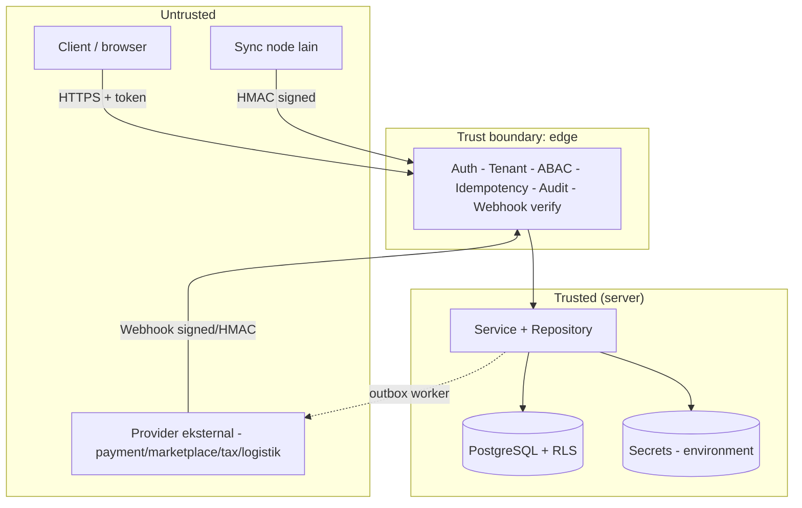
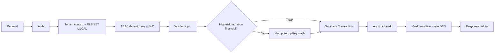

# Bagian 20 — Threat Model dan Arsitektur Keamanan

> **Status dokumen — PENTING.** Repo `awcms` baru pada tahap fondasi ulang
> ([ADR-0001](../adr/0001-rebuild-on-awcms-foundation-erp-scope.md)) —
> **belum ada satu pun modul ERP yang diimplementasikan**, belum ada
> migrasi SQL, belum ada endpoint. Dokumen sumber (awcms-mini) menjelaskan
> kontrol yang **sudah terimplementasi nyata dan diverifikasi live** di
> base tersebut (audit kepatuhan 2026-07-06, referensi path
> file/fungsi/query konkret). Dokumen ini **mengadaptasi mekanisme dan
> pola arsitektur yang sama** sebagai **desain target/rencana** untuk
> awcms — setiap klaim "✅ terpenuhi" pada dokumen sumber diturunkan di
> sini menjadi **"direncanakan, akan diverifikasi ulang"** begitu modul
> terkait benar-benar dibangun. Path file/fungsi yang disebut adalah
> **rencana lokasi** mengikuti pola base, bukan kode yang sudah ada.
> Bagian yang murni spesifik-CMS pada dokumen sumber (mis. epic visitor
> analytics pengunjung web) **dihapus** karena tidak relevan untuk skop
> ERP; sebagai gantinya, dokumen ini **menambah** permukaan ancaman
> spesifik-ERP (integritas data finansial, PII payroll, double-posting/
> double-payment, dan pemalsuan webhook integrasi eksternal) — lihat
> §Ancaman spesifik ERP di bawah.

Dokumen ini merangkum **model ancaman** dan **arsitektur keamanan** AWCMS sebagai base ERP. Kebijakan pelaporan kerentanan ada di [`SECURITY.md`](../../SECURITY.md); keputusan yang mendasari ada di [`docs/adr/`](../adr/README.md).

## Aset yang dilindungi

| Aset                           | Contoh                                                         | Sensitivitas          |
| ------------------------------ | -------------------------------------------------------------- | --------------------- |
| Kredensial autentikasi         | password hash, token sesi, JWT secret                          | Critical              |
| Identifier sensitif            | NPWP, NIK, email, nomor HP (hash + mask)                       | High                  |
| Data payroll & PII karyawan    | gaji, komponen upah, data kependudukan, rekening bank karyawan | Critical              |
| Data finansial                 | jurnal, buku besar, saldo akun, rekonsiliasi bank              | Critical (integritas) |
| Data lintas-tenant             | seluruh baris tenant-scoped                                    | High                  |
| Kredensial integrasi eksternal | API key payment gateway/marketplace/Coretax/logistik           | Critical              |
| Jejak audit & security event   | audit log, decision log, jejak posting/approval                | High (integritas)     |
| Secret provider/infra          | kunci object storage, HMAC sync, DB URL, webhook secret        | Critical              |
| Kontrak & standar              | OpenAPI/AsyncAPI, migration                                    | Medium (integritas)   |

## Batas kepercayaan (trust boundaries)

Prinsip: **semua input dari zona untrusted divalidasi dan tidak dipercaya**; nilai tenant/identitas berasal dari auth middleware, bukan header publik mentah. Untuk ERP, ini mencakup eksplisit **payload webhook dari payment gateway/marketplace/Coretax/logistik** — payload tersebut adalah input untrusted sampai signature/HMAC-nya diverifikasi, sama seperti request dari browser.

## Model ancaman (STRIDE ringkas)

| Ancaman                    | Contoh                                              | Mitigasi direncanakan                                                                                     |
| -------------------------- | --------------------------------------------------- | --------------------------------------------------------------------------------------------------------- |
| **Spoofing**               | Menyamar sebagai user/tenant/node/provider          | Auth token tervalidasi; sync HMAC + anti-replay; webhook signature verify; tenant context dari middleware |
| **Tampering**              | Ubah data/koreksi retroaktif, manipulasi ledger     | Immutability data posted (jurnal/transaksi finansial); audit append-only; RLS `FORCE`                     |
| **Repudiation**            | Menyangkal aksi (mis. approval PO/pembayaran)       | Audit high-risk + decision log dengan correlation ID                                                      |
| **Information disclosure** | Bocor lintas-tenant / data payroll / data finansial | RLS berlapis + filter `tenant_id`; masking/redaction PII & data gaji; error tanpa stack trace             |
| **Denial of service**      | Menjenuhkan DB/pool, banjir webhook palsu           | Pool work-class + backpressure → `503 DATABASE_BUSY`; statement timeout; rate limit webhook inbound       |
| **Elevation of privilege** | Naik hak akses, approval tanpa SoD                  | ABAC default-deny, deny overrides allow; role DB non-superuser; self-approval & SoD ditolak               |

## Kontrol keamanan berlapis

1. **Transport & sesi** — HTTPS di produksi, cookie `HttpOnly`/`Secure`/`SameSite`, TTL sesi, lockout login.
2. **Otorisasi** — RBAC + ABAC default-deny + segregation of duties (SoD) untuk alur finansial, ditambah RLS.
3. **Integritas data** — transaksi, idempotency (wajib untuk posting jurnal/pembayaran/PO), immutability, soft delete.
4. **Kerahasiaan** — hash+mask identifier & data payroll, redaction log/audit, secret hanya dari environment.
5. **Ketersediaan** — pooling/backpressure, offline-first outbox, circuit breaker per-provider integrasi eksternal.
6. **Rantai pasok** — Bun-only, Dependabot, CodeQL, lockfile terkunci.
7. **Integritas integrasi eksternal** — verifikasi signature/HMAC pada setiap webhook inbound, idempotency pada setiap callback yang bisa memicu efek finansial (lihat §Ancaman spesifik ERP).

## Penanganan secret

- Secret hanya dari **environment**; `.env` di-ignore, `.env.example` hanya placeholder.
- Kredensial integrasi eksternal (payment gateway, marketplace, Coretax, logistik) mengikuti pola sama: hanya dari environment/tenant-scoped secret store, tidak pernah di-hardcode atau dikembalikan mentah ke response DTO.
- Boot memvalidasi konfigurasi (fail-fast); flag aktif tanpa kredensial → gagal start.
- Redaction wajib untuk key sensitif (termasuk kunci API integrasi, data payroll) sebelum masuk log/audit.
- CI menolak berkas `.env` yang ter-commit dan tooling non-Bun.

## Data sensitif & privasi

- Identifier sensitif (NPWP/NIK/email/telepon) disimpan sebagai `value_hash` (lookup/dedup) + `masked_value` (tampilan); nilai mentah tidak disimpan mentah di luar kebutuhan operasional yang eksplisit.
- Data payroll (gaji, komponen upah, rekening bank karyawan) diperlakukan sebagai kelas sensitivitas tertinggi bersama kredensial: akses dibatasi role `hr_payroll`/`payroll_admin`, wajib masking pada laporan lintas-role, dan audit akses read pada data payroll individual dipertimbangkan sebagai kontrol tambahan (bukan hanya audit pada mutasi).
- Klasifikasi data & retensi akan didokumentasikan di `04_erd_data_dictionary.md` (belum ditulis) begitu skema data ERP dirancang.
- Data yang di-soft-delete tetap tenant-scoped, tetap terkena RLS, dan tetap masuk retensi/legal hold — termasuk data finansial dan payroll yang di-arsip.

## Automasi keamanan repositori

| Kontrol                                                             | Lokasi (rencana)               |
| ------------------------------------------------------------------- | ------------------------------ |
| Secret scanning + push protection                                   | GitHub (setelan repo)          |
| Dependabot alerts + updates                                         | `.github/dependabot.yml`       |
| CodeQL code scanning                                                | `.github/workflows/codeql.yml` |
| Lint + docs-check + typecheck + unit test + Bun-only/no-`.env` gate | `.github/workflows/ci.yml`     |
| Private vulnerability reporting                                     | `SECURITY.md`                  |

## Batasan (yang belum tercakup)

Kontrol di dokumen ini adalah **desain, bukan status implementasi** — belum ada satu modul pun yang dibangun di awcms saat dokumen ini ditulis. Setiap kontrol harus diverifikasi ulang secara konkret (test otomatis + live verification, sama seperti pola `security-readiness.ts` di base awcms-mini) saat modul terkait dibangun. Yang tetap di luar cakupan base ini secara desain (tanggung jawab lapisan deployment/aplikasi turunan): WAF, rate limiting di edge/proxy, manajemen secret terpusat (vault), pengerasan host, provisioning sertifikat TLS nyata, dan monitoring/SIEM terpusat.

## Matrix kepatuhan OWASP / ASVS / ISO 27001 — target, belum diverifikasi

Struktur matrix di bawah mengikuti pola audit kepatuhan base awcms-mini (memetakan kontrol proyek ke kerangka standar industri untuk kesiapan audit eksternal). **Berbeda dari dokumen sumber, kolom "Bukti" di sini berisi rencana mekanisme, bukan path file/fungsi yang sudah ada** — karena belum ada kode. Legenda status: 🎯 direncanakan (belum ada kode untuk diverifikasi) · ⚠ gap yang diketahui akan perlu ditutup · ➖ di luar scope base generik ini.

### OWASP Top 10 (2021)

| #   | Kategori                           | Status | Rencana mitigasi                                                                                                                                                                                                                                                                                                                                                |
| --- | ---------------------------------- | ------ | --------------------------------------------------------------------------------------------------------------------------------------------------------------------------------------------------------------------------------------------------------------------------------------------------------------------------------------------------------------- |
| A01 | Broken Access Control              | 🎯     | ABAC default-deny + deny-overrides + SoD untuk alur finansial (doc 17); RLS `ENABLE`+`FORCE` pada seluruh tabel tenant-scoped; role app DB non-superuser/non-BYPASSRLS; setiap query tenant-scoped lewat helper `withTenant()` setara.                                                                                                                          |
| A02 | Cryptographic Failures             | 🎯     | Password argon2id; token sesi opaque (hash-only at rest); identifier sensitif & data payroll `value_hash`+`masked_value`; cookie `HttpOnly`+`SameSite`+`Secure`.                                                                                                                                                                                                |
| A03 | Injection                          | 🎯     | Seluruh query lewat tagged template parametrik; tidak ada string-concat SQL; output HTML di-escape otomatis oleh Astro.                                                                                                                                                                                                                                         |
| A04 | Insecure Design                    | 🎯     | Threat model ini sendiri (STRIDE); immutability data posted (jurnal/transaksi finansial); idempotency mutation high-risk; self-approval & SoD workflow ditolak; fail-closed default tenant context.                                                                                                                                                             |
| A05 | Security Misconfiguration          | 🎯     | Secret hanya dari `process.env`; CI menolak `.env` ter-commit; error tanpa stack trace; security response headers (CSP/HSTS/X-Frame-Options/dst.) direncanakan sejak awal, bukan ditambal belakangan seperti temuan gap di base.                                                                                                                                |
| A06 | Vulnerable/Outdated Components     | 🎯     | Bun-only, dependency minimal; Dependabot + CodeQL aktif sejak awal.                                                                                                                                                                                                                                                                                             |
| A07 | Identification & Auth Failures     | 🎯     | Lockout per-identitas + rate limit sumber+tenant sejak awal (bukan ditambal setelah insiden seperti di base); anti-enumeration pada login/forgot-password; sesi TTL + revoke eksplisit saat logout.                                                                                                                                                             |
| A08 | Software & Data Integrity Failures | 🎯     | Checksum objek sync/upload; audit append-only; migration checksum di runner; CodeQL.                                                                                                                                                                                                                                                                            |
| A09 | Logging & Monitoring Failures      | 🎯     | Audit high-risk + decision log + correlation ID; redaction wajib (termasuk data payroll/finansial) sebelum log/audit.                                                                                                                                                                                                                                           |
| A10 | SSRF                               | 🎯     | URL provider eksternal (payment gateway/marketplace/Coretax/logistik) selalu dari konfigurasi tenant/env tervalidasi; circuit breaker per-provider; kasus tenant-configured URL (mis. OIDC issuer, endpoint webhook custom) diperlakukan sebagai accepted-risk terdokumentasi eksplisit, bukan diam-diam dianggap aman — mengikuti pola keputusan #603 di base. |

### OWASP ASVS (L1/L2 relevan)

| Area                            | Status | Rencana mitigasi                                                                                                                                                                                                          |
| ------------------------------- | ------ | ------------------------------------------------------------------------------------------------------------------------------------------------------------------------------------------------------------------------- |
| V2 Auth                         | 🎯     | Hashing modern (argon2id), lockout + rate limit, token sesi baru tiap login, logout mencabut sesi (hapus baris DB).                                                                                                       |
| V3 Session                      | 🎯     | Cookie `HttpOnly`+`SameSite`+`Secure` (prod); token opaque server-side; TTL sesi.                                                                                                                                         |
| V4 Access Control               | 🎯     | Default deny, dicek per-request; RLS defense-in-depth; IDOR dicegah via tenant-context helper konsisten; SoD untuk alur finansial (khas ERP, lihat doc 17).                                                               |
| V5 Validation/Encoding          | 🎯     | Validasi input tiap endpoint; output encoding otomatis Astro; CSRF via `checkOrigin` bawaan.                                                                                                                              |
| V7 Error/Logging                | 🎯     | Error tanpa detail internal; log tanpa data sensitif (redaksi wajib).                                                                                                                                                     |
| V9 Communications               | 🎯/➖  | TLS di produksi (template deploy, provisioning sertifikat tanggung jawab operator); HMAC untuk sync mesin-ke-mesin dan webhook inbound.                                                                                   |
| V12 Files                       | 🎯     | Checksum diverifikasi sebelum upload; path/objek tak pernah dari input tak tepercaya.                                                                                                                                     |
| V14 HTTP Security Configuration | 🎯     | CSP, `X-Content-Type-Options`, `X-Frame-Options`, `Referrer-Policy`, `Permissions-Policy`, HSTS — direncanakan sejak modul pertama dibangun, dijadwalkan dalam gate CI/readiness, bukan ditambal reaktif setelah insiden. |

### ISO/IEC 27001:2022 Annex A (relevan-kode)

| Kontrol                           | Status | Rencana mitigasi                                                                                                                                                   |
| --------------------------------- | ------ | ------------------------------------------------------------------------------------------------------------------------------------------------------------------ |
| A.5.15 Access control             | 🎯     | ABAC default-deny + RLS FORCE + SoD finansial.                                                                                                                     |
| A.5.17 Authentication information | 🎯     | Password hash argon2id; token sesi hash-only.                                                                                                                      |
| A.8.2 Privileged access rights    | 🎯     | Role DB terpisah (app/worker/setup/migration), least-privilege, tak satupun superuser.                                                                             |
| A.8.5 Secure authentication       | 🎯     | Lockout + rate limit + hashing modern + CSRF checkOrigin.                                                                                                          |
| A.8.12 Data leakage prevention    | 🎯     | Masking/redaction identifier sensitif & data payroll.                                                                                                              |
| A.8.15 Logging                    | 🎯     | Audit trail append-only + decision log + correlation ID; retensi eksplisit + purge terjadwal.                                                                      |
| A.8.16 Monitoring                 | ⚠      | Log terstruktur direncanakan; agregasi/alerting terpusat (SIEM) tanggung jawab lapisan operasional/deployment turunan.                                             |
| A.8.24 Cryptography               | 🎯     | Argon2id (password), SHA-256 (token, checksum, hash CSP), HMAC (sync & webhook).                                                                                   |
| A.8.28 Secure coding              | 🎯     | Guardrail coding standard (belum ditulis, doc 10) akan menegakkan tagged-template query, response helper standar, ABAC/RLS/audit/idempotency per endpoint; CodeQL. |
| A.8.31 Separation of environments | 🎯     | `APP_ENV` menggerbang perilaku sensitif; role DB app vs migrasi terpisah.                                                                                          |

Matrix di atas **akan diaudit ulang secara faktual** (dengan bukti path file/fungsi konkret, sama seperti dokumen sumber) setiap kali sekelompok modul selesai dibangun — bukan diklaim terpenuhi di muka.

## Ancaman spesifik ERP

Bagian ini **baru** dibanding dokumen sumber — awcms-mini adalah CMS/POS-oriented dan tidak membahas permukaan ancaman finansial-berat berikut. Skop ERP (finance/accounting, inventory, procurement, manufaktur, payroll, plus integrasi payment gateway/marketplace/pajak/logistik) memperkenalkan kelas risiko dengan konsekuensi lebih tinggi dan lebih langsung (kerugian finansial nyata, kepatuhan pajak, kebocoran PII karyawan) dibanding threat model generik CMS.

### Integritas data finansial (manipulasi ledger)

| Risiko                                             | Mitigasi rencana                                                                                                                                                                                                |
| -------------------------------------------------- | --------------------------------------------------------------------------------------------------------------------------------------------------------------------------------------------------------------- |
| Jurnal/transaksi diubah retroaktif                 | Entri jurnal yang sudah **posted** bersifat append-only/immutable; koreksi hanya lewat entri pembalik (reversing entry) yang tercatat sebagai transaksi baru, tidak pernah `UPDATE`/`DELETE` pada baris posted. |
| Saldo akun dimanipulasi lewat akses langsung DB    | RLS `FORCE` + role DB non-superuser mencegah bypass aplikasi; checksum/hash rantai pada batch posting dipertimbangkan sebagai kontrol tambahan (deteksi tamper) untuk buku besar.                               |
| Approval matrix dilewati untuk posting nilai besar | ABAC policy #6 (doc 17: approval threshold) + SoD (policy #5) — pembuat jurnal tidak boleh merangkap approver; approval di atas ambang nominal wajib role approval eksplisit.                                   |
| Audit trail finansial dipalsukan/dihapus           | Audit append-only dengan correlation ID; setiap posting/approval/reversal finansial masuk kategori high-risk yang wajib tercatat di decision log.                                                               |

### Double-posting dan double-payment

| Risiko                                                                       | Mitigasi rencana                                                                                                                                                                                                                                              |
| ---------------------------------------------------------------------------- | ------------------------------------------------------------------------------------------------------------------------------------------------------------------------------------------------------------------------------------------------------------- |
| Retry client memicu posting jurnal/pembayaran duplikat                       | `Idempotency-Key` wajib untuk seluruh mutasi finansial high-risk (posting jurnal, pembayaran, penerimaan/pengeluaran kas) — pola yang sama diwajibkan base untuk mutasi high-risk apa pun, di ERP cakupannya diperluas eksplisit ke semua endpoint finansial. |
| Webhook callback dari payment gateway dikirim ulang (at-least-once delivery) | Idempotency di sisi consumer webhook (dedup berdasarkan `provider_event_id`, bukan hanya `Idempotency-Key` sisi client) — status pembayaran diperbarui secara idempotent, bukan menambah efek finansial setiap kali callback diterima ulang.                  |
| Race condition dua request approval PO/pembayaran bersamaan                  | Row-level lock (`SELECT ... FOR UPDATE`) atau compare-and-swap pada state transition finansial, mengikuti pola perbaikan regresi MFA/TOTP di base awcms-mini (SELECT-lalu-UPDATE terpisah di bawah READ COMMITTED terbukti rentan race).                      |

### Kebocoran/penyalahgunaan data payroll & PII

| Risiko                                                                       | Mitigasi rencana                                                                                                                                                                      |
| ---------------------------------------------------------------------------- | ------------------------------------------------------------------------------------------------------------------------------------------------------------------------------------- |
| Data gaji/rekening bank karyawan bocor lintas-role                           | ABAC policy #8 (doc 17: tax/PII masking) — hanya role `payroll_admin`/`hr_payroll` yang melihat data gaji penuh; role lain melihat versi masked/aggregate.                            |
| Export payroll tanpa approval                                                | ABAC policy #10 (doc 17: export approval) diperluas ke export payroll, bukan hanya Coretax.                                                                                           |
| Akses read massal ke data payroll individual disalahgunakan (insider threat) | Dipertimbangkan: audit akses read (bukan hanya mutasi) untuk data payroll individual, mengingat sensitivitasnya setara kredensial autentikasi.                                        |
| Data payroll dicatat ke log/audit tanpa redaksi                              | Redaction wajib (key sensitif payroll ditambahkan ke daftar redaction key generik: gaji, `bank_account`, NIK, dst.) sebelum masuk log/audit — memperluas pola redaction generik base. |

### Pemalsuan integrasi/webhook dari provider eksternal

| Risiko                                                                                                                | Mitigasi rencana                                                                                                                                                                                                                                                                   |
| --------------------------------------------------------------------------------------------------------------------- | ---------------------------------------------------------------------------------------------------------------------------------------------------------------------------------------------------------------------------------------------------------------------------------- |
| Webhook payment gateway/marketplace/Coretax/logistik dipalsukan (spoofed)                                             | Setiap webhook inbound wajib verifikasi signature/HMAC sesuai skema provider **sebelum** payload dipercaya atau memicu efek finansial apa pun — ABAC policy #12 (doc 17: webhook integrity) menegakkan default-deny untuk webhook tanpa signature valid.                           |
| Webhook direplay untuk memicu efek finansial berulang                                                                 | Dedup berdasarkan `provider_event_id`/nonce provider, ditambah idempotency di sisi consumer (lihat §Double-posting).                                                                                                                                                               |
| Provider eksternal outage/lambat mengunci transaksi bisnis lain                                                       | Panggilan provider selalu di luar transaksi DB; circuit breaker per-provider (payment gateway, marketplace, Coretax, logistik masing-masing independen) — outage satu provider tidak boleh mengunci proses bisnis tak terkait.                                                     |
| Kredensial integrasi (API key payment/marketplace/Coretax) bocor                                                      | Kredensial hanya dari environment/tenant-scoped secret store; tidak pernah dikembalikan mentah ke response DTO; redaction wajib di log.                                                                                                                                            |
| SSRF via URL callback/webhook yang dikonfigurasi tenant                                                               | URL callback/webhook custom yang dikonfigurasi tenant diperlakukan sebagai kasus accepted-risk terdokumentasi (mengikuti pola keputusan OIDC issuer_url di base) — bukan diam-diam dianggap aman; direkomendasikan validasi hostname/allow-list bila skema integrasi memungkinkan. |
| Marketplace/tax/logistik mengembalikan data yang memicu state finansial salah (mis. status pesanan/pembayaran keliru) | Validasi state transition di sisi aplikasi (mis. status pembayaran tidak boleh mundur dari `paid` ke `pending` tanpa jalur eksplisit); reconciliation job terjadwal untuk mendeteksi drift antara state lokal dan state provider.                                                  |

## Pola arsitektur generik yang diwarisi dari base (ringkas)

Pola berikut dari awcms-mini bersifat generik dan reusable langsung untuk awcms; detail penuh (nama fungsi/file, nomor issue) tidak direproduksi di sini karena spesifik-implementasi awcms-mini yang belum tentu identik strukturnya di awcms — akan didokumentasikan ulang dengan bukti konkret saat modul terkait dibangun:

- **Pemisahan role DB** (app/worker/setup/migration), masing-masing least-privilege sesuai jalur kode yang benar-benar dipakainya, termasuk tabel global (non-RLS) yang harus dipersempit eksplisit dari default `ALTER DEFAULT PRIVILEGES` yang terlalu luas.
- **Hardening auth online** (rate limit + lockout, MFA/TOTP, SSO/OIDC dengan break-glass wajib, circuit breaker per-provider yang tidak menyamakan 4xx valid dengan kegagalan transport) — berlaku sama untuk awcms bila/ketika fitur online-auth serupa dibangun.
- **Pertahanan request smuggling/Content-Length** pada endpoint upload/objek besar.
- **Observability**: audit trail terstruktur, correlation ID, retensi + purge terjadwal, titik pemasangan sink log/audit eksternal (no-op default) untuk aplikasi turunan.
- **Integritas arsip/replay event domain**: checksum pada artifact arsip, UPSERT idempotent pada job rollup/agregasi, pencegahan SQL injection lewat nama tabel/kolom dinamis (allowlist registry-validated, bukan dari input request).

Setiap pola di atas akan diadaptasi dan diverifikasi ulang secara konkret (fungsi/file/test nyata) begitu modul yang membutuhkannya benar-benar dibangun di awcms.
