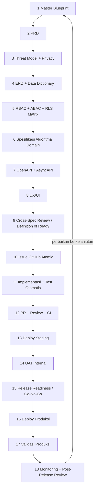

# Alur pengembangan AWCMS

> **Dokumen kanonik proses.** Ia menjawab satu pertanyaan: _dari niat sampai
> produksi, apa yang harus ada, dalam urutan apa, dan apa yang menegakkannya._
>
> Ia **tidak** mengulang isi dokumen lain. Setiap langkah menunjuk artefak
> nyata di repo ini, dan bila artefaknya **belum ada**, langkah itu mengatakannya
> — celah yang ditulis lebih berguna daripada celah yang disamarkan.

- **Menggantikan** [`alur-pengembangan-mini-first.md`](alur-pengembangan-mini-first.md),
  yang dicabut [ADR-0055](../adr/0055-development-confined-to-awcms-and-awcms-astro.md)
  dan kini hanya catatan sejarah.
- **Melengkapi, bukan menggantikan:** [`../../AGENTS.md`](../../AGENTS.md)
  (kontrak kerja teknis) dan [`../../CONTRIBUTING.md`](../../CONTRIBUTING.md)
  (mekanik langkah 10–12).

## Alurnya

## Dua hal yang harus dibaca sebelum memakai diagram ini

**Pertama: tidak setiap perubahan menempuh 18 langkah.** Yang menentukan bukan
selera, melainkan KELAS perubahannya:

| Kelas perubahan                                         | Langkah wajib                                                                                               |
| ------------------------------------------------------- | ----------------------------------------------------------------------------------------------------------- |
| Dokumen saja, chore, dependency bump                    | 10 → 12, lalu 16–18 saat rilis                                                                              |
| Perbaikan bug tanpa perubahan kontrak/skema             | 10 → 12                                                                                                     |
| Perubahan perilaku pada modul yang sudah ada            | 3, 5 (bila menyentuh akses), 7 (bila menyentuh API), 10 → 12                                                |
| Skema baru / kolom baru                                 | 4, 5, 10 → 12                                                                                               |
| **Modul baru**                                          | 1 → 12 penuh, plus admission ADR ([`21_module_admission_governance.md`](21_module_admission_governance.md)) |
| Perubahan lapisan fondasi (auth, access, sync, tenancy) | 1 → 12 penuh, **ADR wajib**                                                                                 |

**Kedua: langkah 1–9 menghasilkan DOKUMEN, dan dokumen di repo ini menua.**
Aturan yang sudah berlaku tetap berlaku: sebuah dokumen yang salah lebih
berbahaya daripada dokumen yang tidak ada, karena ia dipercaya. Kalau sebuah
langkah menghasilkan klaim yang bisa basi (angka, daftar berkas, status), taruh
klaim itu di tempat yang **di-generate atau digerbangi**, bukan di prosa.

---

## 1. Master Blueprint

**Menjawab:** produk ini apa, batasnya di mana, dan apa yang secara sengaja
BUKAN bagiannya.

| Artefak                                                            | Peran                                 |
| ------------------------------------------------------------------ | ------------------------------------- |
| [`01_canvas_induk.md`](01_canvas_induk.md)                         | ringkasan produk & prinsip            |
| [`11_implementation_blueprint.md`](11_implementation_blueprint.md) | blueprint implementasi per sprint     |
| [`../ARCHITECTURE.md`](../ARCHITECTURE.md)                         | arsitektur current-state (digerbangi) |
| [`../adr/`](../adr/README.md)                                      | keputusan yang mengunci ruang lingkup |

Perubahan ruang lingkup di tingkat ini **selalu** sebuah ADR. Blueprint tidak
mengubah arah; ADR yang mengubah, dan blueprint mengikutinya.

## 2. PRD

**Menjawab:** siapa penggunanya, pekerjaan apa yang diselesaikan, dan apa
kriteria diterimanya.

[`02_prd_detail_per_modul.md`](02_prd_detail_per_modul.md).

## 3. Threat Model + Privacy Analysis

**Menjawab:** siapa penyerangnya, apa yang ia incar, dan data pribadi apa yang
tersentuh.

| Bagian                      | Artefak                                                                                | Status          |
| --------------------------- | -------------------------------------------------------------------------------------- | --------------- |
| Threat model                | [`20_threat_model_security_architecture.md`](20_threat_model_security_architecture.md) | ada             |
| Peta kontrol                | [`standar-performa-dan-keamanan.md`](standar-performa-dan-keamanan.md)                 | ada, **hidup**  |
| Retensi data                | [`data-lifecycle.md`](data-lifecycle.md) + gerbang `data-lifecycle:*`                  | ada, digerbangi |
| **Privacy analysis / DPIA** | —                                                                                      | **BELUM ADA**   |

Celahnya nyata dan disebutkan di sini supaya tidak terbaca sebagai "sudah
tertangani". Yang sudah menanggung sebagiannya: setiap tabel baru wajib
menjawab pertanyaan retensi (`data-lifecycle:table-coverage:check`), dan
masking data sensitif adalah bagian dari Definition of Done. Yang belum ada
adalah analisis per-fitur tentang data pribadi apa yang dikumpulkan, atas dasar
apa, dan berapa lama.

## 4. ERD + Data Dictionary

**Menjawab:** entitas apa, relasinya bagaimana, dan kolomnya berarti apa.

[`04_erd_data_dictionary.md`](04_erd_data_dictionary.md), dengan skema nyata di
[`../../sql/`](../../sql/) dan konvensinya di
[`database-migrations.md`](database-migrations.md).

**Yang menegakkan, bukan sekadar menyarankan:**

- migrasi terapan **immutable** — mengeditnya memblokir `db:migrate` di
  deployment yang sudah jalan;
- setiap tabel `awcms_%` wajib `ENABLE` **dan** `FORCE ROW LEVEL SECURITY`
  kecuali terdaftar sebagai global ber-alasan (`security:readiness`);
- setiap kolom foreign key wajib terjangkau index (`db:fk-index:check`);
- setiap tabel wajib menjawab pertanyaan retensi
  (`data-lifecycle:table-coverage:check`).

## 5. RBAC + ABAC + RLS Matrix

**Menjawab:** siapa boleh melakukan apa, terhadap objek mana.

| Artefak                                                        | Peran                                |
| -------------------------------------------------------------- | ------------------------------------ |
| [`17_default_seed_rbac_abac.md`](17_default_seed_rbac_abac.md) | seed role & policy default           |
| Deskriptor `permissions` di `src/modules/*/module.ts`          | katalog permission yang sesungguhnya |
| Policy RLS di `sql/`                                           | batas tenant yang sesungguhnya       |

**Yang menegakkan:** `access:chokepoint:check` (setiap handler lewat gerbang),
`access:permissions:enforcement:check`, `access:decision-log:coverage:check`,
`access:grant-readers:check`, `identity-access:sod-registry:check`, dan
`security:readiness` untuk RLS terhadap basis data nyata.

Aturan yang tidak bisa ditawar: **default-deny**, gerbang struktural di ATAS
pengambilan permission, dan setiap gerbang baru **deny-only** — tidak satu pun
boleh menghasilkan `allowed: true`.

## 6. Spesifikasi Algoritma Domain / Verifikasi

**Menjawab:** aturan bisnisnya persisnya apa, termasuk kasus tepinya.

[`03_srs_detail_per_modul.md`](03_srs_detail_per_modul.md).

Aturan yang berlaku sejak awal repo ini: **logika murni dipisahkan dari I/O**.
Yang bisa ditulis sebagai fungsi murni ditulis begitu, karena itu yang membuat
kasus tepi bisa diuji tanpa basis data — dan karena itu yang membuat mutasi
bisa membuktikan sebuah gerbang benar-benar menjaga sesuatu.

## 7. OpenAPI + AsyncAPI

**Menjawab:** kontrak yang dijanjikan ke pemanggil.

Fragmen per modul di [`../../openapi/modules/`](../../openapi/modules/), pola
dan alasannya di [`05_openapi_asyncapi_detail.md`](05_openapi_asyncapi_detail.md)
dan [`api-contribution-guide.md`](api-contribution-guide.md).

**Yang menegakkan:** `api:spec:check`, `api:docs:check`,
`api:consumer-contract:check`, dan gerbang kesegaran bundle — spesifikasi yang
tidak cocok dengan rutenya memerahkan CI, bukan menunggu ditemukan konsumen.

## 8. UX/UI

**Menjawab:** bentuknya di layar, dan bagaimana ia gagal di depan pengguna.

[`14_ui_ux_design_system.md`](14_ui_ux_design_system.md) dan
[`15_frontend_architecture_integration.md`](15_frontend_architecture_integration.md).

Dua batasan yang sering baru ditemukan belakangan: **CSP single-owner** (script
harus di-import lalu di-bundle, bukan inline) dan setiap layar admin wajib lewat
`loadAdminScreen` (`access:chokepoint:check` menghitungnya).

## 9. Cross-Spec Review / Definition of Ready

**Menjawab:** apakah langkah 1–8 saling setuju, sebelum ada yang menulis kode.

| Artefak                                                                                                | Status                             |
| ------------------------------------------------------------------------------------------------------ | ---------------------------------- |
| [`13_final_master_index_traceability.md`](13_final_master_index_traceability.md)                       | matriks traceability antar-dokumen |
| [`templates/module-admission-decision-checklist.md`](templates/module-admission-decision-checklist.md) | checklist — **modul baru saja**    |
| **Definition of Ready umum**                                                                           | **BELUM ADA**                      |

Celah kedua yang disebutkan apa adanya. Untuk modul baru, admission checklist
memainkan peran ini. Untuk pekerjaan lain, yang berlaku hari ini adalah
Definition of **Done** di `CONTRIBUTING.md` — yang diperiksa di ujung, bukan di
pangkal.

Pengalaman repo ini menunjukkan biayanya: **dua gelombang berturut-turut**
(ADR-0087 dan ADR-0088) menulis rencana yang mengasumsikan pembacaan
lintas-tenant yang FORCE RLS larang, dan keduanya baru ketahuan saat
implementasi. Review lintas-spesifikasi yang menanyakan "apakah policy
mengizinkan pembacaan yang rencana ini butuhkan" akan menemukannya di langkah 9,
bukan di langkah 11.

## 10. Issue GitHub Atomic

**Menjawab:** unit kerja terkecil yang bisa di-review sendirian.

Pola di [`06_github_issues_detail.md`](06_github_issues_detail.md), konvensi
penamaan/roadmap di [`09_roadmap_repository_commit.md`](09_roadmap_repository_commit.md).

Satu issue = satu branch = satu PR. Bila sebuah issue tidak bisa mendarat tanpa
meninggalkan pohon dalam keadaan lebih lemah, ia dipecah sampai bisa.

## 11. Implementasi + Test Otomatis

**Menjawab:** kodenya, dan bukti bahwa kodenya benar.

Standar di [`10_template_kode_coding_standard.md`](10_template_kode_coding_standard.md)
dan [`../../AGENTS.md`](../../AGENTS.md).

Tiga aturan yang khas repo ini dan tidak ada di panduan umum mana pun:

1. **Jalankan, jangan dibaca.** Migrasi diverifikasi dengan di-apply dari nol
   pada Postgres nyata, dan constraint dibuktikan **MENOLAK** — bukan sekadar
   ada.
2. **Gerbang wajib dibuktikan GAGAL.** Sebuah cek yang hijau tidak membuktikan
   apa pun sampai sebuah mutasi memerahkannya. Kembalikan cacat aslinya, lihat
   test yang benar memerah, lalu pulihkan.
3. **Klaim berbentuk "X berjalan sebelum Y" diuji di level SOURCE**, karena test
   perilaku bisa dipuaskan oleh susunan yang benar _dan_ oleh susunan yang
   termutasi — dan asersi source wajib rename-proof, atau ia lolos secara hampa.

## 12. PR + Review + CI

**Menjawab:** apakah ini boleh masuk `main`.

Mekaniknya di [`../../CONTRIBUTING.md`](../../CONTRIBUTING.md), template di
[`../../.github/PULL_REQUEST_TEMPLATE.md`](../../.github/PULL_REQUEST_TEMPLATE.md),
proteksi branch di [`branch-protection.md`](branch-protection.md).

Gerbangnya: rantai `bun run check` penuh, suite DB-gated, E2E Playwright,
CodeQL, GitGuardian, dan changeset wajib untuk perubahan perilaku.

**Jebakan yang sudah pernah menggigit:** PR bertumpuk (base bukan `main`)
menjalankan **NOL** gerbang, sementara `gh pr checks` tetap tampak hijau karena
GitGuardian lulus sendirian.

## 13. Deploy Staging

> **KONFLIK TERBUKA — dibaca sebagai keputusan yang belum diambil, bukan sebagai
> langkah yang sudah berjalan.**

[ADR-0083](../adr/0083-this-template-deploys-to-one-environment.md) menyatakan
template ini men-deploy ke **SATU** environment: produksi. Langkah ini karena itu
**tidak punya environment** di repo ini hari ini, dan
[`environments.md`](environments.md) adalah current-state yang otoritatif.

Yang berdiri di tempatnya sekarang: basis data ephemeral CI + E2E Playwright
(langkah 12) dan preflight produksi (langkah 15). Yang **tidak** tergantikan
olehnya: pengujian manusia terhadap data yang mirip produksi.

Menghidupkan staging adalah keputusan tingkat ADR — men-supersede ADR-0083 —
dan bukan sesuatu yang bisa diputuskan sebuah dokumen proses.

## 14. UAT Internal / Pengujian Manusia

**Menjawab:** apakah yang dibangun benar-benar menyelesaikan pekerjaan
penggunanya.

**BELUM ADA artefaknya.** Celah ketiga. Ia bergantung pada langkah 13, jadi
selama konflik di atas belum diputuskan, langkah ini tidak punya tempat berdiri.

## 15. Release Readiness / Go–No-Go

**Menjawab:** apakah ini aman dirilis, dan siapa yang mengatakan ya.

| Artefak                                                              | Peran                                |
| -------------------------------------------------------------------- | ------------------------------------ |
| [`production-readiness.md`](production-readiness.md)                 | gate kesiapan produksi               |
| [`production-preflight-runbook.md`](production-preflight-runbook.md) | checklist preflight                  |
| `bun run security:readiness`                                         | verifikasi terhadap basis data NYATA |
| [`resilience-dr-verification.md`](resilience-dr-verification.md)     | verifikasi disaster recovery         |

`security:readiness` adalah satu-satunya pemeriksaan di daftar ini yang
menjalankan query terhadap basis data sungguhan — dan ia yang menangkap kelas
kegagalan yang tak terlihat gerbang murni, mis. **role Postgres yang ternyata
superuser sehingga FORCE RLS menjadi inert**.

## 16. Deploy Produksi

**Menjawab:** bagaimana bit-nya sampai ke server.

[`release-process.md`](release-process.md) (SemVer + Changesets),
[`deploy-coolify.md`](deploy-coolify.md), dan `.github/workflows/release.yml`.

## 17. Validasi Produksi

**Menjawab:** apakah yang berjalan di sana benar-benar versi yang dimaksud, dan
benar-benar sehat.

[`production-preflight-runbook.md`](production-preflight-runbook.md) memuat
langkah pasca-deploy-nya.

**Aturan yang lahir dari pengalaman:** _200 di domain ≠ produksi hidup._
Verifikasi versi, migrasi terapan, dan jalur data — bukan hanya kode status
halaman depan.

## 18. Monitoring + Post-Release Review

**Menjawab:** apa yang terjadi setelahnya, dan apa yang dipelajari.

| Bagian                  | Artefak                                                        | Status                    |
| ----------------------- | -------------------------------------------------------------- | ------------------------- |
| Konvensi observability  | [`observability-metrics.md`](observability-metrics.md)         | ada                       |
| Kapasitas basis data    | [`database-capacity-runbook.md`](database-capacity-runbook.md) | ada                       |
| **Post-release review** | [`../PROJECT_STATE.md`](../PROJECT_STATE.md) §4                | ada, tapi bukan per-rilis |

§4 PROJECT_STATE adalah tempat putaran rekomendasi ditulis, dan itulah yang
paling mendekati review pasca-rilis di repo ini — tetapi ia terikat pada
PUTARAN KERJA, bukan pada rilis. Menjadikannya per-rilis adalah perubahan kecil
yang belum dibuat.

**Aturan yang sudah berlaku:** rekomendasi wajib ditulis ke §4, termasuk yang
DITOLAK beserta alasannya. Menurunkan ulang sebuah daftar rekomendasi memakan
satu audit penuh; menuliskannya memakan satu paragraf.

---

## Ringkasan celah

Empat hal di alur ini belum punya artefak, dan satu bertentangan dengan ADR yang
berlaku. Daftar ini ada di sini supaya tidak perlu diturunkan ulang:

| Langkah | Celah                         | Sifat                                            |
| ------- | ----------------------------- | ------------------------------------------------ |
| 3       | Privacy analysis / DPIA       | belum ada                                        |
| 9       | Definition of Ready umum      | belum ada (admission checklist hanya modul baru) |
| 13      | Deploy staging                | **bertentangan dengan ADR-0083**                 |
| 14      | UAT internal                  | belum ada; bergantung pada 13                    |
| 18      | Post-release review per rilis | ada tetapi terikat putaran kerja, bukan rilis    |
