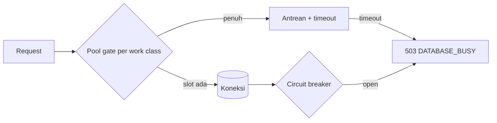

# Database Connection Pooling and Backpressure

> **Status dokumen (AWCMS).** Tiga lapisan pooling/backpressure di bawah
> (`Bun.SQL` pool, work-class concurrency gate, circuit breaker) diwarisi
> dari base teknis `awcms-mini` (Issue 10.2 di repo asal) sebagai mekanisme
> generik yang sudah terverifikasi di sana. Di AWCMS, mekanismenya berlaku
> sejak fondasi, tetapi **contoh endpoint/klasifikasi work-class ERP di
> bawah (posting jurnal, payroll run, dsb.) adalah target rencana** — belum
> ada endpoint domain ERP yang benar-benar memanggil `withTenant` dengan
> klasifikasi tersebut, karena modulnya belum diimplementasikan.

Dokumen ini mencatat standar implementasi pooling/backpressure untuk AWCMS
(diwarisi dari base `awcms-mini`, doc governance/ADR terkait untuk
RLS/RBAC-ABAC dan threat model).

## Ringkasan



Tiga lapisan independen bekerja bersama:

1. **`Bun.SQL` pool config** (`src/lib/database/client.ts`) — pool koneksi
   fisik ke PostgreSQL.
2. **Work-class concurrency gate** (`src/lib/database/work-class.ts`) —
   semaphore aplikasi murni di depan pool, membatasi konkurensi per jenis
   beban.
3. **Circuit breaker** (`src/lib/database/circuit-breaker.ts`) — fail-fast
   saat transaksi database berturut-turut gagal.

Keduanya (gate + breaker) diintegrasikan lewat satu titik: `withTenant`
(`src/lib/database/tenant-context.ts`) — setiap endpoint yang sudah ada
memanggil `withTenant`, sehingga perlindungan ini otomatis berlaku tanpa
mengubah setiap route.

## 1. Bun.SQL pool config

`getDatabaseClient()` mengonfigurasi `Bun.SQL` dengan:

| Opsi                           | Sumber                          | Default |
| ------------------------------ | ------------------------------- | ------- |
| `max`                          | `DATABASE_POOL_MAX`             | `20`    |
| `prepare`                      | `DATABASE_PGBOUNCER !== "true"` | `true`  |
| `connection.statement_timeout` | `DATABASE_STATEMENT_TIMEOUT_MS` | `15000` |

Catatan implementasi: `onconnect` pada `Bun.SQL.Options` (lihat
`node_modules/bun-types/sql.d.ts`) bertipe `(err: Error | null) => void` — ia
hanya melaporkan sukses/gagalnya percobaan koneksi, **bukan** memberi akses ke
client untuk menjalankan SQL (contoh JSDoc `onconnect: (client) => ...` di
file tipe yang sama tidak konsisten dengan signature aktualnya). Cara yang
type-correct dan didokumentasikan untuk menerapkan GUC sesi seperti
`statement_timeout` pada setiap koneksi pooled adalah opsi `connection`
("Postgres client runtime configuration options", lihat
postgresql.org/docs/current/runtime-config-client.html). `onconnect` tetap
dipakai, hanya untuk mencatat kegagalan koneksi ke logger terstruktur.

## 2. Work-class concurrency gate

`src/lib/database/work-class.ts` adalah semaphore in-memory per proses (bukan
lintas-instance). Lima work class dan batas konkurensinya:

| Work class             | Contoh (target ERP)                                | Prioritas | Max |
| ---------------------- | -------------------------------------------------- | --------- | --: |
| `critical_transaction` | Posting jurnal/ledger, payroll run, stock movement | Tertinggi |  10 |
| `interactive`          | CRUD admin, search master data                     | Tinggi    |   8 |
| `reporting`            | Laporan keuangan/inventori, dashboard              | Sedang    |   4 |
| `background_sync`      | Sync push/pull, outbox, integrasi eksternal        | Rendah    |   4 |
| `maintenance`          | Migration, backup                                  | Terjadwal |   1 |

Angka ini kecil dan tetap (tidak env-tunable) secara sengaja — jumlahnya jauh
di bawah `DATABASE_POOL_MAX` (default 20) sehingga masih ada headroom di pool
`Bun.SQL` itu sendiri, dan urutannya mengikuti prioritas: `critical_transaction`
mendapat alokasi terbesar karena prioritas tertinggi; `maintenance`
diserialkan (`max: 1`) karena bukan concern HTTP interaktif.

Ketika sebuah class penuh, pemanggil berikutnya masuk antrean FIFO sampai
slot bebas atau `timeoutMs` habis. Timeout menolak dengan
`WorkClassTimeoutError` (bukan string-matching pesan error), sehingga
pemanggil bisa memetakannya ke `503 DATABASE_BUSY` secara type-safe.

**Antrean dibatasi** (diwarisi dari base, `awcms-mini` Issue #743): antrean
per work class TIDAK unbounded — begitu antrean mencapai `max konkurensi x
DATABASE_WORK_CLASS_QUEUE_MULTIPLIER` (default `4`, di-clamp `[1, 20]`),
pemanggil berikutnya ditolak SEKETIKA dengan `WorkClassQueueFullError` (beda
dari `WorkClassTimeoutError` — tidak pernah menunggu sama sekali), dipetakan
ke `503 DATABASE_BUSY` + header `Retry-After`. Ini menutup risiko "cascading
timeout chain" (antrean tumbuh tak terbatas, setiap pemanggil menunggu
`timeoutMs` penuh sebelum akhirnya gagal) — lihat
[`database-capacity-runbook.md`](database-capacity-runbook.md) §Graceful
saturation behavior.

`critical_transaction` dan `maintenance` sudah ada di tipe/konfigurasi untuk
kebutuhan modul ERP (mis. endpoint posting jurnal/payroll) tetapi **belum
dipakai oleh endpoint manapun** karena belum ada modul ERP yang
diimplementasikan — begitu modul finance/HR-payroll pertama ada, endpoint
posting-nya diharapkan mengklasifikasikan diri ke `critical_transaction`.

## 3. Circuit breaker

`src/lib/database/circuit-breaker.ts` adalah breaker 3-state standar
(`closed → open → half_open → closed`), murni fungsi dari `now: Date` yang
di-inject oleh pemanggil (tidak ada `Date.now()` tersembunyi), sehingga
sepenuhnya unit-testable tanpa menunggu waktu nyata.

- **Closed → Open**: setelah `failureThreshold` (5) kegagalan berturut-turut.
- **Open → Half-open**: setelah `openDurationMs` (30 detik) berlalu sejak
  breaker terbuka, tepat satu percobaan diizinkan lewat.
- **Half-open → Closed**: percobaan sukses.
- **Half-open → Open**: percobaan gagal; jendela `openDurationMs` dimulai
  ulang dari waktu kegagalan tersebut.

Satu instance breaker dipakai bersama di seluruh aplikasi (module-level
singleton `getDatabaseCircuitBreaker()`), bukan per-request — sehingga
kegagalan yang terakumulasi lintas request/tenant memicu satu keputusan
fail-fast untuk semua trafik.

## 4. Integrasi ke `withTenant`

```ts
withTenant(sql, tenantId, fn, {
  workClass: "background_sync", // default: "interactive"
  queueTimeoutMs: 2000 // default: 2000
});
```

Alur:

1. Cek `circuitBreaker.canAttempt(now)` — jika `false`, langsung
   `503 DATABASE_BUSY` + `Retry-After: 30` (skip antrean sepenuhnya,
   fail-fast).
2. `acquireWorkClassSlot(workClass, queueTimeoutMs)`:
   - Antrean sudah penuh (lihat §2 di atas) → tolak seketika
     dengan `WorkClassQueueFullError`; catat `database.pool.rejected`
     lewat logger terstruktur (`src/lib/logging/logger.ts`),
     lalu `503 DATABASE_BUSY` + `Retry-After: 2`.
   - Menunggu lalu timeout → `WorkClassTimeoutError`; catat
     `database.pool.saturated`, lalu `503 DATABASE_BUSY` +
     `Retry-After: 2`.
3. Jalankan transaction seperti biasa (`SET LOCAL app.current_tenant_id`,
   lalu `fn(tx)`).
4. `finally`: lepas slot work-class.
5. Sukses → `circuitBreaker.recordSuccess()`; transaction/`fn` melempar
   exception → `circuitBreaker.recordFailure()` lalu exception dilempar
   ulang (bukan `fail()` yang mengembalikan Response — response error
   ABAC/validasi dari `fn` yang tidak melempar tetap dihitung sebagai
   "sukses" pada level breaker, karena breaker mengukur kegagalan
   transaksi/koneksi database, bukan logika bisnis).

   Dua pengecualian di catch block yang **tidak** memanggil
   `recordFailure()` meski melempar exception, karena keduanya adalah
   outcome logika bisnis/concurrency yang wajar, bukan kegagalan
   infra database (diwarisi dari base):
   - `IdempotencyRaceLostError` — race benign pada
     `saveIdempotencyRecord`.
   - `Bun.SQL.PostgresError` dengan SQLSTATE kelas `23` (integrity
     constraint violation — `23503` foreign_key_violation, `23505`
     unique_violation, `23514` check_violation, dst.). Sebuah
     `INSERT`/`UPDATE` yang gagal karena FK/unique constraint (mis.
     caller mengirim `tenantId` yang tidak ada) tidak dihitung sebagai
     kegagalan infra — mencegah beberapa request dengan input invalid
     membuka breaker aplikasi-lebar.
   - `Bun.SQL.PostgresError` dengan SQLSTATE kelas `22` (data exception —
     `22P02` invalid_text_representation, `22003` numeric_value_out_of_range,
     dst.) — generalisasi dari kelas `23` di atas, sama-sama "input caller
     yang salah bentuk", bukan kegagalan infra (mis. string bukan-UUID yang
     dibandingkan ke kolom `uuid`). Setiap identifier caller-supplied wajib
     divalidasi `assertUuid()` sebelum menyentuh SQL; pengecualian ini
     menutup celah struktural, bukan menunggu endpoint tertentu
     mereproduksinya.

     Error class lain (koneksi terputus, timeout, syntax error, izin
     ditolak, dst.) tetap dihitung sebagai kegagalan seperti biasa.

Endpoint yang direklasifikasi dari default `"interactive"` (target rencana,
belum ada implementasinya di AWCMS):

- `background_sync`: endpoint sync push/pull/status, object dispatch,
  conflict resolution (pola sama seperti base `awcms-mini`).
- `reporting`: endpoint laporan keuangan/inventori dan audit log.

Semua endpoint lain diharapkan tetap default `"interactive"`.

Catatan tipe: signature `withTenant<T>` generik, tetapi pada praktiknya
setiap call site nyata memakai `T = Response` (setiap endpoint yang ada
langsung mengembalikan hasil `withTenant` dari handler-nya). Karena itu
`fail(...)` di dalam `withTenant` di-cast ke `T` — aman secara praktik
meskipun signature generik tidak menegakkannya secara statis.

## 5. Health endpoint

`GET /api/v1/database/pool/health` (tanpa auth, mengikuti presedan
`/api/v1/health` yang juga publik) melaporkan:

```json
{
  "success": true,
  "data": {
    "status": "healthy",
    "databaseReachable": true,
    "circuitBreakerState": "closed",
    "workClasses": [
      {
        "workClass": "critical_transaction",
        "active": 0,
        "max": 10,
        "queued": 0,
        "maxQueueDepth": 40
      },
      {
        "workClass": "interactive",
        "active": 0,
        "max": 8,
        "queued": 0,
        "maxQueueDepth": 32
      },
      {
        "workClass": "reporting",
        "active": 0,
        "max": 4,
        "queued": 0,
        "maxQueueDepth": 16
      },
      {
        "workClass": "background_sync",
        "active": 0,
        "max": 4,
        "queued": 0,
        "maxQueueDepth": 16
      },
      {
        "workClass": "maintenance",
        "active": 0,
        "max": 1,
        "queued": 0,
        "maxQueueDepth": 4
      }
    ],
    "capacity": {
      "processClass": "app",
      "poolMax": 20,
      "approvedConnections": 100,
      "reservedAdminHeadroom": 5
    },
    "generatedAt": "2026-07-14T00:00:00.000Z"
  },
  "meta": {}
}
```

`status` dihitung: `unhealthy` jika DB tidak terjangkau atau breaker `open`;
`degraded` jika breaker `half_open` atau ada work class yang penuh
(`active >= max`) dengan antrean tidak kosong; selain itu `healthy`. Endpoint
ini hanya melaporkan agregat (jumlah/boolean), **tidak pernah** data tenant
atau isi query — cek DB dilakukan lewat satu `SELECT 1` langsung memakai
`getDatabaseClient()` (bukan `withTenant`, karena endpoint ini bukan
tenant-scoped), dibungkus try/catch agar outage DB tidak membuat health
check-nya sendiri crash.

`maxQueueDepth` dan blok `capacity` hanya melaporkan angka KONFIGURASI
proses ini sendiri (bukan agregat lintas-instance — satu proses tidak
mengetahui instance lain) — untuk validasi lintas-instance sebelum
scale-out, lihat
[`database-capacity-runbook.md`](database-capacity-runbook.md) (library
`capacity-config.ts` sudah nyata; CLI `bun run database:capacity:check`
masih target — lihat status dokumen runbook tersebut).

## 6. Domain event `database.pool.saturated`

Didokumentasikan di berkas AsyncAPI kategori "DB Connectivity". **Belum ada
dispatcher pub/sub nyata** untuk domain event apa pun di repo ini —
produsen konkret event ini adalah baris log terstruktur
`database.pool.saturated` yang ditulis oleh `withTenant` lewat
`src/lib/logging/logger.ts`, sama seperti seluruh event AsyncAPI lain yang
baru berupa kontrak terdokumentasi pada tahap fondasi ini.

## 7. PgBouncer (transaction mode) — contoh konfigurasi

Contoh konfigurasi PgBouncer tersimpan satu tempat (canonical) di
[`../../deploy/pgbouncer/pgbouncer.ini.example`](../../deploy/pgbouncer/pgbouncer.ini.example)
— bagian ini hanya kutipan singkat, jangan duplikasi isi lengkapnya di sini
agar tidak ada dua salinan yang bisa berbeda seiring waktu:

```ini
; pgbouncer.ini.example (kutipan — lihat berkas lengkap di link di atas)
[databases]
awcms = host=127.0.0.1 port=5432 dbname=awcms

[pgbouncer]
pool_mode = transaction
default_pool_size = 20 ; selaras dengan DATABASE_POOL_MAX aplikasi ini
```

PgBouncer bersifat **opsional** — topologi LAN-first default (satu server
app + PostgreSQL, lihat `docker-compose.yml` root dan
[`deployment-profiles.md`](deployment-profiles.md)) tidak membutuhkannya;
service `pgbouncer` di compose digerbangi lewat Docker Compose `profiles`
sehingga hanya aktif bila diminta eksplisit.

Implikasi saat `DATABASE_PGBOUNCER=true`:

- `prepare: false` diset otomatis pada `Bun.SQL` (lihat §1) — prepared
  statement otomatis bermasalah di PgBouncer transaction mode karena setiap
  statement bisa dieksekusi di koneksi backend berbeda antar transaction.
- Kode aplikasi sudah aman: `withTenant` selalu memakai
  `SET LOCAL app.current_tenant_id` (bukan `SET` sesi biasa), yang scope-nya
  otomatis terbatas pada satu transaction — kompatibel dengan PgBouncer
  transaction mode.

## 8. Kapasitas deployment-aware

Bagian 1-7 di atas melindungi SATU proses. Kapasitas PostgreSQL/PgBouncer
yang disetujui berlaku untuk SELURUH armada instance — `src/lib/database/
capacity-config.ts` **sudah ada dan aktif di runtime** (instance count per
process class, pool budget, kapasitas PgBouncer, budget koneksi disetujui,
headroom admin dipakai oleh `GET /api/v1/database/pool/health`'s field
`capacity`, dan `recordGauge` mencatat `db_pool_capacity_*` lewat
`src/lib/observability/metrics-port.ts`). Yang **belum ada** adalah CLI
wrapper-nya: `bun run database:capacity:check` dan
`production:preflight`'s stage `database:capacity` bukan script nyata —
tidak ada key ini di `package.json` (lihat `scripts/README.md` §Ditunda).
Validasi kapasitas hari ini hanya bisa dilakukan dengan memanggil
fungsi `capacity-config.ts` langsung (mis. dari test atau REPL), bukan
lewat perintah `bun run` berdiri sendiri. Detail lengkap:
[`database-capacity-runbook.md`](database-capacity-runbook.md) (rumus,
contoh perhitungan, SOP incident saturasi/connection-storm, dan status
implementasi CLI yang lebih rinci).

## Gap yang belum ditutup

- Circuit breaker sulit dipicu secara live tanpa cara memaksa kegagalan
  koneksi database yang representatif; verifikasi utamanya adalah unit test
  (`tests/database-pooling.test.ts`), bukan skenario live.
- Saturasi work-class di level HTTP sulit diamati secara deterministik
  karena request cenderung selesai lebih cepat daripada observasi manual.
- Job worker (`scripts/*.ts`) belum runtime-gated lewat `work-class.ts`'s
  concurrency gate — lihat `database-capacity-runbook.md` §Known
  limitation untuk alasan dan status follow-up.
- Belum ada endpoint domain ERP nyata yang memanfaatkan klasifikasi
work-class di atas — validasi ulang klasifikasi begitu modul finance/
inventory/payroll pertama diimplementasikan.
</content>
