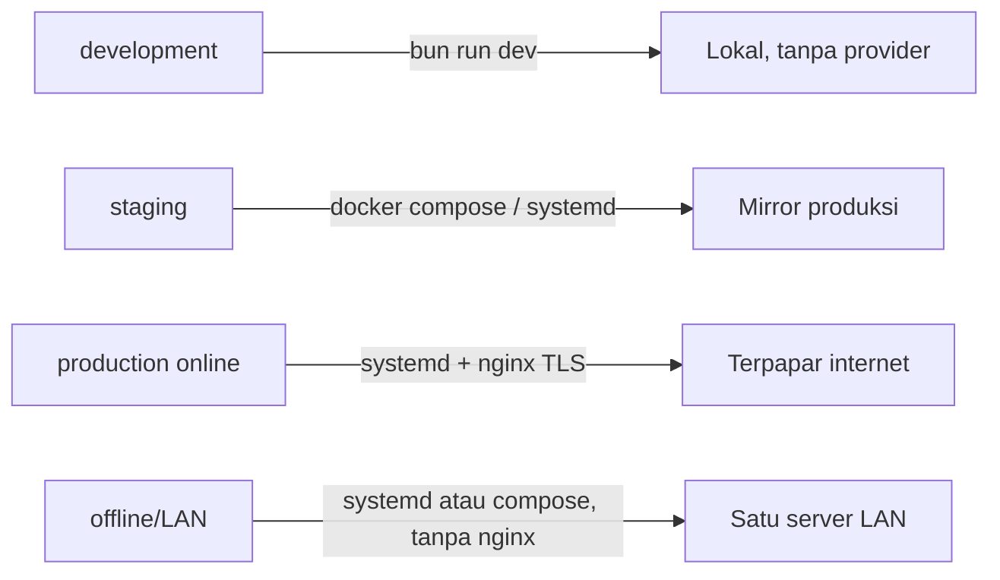

# Deployment Profiles

> **Status dokumen:** target/rencana operasional, bukan status implementasi. Repo `awcms` saat ini belum punya kode modul ERP maupun `deploy/*`/`docker-compose.yml` yang nyata — dokumen ini mengadaptasi standar deployment yang sudah terbukti di basis `awcms-mini` (fully implemented di sana) menjadi **prosedur target** untuk platform ERP `awcms`. Struktur/mekanisme (profil environment, topologi TLS, model dua-peran database, job registry) dipertahankan sebagai standar wajib; nomor issue/PR dan riwayat implementasi spesifik `awcms-mini` dihapus karena tidak relevan untuk repo ini.
>
> **Koreksi: `Dockerfile.production` SUDAH ada.** Berbeda dari `deploy/*`/`docker-compose.yml` (memang belum ada), `Dockerfile.production` nyata ada di root repo (multi-stage, non-root user `bun`, healthcheck) dan sudah dipakai aktif oleh `build` job `.github/workflows/release.yml` untuk build+push image ke `ghcr.io/ahliweb/awcms` setiap rilis — lihat [`release-process.md`](release-process.md) untuk deskripsi status yang akurat. Jalur image-registry (Coolify pull-image, `docker run` langsung) di dokumen ini karena itu sudah bisa dipakai hari ini; hanya jalur `docker-compose.yml`/systemd/nginx/pgbouncer LAN-first di bawah yang masih rencana.

Dokumen ini adalah standar profil deployment untuk AWCMS (lihat ADR-0001, [`01_canvas_induk.md`](01_canvas_induk.md) §Stack final) — melengkapi referensi environment variable (`docs/awcms/18_configuration_env_reference.md`, menyusul) dengan pemetaan konkret: berkas mana di `deploy/` dan `docker-compose.yml` dipakai pada profil environment yang mana, begitu keduanya diimplementasikan.

## Ringkasan



Empat profil target dan berkas `deploy/*` yang relevan untuk masing-masing (berkas-berkas ini **belum ada** di repo — direncanakan mengikuti pola yang sama dengan basis `awcms-mini`):

| Profil                  | Karakteristik                                                                                                                       | Berkas `deploy/`/root yang relevan (rencana)                                                                                                                                                                            |
| ----------------------- | ----------------------------------------------------------------------------------------------------------------------------------- | ----------------------------------------------------------------------------------------------------------------------------------------------------------------------------------------------------------------------- |
| **development**         | Semua provider off, DB lokal, cookie tidak secure                                                                                   | `bun run dev` langsung (tidak perlu `deploy/*` atau `docker-compose.yml`); `.env` disalin dari `.env.example` apa adanya                                                                                                |
| **staging**             | Meniru produksi, data uji, backup aktif                                                                                             | Sama seperti production (di bawah), plus data/tenant uji                                                                                                                                                                |
| **production (online)** | HTTPS, secret manager, backup+restore teruji, sync opsional (mis. Coretax/payment gateway/marketplace)                              | `deploy/systemd/awcms.service.example`, `deploy/nginx/awcms.conf.example` (TLS termination), `deploy/backup/*`, opsional `deploy/pgbouncer/*` bila banyak koneksi pendek                                                |
| **offline/LAN**         | Tanpa internet; sync/integrasi eksternal off atau tertunda; operasional ERP (transaksi, gudang, HR) tetap jalan penuh; backup lokal | `deploy/systemd/awcms.service.example` (atau `docker-compose.yml`) menjalankan app langsung di port 4321 — **nginx dapat dilewati sepenuhnya**, tidak ada eksposur publik; `deploy/backup/*` tetap wajib (backup lokal) |

Prinsip pemilihan: nginx (`deploy/nginx/`) hanya dibutuhkan saat butuh terminasi TLS untuk klien di luar mesin/jaringan tepercaya atau saat memfasadkan beberapa instance upstream — topologi LAN-first satu server bisa langsung menyajikan aplikasi di port 4321 tanpa reverse proxy sama sekali. PgBouncer (`deploy/pgbouncer/`) hanya untuk skenario koneksi pendek bervolume tinggi (mis. banyak worker sync integrasi eksternal berjalan bersamaan) — bukan kebutuhan default.

## Konteks ERP: offline-first tetap wajib untuk operasional inti

Prinsip LAN-first/offline-first yang menjadi standar dasar (ADR-0001) berlaku sama untuk modul ERP: transaksi finansial harian, pencatatan gudang/inventori, absensi HR, dan proses manufaktur **harus tetap berjalan penuh tanpa internet** pada topologi offline/LAN — hanya fitur yang secara inheren online-dependent (payment gateway, marketplace sync, e-Faktur/Coretax submission, resi logistik online) yang boleh tertunda/off pada profil ini, dan wajib di-outbox (ADR — outbox/queue untuk integrasi eksternal, lihat `AGENTS.md`) bukan disinkronkan secara sinkron dari jalur transaksi kritikal.

## Cara menjalankan tiap profil

### development

```bash
cp .env.example .env
bun install
bun run db:migrate
bun run dev
```

### staging / production (online) — bare-metal (systemd)

```bash
bun install && bun run build
sudo cp deploy/systemd/awcms.service.example /etc/systemd/system/awcms.service
sudo cp deploy/nginx/awcms.conf.example /etc/nginx/sites-available/awcms.conf
# ... adaptasi placeholder di kedua berkas (lihat komentar header masing-masing) ...
sudo systemctl enable --now awcms
sudo systemctl reload nginx
```

### offline/LAN — bare-metal (systemd, tanpa nginx)

Sama seperti di atas, minus langkah nginx — klien LAN mengakses aplikasi langsung di `http://<ip-server-lan>:4321`.

### staging / production / offline-LAN — container (docker-compose.yml)

`docker-compose.yml` di root repo (direncanakan) akan menjalankan stack LAN-first default: `app` (image `oven/bun:1.3.14` pinned, bukan `node`, sesuai standar Bun-only) dan `db` (`postgres:18.4`). PgBouncer tersedia sebagai service opsional `pgbouncer`, digerbangi Compose `profiles` sehingga tidak pernah otomatis aktif:

```bash
cp .env.example .env
export APP_UID=$(id -u) APP_GID=$(id -g)   # app berjalan sebagai user host, bukan root
docker compose up --build           # app + db saja
docker compose --profile pgbouncer up   # ikutkan pgbouncer opsional
curl http://localhost:4321/api/v1/health
```

**Container hardening (standar wajib sejak awal, bukan retrofit)**: `db` dan `pgbouncer` tidak boleh mempublikasikan port host secara default — hanya `app`'s `4321:4321` terbuka (satu-satunya kebutuhan topologi yang nyata). Untuk akses `psql`/GUI client lokal dari host, salin `docker-compose.override.yml.example` ke `docker-compose.override.yml` (auto-loaded, di-`.gitignore`) — mengikat kedua port ke `127.0.0.1` saja. Semua service (`db`/`migrate`/`app`/`pgbouncer`) wajib menjalankan `cap_drop: [ALL]` (plus `cap_add` minimal untuk `db`'s entrypoint sendiri), `security_opt: no-new-privileges:true`, healthcheck, dan starting-point `deploy.resources.limits`. PgBouncer's `pgbouncer.ini.example` wajib memakai `auth_type = scram-sha-256` (bukan `md5`).

`export APP_UID/APP_GID` wajib — tanpanya, `app` berjalan sebagai root di dalam container dan `bun install`/`bun run build` menulis berkas `node_modules/`/`dist/` bertahan sebagai milik root di repo hasil bind mount, yang kemudian memblokir `bun install`/`bun run build` sisi **host** pada checkout yang sama.

Semua secret/config masuk lewat `env_file: .env` / `environment:` di `docker-compose.yml` — tidak ada nilai hardcode. `DATABASE_URL` di-override otomatis oleh `docker-compose.yml` agar menunjuk ke hostname service `db` (bukan `localhost` seperti default `.env.example`, yang ditujukan untuk deployment non-container).

Compose juga mewujudkan model dua-peran di bawah tanpa langkah manual: service `migrate` (satu kali, sebagai superuser) menjalankan `db:migrate`, service `app` menunggu `migrate` selesai (`depends_on: … condition: service_completed_successfully`) lalu konek sebagai peran least-privilege — jadi `docker compose up` mengurut sendiri: `db` init membuat peran → `migrate` menerapkan skema + FORCE RLS + grant → `app` mulai.

### production (online) — image registry (`Dockerfile.production` + `docker-compose.prod.yml`, opsional)

`docker-compose.yml` di atas tetap jadi jalur yang direkomendasikan untuk topologi LAN-first satu-server (bind-mount + `bun install && bun run build` saat container start — praktis untuk operator yang `git pull`/rebuild in-place). `Dockerfile.production` (dipakai lewat `docker-compose.prod.yml` atau `docker build`/`docker run` manual) adalah jalur **opsional lain**, untuk deployment berbasis image registry (build sekali di CI, push image, pull+run identik di tiap environment) — dipakai saat build-saat-startup tidak diinginkan (cold start lebih lambat, image ingin immutable) atau saat orkestrator (Coolify, k8s, ECS, dsb.) mengharapkan image siap-pakai.

Perbedaan kunci vs `docker-compose.yml`'s `app` service:

| Aspek       | `docker-compose.yml` (`app`)                                | `docker-compose.prod.yml` (`app`) / `Dockerfile.production`     |
| ----------- | ----------------------------------------------------------- | --------------------------------------------------------------- |
| Sumber kode | Bind-mount repo langsung (`volumes: - .:/app`)              | `COPY` ke dalam image saat build — immutable setelah dibuat     |
| Build       | Saat container start (`bun install && bun run build`)       | Saat `docker build` (multi-stage) — start container jadi instan |
| User        | Host user (`APP_UID`/`APP_GID`) — perlu bind-mount writable | User bawaan image `oven/bun:1.3.14`, `bun` (non-root, uid 1000) |
| Filesystem  | Writable (bind mount + install/build di dalamnya)           | `read_only: true` + `tmpfs: [/tmp]`                             |
| Migration   | Service `migrate` terpisah dalam compose yang sama          | Tidak disertakan — jalankan `bun run db:migrate` terpisah       |
| Cocok untuk | LAN-first satu server, operator `git pull` in-place         | Registry/CI-push, orkestrator container (Coolify/k8s/ECS)       |

Dua cara menjalankan image ini (rencana) — pilih salah satu:

**1. `docker-compose.prod.yml` (disarankan)** — stack standalone (bukan override `docker-compose.yml`) yang membangun `app` dari `Dockerfile.production` dan menjalankan `db` dengan hardening yang sama seperti `docker-compose.yml`'s `db`:

```bash
cp .env.example .env
bun run db:migrate   # atau docker run sekali pakai, lihat di bawah — jalankan SEBELUM app start
docker compose -f docker-compose.prod.yml up -d --build
curl http://localhost:4321/api/v1/health
```

`app` di sini berjalan `read_only: true` (`tmpfs: [/tmp]`) — aman karena image ini tidak menulis ke filesystem-nya sendiri saat runtime. Untuk deploy dari image yang sudah di-push ke registry (bukan build lokal), ganti blok `build:` pada `app` di `docker-compose.prod.yml` dengan `image: <registry>/awcms:<tag>` langsung.

**2. `docker build`/`docker run` manual** — untuk orkestrator yang tidak memakai Compose (Coolify, k8s, ECS, dst., lihat [`deploy-coolify.md`](deploy-coolify.md)):

```bash
docker build -f Dockerfile.production -t awcms:prod .
docker run -d --name awcms \
  -p 4321:4321 \
  --cap-drop=ALL --security-opt=no-new-privileges:true \
  -e DATABASE_URL=postgres://awcms_app:<password>@<db-host>:5432/awcms \
  -e AUTH_JWT_SECRET=<secret> \
  -e AUTH_COOKIE_SECURE=true \
  -e APP_ENV=production \
  awcms:prod
curl http://localhost:4321/api/v1/health
```

`--cap-drop=ALL --security-opt=no-new-privileges:true` — standar wajib, tidak butuh `--cap-add` tambahan untuk app yang berjalan.

Secret (`DATABASE_URL`, `AUTH_JWT_SECRET`, HMAC sync, kredensial integrasi eksternal, dst.) **selalu** disuntikkan saat `docker run`/lewat orkestrator (env var, secret store, atau `--env-file`) — **tidak pernah** dibakar ke dalam image. `.dockerignore` mengecualikan `.env`/`.env.*` dari build context. Untuk orkestrator yang mendukung file secret (Docker Swarm secrets, Kubernetes Secrets sebagai volume mount, dsb.), pola `_FILE` suffix adalah alternatif standar industri — belum wajib diimplementasikan di kode aplikasi; operator yang butuh ini bisa mem-bridge di level orkestrator (entrypoint script yang membaca file secret lalu `export` env var biasa sebelum `exec bun ...`).

Image ini **tidak** menjalankan migration — peran runtime-nya (`awcms_app`, least-privilege) tidak punya hak DDL/GRANT yang migration butuhkan (model dua-peran di bawah). Jalankan `bun run db:migrate` sebagai langkah terpisah (job CI, atau `docker run` sekali pakai dengan `DATABASE_URL` privileged) terhadap database baru sebelum container ini pertama kali dijalankan.

## TLS/trust boundaries

Aplikasi ini **tidak pernah** melakukan terminasi TLS sendiri (tidak ada kode HTTPS listener) — di setiap topologi, TLS (bila ada) adalah tanggung jawab lapisan **di depan** aplikasi:

| Topologi                                                                            | Di mana TLS berhenti                                                                                                   | Trust boundary                                                                                                                                            |
| ----------------------------------------------------------------------------------- | ---------------------------------------------------------------------------------------------------------------------- | --------------------------------------------------------------------------------------------------------------------------------------------------------- |
| **offline/LAN**                                                                     | Tidak ada TLS — `http://` langsung ke port 4321                                                                        | Batas kepercayaan = jaringan LAN itu sendiri (fisik/WiFi tepercaya); tidak ada eksposur internet, PostgreSQL tidak public berlaku sama untuk app port ini |
| **production (online), bare-metal**                                                 | `deploy/nginx/awcms.conf.example` (reverse proxy TLS termination)                                                      | Publik ↔ nginx = batas TLS; nginx ↔ app (`localhost:4321`) = plaintext HTTP di **dalam** mesin yang sama, tidak melewati jaringan                         |
| **production (online), container (`docker-compose.yml`/`docker-compose.prod.yml`)** | Reverse proxy di **luar** compose stack (nginx/Caddy/Coolify's built-in proxy) — compose sendiri tidak menyediakan TLS | Publik ↔ reverse proxy = batas TLS **hanya jika** reverse proxy benar-benar satu-satunya jalur masuk                                                      |
| **PostgreSQL (`db`)/PgBouncer**                                                     | Tidak ada TLS by default (`sslmode` tidak dipaksa) — koneksi Postgres dalam Docker network internal                    | Trust boundary = Docker network compose itu sendiri (`db`/`pgbouncer` tidak publish port host, jadi tidak reachable dari luar mesin sama sekali)          |

Implikasi operasional:

- **Beda penting dari `db`/`pgbouncer`**: `app`'s `ports: ["4321:4321"]` **tetap terikat ke semua interface (`0.0.0.0`) secara default** di kedua compose file. Ini **bukan** berarti aman dijangkau reverse proxy saja — pada host dengan IP publik/LAN yang tidak sepenuhnya tepercaya, klien mana pun bisa langsung menghubungi `http://<host>:4321`, melewati reverse proxy TLS sepenuhnya. **Jangan pernah** expose `app`'s port 4321 langsung ke internet publik tanpa reverse proxy TLS di depannya — `AUTH_COOKIE_SECURE=true` (wajib untuk profil online) mengasumsikan klien browser benar-benar bicara HTTPS ke suatu titik; tanpa TLS termination, cookie secure dikirim lewat kanal plaintext (dan body request pertama seperti password login/data transaksi finansial terkirim plaintext apa pun status cookie-nya). Mitigasi ini **wajib** di level firewall/jaringan host (operator) — mis. `ufw`/`iptables` yang hanya mengizinkan port 4321 dari `localhost`/IP reverse proxy, bukan dari internet umum. Operator yang ingin compose sendiri menegakkan ini bisa mengikat `ports: ["127.0.0.1:4321:4321"]` bila reverse proxy berjalan di mesin yang sama di luar Docker.
- `PUBLIC_TRUST_PROXY`/variabel sejenis (bila diimplementasikan untuk fitur online-only) HANYA aman di-set `true` tepat pada topologi baris "production (online)" di tabel ini — reverse proxy TLS yang menimpa (bukan menambahkan) `X-Forwarded-*` adalah prasyarat, bukan opsional.
- Koneksi `app`↔`db`/`pgbouncer` plaintext-dalam-Docker-network diterima sebagai batas kepercayaan yang memadai **karena** jaringan itu tidak pernah reachable dari luar mesin (tidak ada host port publish default) — bila operator menjalankan `db` di mesin terpisah dari `app` (topologi multi-server, di luar cakupan `docker-compose.yml`/`docker-compose.prod.yml` bawaan), TLS Postgres (`sslmode=require` pada `DATABASE_URL` + sertifikat server Postgres) menjadi tanggung jawab operator.

## Secrets via deployment references

Konvensi standar repo ini ("secret hanya dari environment"): env var langsung (`${VAR:-default}` substitution di compose, `environment:`/`env_file:` di container, atau variabel shell/systemd `EnvironmentFile=` di bare-metal) — **tidak pernah** hardcode ke file yang di-commit.

Untuk orkestrator yang menyediakan mekanisme secret-at-rest terenkripsi sendiri (Docker Swarm `secrets:`, Kubernetes `Secret` sebagai volume mount, Coolify's secret manager, HashiCorp Vault, dsb.), env var biasa tetap bisa dipakai — orkestrator-orkestrator ini pada praktiknya menyuntikkan secret **sebagai** env var runtime (bukan file) ke container. Untuk orkestrator yang secara spesifik mewajibkan pola **file-based** (mis. Docker Swarm secrets di-mount sebagai file di `/run/secrets/<name>`, bukan env var) — operator pada topologi ini punya dua opsi:

1. **Bridge di entrypoint** (disarankan, tidak perlu ubah image/kode aplikasi): tulis skrip entrypoint kecil yang membaca file secret dari `/run/secrets/*`, `export` sebagai env var biasa, lalu `exec` command aslinya.
2. **Env var langsung dari secret store orkestrator** (paling sederhana bila orkestratornya mendukung).

## Model dua-peran basis data (RLS enforcement)

Isolasi antar-tenant/entitas ERP memakai PostgreSQL Row-Level Security (standar wajib — lihat AGENTS.md "PostgreSQL + RLS wajib"). `ENABLE ROW LEVEL SECURITY` saja **tidak cukup**: PostgreSQL melewati RLS untuk _pemilik_ tabel (kecuali `FORCE`) dan tanpa syarat untuk peran SUPERUSER/BYPASSRLS. Karena itu deployment wajib memakai dua peran:

- **Peran migrasi (privileged owner/superuser)** — menjalankan `bun run db:migrate`. Butuh hak DDL/GRANT. Ini `POSTGRES_USER` di `docker-compose.yml` / URL privileged yang dipakai sekali untuk migrasi.
- **Peran aplikasi `awcms_app` (least-privilege)** — peran yang di-koneksi aplikasi saat runtime (`DATABASE_URL` di `.env`). Bukan owner, bukan superuser, hanya grant DML; setiap tabel tenant-scoped/entitas bisnis (ledger, payroll, inventory, dst.) wajib `FORCE ROW LEVEL SECURITY` plus default GUC fail-closed (`app.current_tenant_id` = UUID nol → tak cocok tenant mana pun → 0 baris) sehingga RLS benar-benar ditegakkan untuk peran ini.

Menjalankan aplikasi sebagai superuser membatalkan seluruh isolasi RLS — `bun run security:readiness` (menyusul) wajib memblokir go-live bila peran koneksi `DATABASE_URL` ternyata superuser/BYPASSRLS, atau bila ada tabel tenant/entitas bisnis tanpa `relforcerowsecurity`. Jalankan readiness dengan `DATABASE_URL` peran aplikasi, bukan URL migrasi.

Membuat peran aplikasi:

- **Container:** otomatis — `deploy/postgres/10-create-app-role.sh` (hook `/docker-entrypoint-initdb.d`) membuatnya dari `AWCMS_APP_DB_PASSWORD` saat init cluster pertama, lalu migrasi terkait memberi grant + FORCE RLS.
- **Bare-metal/systemd:** sekali di awal, sebagai superuser — `CREATE ROLE awcms_app LOGIN PASSWORD '…';` — lalu `bun run db:migrate` (URL superuser). Setelah itu app konek sebagai `awcms_app` (`DATABASE_URL` di `.env`).

Peran tambahan opsional (defense-in-depth), kini **nyata** dan mengikuti pola yang sama — dibuat `sql/022_awcms_db_worker_setup_roles.sql` (Issue #163): `awcms_worker` (tujuh cron worker: purge audit, dispatch object/email/domain-event/workflow/reporting, `WORKER_DATABASE_URL`) dan `awcms_setup` (hanya `POST /api/v1/setup/initialize`, `SETUP_DATABASE_URL`), masing-masing hanya GRANT per-jalur-tulis yang dipakai kodenya. Aktifkan opt-in sekali (`ALTER ROLE awcms_worker LOGIN PASSWORD '…';` lalu arahkan var-nya); keduanya fallback ke `DATABASE_URL`/`awcms_app` bila tidak di-set, jadi model dua-peran di atas tetap fondasi minimum yang wajib.

## Validasi konfigurasi sebelum boot (`bun run config:validate`)

Prinsip konfigurasi wajib: "Konfigurasi tervalidasi saat boot; nilai wajib yang hilang menghentikan start dengan pesan jelas." Direncanakan: `scripts/validate-env.ts` (`bun run config:validate`).

**Config registry & deprecated vars (direncanakan)**: `src/lib/config/registry.ts` menjadi sumber kebenaran terstruktur untuk setiap variabel (type/required/owner/sensitivity/profiles/deprecation). `bun run config:docs:check` (bagian dari `bun run check`) menjaga registry ini, `.env.example`, dan referensi konfigurasi tetap sinkron.

- Wajib non-kosong: `APP_ENV`, `APP_URL`, `APP_TIMEZONE`, `DATABASE_URL`, `AUTH_JWT_SECRET`.
- Kondisional: bila sync/integrasi eksternal (`AWCMS_SYNC_ENABLED=true`), maka `AWCMS_SYNC_HMAC_SECRET` wajib diisi dan bukan placeholder `.env.example` (`change-me`).
- Kondisional: bila storage objek eksternal (`R2_ENABLED=true`), maka kredensial R2 terkait wajib diisi.
- Tidak pernah mencetak nilai secret asli — hanya nama variabel yang hilang/tidak valid. Exit code bukan nol bila ada kegagalan.

`bun run production:preflight` (direncanakan) menjalankan `config:validate` sebagai tahap pertama, sebelum `db:migrate` — konfigurasi harus valid sebelum ada percobaan koneksi/migrasi apa pun.

## Dispatcher terjadwal (sync/integrasi eksternal, email, dsb.)

Pola dispatcher CLI terjadwal (bukan endpoint HTTP) adalah standar untuk semua job yang bergantung provider eksternal (email, sync object storage, integrasi payment gateway/marketplace/Coretax/logistik) — direncanakan mengikuti pola `scripts/*.ts` yang idempoten (claim-lease `FOR UPDATE SKIP LOCKED`), aman dijalankan berulang, dengan retry/backoff dan circuit breaker per provider. Tidak melakukan apa pun (exit 0, tanpa efek) bila fitur terkait dimatikan di env — profil mana pun yang mematikan sebuah integrasi (mis. offline/LAN) aman menjalankan dispatcher tanpa efek samping.

| Profil                                       | Cara menjadwalkan                                                                                                                                                      |
| -------------------------------------------- | ---------------------------------------------------------------------------------------------------------------------------------------------------------------------- |
| **development**                              | Jalankan manual sesuai kebutuhan. Fitur eksternal biasanya `false` di `.env` dev — tidak perlu dijadwalkan sama sekali.                                                |
| **offline/LAN**                              | Integrasi eksternal biasanya off atau tertunda. Bila diaktifkan (mis. relay lokal), jadwalkan seperti profil systemd di bawah.                                         |
| **staging/production (bare-metal, systemd)** | `cron` atau systemd timer terpisah dari service utama (`awcms.service`).                                                                                               |
| **container (`docker-compose.yml`)**         | Jalankan sebagai `docker compose exec app bun run <job>` lewat cron host, atau tambahkan service terjadwal terpisah.                                                   |
| **Coolify/VPS**                              | Scheduled Task Coolify (bila tersedia) atau cron di VPS yang menjalankan `docker exec <container-app> bun run <job>` — lihat [`deploy-coolify.md`](deploy-coolify.md). |

Contoh crontab (bare-metal/systemd, setiap 2 menit — pola generik untuk dispatcher email/sync):

```cron
*/2 * * * * cd /opt/awcms && /usr/local/bin/bun run email:dispatch >> /var/log/awcms/email-dispatch.log 2>&1
```

Contoh untuk topologi container, dari cron host:

```cron
*/2 * * * * cd /opt/awcms && docker compose exec -T app bun run email:dispatch >> /var/log/awcms/email-dispatch.log 2>&1
```

Catatan operasional (standar wajib untuk setiap dispatcher yang dibangun):

- **Idempoten/aman dijalankan berulang** — pola claim-lease (`FOR UPDATE SKIP LOCKED`) membuat pemanggilan bersamaan atau tumpang tindih aman; tidak ada baris yang terkirim/diproses dua kali (mis. posting transaksi ganda, submission Coretax ganda).
- **Retry/backoff tidak menjadi spam-loop**: entri yang gagal masuk `retry_wait` dengan `next_attempt_at` mundur eksponensial sebelum diklaim lagi.
- **Circuit breaker provider terbuka**: bila provider eksternal (mis. payment gateway) sedang outage, dispatcher berhenti mengklaim apa pun sampai breaker pulih — cron tetap jalan setiap tick tanpa efek, tidak menambah beban ke provider yang sedang down.
- **Multi-instance**: jadwalkan hanya dari **satu** instance/cron entry per deployment.

## Job registry

Setiap modul (ERP maupun fondasi) yang mendaftarkan command operasional terjadwal (dispatcher, purge retensi, rekonsiliasi) direncanakan mengikuti registry metadata trusted per modul (`ModuleDescriptor.jobs`), dibaca lewat `GET /api/v1/modules/{moduleKey}/jobs` — pola yang sama dipertahankan dari basis. Contoh kategori job yang direncanakan untuk ERP:

| Command (contoh)               | Kategori                                               | Jadwal disarankan                         |
| ------------------------------ | ------------------------------------------------------ | ----------------------------------------- |
| `sync:objects:dispatch`        | Sync storage/object queue                              | Setiap 1-2 menit                          |
| `logs:audit:purge`             | Audit retention                                        | Harian                                    |
| `finance:posting:dispatch`     | Posting transaksi finansial ke ledger/Coretax (outbox) | Setiap 1-2 menit                          |
| `payroll:run:dispatch`         | Eksekusi payroll run terjadwal                         | Sesuai periode payroll (bulanan/mingguan) |
| `inventory:sync:dispatch`      | Sinkronisasi stok ke marketplace/warehouse eksternal   | Setiap 1-5 menit                          |
| `domain-events:dispatch`       | Domain event runtime (fan-out lintas modul)            | Setiap 30-60 detik                        |
| `data-lifecycle:archive-purge` | Arsip/purge retensi data lintas modul                  | Harian                                    |

Semua bersifat operasi database murni kecuali yang secara eksplisit menyentuh provider eksternal (bila fiturnya aktif) — aman dijadwalkan di profil offline/LAN sekalipun untuk job yang murni internal (audit purge, domain events, data lifecycle).

**On-demand/manual (bukan cron berulang)** — dijalankan operator sesuai kebutuhan:

- `security:readiness` — sebelum go-live, dan periodik (mis. mingguan) di staging/production untuk mendeteksi drift.
- `config:validate`/`production:preflight` — sebelum setiap deploy.

## Shared worker runner

`src/lib/jobs/` SUDAH ada dan dipakai nyata — `job-runner.ts`, `batching.ts`,
`retry-classification.ts`, dan `advisory-lock.ts` adalah implementasi
berjalan, bukan rencana. Ketujuh dispatcher script yang sudah ada di
`package.json` (`domain-events:dispatch`, `sync:objects:dispatch`,
`workflow:escalations:dispatch`, `logs:audit:purge`, `email:dispatch`,
`reporting:projections:refresh`, `reporting:exports:dispatch`) semuanya
dibangun di atas shared runner ini. Ia menyediakan:

- **Advisory lock per nama job** (`pg_try_advisory_lock`, non-blocking, session-level, reserved connection terpisah dari handler) — mencegah dua instance job yang sama berjalan tumpang tindih.
- **Bounded batching per tenant/entitas** (`iterateTenantsInBatches`/`runBoundedBatches`) dengan safety bound (`maxPasses`).
- **Klasifikasi error** (`classifyError`): `retryable` vs `not_retryable` vs `unknown` — diagnostik, bukan retry-with-backoff otomatis.
- **Redaksi** — seluruh error di `JobResult.error` melalui `sanitizeErrorForLog` sebelum dicetak/disimpan.
- **Cancellation kooperatif** (SIGTERM/SIGINT-aware) dengan grace period sebelum pelepasan lock, agar tick/instance berikutnya tidak mengklaim lock yang sebenarnya masih dipegang handler yang sedang graceful-shutdown.
- **Telemetry terstruktur** (`JobResult` JSON ke stdout + opsional `--json-output=<path>`).

Panduan adopsi untuk job baru:

1. Gunakan `iterateTenantsInBatches` bila job iterasi tenant/entitas dengan bounded passes.
2. Bungkus logic jadi satu `runJob({ name, description, handler })` — `name` harus stabil (dipakai sebagai lock key).
3. Tambahkan `--dry-run` bila job punya cara wajar melakukan preview read-only tanpa mutasi (penting untuk job finansial/payroll — preview sebelum posting nyata).
4. Cetak `printJobTelemetry(result)` + `writeJobTelemetry(...)` + `applyJobExitCode(result)` di akhir `main()`.
5. Panggilan provider eksternal (payment gateway/marketplace/Coretax/logistik/email) TETAP di luar transaksi database — handler yang memanggil provider harus melakukannya di luar transaction block `withTenant`, tidak pernah di dalam satu transaksi bersama mutasi domain.

## Backup lokal (semua profil)

`deploy/backup/backup-postgres.sh` dan `deploy/backup/restore-postgres.sh` (direncanakan) — backup lokal wajib pada **semua** profil non-development, termasuk offline/LAN. Untuk platform ERP, ini krusial: backup adalah satu-satunya jalur pemulihan data finansial/inventori/payroll bila terjadi kegagalan.

Standar wajib: **enkripsi backup** (`BACKUP_ENCRYPTION_KEY_FILE`/`BACKUP_HMAC_KEY_FILE`, keduanya file, bukan CLI/env-content) — alur lokal terenkripsi ini berjalan penuh **tanpa internet**, jadi profil offline/LAN tidak kehilangan apa pun. Off-site copy (pola 3-2-1) dan restore drill terjadwal **opsional/dikonfigurasi** — dilewati (bukan gagal) bila tidak dikonfigurasi.

Direncanakan menyusul: `bun run resilience:dr-drill` untuk verifikasi failure-injection terkontrol (disconnect PostgreSQL, pool saturation, worker interruption, partial provider outage) — lihat `resilience-dr-verification.md` (menyusul, mengadaptasi pola yang sama dari basis).

## Metrics dan observabilitas operasional

Lihat [`observability-metrics.md`](observability-metrics.md) untuk arsitektur metrics port, tabel kardinalitas/privasi per metrik (termasuk metrik ERP spesifik — throughput transaksi, latensi posting, backlog sync), SLI/SLO awal, dan panduan burn-rate.

## Lihat juga

- [`deploy-coolify.md`](deploy-coolify.md) — panduan deploy Coolify khusus: topologi single VPS, multi aplikasi dalam satu VPS, opsi PostgreSQL, dan checklist keamanan.
- [`observability-metrics.md`](observability-metrics.md) — metrics port, SLI/SLO awal, dependency health endpoint.
- [`performance-suite.md`](performance-suite.md) — performance suite representatif: fixture sintetik deterministik, skenario load/soak/saturasi-dan-recovery, budget regresi query-plan versioned.
- [`release-process.md`](release-process.md) — Changesets, SBOM, signing, provenance untuk rilis image.
- [`repo-inventory.md`](repo-inventory.md) — inventaris modul/migrasi/test/route yang dihasilkan otomatis dari repo (menyusul begitu ada modul aktif).
- `AGENTS.md` — aturan wajib RLS/RBAC-ABAC/idempotency/audit yang melandasi standar deployment ini.
