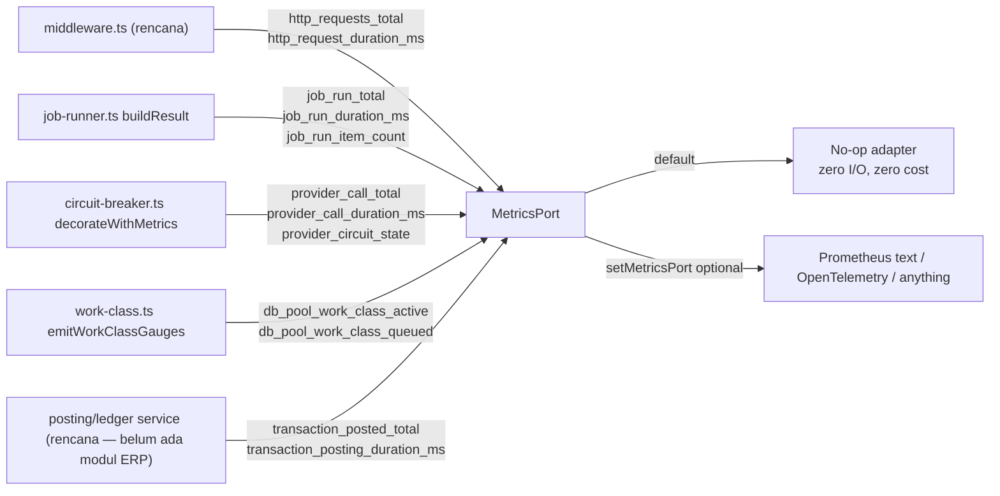

# Observability: Metrics, SLOs, Job Health, and Provider Telemetry

> **Status dokumen:** implementasi inti sudah nyata, sebagian masih target. `src/lib/observability/` SUDAH ada dan dipakai — `metrics-port.ts`, `in-memory-metrics-port.ts`, dan `adapters/prometheus-text-adapter.ts` semuanya nyata, dan `recordCounter`/`recordGauge`/`recordHistogram` sudah di-wire ke `job-runner.ts` (`emitJobRunMetrics`), `work-class.ts` (`emitWorkClassGauges`), `circuit-breaker.ts` (`decorateWithMetrics`), `capacity-config.ts`, serta ke kode aplikasi domain nyata (`workflow-approval`'s `workflow-escalation.ts`, `domain-event-runtime`'s `dispatch-domain-events.ts`, dan beberapa route `src/pages/api/v1/workflows/**`). Yang **masih target/belum ada**: instrumentasi `http_requests_total`/`http_request_duration_ms` di `middleware.ts` (belum di-wire), endpoint dependency-health terautorisasi, adapter OpenTelemetry, seluruh berkas test observability yang dirujuk di §Testing, dan tentu saja metrik ERP-spesifik (`transaction_posted_total`, dsb.) karena belum ada modul ERP yang memanggilnya. Dokumen ini tetap mengadaptasi contoh metrik ke domain transaksi bisnis (finance, inventory, HR/payroll) sebagai target begitu modul ERP dibangun.

Companion untuk [`deployment-profiles.md`](deployment-profiles.md) §Shared worker runner. Dokumen ini mencakup konsep: metrik numerik berkardinalitas rendah (counter/histogram/gauge), SLI/SLO awal, dan endpoint dependency-health terautorisasi.

**Metrics melengkapi, bukan menggantikan, logging atau audit.** Structured logger dan audit trail (lihat `AGENTS.md` "Audit trail dengan redaksi") mencatat fakta diskret, per-event, detail tinggi — mis. "user X mem-posting jurnal Y pukul Z". Metrics mencatat agregat — "berapa banyak", "seberapa cepat", "seberapa jenuh" — dimaksudkan untuk di-scrape/push ke backend time-series pada biaya tetap yang kecil terlepas dari volume traffic. Tidak ada yang menggantikan yang lain, dan metrics **tidak pernah** menjadi sumber otorisasi.

## Arsitektur



- **`src/lib/observability/metrics-port.ts`** (implementasi nyata) — kontrak port (`MetricsPort`: `incrementCounter`/`observeHistogram`/`setGauge`), registry `METRIC_DEFINITIONS` (setiap nama metrik, label key yang diizinkan, estimasi `approxCardinality`, dan `privacyNote`), serta `recordCounter`/`recordHistogram`/`recordGauge` — SATU-SATUNYA cara resmi kode aplikasi mencatat metrik. Ketiga fungsi ini membuang label key yang tidak dideklarasikan untuk metrik itu (defense in depth) dan tidak pernah membiarkan error dari adapter terdaftar bocor keluar.
- **`src/lib/observability/in-memory-metrics-port.ts`** (implementasi nyata) — test double / adapter minimal nyata, dipakai setiap unit test yang menegaskan "sebuah metrik telah dicatat".
- **`src/lib/observability/adapters/prometheus-text-adapter.ts`** (implementasi nyata) — adapter Prometheus text-exposition dependency-free, Bun-only. Tidak di-wire otomatis di mana pun secara default — aplikasi turunan menambahkan `setMetricsPort(createPrometheusTextMetricsPort())` sendiri untuk memakainya; adapter OpenTelemetry (rencana, lihat §Integrasi Prometheus/OpenTelemetry di bawah) mengikuti bentuk identik begitu ditulis.
- **Default selalu adapter no-op.** Setiap deployment offline/LAN yang tidak pernah memanggil `setMetricsPort` membayar nol biaya I/O dan tidak butuh collector eksternal apa pun — ini prasyarat "operasi offline/LAN berjalan tanpa collector eksternal" yang dipenuhi by construction, bukan runtime check.

## Titik instrumentasi wajib — mekanisme bersama, bukan duplikasi per call site

Prinsip wajib: metrik provider/job/pool harus disalurkan lewat mekanisme bersama YANG SUDAH ADA, tidak diduplikasi di setiap call site. Tiga dari lima titik di bawah SUDAH di-wire nyata; dua masih target:

- **Status/backlog job run (implementasi nyata)** — satu titik fungsi (`buildResult` di `job-runner.ts`) yang setiap path return `runJob` (lock acquire gagal, skip-on-contention, sukses/parsial, timeout/terminated, error) sudah dilalui. `emitJobRunMetrics` dipanggil sekali di sana — setiap job (audit purge, dispatcher sync, posting batch, payroll run) mendapatkan `job_run_total`/`job_run_duration_ms`/`job_run_item_count` gratis.
- **Outcome/latensi/circuit state provider (implementasi nyata)** — satu fungsi `getProviderCircuitBreaker()` yang setiap call site provider (email, object storage, payment gateway, marketplace, Coretax, logistik, SSO) wajib melaluinya — tidak ada call site yang langsung memanggil `createCircuitBreaker`. Wrapper `decorateWithMetrics` di antara keduanya menjadi satu-satunya sumber metrik ini.
- **Saturasi DB pool (implementasi nyata)** — satu tempat (`work-class.ts`'s `gates`) di mana `active`/`queue.length` pernah berubah (acquire, hand-off saat release, decrement saat release, timeout eviction). `emitWorkClassGauges(workClass)` dipanggil di setiap titik itu. `capacity-config.ts` juga sudah memanggil `recordGauge` langsung untuk metrik kapasitas (`db_pool_capacity_*`).
- **Outcome/latensi request HTTP (rencana — belum di-wire)** — satu fungsi (`middleware.ts`'s `onRequest`) yang setiap request melaluinya, DIRENCANAKAN memanggil `recordHttpRequestMetrics` di setiap cabang penghasil response, memakai `routePattern` statis Astro (mis. `"/api/v1/finance/journals/[journalId]"` — placeholder literal bertanda kurung, bukan path konkret berisi id nyata). `middleware.ts` hari ini belum mengimpor apa pun dari `src/lib/observability/` — fungsi `recordHttpRequestMetrics` itu sendiri belum ditulis.
- **Posting transaksi/domain event ERP (rencana — baru untuk platform ini)** — satu titik chokepoint di layer aplikasi/domain untuk setiap posting transaksi finansial, penyesuaian stok, atau eksekusi payroll run, mengikuti pola yang sama: `transaction_posted_total`/`transaction_posting_duration_ms`, dicatat dari SATU wrapper/service, bukan tersebar di setiap handler — menunggu modul finance/inventory/HR-payroll pertama. Pola instrumentasi yang sama SUDAH dipakai di luar ERP oleh kode domain yang ada: `workflow-approval`'s `workflow-escalation.ts` (`workflow_escalation_total`), `domain-event-runtime`'s `dispatch-domain-events.ts` (`domain_event_dispatch_total`/`domain_event_delivery_backlog`), dan beberapa route `src/pages/api/v1/workflows/**` (`workflow_recovery_action_total`).

## Kardinalitas dan privasi (kriteria wajib)

Setiap metrik yang dipancarkan aplikasi wajib dideklarasikan di `METRIC_DEFINITIONS` dengan label set lengkap, estimasi `approxCardinality`, dan `privacyNote`. Contoh ringkasan yang direncanakan (nama metrik generik dipertahankan dari basis; baris ERP-spesifik ditambahkan sebagai ilustrasi):

| Metrik                            | Type      | Labels                                                                | Approx. cardinality                     | Kenapa terbatas/privat                                                                                    |
| --------------------------------- | --------- | --------------------------------------------------------------------- | --------------------------------------- | --------------------------------------------------------------------------------------------------------- |
| `http_requests_total`             | counter   | `method`, `routePattern`, `statusCode`                                | low thousands worst case                | `routePattern` adalah route pattern statis Astro (bukan id konkret); `statusCode`/`method` enum tetap.    |
| `http_request_duration_ms`        | histogram | `method`, `routePattern`                                              | ~1000 bound                             | Sama seperti di atas.                                                                                     |
| `db_pool_work_class_active`       | gauge     | `workClass`                                                           | tetap 5                                 | Enum `WorkClass` tetap.                                                                                   |
| `db_pool_work_class_queued`       | gauge     | `workClass`                                                           | tetap 5                                 | Enum `WorkClass` tetap.                                                                                   |
| `job_run_total`                   | counter   | `jobName`, `status`                                                   | terbatas                                | `jobName` adalah literal nama job yang di-hardcode script; `status` adalah enum tetap.                    |
| `job_run_duration_ms`             | histogram | `jobName`                                                             | terbatas                                | Sama.                                                                                                     |
| `provider_call_total`             | counter   | `provider`, `outcome`                                                 | terbatas                                | `provider` adalah prefix keluarga yang terbatas (lihat di bawah), bukan raw registry key tenant-scoped.   |
| `provider_circuit_state`          | gauge     | `provider`                                                            | terbatas                                | Sama. Encoded `0=closed, 1=half_open, 2=open`.                                                            |
| `transaction_posted_total`        | counter   | `module` (`finance`/`inventory`/`hr_payroll`), `outcome`              | terbatas (jumlah modul x outcome tetap) | `module` adalah enum literal tetap, bukan id transaksi/tenant; tidak pernah nomor jurnal/nominal.         |
| `transaction_posting_duration_ms` | histogram | `module`                                                              | terbatas                                | Sama.                                                                                                     |
| `sync_backlog_size`               | gauge     | `integration` (`payment_gateway`/`marketplace`/`coretax`/`logistics`) | terbatas                                | Enum integrasi eksternal tetap — jumlah item outbox yang belum terkirim per integrasi, bukan isi payload. |

**Label yang butuh mekanisme bounding khusus**: registry key circuit-breaker provider bisa tenant-scoped (mis. `sso-oidc-discovery:<tenantId>:<providerKey>`, atau untuk ERP: `payment-gateway:<tenantId>:<providerKey>`). Menaruh string mentah itu di label metrik akan JADI KEDUANYA — kebocoran tenant-id dan kardinalitas tak terbatas. Fungsi bounding (`deriveProviderFamilyLabel`, dipertahankan dari basis) menyimpan hanya prefix literal, code-hardcoded sebelum `:` pertama — setiap call site provider di repo ini mengikuti konvensi yang sama "literal-category-prefix, optional dynamic `:`-suffix", jadi satu aturan split generik cukup.

**Tidak ada tenant id, route ber-id tak terbatas, email/IP, object key, token, nomor rekening/NPWP, nominal transaksi, atau konten percakapan yang boleh muncul di label mana pun** — setiap nilai wajib berupa anggota enum tetap atau string literal kode, tidak pernah data yang berasal dari body request, record tenant, atau data finansial/personal.

## SLI/SLO awal dan panduan burn-rate

Ini adalah target AWAL untuk disetel aplikasi turunan/tim operasional, bukan komitmen kontraktual. Setiap SLI bisa dihitung langsung dari metrik di atas; backend alerting nyata (Prometheus recording rules/alertmanager, atau setara OpenTelemetry) adalah tempat matematika burn-rate sebenarnya berjalan — basis ini tidak mengirimkannya (menghindari coupling ke satu SaaS tertentu).

| SLO                                        | SLI (diturunkan dari)                                                | Target awal                                                                 |
| ------------------------------------------ | -------------------------------------------------------------------- | --------------------------------------------------------------------------- |
| HTTP availability                          | `1 - (http_requests_total{statusCode=~"5.."} / http_requests_total)` | 99.9% over rolling 28 days                                                  |
| HTTP latency                               | p95 `http_request_duration_ms` per `routePattern`                    | < 500ms untuk route `interactive`-class                                     |
| DB pool headroom                           | `db_pool_work_class_active / max` per `workClass`                    | < 0.8 untuk 99% window 5 menit, `critical_transaction`/`interactive`        |
| Job success rate                           | `job_run_total{status="success"} / job_run_total` per `jobName`      | ≥ 99% over rolling 7 days                                                   |
| Provider circuit availability              | fraksi waktu `provider_circuit_state != 2 (open)` per `provider`     | ≥ 99.5% over rolling 7 days                                                 |
| **Posting transaksi tepat waktu (ERP)**    | p95 `transaction_posting_duration_ms` per `module`                   | < 2 detik untuk `finance`/`inventory` posting sinkron                       |
| **Sync backlog integrasi eksternal (ERP)** | `sync_backlog_size` per `integration`                                | < 100 item tertunda dalam window 15 menit untuk `payment_gateway`/`coretax` |

**Panduan burn-rate** (multi-window, multi-burn-rate — bentuk yang sama seperti pendekatan Google SRE workbook, adapter-agnostic):

- **Fast burn** (page segera): error budget terpakai >14.4x sustainable rate dalam window 5 menit DAN 1 jam sekaligus.
- **Slow burn** (ticket, bukan page): error budget terpakai >1x sampai >6x sustainable rate selama window 6 jam DAN 3 hari.
- Terapkan pola dua-window yang sama pada SETIAP SLO di atas, termasuk SLO ERP baru (mis. "posting latency slow-burn" menangkap regresi bertahap sebelum rata-rata 7 hari melewati batas).

## Contoh dashboard/runbook (tanpa coupling SaaS)

Dashboard minimal butuh lima kelompok panel (empat generik + satu ERP), satu per sumber terhubung di atas:

1. **HTTP** — request rate per kelas `statusCode`, latensi p50/p95/p99 per `routePattern`.
2. **Database pool** — rasio `db_pool_work_class_active`/`max` dan `db_pool_work_class_queued` per `workClass`, plus `provider_circuit_state{provider="database"}`.
3. **Jobs** — `job_run_total` per `status` per `jobName` (stacked bar), p95 `job_run_duration_ms` per `jobName`.
4. **Providers** — `provider_circuit_state` per `provider`, `provider_call_total` per `outcome`, p95 `provider_call_duration_ms`.
5. **Transaksi ERP** — `transaction_posted_total` per `module`+`outcome`, p95 `transaction_posting_duration_ms` per `module`, `sync_backlog_size` per `integration` sebagai tren backlog.

**Runbook — langkah aksi per sinyal:**

| Sinyal muncul                                                           | Cek pertama                                                                                               | Kemungkinan perbaikan                                                                                                                  |
| ----------------------------------------------------------------------- | --------------------------------------------------------------------------------------------------------- | -------------------------------------------------------------------------------------------------------------------------------------- |
| `http_requests_total{statusCode=~"5.."}` melonjak                       | Korelasikan `routePattern` + window waktu terhadap structured log (`correlationId`)                       | Rollback deploy yang menyebabkannya, atau perbaiki handler spesifik.                                                                   |
| `db_pool_work_class_*` jenuh untuk `critical_transaction`/`interactive` | Cek `provider_circuit_state{provider="database"}` — apakah DB sendiri degradasi, atau regresi slow-query? | Scale `DATABASE_POOL_MAX`, atau temukan/perbaiki slow query.                                                                           |
| `job_run_total{status="failed"}` melonjak untuk satu `jobName`          | Tarik log terstruktur job tersebut untuk `error`/`retryClassification` yang sudah disanitasi              | Perbaiki penyebab; klasifikasi `retryable` berarti tick terjadwal berikutnya self-heal.                                                |
| `provider_circuit_state{provider=X}` di `open` (2)                      | Cek health-check endpoint provider tersebut bila ada, dan status halaman outage-nya                       | Tunggu trial half-open breaker, atau eskalasi ke provider bila outage terkonfirmasi eksternal.                                         |
| `sync_backlog_size{integration="coretax"}` naik terus                   | Cek `provider_circuit_state{provider="coretax"}` dan log dispatcher terkait                               | Tunggu breaker pulih, atau investigasi kredensial/kuota Coretax; jangan menaikkan concurrency dispatcher tanpa memeriksa akar masalah. |

## Endpoint dependency health terautorisasi (rencana)

`GET /api/v1/logs/observability/dependency-health` — rekan TERAUTORISASI dari `/api/v1/health` (liveness publik) dan `/api/v1/database/pool/health` (agregat lokal tanpa autentikasi). Butuh sesi valid dan permission `logging.observability.read`. Bentuk response:

```json
{
  "data": {
    "generatedAt": "2026-07-14T04:00:00.000Z",
    "localDependencies": [
      {
        "name": "database",
        "status": "healthy",
        "circuitBreakerState": "closed",
        "workClasses": [
          {
            "workClass": "critical_transaction",
            "active": 0,
            "max": 10,
            "queued": 0
          }
        ]
      }
    ],
    "optionalProviders": [
      { "family": "email", "circuitBreakerState": "closed" },
      { "family": "payment-gateway", "circuitBreakerState": "open" }
    ]
  }
}
```

`optionalProviders` tidak pernah mengekspos raw circuit-breaker registry key — hanya label `family` yang terbatas (fungsi bounding yang sama dipakai layer metrics). Provider yang belum pernah dipanggil sederhananya tidak punya entry. Bila lebih dari satu registered breaker map ke family yang sama (mis. dua tenant's payment-gateway breaker), state TERBURUK yang dilaporkan untuk family itu — satu sinyal agregat, tidak pernah breakdown per-tenant.

## Integrasi Prometheus/OpenTelemetry opsional (tidak coupled ke runtime inti)

```ts
// Bootstrap aplikasi turunan sendiri — BUKAN bagian dari jalur runtime
// default basis ini.
import { setMetricsPort } from "src/lib/observability/metrics-port";
import { createPrometheusTextMetricsPort } from "src/lib/observability/adapters/prometheus-text-adapter";

const prometheus = createPrometheusTextMetricsPort();
setMetricsPort(prometheus);

// Ekspos ke scraper Prometheus lewat route BARU yang ditambahkan aplikasi
// turunan sendiri — sengaja tidak dikirimkan di sini, karena kebijakan
// eksposur scrape-endpoint (dibatasi jaringan? admin-only? port terpisah?)
// adalah keputusan deployment, bukan sesuatu yang basis ini putuskan atas
// nama aplikasi turunan:
// return new Response(prometheus.renderPrometheusText(), {
//   headers: { "content-type": "text/plain; version=0.0.4" }
// });
```

Adapter OpenTelemetry mengikuti bentuk identik: implementasikan tiga method `MetricsPort` terhadap instrumen Counter/Histogram/Gauge `@opentelemetry/api`, bukan map in-memory yang dipakai adapter Prometheus. Tidak disertakan sebagai kode nyata di basis ini untuk menghindari dependency yang tidak terpakai — `prometheus-text-adapter.ts` adalah pola yang disalin.

## Testing (rencana)

- `tests/unit/observability-metrics-port.test.ts` — default no-op tidak pernah throw, label filtering (membuang key tak dideklarasikan), containment error adapter.
- `tests/unit/observability-in-memory-metrics-port.test.ts` — semantik akumulasi counter/histogram/gauge adapter in-memory.
- `tests/unit/observability-prometheus-adapter.test.ts` — rendering exposition-format adapter Prometheus representatif.
- `tests/unit/job-runner-metrics.test.ts`, `tests/unit/circuit-breaker-metrics.test.ts`, `tests/unit/work-class-metrics.test.ts` — setiap hook point, termasuk reduksi tenant-scoped-key ke bounded-family-label.
- `tests/unit/observability-metrics-performance.test.ts` — bukti load/smoke: puluhan ribu panggilan `recordCounter`/`recordHistogram`/`recordGauge` selesai jauh di bawah 1 detik, baik untuk default no-op maupun adapter nyata — membuktikan wrapper label-filtering + error-containment tidak menambah overhead material per-request.
- `tests/integration/observability-dependency-health.integration.test.ts` — endpoint terautorisasi terhadap PostgreSQL nyata: syarat tenant/auth, dependency database dengan circuit tertutup yang sehat, dan open provider circuit dilaporkan di bawah label family-nya yang terbatas dengan raw tenant-scoped key/tenant id terbukti absen dari response body.

## Terkait: performance suite

[`performance-suite.md`](performance-suite.md)'s skenario `saturation-and-recovery` membaca kembali sinyal REAL `db_pool_work_class_active`/`db_pool_work_class_queued`/`db_pool_work_class_rejected_total` yang dideskripsikan dokumen ini (via `getWorkClassSaturation()` — tanpa mekanisme akuntansi kedua) sebagai bukti recovery-nya, dan artefak laporannya juga menangkap CPU/memori proses serta sinyal koneksi/lock turunan `pg_stat_activity`/`pg_locks` — sampel read-only, bukan entry metrics-port baru.
