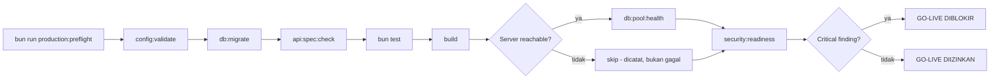

# Production Security Readiness

> **Status dokumen (AWCMS, tahap foundation-rebuild).** Dokumen ini
> mengadaptasi standar `security:readiness`/`production:preflight` yang
> pada base `awcms-mini` sudah diimplementasikan penuh dan diverifikasi
> live (skrip nyata, test otomatis, laporan pass/fail sungguhan). Di
> AWCMS, **belum ada satu pun skrip ini yang diimplementasikan** — repo
> baru berisi ADR/governance docs (lihat
> [ADR-0001](../adr/0001-rebuild-on-awcms-foundation-erp-scope.md)).
> Seluruh tabel "Status implementasi" di bawah menjelaskan **target
> mekanisme yang akan dibangun ulang** saat fondasi teknis
> (`src/lib/security`, `scripts/security-readiness.ts`,
> `scripts/production-preflight.ts`, dst.) diporting dari `awcms-mini` ke
> AWCMS — bukan klaim bahwa AWCMS hari ini sudah lulus check apa pun.
> Baca "Otomatis"/"Manual" di bawah sebagai target desain, bukan status
> berjalan.

Dokumen ini mencatat standar readiness keamanan produksi untuk AWCMS
(diwarisi dari base `awcms-mini`, selaras governance docs, ADR RLS/RBAC-
ABAC/soft-delete AWCMS, dan threat model yang akan disusun).

## Ringkasan



`config:validate` dijalankan **paling pertama** — config harus valid
sebelum tahap manapun mencoba konek database atau menjalankan migration
(`scripts/production-preflight.ts`'s `STAGES` array, begitu skrip ini
diporting).

Tiga skrip inti (target implementasi, diwarisi dari base):

| Perintah                       | Skrip                             | Fungsi                                                                        |
| ------------------------------ | --------------------------------- | ----------------------------------------------------------------------------- |
| `bun run db:pool:health`       | `scripts/db-pool-health.ts`       | CLI wrapper `GET /api/v1/database/pool/health`                                |
| `bun run security:readiness`   | `scripts/security-readiness.ts`   | Menjalankan checklist keamanan otomatis, exit non-zero bila ada critical fail |
| `bun run production:preflight` | `scripts/production-preflight.ts` | Orkestrasi seluruh tahap preflight + verdict go/no-go akhir                   |

Ketiganya murni CLI/script — perubahan pada standar ini tidak dengan
sendirinya membutuhkan perubahan OpenAPI/AsyncAPI (tidak ada endpoint atau
event baru).

## 1. `db:pool:health`

Memanggil endpoint `GET /api/v1/database/pool/health`
(`src/pages/api/v1/database/pool/health.ts`, lihat
[`database-pooling.md`](database-pooling.md)) dari base URL yang bisa
dikonfigurasi lewat env `APP_URL` (default `http://localhost:4321`).
Semantik exit code mengikuti 3-tier status endpoint tersebut:

- `"healthy"` atau `"degraded"` → exit `0` (degraded tetap dianggap lulus —
  hanya peringatan untuk diselidiki sebelum go-live).
- `"unhealthy"` → exit non-zero (hard failure).
- Fetch gagal total (server belum jalan, connection refused) → **juga** hard
  failure dengan pesan error yang jelas — tidak pernah terlihat seperti lulus
  diam-diam.

## 2. `security:readiness`

Menjalankan daftar tetap check bernama, masing-masing menghasilkan:

```ts
{
  name: string;
  severity: "critical" | "warning" | "info";
  status: "pass" | "fail";
  evidence: string;
}
```

Exit non-zero bila **ada satu saja** check `critical` berstatus `fail`.

### Pemetaan checklist doc 07 → target implementasi

| Item checklist doc 07                              | Target implementasi                                                                                                                                                                                                                                                   |
| -------------------------------------------------- | --------------------------------------------------------------------------------------------------------------------------------------------------------------------------------------------------------------------------------------------------------------------- |
| No hardcoded secret                                | **Otomatis** (critical) — heuristik grep `src/`, `scripts/`, config file yang di-track git                                                                                                                                                                            |
| `.env` tidak dikomit                               | **Otomatis** (critical) — `git ls-files` tidak boleh memuat `.env`                                                                                                                                                                                                    |
| Password hash modern                               | **Otomatis** (critical) — memanggil `hashPassword()` sungguhan, memeriksa awalan `$argon2id$`                                                                                                                                                                         |
| Login lockout                                      | **Otomatis** (critical) — memanggil `evaluateLoginAttempt()` dengan skenario 5x gagal                                                                                                                                                                                 |
| RLS aktif                                          | **Otomatis** (critical) — query langsung `pg_class.relrowsecurity` per tabel `awcms_%`                                                                                                                                                                                |
| ABAC aktif (default deny)                          | **Otomatis** (critical) — memanggil `evaluateAccess()` dengan permission kosong                                                                                                                                                                                       |
| Audit log aktif                                    | **Otomatis** (critical) — `SELECT to_regclass('awcms_audit_events')`                                                                                                                                                                                                  |
| Soft delete/restore/purge audit aktif              | **Otomatis** (warning) — cek seed permission + grep `recordAuditEvent` di endpoint profile                                                                                                                                                                            |
| Sync HMAC bila hybrid                              | **Otomatis** (warning/info) — cek env secret bukan placeholder `.env.example`, skip bila sync off                                                                                                                                                                     |
| Error tidak expose stack trace                     | **Best-effort otomatis** (warning/info) — butuh server hidup; `info` bila tidak bisa dicek                                                                                                                                                                            |
| Restore/purge berizin dan diaudit                  | Tercakup di baris "soft delete/restore/purge audit aktif" di atas (satu check gabungan)                                                                                                                                                                               |
| Tax data masking                                   | **Menjadi in-scope untuk AWCMS** — berbeda dari base generik `awcms-mini`, AWCMS memang punya modul tax/Coretax sebagai bagian skop produk (lihat ADR-0001); check ini perlu diimplementasikan begitu modul tax ada, bukan didokumentasikan sebagai "out of scope"    |
| Payroll/HR data masking (NIK, rekening bank, gaji) | **Baru untuk AWCMS** — belum ada padanan di base generik; perlu ditambahkan sebagai check baru saat modul HR/payroll dibangun                                                                                                                                         |
| AI read-only                                       | **Tergantung skop** — hanya relevan bila modul AI analyst diaktifkan di AWCMS; lihat §Item di luar cakupan                                                                                                                                                            |
| PostgreSQL tidak public                            | **Manual** — lihat §Item di luar cakupan                                                                                                                                                                                                                              |
| Least-privilege DB user                            | **Otomatis sebagian** (critical, cakupan connection role) + **manual** untuk provisioning grant/role menyeluruh                                                                                                                                                       |
| Backup aktif / restore tested                      | **Manual** (SOP + skrip target: `deploy/backup/{backup,restore}-postgres.sh` dengan enkripsi + manifest bertanda tangan + checksum-before-restore + restore drill terjadwal — lihat `deploy/backup/README.md` begitu diporting)                                       |
| PostgreSQL version sesuai target                   | **Manual** — versi di-pin di `docker-compose.yml`, tidak diverifikasi ulang dari kode aplikasi                                                                                                                                                                        |
| Build pass / migration pass / API spec valid       | **Otomatis** — via `production:preflight`, tahap `build`/`db:migrate`/`api:spec:check`                                                                                                                                                                                |
| Setup wizard locked                                | Target: singleton `awcms_setup_state`; belum ada implementasi                                                                                                                                                                                                         |
| Role default tersedia                              | Target: seed role bawaan (owner/admin/operator ERP); belum ada implementasi                                                                                                                                                                                           |
| Logging aktif                                      | Target: `src/lib/logging/logger.ts`, diperkuat lint gate `bun run logging:lint:check` (bagian `bun run check`) yang menggagalkan build kalau ada pola `console.error`/`console.warn` dengan raw error/`.message`/`.stack` tidak tersanitasi di path admin/API/scripts |
| Index utama / partial index soft delete            | Diverifikasi lewat test migration per modul; belum ada modul untuk diverifikasi                                                                                                                                                                                       |
| Pool sehat / slow query monitoring                 | **Otomatis** via `db:pool:health` (pool); slow query monitoring tetap di luar cakupan (butuh `pg_stat_statements`/APM eksternal)                                                                                                                                      |
| Security response headers (CSP/HSTS/dst.)          | **Otomatis** (warning) — hit server nyata, cek `content-security-policy`/`x-content-type-options`/`x-frame-options`/`referrer-policy`/`permissions-policy` di respons `GET /login`                                                                                    |
| Login rate limiting (sumber+tenant)                | **Otomatis** (warning) — `checkRateLimit()` murni, menegaskan percobaan ke-4 ditolak setelah `maxAttempts=3`                                                                                                                                                          |
| Email provider config lengkap bila diaktifkan      | **Otomatis** (critical) — `checkEmailProviderConfigReady` menggunakan ulang `checkEmailConfig`; skip (pass) bila `EMAIL_ENABLED` bukan `"true"`                                                                                                                       |

### Item di luar cakupan atau perlu penyesuaian skop AWCMS

Dicetak eksplisit di laporan `security:readiness` sebagai bagian "Out of
scope" — **tidak** disembunyikan atau dipaksakan jadi check palsu:

| Item                      | Alasan                                                                                                                                                                        |
| ------------------------- | ----------------------------------------------------------------------------------------------------------------------------------------------------------------------------- |
| AI read-only              | Hanya relevan bila modul AI analyst/tool-calling diaktifkan — belum ada modul ini di AWCMS pada tahap fondasi.                                                                |
| PostgreSQL tidak public   | Concern deployment profile — eksposur jaringan nyata bergantung konfigurasi operator saat deploy, tidak bisa diverifikasi dari kode aplikasi saja. Manual.                    |
| Least-privilege DB user   | Role/grant DB diprovisi saat deploy. Connection role aplikasi sendiri (bukan superuser/bypass-RLS) diverifikasi otomatis (lihat check di atas); grant/role lain tetap manual. |
| Backup/restore tested     | Skrip backup/restore perlu diporting dan dijalankan sungguhan terhadap environment terprovisi untuk membuktikan hasil restore. Manual.                                        |
| PostgreSQL version pinned | Version pin ada di `docker-compose.yml`, bukan diverifikasi dari kode aplikasi. Manual — konfirmasi versi server nyata (`SELECT version();`).                                 |

Berbeda dari base generik `awcms-mini` (di mana tax masking/CRM opt-out/AI
read-only adalah concern domain aplikasi turunan yang eksplisit di luar
cakupan base), untuk AWCMS **tax data masking dan payroll/HR data masking
adalah in-scope produk** karena modul tax/Coretax dan HR/payroll adalah
bagian skop AWCMS sendiri (ADR-0001) — keduanya perlu check
`security:readiness` khusus begitu modulnya dibangun, bukan didokumentasikan
sebagai "domain turunan yang tidak ditangani base."

## 3. `production:preflight`

Mengorkestrasi tahap berikut sebagai child process (`Bun.spawn`), berurutan,
mencatat pass/fail per tahap, lalu mencetak verdict akhir:

1. `bun run config:validate` — **paling pertama**: config harus valid
   sebelum tahap manapun mencoba konek database atau menjalankan migration.
2. `bun run db:migrate`
3. `bun run api:spec:check`
4. `bun test`
5. `bun run build`
6. `bun run db:pool:health` — **hanya bila** probe `GET /api/v1/health`
   menunjukkan ada server yang menjawab; bila tidak, tahap ini dicatat
   `skipped` (bukan `failed`) dengan alasan eksplisit di laporan. Ini
   keputusan desain yang disengaja: `production:preflight` bisa dijalankan
   di CI/lingkungan tanpa server berjalan tanpa memblokir seluruh preflight
   pada satu tahap yang memang butuh server hidup.
7. `bun run security:readiness`

`bun install` **sengaja tidak** dijalankan oleh skrip ini — itu langkah
setup environment (mengambil dependency), bukan readiness check, dan di
luar tanggung jawab skrip ini.

Semua tahap tetap dijalankan meskipun tahap sebelumnya gagal (bukan
fail-fast) — laporan akhir mendaftar **seluruh** tahap yang gagal, bukan
hanya yang pertama, supaya satu kegagalan tidak menyembunyikan masalah lain.

Verdict akhir: `GO-LIVE DIIZINKAN` (exit 0) jika tidak ada tahap `fail`,
`GO-LIVE DIBLOKIR` (exit non-zero) jika ada.

## Cara menjalankan sebelum go-live

```bash
bun install
bun run config:validate
bun run db:migrate
bun run api:spec:check
bun test
bun run build
bun run preview &            # atau `bun run dev` — perlu server hidup untuk db:pool:health
bun run db:pool:health
bun run security:readiness
bun run production:preflight
```

Atau cukup `bun run production:preflight` setelah server (opsional) sudah
hidup — skrip ini menjalankan seluruh tahap di atas kecuali `bun install`.

## Test

Target: `tests/security-readiness.test.ts` menutup logika murni yang tidak
butuh koneksi DB/server sungguhan: heuristik `scanLineForHardcodedSecret`
(termasuk kasus negatif — placeholder, member-expression, baca dari
`process.env`), `checkAbacDefaultDeny`, `checkLoginLockoutImplemented`, dan
`checkSyncHmacSecretNotDefault` (ketiga cabang: sync off, sync on dengan
placeholder, sync on dengan secret asli).

Check yang butuh Postgres sungguhan (`checkRlsEnabled`,
`checkAuditLogTableReachable`, sebagian `checkSoftDeletePermissionsSeededAndAudited`)
**tidak** di-unit-test dengan DB palsu — itu akan menguji mock, bukan query
sungguhan. Pembuktiannya perlu ada di verifikasi live begitu skrip ini
diimplementasikan, termasuk skenario RLS sengaja dimatikan untuk membuktikan
gate benar-benar memblokir, bukan sekadar skrip yang selalu mencetak "pass".

## Gap yang belum ditutup

- Belum ada implementasi kode sama sekali untuk mekanisme di dokumen ini —
  ini adalah gap utama pada tahap fondasi AWCMS saat ini, di luar gap
  teknis yang diwarisi dari base (lihat poin-poin di bawah, yang berlaku
  begitu porting selesai).
- Slow query monitoring (`pg_stat_statements`/APM) tidak diverifikasi
  otomatis — butuh tooling observability eksternal di luar cakupan base ini.
- `checkErrorsDontLeakStackTraces` best-effort: hanya menguji satu bentuk
  request terhadap satu daftar substring stack-trace yang umum; bukan
  jaminan menyeluruh seluruh endpoint.
- Item deployment (PostgreSQL tidak public, least-privilege user menyeluruh,
  backup/restore, version pinned) tetap verifikasi **manual** terhadap
  environment terprovisi.
- Security headers hanya dicek **kehadirannya** (nama header ada di
  respons), bukan validitas isi CSP secara mendalam.
- Rate limiter login in-memory per-proses, tidak dibagi antar instance pada
  deployment multi-instance.
- Tax data masking dan payroll/HR data masking (checks baru untuk AWCMS,
bukan warisan langsung dari base) belum punya implementasi rujukan sama
sekali — perlu didesain dari nol saat modul tax/Coretax dan HR/payroll
dibangun.
</content>
