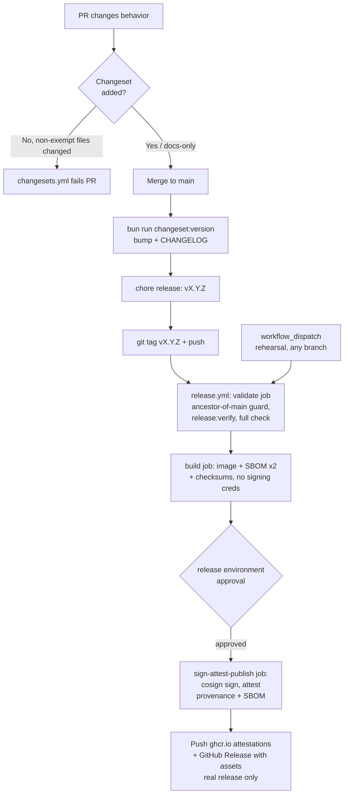

# Release Process — Changesets, SBOM, Signing, Provenance

> **Status dokumen:** standar target, bukan status implementasi. Repo `awcms` saat ini di versi `0.1.0` pre-release, belum ada modul ERP, belum ada `.github/workflows/changesets.yml`/`release.yml` yang nyata. Dokumen ini mengadaptasi pipeline release yang sudah terbukti dan telah dieksekusi (real tags, real image, real signature) di basis `awcms-mini` menjadi **desain pipeline yang wajib diimplementasikan** sebelum rilis pertama `awcms` (`v0.1.0` atau `v1.0.0`, tergantung kebijakan versi awal yang disepakati). Mekanisme (changeset policy, dua workflow, SBOM ganda, keyless signing, provenance) dipertahankan sebagai standar wajib.

Sebelum pipeline ini diimplementasikan, Changesets akan mengelola version bump dan `CHANGELOG.md` (lihat `.changeset/` yang sudah ada di repo ini serta `docs/awcms/09_roadmap_repository_commit.md` §Versioning dengan Changesets, menyusul), tapi belum ada yang menegakkan kebijakan changeset secara otomatis, dan belum ada workflow yang memproduksi image, SBOM, signature, atau provenance yang bisa diverifikasi untuk tag rilis. Dokumen ini mendeskripsikan dua workflow yang harus dibangun untuk itu — `.github/workflows/changesets.yml` dan `.github/workflows/release.yml` — dan cara memverifikasi output-nya sebagai konsumen.

## Pipeline overview



Kedua trigger wajib menjalankan `validate` job yang persis sama — jalur rehearsal bukan jalan pintas melewati quality gate, hanya melewati tag-ancestor guard dan `release:verify` (keduanya `if: github.event_name == 'push'`; `bun run check` sendiri selalu berjalan).

## 1. PR-time gate: `changesets.yml`

`scripts/changeset-policy-check.ts` (`bun run changesets:policy:check`) memutuskan apakah sebuah PR butuh changeset baru, memakai riwayat PR yang sudah merge di repo ini sendiri sebagai ground truth untuk apa yang tergolong "docs-only/chore":

- **Exempt** (tidak butuh changeset): `docs/**`, `.claude/**`, `.changeset/**`, berkas `*.md` mana pun.
- **Tidak exempt** (wajib changeset): semua yang lain, termasuk `.github/**` workflow, `scripts/**`, `src/**`, `sql/**`, `openapi/**`, `asyncapi/**`, `package.json`, `Dockerfile*`, `docker-compose*.yml`, dan berkas test.

Bila berkas `.changeset/*.md` baru ditambahkan, frontmatter-nya divalidasi (`"awcms": major|minor|patch` — repo single-package, jadi tidak ada nama package lain yang valid). Sebuah daftar pengecualian path satu-off (`CHANGESET_POLICY_PATH_EXEMPTIONS` di script) tersedia untuk false positive genuine, meniru pola `CONFIG_EXEMPTIONS`/`LOGGING_LINT_EXEMPTIONS` yang sudah dipakai di tempat lain di repo ini bila diadopsi.

Check ini berjalan sebagai workflow sendiri (`changesets.yml`), bukan step tambahan di dalam `ci.yml`'s `quality` job atau `bun run check`, karena secara inheren berbentuk PR-diff (butuh tip `origin/main` untuk dibandingkan) — setiap step lain di `check` bersifat self-contained dan aman dijalankan terhadap satu checkout tanpa dependency network/git-history.

## 2. Tag-time release: `release.yml`

Dua entry point, keduanya konvergen ke job graph yang sama:

| Trigger                        | Efek                                                                                                                                     |
| ------------------------------- | ------------------------------------------------------------------------------------------------------------------------------------------- |
| `push` tag yang cocok `v*.*.*` | **Rilis nyata.** Mempublikasikan image, GitHub Release, dan memindahkan `:latest`.                                                          |
| `workflow_dispatch` (ref apa pun) | **Rehearsal.** Menjalankan pipeline yang identik terhadap image tag `dryrun-<sha>`. Tidak ada GitHub Release dibuat, `:latest` tidak pernah disentuh. |

### `validate` job (read-only)

1. **Ancestor-of-main guard** (rilis nyata saja) — `git merge-base --is-ancestor HEAD origin/main`. Selama repo ini belum punya branch protection rule di `main`, guard ini adalah pengganti level-workflow untuk "publish hanya dari branch terproteksi": tag yang commit-nya bukan bagian dari riwayat `origin/main` ditolak sebelum apa pun dibangun.
2. **`bun run release:verify`** (rilis nyata saja, `scripts/release-verify.ts`) — memastikan versi tag yang di-push cocok dengan `package.json`, bahwa `CHANGELOG.md` punya section `## [X.Y.Z]` untuknya, dan tidak ada berkas changeset yang belum terkonsumsi di `.changeset/`.
3. **`bun run check`** (terhadap Postgres service nyata yang sudah dimigrasi) — quality gate penuh, diverifikasi ulang saat release time, bukan dipercaya dari hasil CI yang mungkin sudah basi. Ini harus **lebih ketat** daripada `quality` job milik `ci.yml`, bukan identik dengannya — pastikan setiap step yang dijalankan `bun run check` juga dijalankan `ci.yml`'s `quality` job (mis. `i18n:pot:check`, `config:docs:check`, `logging:lint:check`, `api:docs:check`, `repo:inventory:check`) agar drift semacam ini tidak bisa merge ke `main` lewat PR hijau dan baru muncul saat tag-push.

   `extension:check` (kompatibilitas manifest aplikasi turunan, bila diadopsi mengikuti ADR terkait) sebaiknya ditambahkan ke `package.json`'s `check` composite DAN sebagai step eksplisit bernama di `ci.yml`'s `quality` job dalam PR yang sama, untuk menghindari kelas drift yang sama untuk check baru mana pun.

### `build` job (unprivileged: `contents: read`, `packages: write` saja)

Berjalan identik untuk rilis nyata dan rehearsal. Sengaja tidak memegang credential signing/attestation (`id-token`/`attestations`) — lihat di bawah.

1. Build `Dockerfile.production` dengan Docker Buildx, push ke `ghcr.io/ahliweb/awcms` bertag `<version>` (atau `dryrun-<sha>` untuk rehearsal) dan `sha-<commit>`; `:latest` ditambahkan hanya untuk rilis nyata.
2. **SBOM** — dua SBOM CycloneDX JSON terpisah via [`anchore/sbom-action`](https://github.com/anchore/sbom-action) (Syft di baliknya): satu untuk **source tree** (`bun.lock` + workspace, `sbom-source.cdx.json`) dan satu untuk **image container terbangun** (`sbom-image.cdx.json`) — keduanya bisa berbeda (SBOM image juga mencerminkan paket OS base image, bukan hanya `bun.lock`).
3. **Checksums** — `CHECKSUMS.txt` (SHA-256) mencakup kedua SBOM dan sebuah `git archive` source tarball.
4. Mengunggah semua di atas sebagai workflow artifact berumur pendek (1 hari) untuk diunduh job berikutnya.

### `sign-attest-publish` job (`environment: release`)

Digerbangi di belakang GitHub Environment bernama `release` (lihat §Environment approval di bawah). Dipisah dari `build` menjadi job sendiri karena alasan keamanan: `id-token`/`attestations` permission bersifat JOB-scoped di GitHub Actions, jadi setiap step di job yang memegangnya bisa mencetak OIDC token sendiri — menjaga third-party action `anchore/sbom-action` sepenuhnya di luar job ini berarti hipotesis kompromi supply-chain pada action itu tidak pernah punya credential OIDC/attestation untuk disalahgunakan. Berjalan identik untuk rilis nyata dan rehearsal:

1. **Signing** — `cosign sign --yes` terhadap digest image yang dihasilkan `build` job, **keyless OIDC** (tidak ada signing key yang pernah ada; identitasnya adalah workflow run ini sendiri, didukung OIDC token GitHub Actions dan Sigstore's Fulcio/Rekor).
2. **Attestation/provenance** — `actions/attest-build-provenance` untuk digest image (dipush ke registry juga) dan untuk tiga artefak source (`CHECKSUMS.txt`, `sbom-source.cdx.json`, source tarball); `actions/attest-sbom` mengasosiasikan `sbom-image.cdx.json` dengan digest image secara spesifik. Semua adalah attestation store SLSA-compatible milik GitHub sendiri — tidak ada infrastruktur terpisah yang perlu dijalankan/dipelihara.
3. **Publish** (rilis nyata saja) — mengekstrak section versi ini dari `CHANGELOG.md` sebagai body release dan menjalankan `gh release create`, melampirkan `CHECKSUMS.txt` dan kedua SBOM plus source tarball sebagai release asset.

## Mengapa `anchore/sbom-action` (Syft) untuk SBOM generation

- Menghasilkan CycloneDX **dan** SPDX (pipeline ini memakai CycloneDX untuk kedua scan — satu format lebih sederhana untuk konsumen di-diff/tooling; keduanya memenuhi kriteria "CycloneDX atau SPDX").
- Composite action self-contained yang membungkus satu binary Go statically-linked (Syft) — tidak memanggil `npm`/`node` terhadap repo ini atau membutuhkan SBOM generator berbasis Node.js (`@cyclonedx/cyclonedx-npm` dan sejenisnya adalah npm-ecosystem-only dan akan bertentangan dengan aturan Bun-only di `AGENTS.md`). Hanya membaca `bun.lock`/filesystem/image terbangun — tidak pernah mengeksekusi kode proyek ini sendiri.
- Satu action mencakup kedua scan target (`path:` untuk source tree, `image:` untuk container terbangun), jadi hanya ada satu third-party action baru untuk di-pin dan diaudit, bukan dua tool berbeda.

## Environment approval (langkah manual maintainer)

`sign-attest-publish` mendeklarasikan `environment: release` (`build` tidak — karena tidak memegang credential signing/attestation, menggerbanginya di belakang approval hanya menambah friksi tanpa manfaat keamanan). Mereferensikan nama environment di sebuah workflow **auto-create record environment yang tidak terproteksi** pada run pertama bila belum ada — ini **tidak**, dengan sendirinya, mem-pause job untuk approval. Mengonfigurasi **required reviewers** pada environment tersebut adalah perubahan repo-admin/shared-state yang sengaja dibiarkan untuk diterapkan eksplisit oleh maintainer:

**Via GitHub UI:** Settings → Environments → New environment → beri nama tepat `release` → **Required reviewers** → tambahkan minimal satu maintainer → Save protection rules. Setiap run `release.yml`'s publish job (rilis nyata **dan** rehearsal) akan pause di "Waiting for review" sampai reviewer yang disetujui klik **Approve and deploy**.

**Setara `gh api`** (dijalankan oleh repo admin; ganti `<reviewer-user-id>` dengan numeric GitHub user id tiap required reviewer, dari `gh api users/<login> --jq .id`):

```bash
gh api -X PUT repos/ahliweb/awcms/environments/release \
  -f 'reviewers[][type]=User' \
  -F 'reviewers[][id]=<reviewer-user-id>'
```

Sampai ini diterapkan, `release.yml` tetap berjalan end-to-end (kedua entry point) tanpa pause — setiap kontrol lain di dokumen ini (ancestor-of-main guard, `release:verify`, quality gate penuh, least-privilege per-job permissions, pinned-by-SHA actions) independen dari langkah ini.

## Dry-run / rehearsal path

Trigger `release.yml` secara manual — GitHub UI: **Actions → Release → Run workflow** (pilih branch mana pun; `main` adalah default yang masuk akal), atau:

```bash
gh workflow run release.yml --repo ahliweb/awcms --ref main
```

Ini menjalankan pipeline **sepenuhnya** — image build, kedua SBOM, checksums, keyless signing, provenance/SBOM attestation, dan gate approval `release` environment (setelah dikonfigurasi) — terhadap tag `ghcr.io/ahliweb/awcms:dryrun-<short-sha>` yang sekali pakai. Tidak pernah membuat GitHub Release dan tidak pernah memindahkan `:latest`, jadi tidak bisa keliru dianggap (atau tanpa sengaja jadi) rilis produksi. Rehearse ini minimal sekali, dengan reviewer benar-benar menyetujui gate environment, sebelum tag `vX.Y.Z` nyata pertama di-push.

Image rehearsal menumpuk di package `ghcr.io/ahliweb/awcms` di bawah tag `dryrun-*`; maintainer bisa menghapus yang lama secara berkala lewat halaman **Manage versions** package atau `gh api -X DELETE /orgs/ahliweb/packages/container/awcms/versions/<id>` — tidak diotomasi pipeline ini, karena penghapusan otomatis butuh `packages: delete`, permission yang tidak dibutuhkan job mana pun di sini.

## Verifikasi (sisi konsumen — tidak butuh secret repository)

Setiap check di bawah hanya memakai data publik (registry, GitHub public attestation API, Sigstore public transparency log) — tidak ada yang butuh akses ke secret/CI environment repo ini.

```bash
# 1. Verifikasi attestation SLSA build provenance milik image
gh attestation verify oci://ghcr.io/ahliweb/awcms:vX.Y.Z \
  --owner ahliweb

# 2. Verifikasi attestation SBOM milik image
gh attestation verify oci://ghcr.io/ahliweb/awcms:vX.Y.Z \
  --owner ahliweb --predicate-type https://cyclonedx.org/bom

# 3. Verifikasi signature keyless cosign langsung (tanpa gh CLI)
cosign verify ghcr.io/ahliweb/awcms:vX.Y.Z \
  --certificate-identity-regexp "^https://github.com/ahliweb/awcms/.github/workflows/release.yml@refs/tags/v.*" \
  --certificate-oidc-issuer https://token.actions.githubusercontent.com

# 4. Verifikasi provenance untuk artefak source yang bisa diunduh
gh attestation verify CHECKSUMS.txt --owner ahliweb
gh attestation verify sbom-source.cdx.json --owner ahliweb

# 5. Verifikasi checksum untuk apa pun yang diunduh dari GitHub Release
sha256sum -c CHECKSUMS.txt
```

`gh attestation verify` dan `cosign verify` keduanya bekerja terhadap identitas GitHub/Sigstore publik dan anonim — tidak butuh `GITHUB_TOKEN`, secret repository, atau credential maintainer apa pun untuk kelima command di atas.

## Panduan rollback / yank

Baik Changesets maupun pipeline ini tidak pernah menghapus atau menulis ulang versi yang sudah dipublikasikan — konsisten dengan semangat append-only aturan audit trail di `AGENTS.md` (diterapkan di sini untuk artefak rilis, bukan data domain). Untuk memulihkan dari rilis yang buruk:

1. **Jangan hapus git tag, GitHub Release, atau image/tag `ghcr.io`.** Konsumen mungkin sudah menarik (pull) rilis itu; menghapusnya menghilangkan kemampuan mereka bahkan untuk mendiagnosis apa yang mereka punya.
2. **Tandai GitHub Release sebagai pre-release** (`gh release edit vX.Y.Z --prerelease`) dan tambahkan catatan di atas body-nya yang menunjuk ke versi yang sudah diperbaiki.
3. **Buat rilis patch baru** (`vX.Y.Z+1`) lewat jalur normal (changeset → `changeset:version` → tag → `release.yml`) dengan perbaikannya. Jangan force-push tag yang dikoreksi di atas nomor versi yang sama — digest image dan attestation yang sudah diterbitkan untuk tag lama akan secara diam-diam menunjuk ke byte yang berbeda dari yang diimplikasikan nama tag, yang membatalkan seluruh tujuan rantai checksum/signature/provenance yang dideskripsikan dokumen ini.
4. Bila image sudah dideploy, redeploy dengan pin ke **digest** versi baru (`ghcr.io/ahliweb/awcms@sha256:...`, dari `CHECKSUMS.txt` atau `docker buildx imagetools inspect`), bukan tag mengambang, untuk menjamin byte yang benar-benar tetap yang berjalan.

## Lihat juga

- `docs/awcms/09_roadmap_repository_commit.md` (menyusul) — kebijakan SemVer dan alur Changesets yang diotomasi pipeline ini.
- `branch-protection.md` (menyusul) — required status checks dan status branch protection `main`; ancestor-of-main guard dan environment-approval step dokumen ini mengikuti pola "dokumentasikan langkah admin manual, jangan diterapkan sendiri" yang sama.
- [`performance-suite.md`](performance-suite.md) — sebelum rilis yang menyentuh jalur query kritikal atau sizing koneksi/work-class, jalankan performance lane penuh (`bun run performance:suite -- --full`) terhadap environment staging/isolated dan bandingkan laporan JSON-nya dengan rilis sebelumnya, sesuai §Comparing two releases/commits dokumen itu.
- `.github/workflows/changesets.yml` / `.github/workflows/release.yml` (menyusul) — definisi workflow aktual yang dideskripsikan dokumen ini.
- `scripts/changeset-policy-check.ts` / `scripts/release-verify.ts` (menyusul) — pure-function policy check yang melandasi kedua workflow, diuji unit di `tests/unit/`.
