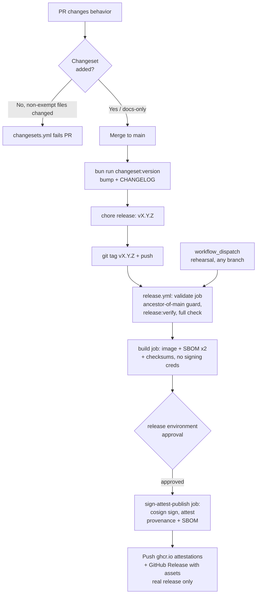

🇬🇧 English (source) · 🇮🇩 [Bahasa Indonesia](release-process.id.md)

# Release Process — Changesets, SBOM, Signing, Provenance

> **Document status:** the pipeline **has already been executed as a real release**. The first real release **`v6.0.0` (2026-07-21)** ran `.github/workflows/release.yml` end-to-end via a `v6.0.0` tag push: `validate` → `build` (image + two SBOMs) → `sign-attest-publish` all succeeded, image `ghcr.io/ahliweb/awcms:6.0.0` (+`:latest`,`:sha-*`) was published with a verified attestation (`gh attestation verify oci://ghcr.io/ahliweb/awcms:6.0.0 --owner ahliweb` → OK), and GitHub Release `v6.0.0` shipped with SBOM×2 + `CHECKSUMS.txt` + `source.tar.gz` assets. The previous version `5.0.0` was a manual jump continuing the legacy major line `v4.6.0` (see [ADR-0024](../adr/0024-semver-numbering-continues-legacy-major-line.md)); `6.0.0` is a normal changeset bump (MAJOR: breaking ADR-0034). Both workflows (`.github/workflows/changesets.yml`, `.github/workflows/release.yml`, `Dockerfile.production`, `scripts/release-verify.ts`) were adapted from the `awcms-mini` base.
>
> **✅ The approval gate is now ACTIVE (configured 2026-07-21).** On release `v6.0.0` the `sign-attest-publish` job ran **without any "Waiting for review" pause** because the `release` Environment had no required reviewers yet. That gap is **now closed**: required reviewer `ahliweb` (id `44542506`) was installed via `gh api -X PUT .../environments/release` (`prevent_self_review: false`, `can_admins_bypass: true`). **Verified through a rehearsal** (`workflow_dispatch`, run 29831369872): `validate`+`build` succeeded and then `sign-attest-publish` stopped at `status: waiting` with a pending deployment for environment `release` — proving the gate really does hold (the rehearsal run was then cancelled without publishing). From now on every real release **and** rehearsal pauses waiting for a maintainer's **Approve and deploy** before sign/attest/publish.
>
> **Tag procedure (correction):** there is no `bun run changeset:tag` script — the release tag `vX.Y.Z` is created **manually** (`git tag -a vX.Y.Z -m "vX.Y.Z"` → `RELEASE_VERIFY_TAG=vX.Y.Z bun run release:verify` → `git push origin vX.Y.Z`). The image is tagged **without** the `v` prefix (`6.0.0`), while the git tag and GitHub Release use `v6.0.0`.

Changesets already manages the version bump and `CHANGELOG.md` (see `.changeset/` and `CHANGELOG.md` in this repo plus `docs/awcms/09_roadmap_repository_commit.md` §Versioning with Changesets, to follow) and `bun run changesets:policy:check` already enforces the changeset policy on every PR (`.github/workflows/changesets.yml`). `release.yml` produces an image, two SBOMs, a signature, and provenance that can be verified — its design is documented in full below, its implementation lives in `.github/workflows/release.yml`.

## Pipeline overview


```mermaid
flowchart TD
  PR[PR changes behavior] --> CS{Changeset<br/>added?}
  CS -- No, non-exempt files changed --> Block[changesets.yml fails PR]
  CS -- Yes / docs-only --> Merge[Merge to main]
  Merge --> Version[bun run changeset:version<br/>bump + CHANGELOG]
  Version --> Commit[chore release: vX.Y.Z]
  Commit --> Tag[git tag vX.Y.Z + push]
  Tag --> Validate[release.yml: validate job<br/>ancestor-of-main guard,<br/>release:verify, full check]
  Dispatch[workflow_dispatch<br/>rehearsal, any branch] --> Validate
  Validate --> BuildJob[build job: image + SBOM x2<br/>+ checksums, no signing creds]
  BuildJob --> Approve{release environment<br/>approval}
  Approve -- approved --> SignJob[sign-attest-publish job:<br/>cosign sign, attest<br/>provenance + SBOM]
  SignJob --> Publish[Push ghcr.io attestations<br/>+ GitHub Release with assets<br/>real release only]
```

Both triggers must run exactly the same `validate` job — the rehearsal path is not a shortcut around the quality gate, it only skips the tag-ancestor guard and `release:verify` (both `if: github.event_name == 'push'`; `bun run check` itself always runs).

## 1. PR-time gate: `changesets.yml`

`scripts/changeset-policy-check.ts` (`bun run changesets:policy:check`) decides whether a PR needs a new changeset, using this repo's own merged-PR history as ground truth for what counts as "docs-only/chore":

- **Exempt** (no changeset needed): `docs/**`, `.claude/**`, `.changeset/**`, any `*.md` file.
- **Not exempt** (changeset required): everything else, including `.github/**` workflows, `scripts/**`, `src/**`, `sql/**`, `openapi/**`, `asyncapi/**`, `package.json`, `Dockerfile*`, `docker-compose*.yml`, and test files.

When a new `.changeset/*.md` file is added, its frontmatter is validated (`"awcms": major|minor|patch` — this repo is single-package, so no other package name is valid). A one-off path exception list (`CHANGESET_POLICY_PATH_EXEMPTIONS` in the script) is available for genuine false positives, mirroring the `CONFIG_EXEMPTIONS`/`LOGGING_LINT_EXEMPTIONS` pattern already used elsewhere in this repo where adopted.

This check runs as its own workflow (`changesets.yml`), not as an extra step inside `ci.yml`'s `quality` job or `bun run check`, because it is inherently PR-diff shaped (it needs the `origin/main` tip to compare against) — every other step in `check` is self-contained and safe to run against a single checkout with no network/git-history dependency.

## 2. Tag-time release: `release.yml`

Two entry points, both converging on the same job graph:

| Trigger                           | Effect                                                                                                                                 |
| --------------------------------- | -------------------------------------------------------------------------------------------------------------------------------------- |
| `push` of a tag matching `v*.*.*` | **Real release.** Publishes the image, the GitHub Release, and moves `:latest`.                                                        |
| `workflow_dispatch` (any ref)     | **Rehearsal.** Runs the identical pipeline against image tag `dryrun-<sha>`. No GitHub Release is created, `:latest` is never touched. |

### `validate` job (read-only)

1. **Ancestor-of-main guard** (real releases only) — `git merge-base --is-ancestor HEAD origin/main`. As long as this repo has no branch protection rule on `main`, this guard is the workflow-level substitute for "publish only from a protected branch": a tag whose commit is not part of `origin/main`'s history is rejected before anything is built.
2. **`bun run release:verify`** (real releases only, `scripts/release-verify.ts`) — makes sure the pushed tag's version matches `package.json`, that `CHANGELOG.md` has a `## [X.Y.Z]` section for it, and that there are no unconsumed changeset files left in `.changeset/`.
3. **`bun run check`** (against a real, already-migrated Postgres service) — the full quality gate, re-verified at release time rather than trusted from a possibly stale CI result. This must be **stricter** than `ci.yml`'s `quality` job, not identical to it — make sure every step `bun run check` runs is also run by `ci.yml`'s `quality` job (e.g. `i18n:pot:check`, `config:docs:check`, `logging:lint:check`, `api:docs:check`, `repo:inventory:check`) so that this kind of drift cannot merge to `main` through a green PR and only surface on a tag push.

   (Historical note: an older version of this paragraph suggested adding `extension:check` — derived-application manifest compatibility — to the `check` composite and to `ci.yml`. That advice **no longer applies**: the derived-application pathway together with `extension:check` has been **revoked by [ADR-0034](../adr/0034-awcms-family-direct-use-templates-and-derived-pathway-removal.md)**. The principle stands: every new check added to `package.json`'s `check` composite must also become an explicit named step in `ci.yml`'s `quality` job in the same PR, so the same class of drift cannot appear.)

### `build` job (unprivileged: `contents: read`, `packages: write` only)

Runs identically for a real release and a rehearsal. Deliberately holds no signing/attestation credentials (`id-token`/`attestations`) — see below.

1. Build `Dockerfile.production` with Docker Buildx, push to `ghcr.io/ahliweb/awcms` tagged `<version>` (or `dryrun-<sha>` for a rehearsal) and `sha-<commit>`; `:latest` is added only for a real release.
2. **SBOM** — two separate CycloneDX JSON SBOMs via [`anchore/sbom-action`](https://github.com/anchore/sbom-action) (Syft behind it): one for the **source tree** (`bun.lock` + workspace, `sbom-source.cdx.json`) and one for the **built container image** (`sbom-image.cdx.json`) — the two can differ (the image SBOM also reflects the base image's OS packages, not just `bun.lock`).
3. **Checksums** — `CHECKSUMS.txt` (SHA-256) covers both SBOMs and a `git archive` source tarball.
4. Uploads all of the above as a short-lived (1 day) workflow artifact for the next job to download.

### `sign-attest-publish` job (`environment: release`)

Gated behind a GitHub Environment named `release` (see §Environment approval below). It is split out of `build` into its own job for a security reason: the `id-token`/`attestations` permissions are JOB-scoped in GitHub Actions, so every step in a job holding them can mint its own OIDC token — keeping the third-party `anchore/sbom-action` entirely out of this job means a hypothetical supply-chain compromise of that action never has OIDC/attestation credentials to abuse. Runs identically for a real release and a rehearsal:

1. **Signing** — `cosign sign --yes` against the image digest produced by the `build` job, **keyless OIDC** (no signing key ever exists; the identity is this workflow run itself, backed by the GitHub Actions OIDC token and Sigstore's Fulcio/Rekor).
2. **Attestation/provenance** — `actions/attest-build-provenance` for the image digest (pushed to the registry too) and for the three source artifacts (`CHECKSUMS.txt`, `sbom-source.cdx.json`, source tarball); `actions/attest-sbom` associates `sbom-image.cdx.json` with the image digest specifically. All of these are GitHub's own SLSA-compatible attestation store — no separate infrastructure to run/maintain.
3. **Publish** (real releases only) — extracts this version's section from `CHANGELOG.md` as the release body and runs `gh release create`, attaching `CHECKSUMS.txt` and both SBOMs plus the source tarball as release assets.

## Why `anchore/sbom-action` (Syft) for SBOM generation

- Produces CycloneDX **and** SPDX (this pipeline uses CycloneDX for both scans — one format is simpler for consumers to diff/tool against; both satisfy the "CycloneDX or SPDX" criterion).
- A self-contained composite action wrapping a single statically-linked Go binary (Syft) — it does not invoke `npm`/`node` against this repo or require a Node.js-based SBOM generator (`@cyclonedx/cyclonedx-npm` and friends are npm-ecosystem-only and would conflict with the Bun-only rule in `AGENTS.md`). It only reads `bun.lock`/the filesystem/the built image — it never executes this project's own code.
- One action covers both scan targets (`path:` for the source tree, `image:` for the built container), so there is only one new third-party action to pin and audit, not two different tools.

## Environment approval (manual maintainer step)

`sign-attest-publish` declares `environment: release` (`build` does not — since it holds no signing/attestation credentials, gating it behind approval would only add friction with no security benefit). Referencing an environment name in a workflow **auto-creates an unprotected environment record** on the first run if it does not exist — this does **not**, by itself, pause the job for approval. Configuring **required reviewers** on that environment is a repo-admin/shared-state change deliberately left for a maintainer to apply explicitly:

**Via the GitHub UI:** Settings → Environments → New environment → name it exactly `release` → **Required reviewers** → add at least one maintainer → Save protection rules. Every run of `release.yml`'s publish job (real release **and** rehearsal) will then pause at "Waiting for review" until an approved reviewer clicks **Approve and deploy**.

**`gh api` equivalent** (run by a repo admin; replace `<reviewer-user-id>` with the numeric GitHub user id of each required reviewer, from `gh api users/<login> --jq .id`):

```bash
gh api -X PUT repos/ahliweb/awcms/environments/release \
  -f 'reviewers[][type]=User' \
  -F 'reviewers[][id]=<reviewer-user-id>'
```

Until this is applied, `release.yml` still runs end-to-end (both entry points) with no pause — every other control in this document (ancestor-of-main guard, `release:verify`, the full quality gate, least-privilege per-job permissions, actions pinned by SHA) is independent of this step.

## Dry-run / rehearsal path

Trigger `release.yml` manually — GitHub UI: **Actions → Release → Run workflow** (pick any branch; `main` is the sensible default), or:

```bash
gh workflow run release.yml --repo ahliweb/awcms --ref main
```

This runs the pipeline **in full** — image build, both SBOMs, checksums, keyless signing, provenance/SBOM attestation, and the `release` environment approval gate (once configured) — against a throwaway `ghcr.io/ahliweb/awcms:dryrun-<short-sha>` tag. It never creates a GitHub Release and never moves `:latest`, so it cannot be mistaken for (or accidentally become) a production release. Rehearse this at least once, with a reviewer actually approving the environment gate, before the first real `vX.Y.Z` tag is pushed.

Rehearsal images pile up in the `ghcr.io/ahliweb/awcms` package under `dryrun-*` tags; a maintainer can delete old ones periodically via the package's **Manage versions** page or `gh api -X DELETE /orgs/ahliweb/packages/container/awcms/versions/<id>` — not automated by this pipeline, because automatic deletion needs `packages: delete`, a permission no job here needs.

## Verification (consumer side — no repository secrets needed)

Every check below uses only public data (the registry, the GitHub public attestation API, the Sigstore public transparency log) — none of them needs access to this repo's secrets/CI environment.

> **The image tag is NOT prefixed with `v`.** `release.yml` computes `VERSION="${GITHUB_REF_NAME#v}"`, so Git tag `v7.0.1` publishes `ghcr.io/ahliweb/awcms:7.0.1` (+ `:latest`, `:sha-<12>`). `…:v7.0.1` does not exist in the registry and every command below will fail with "manifest unknown" if the `v` is written along with it. Replace `X.Y.Z` below with the version without the `v`.

```bash
# 1. Verify the image's SLSA build provenance attestation
gh attestation verify oci://ghcr.io/ahliweb/awcms:X.Y.Z \
  --owner ahliweb

# 2. Verify the image's SBOM attestation
gh attestation verify oci://ghcr.io/ahliweb/awcms:X.Y.Z \
  --owner ahliweb --predicate-type https://cyclonedx.org/bom

# 3. Verify the keyless cosign signature directly (without the gh CLI)
cosign verify ghcr.io/ahliweb/awcms:X.Y.Z \
  --certificate-identity-regexp "^https://github.com/ahliweb/awcms/.github/workflows/release.yml@refs/tags/v.*" \
  --certificate-oidc-issuer https://token.actions.githubusercontent.com

# 4. Verify provenance for the downloadable source artifacts
gh attestation verify CHECKSUMS.txt --owner ahliweb
gh attestation verify sbom-source.cdx.json --owner ahliweb

# 5. Verify checksums for anything downloaded from the GitHub Release
sha256sum -c CHECKSUMS.txt
```

`gh attestation verify` and `cosign verify` both work against public, anonymous GitHub/Sigstore identities — none of the five commands above needs a `GITHUB_TOKEN`, a repository secret, or any maintainer credential.

## Rollback / yank guidance

Neither Changesets nor this pipeline ever deletes or rewrites an already-published version — consistent with the append-only spirit of the audit trail rule in `AGENTS.md` (applied here to release artifacts, not domain data). To recover from a bad release:

1. **Do not delete the git tag, the GitHub Release, or the `ghcr.io` image/tag.** Consumers may already have pulled that release; deleting it takes away even their ability to diagnose what they have.
2. **Mark the GitHub Release as a pre-release** (`gh release edit vX.Y.Z --prerelease`) and add a note at the top of its body pointing at the fixed version.
3. **Cut a new patch release** (`vX.Y.Z+1`) through the normal path (changeset → `changeset:version` → tag → `release.yml`) with the fix. Do not force-push a corrected tag over the same version number — the image digest and attestations already published for the old tag would silently point at different bytes than the tag name implies, which defeats the entire purpose of the checksum/signature/provenance chain this document describes.
4. If the image is already deployed, redeploy pinned to the new version's **digest** (`ghcr.io/ahliweb/awcms@sha256:...`, from `CHECKSUMS.txt` or `docker buildx imagetools inspect`), not a floating tag, to guarantee exactly which bytes are running.

## See also

- `docs/awcms/09_roadmap_repository_commit.md` (to follow) — the SemVer policy and the Changesets flow this pipeline automates.
- `branch-protection.md` (to follow) — required status checks and the branch protection status of `main`; this document's ancestor-of-main guard and environment-approval step follow the same "document the manual admin step, do not apply it yourself" pattern.
- [`performance-suite.md`](performance-suite.md) — before a release that touches a critical query path or connection/work-class sizing, run the full performance lane (`bun run performance:suite -- --full`) against an isolated database (`APP_ENV=test`, never any live environment) and compare its JSON report against the previous release, per that document's §Comparing two releases/commits.
- `.github/workflows/changesets.yml` / `.github/workflows/release.yml` — the actual workflow definitions this document describes.
- `scripts/changeset-policy-check.ts` / `scripts/release-verify.ts` — the pure-function policy checks underpinning both workflows, unit-tested in `tests/`.

## After a release: post-release review (step 18)

Within one working week after a tag is deployed, write one entry in
[`post-release-reviews.md`](post-release-reviews.md) using
[`templates/post-release-review-template.md`](templates/post-release-review-template.md).

A release that went smoothly **still** gets an entry, and four lines are fine.
A register that only contains incidents teaches its readers that releases are
usually troubled, and removes the only baseline that makes a bad release
look bad.
