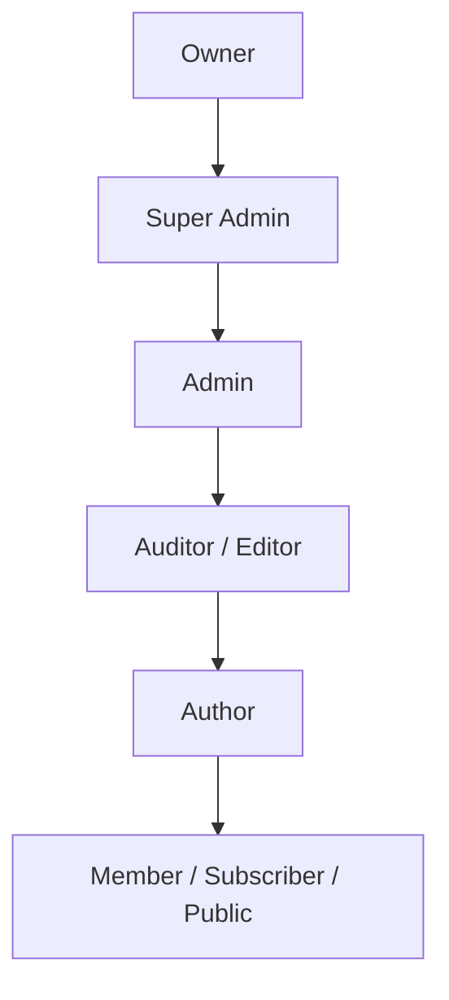

> **Documentation Authority**: [SYSTEM_MODEL.md](../../SYSTEM_MODEL.md) -> [AGENTS.md](../../AGENTS.md) -> [README.md](../../README.md) -> [DOCS_INDEX.md](../../DOCS_INDEX.md)
>
> **Status:** Maintained
>
> **Last Refreshed:** 2026-04-09

# Role Hierarchy (ABAC Framework)

## Purpose

Describe the current role model in AWCMS: default role templates, role flags, conceptual hierarchy, staff-level hierarchy, and how roles interact with the ABAC permission system.

This is a current-state guide. In the checked-in repo, roles are still meaningful defaults, but ABAC permissions and role flags are the real enforcement surface.

## Current Role Model

AWCMS currently uses roles as permission bundles plus metadata flags.

Current important rule:

- roles are not the final authorization authority by name alone
- ABAC permissions and role flags determine real runtime behavior

That means the “hierarchy” is conceptual and operational, not a guarantee that role names alone define power in every tenant.

## Current Default Role Baselines

Representative default role baselines still include:

- Owner
- Super Admin
- Admin
- Auditor
- Editor
- Author
- Member
- Subscriber
- Public
- No Access

Current practical rule:

- these should be treated as baseline templates for common behavior, not as a replacement for inspecting live permissions and role flags

## Current Scope Model

Roles currently participate in the same scope model used by ABAC:

- `platform`
- `tenant`
- reserved/specialized scopes such as `content` and `module` only where the live product surface requires them

Current important note:

- platform roles are identified by flags such as `is_platform_admin` and `is_full_access`, not just by human-readable role names

## Current Role Flags

The roles model currently includes important flag-driven behavior such as:

- `is_platform_admin`
- `is_full_access`
- `is_tenant_admin`
- `is_public`
- `is_guest`
- `is_staff`
- `staff_level`
- `is_default_public_registration`
- `is_default_invite`

These flags are part of the real runtime model used by contexts, policies, and admin logic.

## Current Conceptual Hierarchy

Conceptually, current role templates still map roughly like this:

Current important caveat:

- custom role permissions can diverge from this conceptual order
- ABAC remains the authoritative action-level control model

## Current Permission Relationship

Current role usage still works through:

- `roles`
- `permissions`
- `role_permissions`
- policy- and UI-level permission checks using canonical keys

Current practical rule:

- use role names for baseline understanding and UX copy
- use permission checks for implementation

## Current Staff Hierarchy

The current data model still includes staff-level hierarchy support through `staff_level`.

Representative current ordering remains:

| Level | Name |
| --- | --- |
| 10 | super_manager |
| 9 | senior_manager |
| 8 | manager |
| 7 | senior_supervisor |
| 6 | supervisor |
| 5 | senior_specialist |
| 4 | specialist |
| 3 | associate |
| 2 | assistant |
| 1 | internship |

Current important note:

- staff hierarchy is a structured tenant role attribute used by current workflows and should not be confused with the broader ABAC permission matrix

## Current Onboarding Role Flags

Roles may still be marked for onboarding defaults such as:

- `is_default_public_registration`
- `is_default_invite`

These are current data-model features and should be preferred over hardcoding onboarding role names in app logic.

## Current Tenant Role Inheritance Note

Current tenancy still supports role inheritance modes such as:

- `auto`
- `linked`

Role inheritance behavior should be understood as a tenancy/data-model feature, not as a simple fixed hierarchy rule.

## Current Implementation Guidance

- use role flags for platform/full-access/admin state checks where the current runtime expects them
- use canonical permission checks (`hasPermission`, `has_permission`) for feature access
- do not implement new feature access with role-name-only checks when a permission family already exists
- keep role-management and policy-management permissions aligned with the current migration-backed baseline

## Current Security Notes

- platform admin access is determined by flags, not role names alone
- tenant authorization remains permission- and policy-driven
- role customization can change practical access, so docs and code should not over-promise fixed role-name behavior

## Validation Guidance

| Surface | Validation |
| --- | --- |
| maintained docs | `cd awcms && npm run docs:check` |
| role/permission runtime implications | `cd awcms && npm run build` and related edge/migration validation when relevant |

## Related Docs

- [docs/security/abac.md](../security/abac.md)
- [docs/security/rls.md](../security/rls.md)
- [docs/tenancy/overview.md](../tenancy/overview.md)
- [docs/dev/admin.md](../dev/admin.md)
